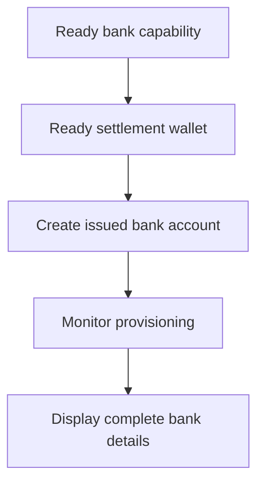

Izmantojiet izsniegtu bankas kontu, kad klientam nepieciešami atkārtoti izmantojami bankas rekvizīti. Vienreizējām finansēšanas instrukcijām, kas piesaistītas konkrētai summai, izmantojiet [Saņemt līdzekļus](/lv/integration/receive-funds).



## Pirms sākat

Jums nepieciešams klienta ID, gatava bankas iespēja paredzētajai metodei un valūtai, kā arī gatavs izsniegts maks, kas pieder tam pašam klientam. Pabeidziet atvērtos darbus sadaļā [Iespējas un uzdevumi](/lv/integration/onboarding/capabilities-and-requirements).

## 1. Izveidojiet vai atlasiet norēķinu maku

Izveidojiet izsniegtu maku sadaļā [Konti un maki](/lv/integration/accounts#create-the-account), pēc tam nolasiet to vēlreiz. Turpiniet tikai tad, kad tā pašreizējais statuss atļauj norēķinu.

Saglabājiet no atbildes iegūto `data.id` kā `SETTLEMENT_WALLET_ID`. Neizmantojiet ārējo maku laukam `settlement.accountId`.

## 2. Izveidojiet izsniegtu bankas kontu

Izmantojiet [`POST /v3/customers/{customerId}/accounts`](/api-reference/accounts/post-v3-customers-by-customer-id-accounts) ar šīm galvenēm:

```http
X-API-Key: ${SWIPELUX_API_KEY}
Idempotency-Key: issued-bank-account-001
Content-Type: application/json
```

Nosūtiet šo pieprasījuma pamattekstu:

```json
{
  "origin": "issued",
  "type": "bank",
  "method": "ach",
  "country": "US",
  "currency": "USD",
  "settlement": {
    "accountId": "${SETTLEMENT_WALLET_ID}"
  },
  "label": "USD account"
}
```

Saglabājiet atgriezto `data.id` kā `BANK_ACCOUNT_ID`. Saglabājiet arī `data.status`, `data.openTaskIds`, `data.details` un norēķinu attiecības.

Bankas konta ID un maka ID ir dažādas lomas. Nolasiet nodrošinājumu un bankas rekvizītus caur bankas konta ID. Izmantojiet norēķinu maka ID, lai identificētu, kur iemaksas tiek kreditētas.

## 3. Uzraugiet nodrošinājumu

Pēc izveides un pēc katra attiecīgā webhook izsauciena nolasiet [`GET /v3/customers/{customerId}/accounts/{accountId}`](/api-reference/accounts/get-v3-customers-by-customer-id-accounts-by-account-id).

Uzturiet klienta saskarni gaidīšanas režīmā, kamēr `details` nav pieejams. Ja `openTaskIds` nav tukšs, pabeidziet jaunākos uzdevumus un atkārtoti nolasiet kontu. Nesniedziet secinājumus par gatavību pēc pagājušā laika.

Ja jaunākais `statusReason.code` ir `awaiting_assignment`, izveidojiet pirmo iemaksu tam pašam klientam, iespējai un norēķinu makam sadaļā [Saņemt līdzekļus](/lv/integration/receive-funds), pēc tam vēlreiz nolasiet bankas kontu. Sekojiet šim zaram tikai tad, kad pašreizējais konts to pieprasa.

## 4. Droši parādiet bankas rekvizītus

Rādiet tikai pilnas detaļas, kas atgrieztas jaunākajā konta lasīšanā. Ja `details.referenceRequired` ir true, parādiet precīzu `details.reference` un padariet to kopējamu. Ja tas ir false, neizdomājiet atsauci.

Šie bankas rekvizīti ir atkārtoti izmantojami. Neaizstājiet tos ar finansēšanas koordinātām no kotētas iemaksas, kas pieder tikai šim pārvedumam.

Tālāk pievienojiet [Webhook izsaukumus](/lv/integration/webhooks), lai nodrošinājuma atjauninājumi sasniegtu jūsu lietojumprogrammu, neaizturot klientu uz aptaujas ekrāna.
