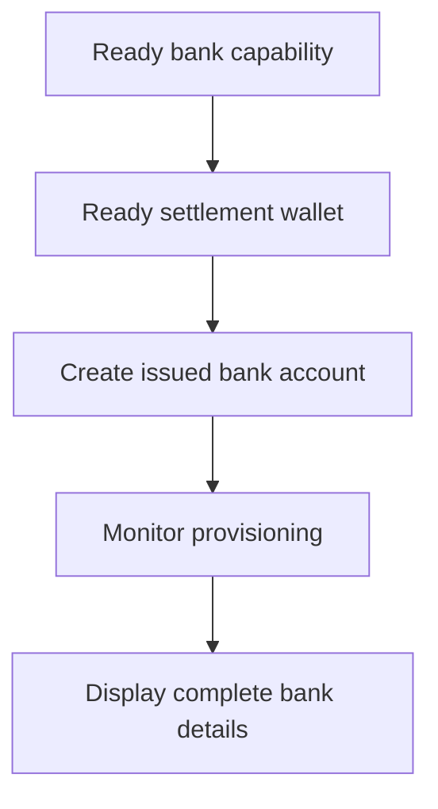

Izmantojiet izsniegtu bankas kontu, kad klientam nepieciešami atkārtoti izmantojami bankas rekvizīti. Vienreizējām finansēšanas instrukcijām, kas piesaistītas konkrētai summai, izmantojiet [Saņemt līdzekļus](/lv/integration/receive-funds).


```mermaid
flowchart TD
  A["Ready bank capability"] --> B["Ready settlement wallet"]
  B --> C["Create issued bank account"]
  C --> D["Monitor provisioning"]
  D --> E["Display complete bank details"]
```

## Pirms sākat

Jums nepieciešams klienta ID, gatava bankas iespēja paredzētajai metodei un valūtai, kā arī gatavs izsniegts maks, kas pieder tam pašam klientam. Ar `allowPending` varat saglabāt pieprasījumu, kamēr atlasītā banka vēl izskata klientu. Pabeidziet atvērtos darbus sadaļā [Iespējas un uzdevumi](/lv/integration/onboarding/capabilities-and-requirements).

## 1. Izveidojiet vai atlasiet norēķinu maku

Izveidojiet izsniegtu maku sadaļā [Konti un maki](/lv/integration/accounts#create-the-account), pēc tam nolasiet to vēlreiz. Turpiniet tikai tad, kad tā pašreizējais statuss atļauj norēķinu.

Saglabājiet no atbildes iegūto `data.id` kā `SETTLEMENT_WALLET_ID`. Neizmantojiet ārējo maku laukam `settlement.accountId`.

## 2. Izveidojiet izsniegtu bankas kontu

Izmantojiet [`POST /v3/customers/{customerId}/accounts`](/api-reference/accounts/post-v3-customers-by-customer-id-accounts) ar šīm galvenēm:

```http
X-API-Key: ${SWIPELUX_API_KEY}
Idempotency-Key: issued-bank-account-001
Content-Type: application/json
```

Nosūtiet šo pieprasījuma pamattekstu:

```json
{
  "origin": "issued",
  "type": "bank",
  "method": "ach",
  "country": "US",
  "currency": "USD",
  "settlement": {
    "accountId": "${SETTLEMENT_WALLET_ID}"
  },
  "label": "USD account"
}
```

Saglabājiet atgriezto `data.id` kā `BANK_ACCOUNT_ID`. Saglabājiet arī `data.status`, `data.openTaskIds`, `data.details` un norēķinu attiecības.

Neobligātie pieprasījuma lauki:

| Lauks | Attiecas uz | Darbība |
| --- | --- | --- |
| `institution` | Izsniegtiem `ach`, `wire` un `swift` | Atlasa tieši šo banku. Swipelux neizmanto citu banku kā rezerves variantu. Izmantojiet iestādes ID, kas atgriezts atbalstīto iespēju atbildē. |
| `allowPending` | Izsniegtiem `ach`, `wire` un `swift` | Iestatiet uz `true`, lai saglabātu pieprasījumu, kamēr atlasītās bankas pieteikums gaida apstiprinājumu. Nepieciešams `institution`. |
| `settlement.currency` | Izsniegtiem bankas kontiem | `USDC` vai `USDT`. Nosaka stablecoin, kas tiek piegādāts uz norēķinu maku. |

### Izvēlieties banku {#choose-the-bank}

Nosūtiet `institution`, kad klientam nepieciešami konkrētas bankas rekvizīti. Swipelux rezervē vienu izsniegtu kontu katram klientam, metodei, valūtai un iestādei. Pieprasījums bez `institution` atgriež `409 conflict`, ja klientam jau ir izsniegts konts šai metodei un valūtai jebkurā bankā. Pieprasījums ar `institution` atgriež `409 conflict` tikai tad, ja konts šajā bankā jau pastāv.

Konta lasīšana atgriež atlasīto banku kā `institution` ar `id`, `name` un `bic`. `bic` var būt `null`.

Idempotence attiecas uz atlasīto banku. Atkārtojot to pašu pieprasījumu, tiek atgriezts sākotnējais konts. Mainot `institution` ar to pašu `Idempotency-Key`, tiek atgriezts `409 idempotency_conflict`.

### Saglabājiet pieprasījumu pirms bankas apstiprinājuma {#save-the-request-before-bank-approval}

Pēc noklusējuma Swipelux pieņem izsniegta bankas konta pieprasījumu tikai pēc tam, kad bankas iespēja ir gatava. Lai savāktu klienta konta iestatījumus agrāk, nosūtiet `allowPending: true` kopā ar `institution`:

```json
{
  "origin": "issued",
  "type": "bank",
  "method": "wire",
  "country": "US",
  "currency": "USD",
  "institution": "${INSTITUTION_ID}",
  "allowPending": true,
  "settlement": {
    "accountId": "${SETTLEMENT_WALLET_ID}"
  },
  "label": "USD wire account"
}
```

Kamēr bankas pieteikums tiek izskatīts, konts atgriež `status: "in_review"` ar `statusReason.code` vērtību `waiting_for_approval`. Atbildē ir iekļauts arī `applicationId` un pieteikuma `openTaskIds`. Pabeidziet šos uzdevumus sadaļā [Iespējas un uzdevumi](/lv/integration/onboarding/capabilities-and-requirements).

Saglabātais pieprasījums saglabā savu konta ID, norēķinu maku un konta vietu. Kad pieteikums un iespēja ir gatavi, Swipelux nodrošina bankas rekvizītus ar to pašu `BANK_ACCOUNT_ID`. Turpiniet nolasīt šo ID. Neveidojiet citu pieprasījumu.

Ja pieteikums vispirms tiek noraidīts, atcelts vai arhivēts, konts kļūst `rejected`. Tas vairs neaizņem konta vietu.

### Izvēlieties norēķinu valūtu {#choose-the-settlement-currency}

Pēc noklusējuma iemaksas tiek norēķinātas norēķinu maka valūtā. Iestatiet `settlement.currency` uz `USDC` vai `USDT`, lai izvēlētos piegādājamo aktīvu neatkarīgi no maka valūtas:

```json
{
  "settlement": {
    "accountId": "${SETTLEMENT_WALLET_ID}",
    "currency": "USDT"
  }
}
```

`USDT` pieprasa `USD` kontu un norēķinu maku tīklā, kas atbalsta USDT piegādi. Pretējā gadījumā pieprasījums atgriež `400 invalid_settlement_target`. Konta lasīšana atgriež saglabāto izvēli, arī kamēr konts tiek nodrošināts.

Bankas konta ID un maka ID ir dažādas lomas. Nolasiet nodrošinājumu un bankas rekvizītus caur bankas konta ID. Izmantojiet norēķinu maka ID, lai identificētu, kur iemaksas tiek kreditētas.

## 3. Uzraugiet nodrošinājumu

Pēc izveides un pēc katra attiecīgā webhook izsauciena nolasiet [`GET /v3/customers/{customerId}/accounts/{accountId}`](/api-reference/accounts/get-v3-customers-by-customer-id-accounts-by-account-id).

Uzturiet klienta saskarni gaidīšanas režīmā, kamēr `details` nav pieejams. Ja `openTaskIds` nav tukšs, pabeidziet jaunākos uzdevumus un atkārtoti nolasiet kontu. Nesniedziet secinājumus par gatavību pēc pagājušā laika.

Ja konts tika saglabāts ar `allowPending: true`, tas paliek `in_review` ar `statusReason.code` vērtību `waiting_for_approval`, līdz banka apstiprina pieteikumu.

Ja jaunākais `statusReason.code` ir `awaiting_assignment`, izveidojiet pirmo iemaksu tam pašam klientam, iespējai un norēķinu makam sadaļā [Saņemt līdzekļus](/lv/integration/receive-funds), pēc tam vēlreiz nolasiet bankas kontu. Sekojiet šim zaram tikai tad, kad pašreizējais konts to pieprasa.

## 4. Droši parādiet bankas rekvizītus

Rādiet tikai pilnas detaļas, kas atgrieztas jaunākajā konta lasīšanā. Ja `details.referenceRequired` ir true, parādiet precīzu `details.reference` un padariet to kopējamu. Ja tas ir false, neizdomājiet atsauci.

Izsniegtiem `swift` kontiem parādiet `details.bankName`, `details.swiftCode` (saņēmējbankas BIC), `details.accountNumber`, `details.accountHolderName` un `details.accountHolderAddress`, ja tie ir atgriezti. Sūtītājiem saņēmēja adrese starptautiskajā pārvedumā jānokopē precīzi. Parādiet arī `details.bankAddress` un visus starpniekbankas laukus, ko atgriež konts.

Šie bankas rekvizīti ir atkārtoti izmantojami. Neaizstājiet tos ar finansēšanas koordinātām no kotētas iemaksas, kas pieder tikai šim pārvedumam.

Tālāk pievienojiet [Webhook izsaukumus](/lv/integration/webhooks), lai nodrošinājuma atjauninājumi sasniegtu jūsu lietojumprogrammu, neaizturot klientu uz aptaujas ekrāna.
