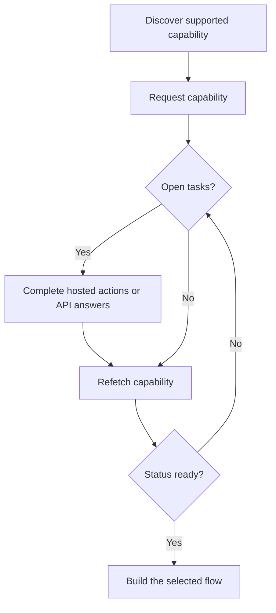

Iespēja norāda, vai klients var izmantot konkrētu rezultātu, maksājuma metodi un virzienu. Atvērtie uzdevumi norāda, kam jānotiek, pirms šī iespēja vai saistīts resurss var virzīties uz priekšu.



```bash
export API_BASE='https://platform.swipelux.com'
export SWIPELUX_API_KEY='replace-with-your-api-key'
```

## Atklājiet atbalstītās iespējas

Nolasiet klienta pašreizējās iespējas ar [`GET /v3/customers/{customerId}/capabilities/supported`](/api-reference/capabilities/get-v3-customers-by-customer-id-capabilities-supported):

```bash
curl --request GET \
  "${API_BASE}/v3/customers/${CUSTOMER_ID}/capabilities/supported" \
  --header "X-API-Key: ${SWIPELUX_API_KEY}"
```

Izvēlieties atbildes ierakstu, kas atbilst paredzētajiem `directions`, `method` un `accountType`. Turpiniet tikai tad, kad `availability` ir `available` vai `beta` un `eligibility.eligible` ir `true`. Ja tiek atgrieztas `institutions`, izvēlieties tikai ID no šīs atbildes.

Saglabājiet izvēlēto `data[].id` kā `CAPABILITY_ID`. Nekad nekopējiet iespējas ID no cita klienta vai vides.

### Apkopotais un nosauktais konta veids

Bankas iespējas ir divos variantos, kas kodēti kā lauks `accountType` un iespējas ID sufikss (piemēram, `ach_pooled`, `wire_named`):

- **`pooled`**: kopīgs Swipelux bankas konts. Katra iemaksa izmanto unikālu atsauci līdzekļu maršrutēšanai. Izvēlieties šo vienreizējiem pārvedumiem.
- **`named`**: klientam veltīti bankas rekvizīti (virtuāls IBAN, veltīts ACH konts). Atkārtoti izmantojami un dalāmi ar jebkuru maksātāju. Nepieciešams [izsniegtiem bankas kontiem](/lv/integration/issue-bank-account).

Pēc noklusējuma izmantojiet `pooled`. Izmantojiet `named` tikai tad, kad klientam nepieciešami atkārtoti izmantojami bankas rekvizīti. Pārbaudiet `supported` atbildi, lai uzzinātu, kuri varianti ir pieejami.

## Pieprasiet iespēju

Pieprasiet izvēlēto opciju ar [`POST /v3/customers/{customerId}/capabilities/{capabilityId}`](/api-reference/capabilities/post-v3-customers-by-customer-id-capabilities-by-capability-id):

```bash
curl --request POST \
  "${API_BASE}/v3/customers/${CUSTOMER_ID}/capabilities/${CAPABILITY_ID}" \
  --header "X-API-Key: ${SWIPELUX_API_KEY}" \
  --header "Idempotency-Key: capability-request-001" \
  --header "Content-Type: application/json" \
  --data '{}'
```

Izmantojiet skaidru `institutions` masīvu tikai tad, kad jums nepieciešams izvēlēties no atbalstīto iespēju atbildē atgrieztajiem ID.

Saglabājiet `data.status` kā `CAPABILITY_STATUS`, `data.openTaskIds` kā `OPEN_TASK_IDS` un katru `data.applications[].id` sarakstā `APPLICATION_IDS`.

## Pabeidziet pašreizējos uzdevumus {#complete-current-tasks}

Uzskaitiet uzdevumus ar [`GET /v3/customers/{customerId}/tasks`](/api-reference/tasks/list-customer-tasks), izvēlieties ID no `OPEN_TASK_IDS`, pēc tam nolasiet katru pašreizējo uzdevumu ar [`GET /v3/customers/{customerId}/tasks/{taskId}`](/api-reference/tasks/get-customer-task):

```bash
curl --request GET \
  "${API_BASE}/v3/customers/${CUSTOMER_ID}/tasks/${TASK_ID}" \
  --header "X-API-Key: ${SWIPELUX_API_KEY}"
```

Izmantojiet jaunāko `data.revision` un `data.requirements`. Uzreiz pirms iesniegšanas atkārtoti ielādējiet uzdevumu, ja kāds no tiem varētu būt mainījies.

Katrs atvērtais uzdevums ietver `dueAt` laika zīmogu. Kad Swipelux izveido uzdevumu bez skaidri norādīta izpildes termiņa, `dueAt` pēc noklusējuma tiek iestatīts tieši 31 dienu pēc uzdevuma `createdAt`. Uztveriet `dueAt` kā informatīvu: to nevar iestatīt caur API, un tas neizraisa automātisku dzīves cikla pāreju. Tikai atsevišķais lauks `deadline`, ja tas ir norādīts, izraisa automātisku pāreju.

### Uzņemtās darbības

Uzdevuma detaļu atbildē katrs `verificationSessions` un `tosSessions` ieraksts ietver `action` objektu. Uzdevumu saraksta atbildēs šo darbību saišu nav. Saglabājiet katras sesijas `id`, pēc tam pirms klienta nosūtīšanas nolasiet `action.kind`; nenosakiet saites pieejamību tikai pēc sesijas `status`.

- `action.kind: "available"` ietver `action.url` un `action.expiresAt` (pašlaik vienmēr `null`). Saglabājiet `action.url`, nosūtiet klientu uz šo adresi un pēc tam atkārtoti nolasiet uzdevumu. Sesijas līmeņa lauki `url` un `expiresAt` satur tās pašas vērtības.
- `action.kind: "unavailable"` nozīmē, ka saiti nedrīkst parādīt. Sesijas līmeņa lauku `url` un `expiresAt` nav. Sesijas `status` viens pats nenosaka, kuru darbības veidu saņemsiet.

```json
{
  "data": {
    "verificationSessions": [
      {
        "id": "vfy_000000000000000003",
        "key": "identity_verification",
        "type": "identity_verification",
        "status": "action_required",
        "action": {
          "kind": "available",
          "url": "https://platform.swipelux.com/kyc/redirect/cus_000000000000000001/tsk_000000000000000002/vfy_000000000000000003",
          "expiresAt": null
        },
        "url": "https://platform.swipelux.com/kyc/redirect/cus_000000000000000001/tsk_000000000000000002/vfy_000000000000000003",
        "expiresAt": null
      }
    ],
    "tosSessions": [
      {
        "id": "vfy_000000000000000004",
        "key": "terms_of_service",
        "type": "terms_of_service",
        "status": "completed",
        "action": { "kind": "unavailable" }
      }
    ]
  }
}
```

Tās ir uzdevuma mērogā ierobežotas darbības, nevis atsevišķs klienta verifikācijas dzīves cikls.

### Augšupielādējiet dokumentus {#upload-documents}

Ja prasība pieprasa dokumentu, augšupielādējiet to ar [`POST /v3/customers/{customerId}/documents`](/api-reference/documents/post-v3-customers-by-customer-id-documents):

```bash
export DOCUMENT_PATH='/absolute/path/to/requested-document.pdf'

curl --request POST \
  "${API_BASE}/v3/customers/${CUSTOMER_ID}/documents" \
  --header "X-API-Key: ${SWIPELUX_API_KEY}" \
  --header "Idempotency-Key: customer-document-001" \
  --form "file=@${DOCUMENT_PATH}"
```

Saglabājiet atgriezto `data.id` kā `DOCUMENT_ID`, pirms iesniedzat atbildi, kas uz to atsaucas.

### API atbildes

Iesniedziet vienu pilnu atbilžu kopu pašreizējai versijai ar [`POST /v3/customers/{customerId}/tasks/{taskId}/submissions`](/api-reference/task-submissions/create-customer-task-submission):

```bash
curl --request POST \
  "${API_BASE}/v3/customers/${CUSTOMER_ID}/tasks/${TASK_ID}/submissions" \
  --header "X-API-Key: ${SWIPELUX_API_KEY}" \
  --header "Idempotency-Key: task-submission-001" \
  --header "Content-Type: application/json" \
  --data @- <<'JSON'
{
  "taskRevision": 3,
  "answers": [
    {
      "requirementId": "req_from_current_task",
      "answer": {
        "type": "text",
        "value": "Current answer"
      }
    }
  ]
}
JSON
```

Ņemiet katru prasības ID un atbildes veidu no jaunākā uzdevuma. Ja API ziņo, ka uzdevums ir mainījies, atkārtoti ielādējiet to un pārveidojiet iesniegumu no jaunās versijas.

## Turpiniet, kad iespēja ir gatava

Atkārtoti nolasiet iespēju ar [`GET /v3/customers/{customerId}/capabilities/{capabilityId}`](/api-reference/capabilities/get-v3-customers-by-customer-id-capabilities-by-capability-id):

```bash
curl --request GET \
  "${API_BASE}/v3/customers/${CUSTOMER_ID}/capabilities/${CAPABILITY_ID}" \
  --header "X-API-Key: ${SWIPELUX_API_KEY}"
```

Aizstājiet saglabāto statusu un uzdevumu ID ar jaunāko atbildi. Turpiniet tikai tad, kad pašreizējais iespējas statuss atļauj kontu, kotāciju vai pārvedumu, ko paredzat izveidot.

Tālāk izvēlieties atbilstošo ceļojumu sadaļā [Biežākās plūsmas](/lv/integration/common-flows).
