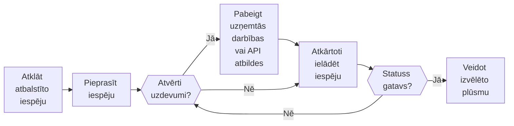

Iespēja norāda, vai klients var izmantot konkrētu rezultātu, maksājuma metodi un virzienu. Atvērtie uzdevumi norāda, kam jānotiek, pirms šī iespēja vai saistīts resurss var virzīties uz priekšu.


```mermaid
%%{init: {"flowchart": {"rankSpacing": 20, "nodeSpacing": 16, "wrappingWidth": 80, "padding": 8}}}%%
flowchart LR
  A["Atklāt atbalstīto iespēju"] --> B["Pieprasīt iespēju"]
  B --> C{{"Atvērti uzdevumi?"}}
  C -->|"Jā"| D["Pabeigt uzņemtās darbības vai API atbildes"]
  D --> E["Atkārtoti ielādēt iespēju"]
  C -->|"Nē"| E
  E --> F{{"Statuss gatavs?"}}
  F -->|"Nē"| C
  F -->|"Jā"| G["Veidot izvēlēto plūsmu"]
```

```bash Environment variables
export API_BASE='https://platform.swipelux.com'
export SWIPELUX_API_KEY='replace-with-your-api-key'
```

## Atklājiet atbalstītās iespējas

Nolasiet klienta pašreizējās iespējas ar [`GET /v3/customers/{customerId}/capabilities/supported`](/api-reference/capabilities/get-v3-customers-by-customer-id-capabilities-supported):

```bash List supported capabilities
curl --request GET \
  "${API_BASE}/v3/customers/${CUSTOMER_ID}/capabilities/supported" \
  --header "X-API-Key: ${SWIPELUX_API_KEY}"
```

Izvēlieties atbildes ierakstu, kas atbilst paredzētajiem `directions`, `method` un `accountType`. Turpiniet tikai tad, kad `availability` ir `available` vai `beta` un `eligibility.eligible` ir `true`. Ja tiek atgrieztas `institutions`, izvēlieties tikai ID no šīs atbildes.

Katrs iestādes ieraksts ietver `logoUrl` un karodziņu `isDefault`. Izmantojiet `logoUrl`, lai parādītu bankas logotipu bankas izvēles saskarnē, un attēlojiet savu vispārīgo bankas ikonu, kad tā vērtība ir `null`. `isDefault` attiecas tikai uz šo klientu un iespēju, nevis uz iestādi globāli. [`GET /v3/institutions`](/api-reference/institutions/get-v3-institutions) atgriež to pašu `logoUrl`, kura vērtība var būt `null`. Iestāžu ID ir necaurredzami, tāpēc apstrādājiet jaunus ID bez koda izmaiņām.

```json Institution entry
{
  "institutions": [
    {
      "id": "jpmorgan",
      "name": "JPMorgan Chase",
      "bic": "CHASUS33",
      "logoUrl": "https://wallet.swipelux.com/bank-logos/jpmorgan.png",
      "countries": ["US"],
      "isDefault": true
    }
  ]
}
```

Saglabājiet izvēlēto `data[].id` kā `CAPABILITY_ID`. Nekad nekopējiet iespējas ID no cita klienta vai vides.

### Apkopotais un nosauktais konta veids

Bankas iespējas ir divos variantos, kas kodēti kā lauks `accountType` un iespējas ID sufikss (piemēram, `ach_pooled`, `wire_named`):

- **`pooled`**: kopīgs Swipelux bankas konts. Katra iemaksa izmanto unikālu atsauci līdzekļu maršrutēšanai. Izvēlieties šo vienreizējiem pārvedumiem.
- **`named`**: klientam veltīti bankas rekvizīti (virtuāls IBAN, veltīts ACH konts). Atkārtoti izmantojami un dalāmi ar jebkuru maksātāju. Nepieciešams [izsniegtiem bankas kontiem](/lv/integration/issue-bank-account).

Pēc noklusējuma izmantojiet `pooled`. Izmantojiet `named` tikai tad, kad klientam nepieciešami atkārtoti izmantojami bankas rekvizīti. Pārbaudiet `supported` atbildi, lai uzzinātu, kuri varianti ir pieejami.

Lai saņemtu SWIFT iemaksas vai izsniegtu SWIFT bankas rekvizītus, izmantojiet `swift_named`. `swift_pooled` atbalsta tikai izmaksas, tāpēc pārbaudiet katras opcijas `directions` atbalstīto iespēju atbildē. Nosauktais SWIFT konts atgriež atkārtoti izmantojamus saņemšanas rekvizītus, tostarp bankas BIC, atsauci, ja tā ir nepieciešama, un saņēmēja adresi, ja banka to sniedz.

Izsniegtiem ACH, Wire un SWIFT kontiem varat izvēlēties konkrētu banku ar `institution` un saglabāt konta pieprasījumu, pirms banka apstiprina klientu. Skatiet [Izsniegt bankas kontu](/lv/integration/issue-bank-account#choose-the-bank).

## Pieprasiet iespēju

Pieprasiet izvēlēto opciju ar [`POST /v3/customers/{customerId}/capabilities/{capabilityId}`](/api-reference/capabilities/post-v3-customers-by-customer-id-capabilities-by-capability-id):

```bash Request capability
curl --request POST \
  "${API_BASE}/v3/customers/${CUSTOMER_ID}/capabilities/${CAPABILITY_ID}" \
  --header "X-API-Key: ${SWIPELUX_API_KEY}" \
  --header "Idempotency-Key: capability-request-001" \
  --header "Content-Type: application/json" \
  --data '{}'
```

Izmantojiet skaidru `institutions` masīvu tikai tad, kad jums nepieciešams izvēlēties no atbalstīto iespēju atbildē atgrieztajiem ID.

Saglabājiet `data.status` kā `CAPABILITY_STATUS`, `data.accountProvisioning` kā `ACCOUNT_PROVISIONING_STATUS`, `data.openTaskIds` kā `OPEN_TASK_IDS` un katru `data.applications[].id` sarakstā `APPLICATION_IDS`.

### Kopīgi pieteikumi katrai bankai {#shared-applications-per-bank}

Nosauktajām bankas iespējām katram klientam ir viena pieteikuma lieta katrā bankā. Apkopotās un platformas iespējas izmanto lietas bez bankas. Swipelux koplieto lietu starp visām saderīgajām iespējām, ko pieprasāt:

- Viens apstiprinājums var aptvert vairākas iespējas. Piemēram, apstiprināta lieta vienā bankā var padarīt gan ACH, gan Wire iespēju `ready`.
- Vēlāks pieprasījums, kas atbilst esošai lietai, to izmanto atkārtoti. Swipelux neatver otru pieteikumu un nepievieno dublētus uzdevumus.
- Lietas dažādās bankās ir neatkarīgas. Noraidījums vienā bankā neietekmē lietu citā bankā.

Pieprasījuma atbilde norāda, kuru lietu Swipelux izmantoja:

- `201` nozīmē, ka pieprasījums atvēra jaunu pieteikuma lietu.
- `200` nozīmē, ka pieprasījums tika piesaistīts pieteikuma lietai, kas klientam jau bija, piemēram, atkārtots pieprasījums bankas iespējai, kas klientam jau ir, vai pieprasījums atceltai iespējai. Atkārtots pieprasījums iespējām `card` vai `stablecoin_transfers` joprojām atgriež [`409 capability_already_exists`](/integration/errors#capability-already-exists).
- `selectedApplicationId` ir augstākā līmeņa lauks blakus `data`, kas satur pieprasījuma izvēlētās vai atvērtās lietas ID. Swipelux to izlaiž, ja pieprasījums neizvēlējās lietu. Idempotenta atkārtošana atgriež to pašu vērtību.

Saīsināta atbilde:

```json Response (abbreviated)
{
  "data": {
    "id": "ach_named",
    "status": "pending",
    "openTaskIds": ["tsk_000000000000000002"],
    "applications": [{ "id": "apl_000000000000000005", "status": "in_review" }]
  },
  "selectedApplicationId": "apl_000000000000000005"
}
```

Nosauktajām iespējām vēlreiz nosūtiet to pašu `institutions` sarakstu, lai izvēlētos to pašu lietu, vai nosūtiet viena iestādes ID, lai mērķētu uz šo banku. Banka, kas klientu ir galīgi noraidījusi, tiek izlaista. Ja norādāt tikai šo banku vai ja visas atbilstošās bankas ir klientu noraidījušas, pieprasījums atgriež [`409 capability_terminally_rejected`](/integration/errors#capability-terminally-rejected). Lai pēc noraidījuma mēģinātu citu banku, vēlreiz pieprasiet iespēju ar šīs bankas iestādes ID.

Iespējas statuss atspoguļo visas klienta saistītās lietas. Nosauktai iespējai pietiek ar vienu `ready` lietu, kuras apstiprinājums to aptver, lai tā kļūtu `ready`, neatkarīgi no tā, ko ziņo citas bankas. Apkopotā iespēja gaida arī savu metodes pārbaudi, kas tiek norādīta `probes` klienta pieteikumu sarakstā.

#### Uzskaitiet klienta pieteikumus {#list-the-customers-applications}

Uzskaitiet visas klienta pieteikuma lietas ar [`GET /v3/customers/{customerId}/applications`](/api-reference/capabilities/get-v3-customers-by-customer-id-applications). Rezultāti tiek lapoti ar `nextCursor` un `hasMore`, un tie pieņem `updatedAfter`:

```bash List applications
curl --request GET \
  "${API_BASE}/v3/customers/${CUSTOMER_ID}/applications" \
  --header "X-API-Key: ${SWIPELUX_API_KEY}"
```

Katrs ieraksts ietver pieteikuma laukus, kas tiek atgriezti iespējas `applications[]`, kā arī:

- `scope`: `named` lietai vienā bankā, `provider_pooled` vai `platform` lietām bez bankas, vai `null` neklasificētai vēsturiskai lietai. `institution` nav iekļauts `provider_pooled` un `platform` lietām.
- `requestedScope[]`: iespēju atslēgas, kas pieprasītas attiecībā uz lietu, katra ar savu pirmo `requestedAt`. Ieraksti nekad netiek noņemti.
- `coverage[]`: iespēju atslēgas, ko aptver lietas apstiprinājums, katra ar `grantedAt` un `source`. Pārklājums fiksē tvērumu, nevis autorizāciju. Nolasiet iespēju, lai uzzinātu tās pašreizējo statusu.
- `probes[]`: metožu pārbaudes apkopotajām iespēju atslēgām, ko lieta aptver, katra ar `capabilityKey`, `status` un `reason`. Nosauktajām atslēgām pārbaude nekad nav nepieciešama.
- `generation`, `predecessorApplicationId` un `supersededByApplicationId`: pēctecības saites. Ja ir iestatīts `supersededByApplicationId`, lieta ir aizstāta. Sekojiet šim ID uz pašreizējo lietu.

Saīsināta atbilde:

```json Response (abbreviated)
{
  "data": [
    {
      "id": "apl_000000000000000005",
      "status": "ready",
      "scope": "named",
      "institution": { "id": "jpmorgan", "name": "JPMorgan Chase", "bic": "CHASUS33" },
      "requestedScope": [
        { "capabilityKey": "ach_named", "requestedAt": "2026-09-20T10:00:00.000Z" }
      ],
      "coverage": [
        { "capabilityKey": "ach_named", "grantedAt": "2026-09-22T12:00:00.000Z", "source": "approval" },
        { "capabilityKey": "wire_named", "grantedAt": "2026-09-22T12:00:00.000Z", "source": "approval" }
      ],
      "probes": [],
      "generation": 1,
      "predecessorApplicationId": null,
      "supersededByApplicationId": null
    }
  ],
  "nextCursor": null,
  "hasMore": false
}
```

## Pabeidziet pašreizējos uzdevumus {#complete-current-tasks}

Uzskaitiet uzdevumus ar [`GET /v3/customers/{customerId}/tasks`](/api-reference/tasks/list-customer-tasks), izvēlieties ID no `OPEN_TASK_IDS`, pēc tam nolasiet katru pašreizējo uzdevumu ar [`GET /v3/customers/{customerId}/tasks/{taskId}`](/api-reference/tasks/get-customer-task):

```bash List open tasks
curl --request GET \
  "${API_BASE}/v3/customers/${CUSTOMER_ID}/tasks/${TASK_ID}" \
  --header "X-API-Key: ${SWIPELUX_API_KEY}"
```

Izmantojiet jaunāko `data.revision` un `data.requirements`. Uzreiz pirms iesniegšanas atkārtoti ielādējiet uzdevumu, ja kāds no tiem varētu būt mainījies.

### Atkārtoti izmantoti profila pierādījumi {#reused-profile-evidence}

Pieteikuma datu ievākšanas uzdevumiem, kas pieņem tiešu iesniegšanu caur API, Swipelux atkārtoti izmanto informāciju, ko klients jau ir sniedzis. Kad šāds uzdevums tiek izveidots vai saskaņots, Swipelux pārbauda klienta profilu un paša klienta augšupielādētos dokumentus. Atbilstošās prasības, ko jau pamato izmantojama profila vērtība vai dokuments, pāriet uz `in_review`, nevis paliek rīkojamas. Profila atjauninājumi un jaunu dokumentu augšupielāde izraisa to pašu pārbaudi esošajiem uzdevumiem.

Rīkojamas paliek tikai trūkstošās vai nesaderīgās vērtības. Atkārtota izmantošana neapstiprina pierādījumus. Swipelux tos joprojām pārskata. Skaidri labojumu pieprasījumi un iepriekš atbildētas prasības paliek rīkojamas. Īpašnieku un saistīto pušu dokumenti netiek izmantoti atkārtoti, un prasības, kas tiek ievāktas tikai mitinātā sesijā, saglabā savu parasto plūsmu.

### Prasību attēlošana {#render-requirements}

Veidojiet formas no metadatiem, ko atgriež katra prasība, nevis no prasību atslēgām. Prasība var ietvert neobligātu īsu `title`, un katrs `request` ietver `prompt`, ko parādīt zem virsraksta.

Prasības ar `request.type: "profile"` identificē profila lauku ar `profilePointer` un pievieno ievades metadatus:

- `allowedValues`: atļautās vērtības skalāram laukam vai katram masīva lauka elementam. Iesniedziet šīs vērtības, nevis tulkotas attēlojamās etiķetes.
- `valueSchema`: pašpietiekams JSON Schema Draft 7 dokuments, kas apraksta ievades formu, ligzdotos rekvizītus, obligātos laukus un strukturālos ierobežojumus. Objektu uzskaitījumi parādās attiecīgajā rekvizītā, piemēram, `valueSchema.items.properties.type.enum` nodokļu identifikatoriem. Swipelux pēc iesniegšanas joprojām piemēro starplauku un pārskatīšanas validāciju, tāpēc vērtību, kas atbilst shēmai, joprojām var noraidīt.
- `valueType: "country"` vai masīviem `itemValueType: "country"`: lauks pieņem ISO 3166-1 alpha-2 kodus ar lielajiem burtiem. Ligzdotie valsts rekvizīti `valueSchema` izmanto `format: "iso-3166-1-alpha-2"`. Lokalizētām etiķetēm izmantojiet standarta valstu sarakstu.

```json Requirement
{
  "id": "req_000000000000000010",
  "key": "account_purposes",
  "title": "Account purpose",
  "status": "action_required",
  "request": {
    "type": "profile",
    "prompt": "Select every purpose that applies.",
    "required": true,
    "profilePointer": "/financialProfile/accountPurposes",
    "valueType": "array",
    "itemValueType": "string",
    "allowedValues": ["business_expenses", "ecommerce", "payroll"],
    "valueSchema": {
      "$schema": "http://json-schema.org/draft-07/schema#",
      "type": "array",
      "items": { "enum": ["business_expenses", "ecommerce", "payroll"] }
    }
  }
}
```

Šis piemērs saīsina vērtību katalogu, bet API atgriež visas atļautās vērtības. Dažām profila prasībām nav publicētas shēmas, un tās izlaiž `valueSchema` un `allowedValues`. Attēlojiet tās, izmantojot `prompt` un `valueType`.

Katrs atvērtais uzdevums ietver `dueAt` laika zīmogu. Kad Swipelux izveido uzdevumu bez skaidri norādīta izpildes termiņa, `dueAt` pēc noklusējuma tiek iestatīts tieši 31 dienu pēc uzdevuma `createdAt`. Uztveriet `dueAt` kā informatīvu: to nevar iestatīt caur API, un tas neizraisa automātisku dzīves cikla pāreju. Tikai atsevišķais lauks `deadline`, ja tas ir norādīts, izraisa automātisku pāreju.

### Uzņemtās darbības

Uzdevuma detaļu atbildē katrs `verificationSessions` un `tosSessions` ieraksts ietver `action` objektu. Uzdevumu saraksta atbildēs šo darbību saišu nav. Saglabājiet katras sesijas `id`, pēc tam pirms klienta nosūtīšanas nolasiet `action.kind`; nenosakiet saites pieejamību tikai pēc sesijas `status`.

- `action.kind: "available"` ietver `action.url` un `action.expiresAt` (pašlaik vienmēr `null`). Saglabājiet `action.url`, nosūtiet klientu uz šo adresi un pēc tam atkārtoti nolasiet uzdevumu. Sesijas līmeņa lauki `url` un `expiresAt` satur tās pašas vērtības.
- `action.kind: "unavailable"` nozīmē, ka saiti nedrīkst parādīt. Sesijas līmeņa lauku `url` un `expiresAt` nav. Sesijas `status` viens pats nenosaka, kuru darbības veidu saņemsiet.

```json Verification session
{
  "data": {
    "verificationSessions": [
      {
        "id": "vfy_000000000000000003",
        "key": "identity_verification",
        "type": "identity_verification",
        "status": "action_required",
        "action": {
          "kind": "available",
          "url": "https://platform.swipelux.com/kyc/redirect/cus_000000000000000001/tsk_000000000000000002/vfy_000000000000000003",
          "expiresAt": null
        },
        "url": "https://platform.swipelux.com/kyc/redirect/cus_000000000000000001/tsk_000000000000000002/vfy_000000000000000003",
        "expiresAt": null
      }
    ],
    "tosSessions": [
      {
        "id": "vfy_000000000000000004",
        "key": "terms_of_service",
        "type": "terms_of_service",
        "status": "completed",
        "action": { "kind": "unavailable" }
      }
    ]
  }
}
```

Tās ir uzdevuma mērogā ierobežotas darbības, nevis atsevišķs klienta verifikācijas dzīves cikls.

### Augšupielādējiet dokumentus {#upload-documents}

Ja prasība pieprasa dokumentu, augšupielādējiet to ar [`POST /v3/customers/{customerId}/documents`](/api-reference/documents/post-v3-customers-by-customer-id-documents):

```bash Upload document
export DOCUMENT_PATH='/absolute/path/to/requested-document.pdf'

curl --request POST \
  "${API_BASE}/v3/customers/${CUSTOMER_ID}/documents" \
  --header "X-API-Key: ${SWIPELUX_API_KEY}" \
  --header "Idempotency-Key: customer-document-001" \
  --form "file=@${DOCUMENT_PATH}"
```

Saglabājiet atgriezto `data.id` kā `DOCUMENT_ID`, pirms iesniedzat atbildi, kas uz to atsaucas.

Lai vēlāk izgūtu saglabātu failu, izsauciet [`GET /v3/customers/{customerId}/documents/{documentId}/download`](/api-reference/documents/get-v3-customers-by-customer-id-documents-by-document-id-download). Swipelux atgriež `url`, kas lejupielādē failu kā pielikumu un kura derīgums beidzas pēc vienas stundas. Arhivēti dokumenti atgriež `404`.

### API atbildes

Iesniedziet vienu pilnu atbilžu kopu pašreizējai versijai ar [`POST /v3/customers/{customerId}/tasks/{taskId}/submissions`](/api-reference/task-submissions/create-customer-task-submission):

```bash Submit task answers
curl --request POST \
  "${API_BASE}/v3/customers/${CUSTOMER_ID}/tasks/${TASK_ID}/submissions" \
  --header "X-API-Key: ${SWIPELUX_API_KEY}" \
  --header "Idempotency-Key: task-submission-001" \
  --header "Content-Type: application/json" \
  --data @- <<'JSON'
{
  "taskRevision": 3,
  "answers": [
    {
      "requirementId": "req_from_current_task",
      "answer": {
        "type": "text",
        "value": "Current answer"
      }
    }
  ]
}
JSON
```

Ņemiet katru prasības ID un atbildes veidu no jaunākā uzdevuma. Ja API ziņo, ka uzdevums ir mainījies, atkārtoti ielādējiet to un pārveidojiet iesniegumu no jaunās versijas.

### Patiesā labuma guvēja priekšnosacījums uzņēmumiem {#beneficial-owner-prerequisite-for-businesses}

Uzņēmuma iespējas pieprasīšana, kurai nepieciešami patiesā labuma guvēja pierādījumi, izdodas arī tad, kad klientam vēl nav kvalificējoša īpašnieka. Iespēja tiek izveidota kā `restricted` ar `statusReason.code: tasks_due`, un uzņēmuma datu ievākšanas uzdevums pieprasa trūkstošos īpašumtiesību faktus, tostarp īpašumtiesību struktūru.

Tas pats uzdevums ietver `resource_reference` prasību, kuras pieprasījums ietver `qualification: "beneficial_owner"`:

```json Beneficial owner requirement
{
  "type": "resource_reference",
  "prompt": "Add or select a qualifying beneficial owner.",
  "required": true,
  "resourceType": "related_party",
  "qualification": "beneficial_owner"
}
```

Saistītā puse kvalificējas, kad tā ir tā paša klienta aktīva `person` puse ar `ownership.declared: true` vai norādītu īpašumtiesību procentu vismaz 25.

Prasība tiek atvasināta no pašreizējā saistīto pušu saraksta, tāpēc parasti uz to neatbildat tieši:

- Kvalificējošas saistītās puses izveide vai atjaunināšana izpilda prasību tajā pašā pārvērtēšanā un atver šī īpašnieka paša profila un dokumentu darbu. Skatiet [Pievienojiet uzņēmuma saistītās puses](/lv/integration/onboarding/customers#add-business-related-parties).
- Varat arī tieši atsaukties uz kvalificējošu pusi ar `resource_reference` atbildi, kas satur tās `relatedPartyId`.
- Prasība paliek uzskaitīta pašreizējā uzdevumā arī pēc tās izpildes. Kad neviena cita saistība vairs nav atvērta, uzdevums kļūst `satisfied`.
- Pēdējās kvalificējošās puses arhivēšana vai to faktu noņemšana, kas to kvalificēja, atkārtoti atver prasību pat pēc tam, kad uzdevums bija `satisfied`.

## Turpiniet, kad iespēja ir gatava

Atkārtoti nolasiet iespēju ar [`GET /v3/customers/{customerId}/capabilities/{capabilityId}`](/api-reference/capabilities/get-v3-customers-by-customer-id-capabilities-by-capability-id):

```bash Refetch capability
curl --request GET \
  "${API_BASE}/v3/customers/${CUSTOMER_ID}/capabilities/${CAPABILITY_ID}" \
  --header "X-API-Key: ${SWIPELUX_API_KEY}"
```

Aizstājiet saglabāto statusu, konta izsniegšanas statusu un uzdevumu ID ar jaunāko atbildi. Iespējas `status` ziņo, vai tiesības ir apstiprinātas. Iespējai, kas izsniedz kontu, `accountProvisioning` atsevišķi ziņo, vai šis konts ir `not_started`, `in_progress`, `issued` vai `failed`; iespēja, kas neizsniedz kontu, atgriež `not_applicable`.

Turpiniet tikai tad, kad pašreizējais iespējas statuss atļauj kontu, kotāciju vai pārvedumu, ko paredzat izveidot. Ja plūsmai nepieciešams izsniegts konts, gaidiet arī, līdz `accountProvisioning` kļūst `issued`.

Tālāk izvēlieties atbilstošo ceļojumu sadaļā [Biežākās plūsmas](/lv/integration/common-flows).
