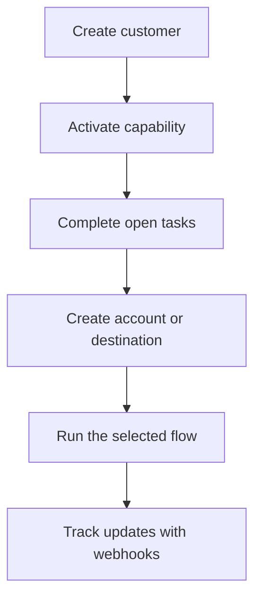

Swipelux piedāvā jūsu aizmugursistēmai būvbloķus, lai iesaistītu klientus un pārvietotu naudu, neatklājot maksājumu infrastruktūru jūsu produktā.

## Ko jūs varat veidot

<CardGroup cols={3}>
  <Card title="Saņemt līdzekļus" icon="arrow-down-to-line" href="/lv/integration/receive-funds">
    Izveidojiet vienreizējas fiat valūtas finansēšanas instrukcijas un norēķinieties ar stabilo monētu makā.
  </Card>
  <Card title="Sūtīt līdzekļus" icon="arrow-up-from-line" href="/lv/integration/send-funds">
    Sūtiet no klienta maka uz paša kontu vai trešās puses galamērķi.
  </Card>
  <Card title="Izsniegt bankas kontu" icon="building-columns" href="/lv/integration/issue-bank-account">
    Nodrošiniet atkārtoti izmantojamus bankas rekvizītus, kas saistīti ar norēķinu maku.
  </Card>
</CardGroup>

## Kā darbojas integrācija

Klients ir persona vai uzņēmums, kas ir plūsmas īpašnieks. Iespējas apraksta, kurus rezultātus šis klients var izmantot. Atvērtie uzdevumi norāda, kas jāpabeidz, pirms iespēja vai resurss var virzīties uz priekšu.

## Redziet darbībā

Iepazīstieties ar [demo.swipelux.com](https://demo.swipelux.com), lai izmēģinātu simulētu neobankas pieredzi. Varat arī [klonēt sākumkodu](https://github.com/swipelux/neobank-starter) un pielāgot tā produkta saskarni.

Demo un sākumkods ir produkta un lietotāja saskarnes atsauces. Tās neaizstāj šos ceļvežus vai pašreizējo API līgumu.

## Sāciet veidot

<CardGroup cols={3}>
  <Card title="Ātrais starts" icon="rocket" href="/lv/integration/quickstart">
    Izveidojiet klientu un izpildiet vienu smilšu kastes plūsmu.
  </Card>
  <Card title="Biežākās plūsmas" icon="route" href="/lv/integration/common-flows">
    Salīdziniet katram rezultātam nepieciešamo iestatījumu.
  </Card>
  <Card title="API atsauce" icon="code" href="/lv/api-reference/introduction">
    Izlasiet pieprasījumu konvencijas un aplūkojiet katru API operāciju.
  </Card>
</CardGroup>
