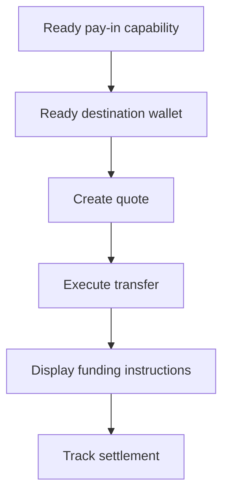

Izmantojiet kotētu iemaksu, kad klientam jāfinansē konkrēta summa. Pārvedums norēķinās stabilo monētu izsniegtā makā.



## Pirms sākat

Jums nepieciešama gatava iemaksas iespēja un gatavs izsniegts galamērķa maks tam pašam klientam. Pabeidziet atvērtos darbus sadaļā [Iespējas un uzdevumi](/lv/integration/onboarding/capabilities-and-requirements), pēc tam atkārtoti ielādējiet abus resursus.

## 1. Izveidojiet kotāciju

Izveidojiet cenu ar [`POST /v3/quotes`](/api-reference/money-movement/post-v3-quotes). Nosūtiet šīs galvenes:

```http
X-API-Key: ${SWIPELUX_API_KEY}
Idempotency-Key: payin-quote-001
Content-Type: application/json
```

```json
{
  "customerId": "${CUSTOMER_ID}",
  "capabilityId": "${CAPABILITY_ID}",
  "externalId": "payin-order-123",
  "in": {
    "amount": "150.00",
    "currency": "USD"
  },
  "destinationId": "${SETTLEMENT_WALLET_ID}",
  "out": {
    "currency": "USDC"
  }
}
```

Saglabājiet `data.id` kā `QUOTE_ID`. Parādiet atgrieztās summas un maksas, nevis pārveidojiet tās no likmes.

## 2. Izpildiet kotāciju

Izpildiet pašreizējo kotāciju pirms termiņa beigām ar [`POST /v3/transfers`](/api-reference/money-movement/post-v3-transfers). Izmantojiet jaunu atslēgu šim paredzētajam pārvedumam:

```http
X-API-Key: ${SWIPELUX_API_KEY}
Idempotency-Key: payin-transfer-001
Content-Type: application/json
```

```json
{
  "quoteId": "${QUOTE_ID}"
}
```

Saglabājiet pārveduma `data.id` kā `TRANSFER_ID` un saglabājiet tā pašreizējo stāvokli.

## 3. Iegūstiet finansēšanas instrukcijas

Nolasiet [`GET /v3/transfers/{transferId}/instructions`](/api-reference/money-movement/get-v3-transfers-by-transfer-id-instructions). Attēlojiet atgriezto `data.instructions` variantu, nepieņemot pieņēmumus par tā tipu.

Šīs detaļas ir specifiskas pārvedumam. Nekad neizmantojiet cita pārveduma bankas koordinātas, kodu, mitināto URL, summu, atsauci vai termiņu jaunai iemaksai.

Bankas instrukcijām, kad `reference.required` ir true, parādiet precīzu `reference.value` blakus bankas koordinātām un padariet to kopējamu. Parādiet atgriezto summu un valūtu no tās pašas instrukciju kopas.

Izsniegts bankas konts ir citādāks: tas nodrošina atkārtoti izmantojamus rekvizītus vēlākām iemaksām. Skatiet [Izsniegt bankas kontu](/lv/integration/issue-bank-account), ja tā ir paredzētā pieredze.

## 4. Sekojiet norēķinam

Pēc izpildes un pēc katra notikuma nolasiet [`GET /v3/transfers/{transferId}`](/api-reference/money-movement/get-v3-transfers-by-transfer-id). Vadiet klientam redzamo statusu no jaunākā `data.state`.

Izmantojiet `data.stateDetail` un `data.openTaskIds`, kad pārvedumam nepieciešama papildu darbība. Nemarķējiet to kā pabeigtu, pamatojoties uz gaidīto grafiku.

Tālāk pievienojiet [Webhook izsaukumus](/lv/integration/webhooks) un uzturiet pārveduma statusu sinhronizētu, līdz tas sasniedz rezultātu, ko jūsu produkts apstrādā.
