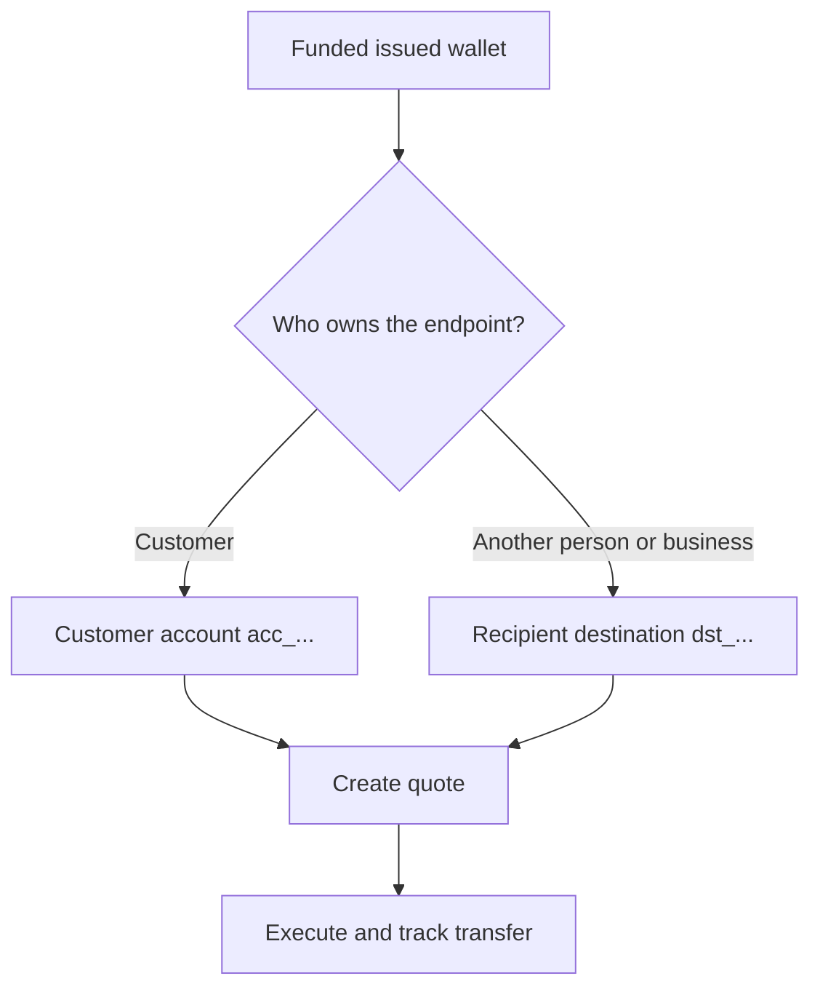

Katra izmaksa sākas no gatava, finansēta izsniegta maka. Galamērķa modelis ir atkarīgs no tā, kam pieder galapunkts.



## Pirms sākat

Atkārtoti ielādējiet avota maku. Apstipriniet, ka tā pašreizējais statuss atļauj izmaksu un tā pieejamais atlikums sedz paredzēto avota summu. Saglabājiet no atbildes iegūto ID kā `SOURCE_WALLET_ID`.

Jums nepieciešama arī gatava izmaksas iespēja pašreizējam klientam un izvēlētajam galamērķim.

## 1. Sagatavojiet galamērķi

<Tabs>
  <Tab title="Paša konts">

Izmantojiet klientam piederošu ārēju bankas kontu, kad klients ir galapunkta īpašnieks. Izveidojiet to ar [`POST /v3/customers/{customerId}/accounts`](/api-reference/accounts/post-v3-customers-by-customer-id-accounts) un šīm galvenēm:

```http
X-API-Key: ${SWIPELUX_API_KEY}
Idempotency-Key: payout-account-001
Content-Type: application/json
```

```json
{
  "origin": "external",
  "type": "bank",
  "methods": ["ach", "wire"],
  "country": "US",
  "currency": "USD",
  "details": {
    "routingNumber": "021000021",
    "accountNumber": "123456789",
    "accountType": "checking",
    "bankName": "Example Bank",
    "accountHolderName": "Acme Payments SAS"
  },
  "label": "Customer operating account"
}
```

Nolasiet to ar [`GET /v3/customers/{customerId}/accounts/{accountId}`](/api-reference/accounts/get-v3-customers-by-customer-id-accounts-by-account-id). Turpiniet tikai tad, kad tā pašreizējais statuss atļauj izmaksu. Saglabājiet tā `acc_` ID kā `PAYOUT_DESTINATION_ID`.

  </Tab>
  <Tab title="Trešā puse">

Izveidojiet personu vai uzņēmumu un tā bankas vai maka galapunktu sadaļā [Saņēmēji un galamērķi](/lv/integration/recipients). Turpiniet tikai tad, kad galamērķis ir gatavs.

Saglabājiet atgriezto `dst_` ID kā `PAYOUT_DESTINATION_ID`. Neizmantojiet saņēmēja `rcp_` ID kā kotācijas galamērķi.

  </Tab>
</Tabs>

## 2. Izveidojiet izmaksas kotāciju

Izmantojiet [`POST /v3/quotes`](/api-reference/money-movement/post-v3-quotes) ar šīm galvenēm:

```http
X-API-Key: ${SWIPELUX_API_KEY}
Idempotency-Key: payout-quote-001
Content-Type: application/json
```

```json
{
  "customerId": "${CUSTOMER_ID}",
  "capabilityId": "${CAPABILITY_ID}",
  "in": {
    "amount": "150.00",
    "currency": "USDC",
    "accountId": "${SOURCE_WALLET_ID}"
  },
  "destinationId": "${PAYOUT_DESTINATION_ID}",
  "out": {
    "currency": "USD"
  }
}
```

Saglabājiet `data.id` kā `QUOTE_ID` un parādiet atgriezto cenu un maksas.

## 3. Izpildiet izmaksu

Izveidojiet pārvedumu ar [`POST /v3/transfers`](/api-reference/money-movement/post-v3-transfers). Izmantojiet vienu jaunu atslēgu šai paredzētajai izpildei:

```http
X-API-Key: ${SWIPELUX_API_KEY}
Idempotency-Key: payout-transfer-001
Content-Type: application/json
```

```json
{
  "quoteId": "${QUOTE_ID}"
}
```

Saglabājiet pārveduma `data.id` kā `TRANSFER_ID`. Veiksmīga izveide uzsāk izmaksu; tā nepierāda piegādi.

## 4. Sekojiet piegādei

Pēc izveides un pēc katra notikuma nolasiet [`GET /v3/transfers/{transferId}`](/api-reference/money-movement/get-v3-transfers-by-transfer-id). Izmantojiet jaunāko `data.state`, `data.stateDetail` un `data.openTaskIds`, lai izlemtu, vai gaidīt, rīkoties vai parādīt gala rezultātu.

Tālāk pārskatiet [Kotācijas un pārvedumi](/lv/integration/quotes-and-transfers), lai iegūtu precīzas summas, drošu izpildes atgūšanu un pārveduma uzdevumus.
