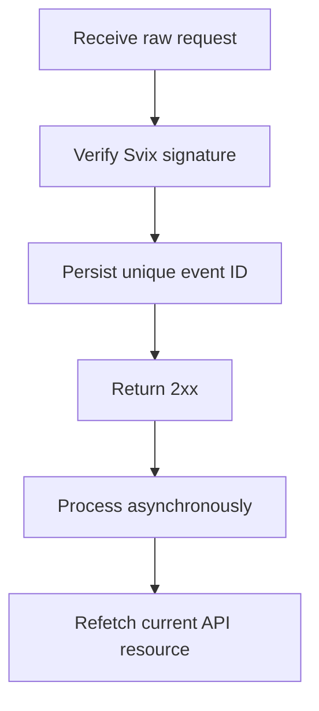

Izmantojiet webhook izsaukumus, lai reaģētu uz asinhronām izmaiņām. Piegāde notiek vismaz vienu reizi, tāpēc dublēti, aizkavēti un nesakārtoti notikumi ir normāli.



## Reģistrējiet tikai vajadzīgos notikumus

Izveidojiet galapunktu ar [`POST /v3/webhooks`](/api-reference/webhooks/post-v3-webhooks). Abonējiet tikai dokumentētus notikumus, kas vada jūsu integrāciju. Šis piemērs izmanto [`transfer.state_changed`](/api-reference/webhooks/transfer-state-changed).

```bash
export API_BASE='https://platform.swipelux.com'
export SWIPELUX_API_KEY='replace-with-your-api-key'

curl --request POST \
  "${API_BASE}/v3/webhooks" \
  --header "X-API-Key: ${SWIPELUX_API_KEY}" \
  --header "Idempotency-Key: webhook-endpoint-001" \
  --header "Content-Type: application/json" \
  --data @- <<'JSON'
{
  "url": "https://example.com/webhooks/swipelux",
  "events": ["transfer.state_changed"]
}
JSON
```

Saglabājiet atbildes `data.id` kā `WEBHOOK_ID`. Atveriet portālu, ko atgriež [`GET /v3/webhooks/portal`](/api-reference/webhooks/get-v3-webhooks-portal), iegūstiet šī galapunkta parakstīšanas noslēpumu un glabājiet to atsevišķi no API atslēgas noslēpumu pārvaldniekā.

## Pārbaudiet pirms parsēšanas

Swipelux piegādā jaunas webhook integrācijas caur Svix. Pārbaudiet neapstrādāto pieprasījuma pamattekstu ar sava galapunkta parakstīšanas noslēpumu un šīm galvenēm:

- `svix-id`
- `svix-timestamp`
- `svix-signature`

Neparsējiet JSON un neradiet blakusefektus, pirms verifikācija ir veiksmīga.

```javascript
import { Webhook } from "svix";

const verifier = new Webhook(process.env.SWIPELUX_WEBHOOK_SECRET);

export async function handleSwipeluxWebhook(request) {
  const rawBody = await request.text();
  const event = verifier.verify(rawBody, {
    "svix-id": request.headers.get("svix-id"),
    "svix-timestamp": request.headers.get("svix-timestamp"),
    "svix-signature": request.headers.get("svix-signature"),
  });

  await webhookInbox.insertIfAbsent({
    id: event.id,
    payload: event,
    status: "pending",
  });

  return new Response(null, { status: 204 });
}
```

Noraidiet pieprasījumus ar trūkstošiem vai nederīgiem parakstiem. Uzturiet neapstrādāto pamattekstu pieejamu, līdz verifikācija ir pabeigta.

## Saglabājiet, apstipriniet, pēc tam apstrādājiet

Uzstādiet unikalitātes ierobežojumu aploksnes `id`. Saglabājiet pārbaudīto aploksni, ātri atgriezt `2xx`, pēc tam apstrādājiet to asinhroni.

Ja notikuma ID jau pastāv, apstipriniet piegādi, neatkārtojot pabeigtos blakusefektus. Atsāciet neizpildītos vai neveiksmīgos lokālos darbus caur savu atkārtotu mēģinājumu rindu. Neizmantojiet aploksnes lauku `attempt` kā deduplikācijas atslēgu vai transporta atkārtojumu skaitītāju.

## Atkārtoti ielādējiet pašreizējo stāvokli

Webhook secība nav autoritatīva resursu vēsture. Izmantojiet `resource.type` un `resource.id`, lai atrastu objektu, pēc tam pirms sistēmas atjaunināšanas iegūstiet tā pašreizējo stāvokli.

Pārveduma notikumam izsauciet [`GET /v3/transfers/{transferId}`](/api-reference/money-movement/get-v3-transfers-by-transfer-id):

```bash
curl --request GET \
  "${API_BASE}/v3/transfers/${TRANSFER_ID}" \
  --header "X-API-Key: ${SWIPELUX_API_KEY}"
```

Vadiet klientam redzamo statusu un turpmākās darbības no pašreizējās API atbildes. Veidojiet blakusefektus tā, lai tie paliktu droši, ja divi izpildītāji apstrādā saistītus notikumus dažādā secībā.

## Atjaunojiet piegādes

Izmantojiet [`GET /v3/webhooks/portal`](/api-reference/webhooks/get-v3-webhooks-portal), lai atvērtu piegāžu žurnālus, atkārtoti mēģinātu neveiksmīgas piegādes vai sāktu manuālu atkārtojumu.

Katram atkārtojumam jāizet cauri tai pašai parakstu pārbaudei un noturīgai iesūtnei. Lai atgūtu pēc dīkstāves, atkārtojiet ietekmēto logu un atkārtoti ielādējiet katru minēto resursu. Pabeigtie notikumu ID paliek bez darbībām; nepabeigtie ieraksti tiek atsākti asinhroni.

Tālāk pārbaudiet dublētās un nesakārtotās piegādes smilšu kastē, pēc tam pabeidziet [Doties tiešraidē](/lv/integration/go-live) kontrolsarakstu.
