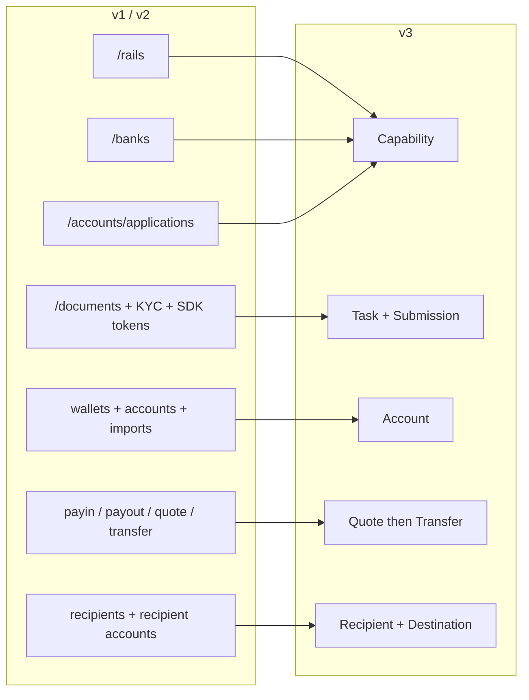
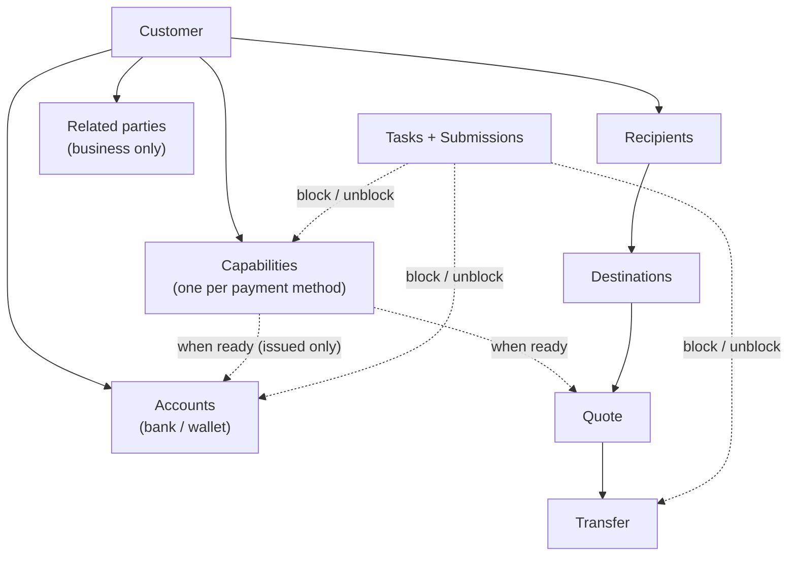
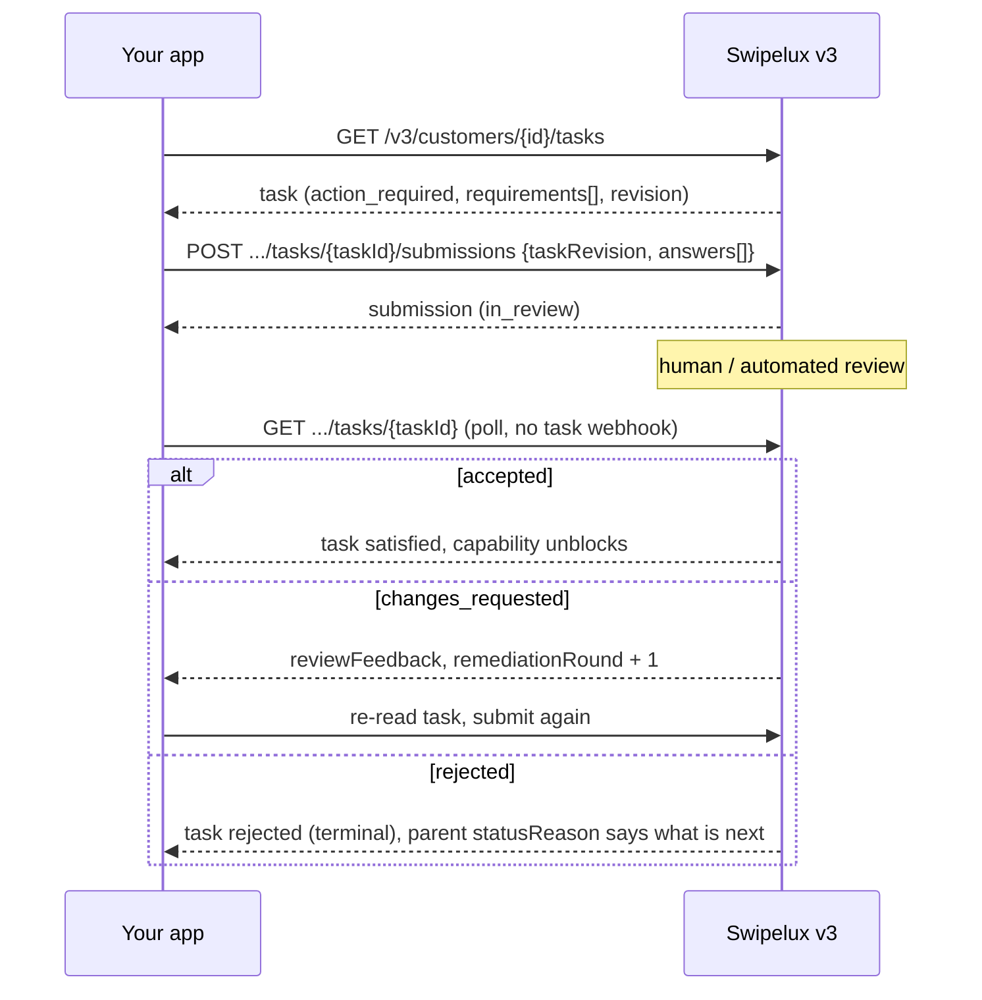
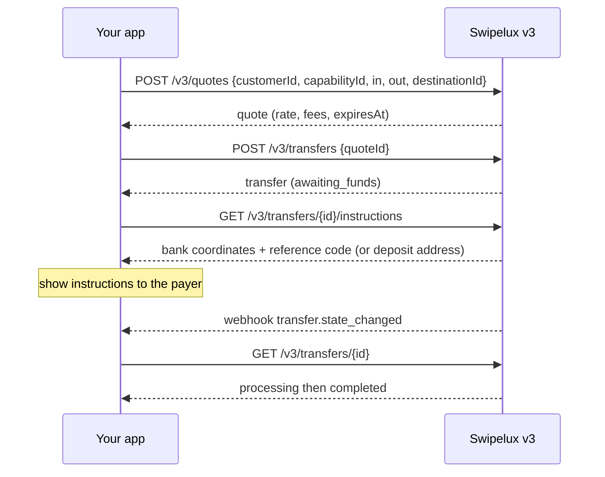
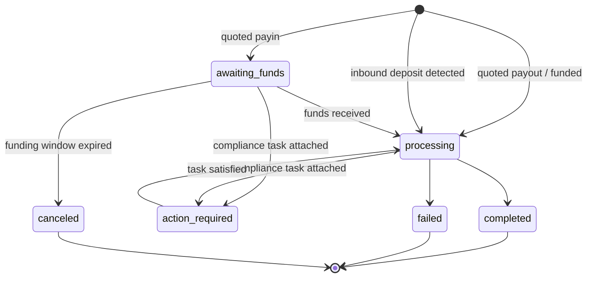
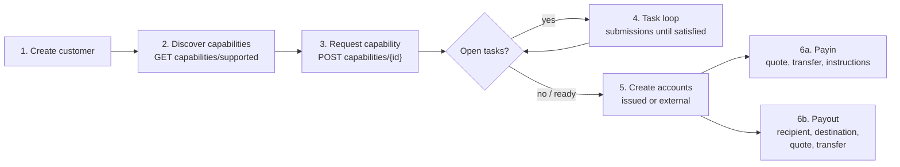

Migreer uw integratie van API v1 en v2 naar v3 in twee passes:

- **Deel 1, het concept.** Lees dit eerst. v3 is een herontwerp, geen hernoeming: als u oude endpoints één-op-één in kaart brengt, werkt u tegen de API in. Tien minuten hier bespaart u later dagen.
- **Deel 2, de API.** Endpoint-voor-endpoint mapping, voorbeeldverzoeken, toestandsmachines en een migratiechecklist.

Gebaseerd op de productie-OpenAPI-specificatie ([platform.swipelux.com/openapi.json](https://platform.swipelux.com/openapi.json)). v1 en v2 blijven actief en zijn nog niet als verouderd gemarkeerd; alle nieuwe capability-, ontvanger-, task- en quoting-functionaliteit verschijnt uitsluitend in v3. Abonneer u op de webhook-gebeurtenis `api.deprecation` voor uitfaseringsberichten.

<Info>
  **Inhoud.** Deel 1: 1.1 waarom v3 bestaat, 1.2 objectmodel, 1.3 gereedheid per capability, 1.4 taakloop, 1.5 geldstromen, 1.6 toestandsmachines, 1.7 conventies, 1.8 gouden pad. Deel 2: 2.1 klanten, 2.2 capabilities, 2.3 tasks en submissions, 2.4 accounts, 2.5 ontvangers en destinations, 2.6 quotes en transfers, 2.7 webhooks, 2.8 sandbox, 2.9 legacy-endpoints, 2.10 migratievolgorde, 2.11 valkuilenchecklist.
</Info>

---

## Deel 1, het concept

### 1.1 Waarom v3 bestaat

v1 en v2 lieten vier overlappende manieren groeien om een klant klaar voor betalingen te maken: `/rails`, `/banks`, `/accounts/applications` en de zakelijke `rail-applications`-oppervlakte, elk met zijn eigen statusvocabulaire. Documentverzameling (`/documents`, KYC-imports, verificatie-SDK-tokens) was losgekoppeld van datgene wat het feitelijk zou moeten deblokkeren. v3 vat dit alles samen in zes resources, de klant plus vijf dingen die hij bezit:



| Resource | Definitie in één regel |
| --- | --- |
| **Customer** | De persoon of het bedrijf. Heeft **geen publiek statusveld**, gereedheid ligt bij capabilities. |
| **Capability** | Eén betaalmethode die de klant kan gebruiken (`sepa`, `ach`, `swift`, `stablecoin_transfers`, enzovoort), met een eigen status. Vervangt `/rails`, `/banks` en de instappunten voor account-applications. |
| **Task** | Een werkeenheid die Swipelux nodig heeft (gegevens, documenten, verificatie), beantwoord met een **Submission**. Vervangt het document- en KYC-oppervlak. |
| **Account** | Een financieringspunt dat de klant bezit: `bank` of `wallet`, `issued` door Swipelux of `external`. |
| **Recipient / Destination** | Uitbetalingsbegunstigde (wie) en hun bank- of wallet-endpoint (waar). |
| **Quote / Transfer** | Alle geldbewegingen. Een transfer voert een opgeslagen quote uit; transfers zonder quote bestaan niet meer. |

### 1.2 Het objectmodel



Twee structurele regels om te verinnerlijken:

1. **Capabilities sturen alles.** Accounts worden ingericht onder een `ready` capability; quotes worden geprijsd tegen een capability. Onboarding komt neer op de benodigde capabilities naar `ready` brengen.
2. **Tasks kunnen overal aan hangen.** Een capability, een account of een lopende transfer kan `openTaskIds` dragen. Waar u ze ook ziet, de loop is hetzelfde: task lezen, antwoorden indienen, wachten op beoordeling, het bovenliggende object opnieuw lezen.

### 1.3 Gereedheid is per capability, niet per klant

v1 verweefde `/rails`-gereedheid met een klantbrede KYC-poort. In v3 bestaat er geen klantstatus: een klant kan volledig bruikbaar zijn op `stablecoin_transfers` terwijl zijn `sepa`-capability nog openstaande tasks heeft. Capabilities met gepoolde accounts bereiken doorgaans sneller `ready` dan benoemde, begin dus met transacties op wat `ready` is in plaats van op alles te wachten.

Als uw v1- of v2-code UI-badges baseert op de verificatiestatus van de klant, herschrijf die dan:

- "Kan hij transacties doen op X?" wordt capability X `status == "ready"`.
- "Moet hij iets doen?" wordt een task met status `action_required` (de capability toont doorgaans `restricted` met `statusReason.resolution: "complete_tasks"`).
- "Wachten wij op Swipelux?" wordt tasks in `in_review`, capability `pending`.

### 1.4 De taakloop

Alles wat het oude document- en KYC-oppervlak deed, is nu deze ene loop:



Belangrijke eigenschappen:

- Een task bevat `requirements[]`, de afzonderlijke vragen. Elk heeft een taakspecifieke `requirementId`, een stabiele `key` die de vraag benoemt (bijvoorbeeld adresbewijs, dedupliceer uw UI hierop) en een getypeerd `request` dat exact beschrijft welke invoer wordt gevraagd (tekst, datum, keuze, document, verklaring, enzovoort).
- Indienen is **beoordeling-gestuurd**: het muteert nooit direct de status van een capability of account, dat doet acceptatie. Eén uitzondering: `profile`-antwoorden schrijven bij indienen door naar het klantprofiel (2.3). Poll na indienen de task of de bovenliggende resource.
- `taskRevision` (echo van de `revision` van de task) is een concurrency-beveiliging: is de task gewijzigd sinds u hem las, lees dan opnieuw en bouw uw antwoorden opnieuw op.
- `absence` is een volwaardig antwoord ("Ik heb dit niet omdat ..."), gebruik het in plaats van vereisten open te laten.

### 1.5 Geldbewegingen

Eén flow voor payins, payouts en stablecoin-bewegingen. Er is **geen richtingsparameter**, u verklaart nooit payin versus payout. De vorm van de in- en uitkomstvaluta leidt een alleen-lezen `direction` af op de quote en transfer: `fiat_to_stablecoin` (payin), `stablecoin_to_fiat` (payout) of `stablecoin_move`.



### 1.6 Eén toestandsmachine per resource

Elke statusdragende resource heeft zijn eigen enum, en elke niet-happy status draagt een gestructureerde reden. Accounts, applications en transfers delen de vorm `{ code, message, actor, retryable }`: accounts en applications tonen die als `statusReason`, transfers als `stateDetail`. `actor` zegt wie moet handelen (`customer`, `developer`, `provider`, `network`, `swipelux`), `retryable` zegt of opnieuw proberen kan helpen. Capabilities gebruiken `{ code, resolution, message }`, waarbij `resolution` (`complete_tasks`, `wait`, `contact_support`, `none`) aangeeft wat de capability vooruit brengt. `code`-waarden vormen een open, alleen-groeiende catalogus: vertak op `resolution` (of `actor` plus `retryable`) en tolereer codes die u nog nooit hebt gezien.

| Resource | Toestanden |
| --- | --- |
| Capability | `pending`, `restricted`, `ready`, `rejected`, `canceled` |
| Application (poging per verzoek onder een capability, 2.2) | `requested`, `in_review`, `action_required`, `ready`, `rejected`, `disabled`, `canceled` |
| Task | `action_required`, `in_review`, `satisfied`, `rejected`, `canceled` |
| Submission | `in_review`, `accepted`, `changes_requested`, `rejected` |
| Account | `provisioning`, `in_review`, `ready`, `action_required`, `suspended`, `rejected`, `archived` |
| Quote | `active`, `executed`, `expired`, `failed` |
| Transfer | `awaiting_funds`, `processing`, `action_required`, `completed`, `failed`, `canceled` |
| Recipient | `active`, `rejected`, `archived` |
| Destination | `in_review`, `ready`, `action_required`, `archived` |

Toestanden die deze gids niet doorloopt (`rejected`, `suspended`, `disabled`, `failed`, `canceled`) zijn terminaal of support-gedreven; definities per resource staan in de specificatie.

Transfer, uitgetekend:



### 1.7 Conventies

| Onderwerp | v1 / v2 | v3 |
| --- | --- | --- |
| Auth | `X-API-Key` header | Hetzelfde. De omgeving (productie of sandbox) wordt geselecteerd door de sleutel; één basis-URL. |
| Idempotentie | Niet afgedwongen | `Idempotency-Key` header **verplicht bij elke effectvolle aanvraag** (POST, PATCH, PUT, DELETE), sandbox-endpoints uitgezonderd. Dezelfde sleutel plus dezelfde body herhaalt het oorspronkelijke antwoord. |
| Geldwaarden | Gemengd getallen en strings | Alleen strings (`"amount": "150.00"`). Nooit floats. |
| Paginering | Offset/limit-varianten | Cursor: lijsten geven `{ data, nextCursor, hasMore }` terug. |
| Updates | Vooral PUT | `PATCH` gedeeltelijke updates. |
| Webhooks | Configuratie met één endpoint | Meerdere endpoints, abonnement per gebeurtenis. Gebeurtenissen zijn **hints**, het lezen is de waarheid (2.7). |

Idempotentieregels om te verinnerlijken voor u code schrijft:

- Een sleutel hergebruiken met een **andere** body geeft `409 idempotency_conflict` zolang de sleutel wordt bewaard (ten minste 7 dagen), plan dus nooit hergebruik van een sleutel. Genereer per logische bewerking een verse UUID en bewaar die bij uw job.
- De replay dekt ook fouten: eindigde de oorspronkelijke aanvraag in een terminale 4xx, dan levert dezelfde sleutel plus body dezelfde probleemantwoord opnieuw op.
- Twee gelijktijdige aanvragen met dezelfde sleutel: één wint, de ander krijgt `409`. Doe de verliezer opnieuw nadat de winnaar is afgehandeld; de replay geeft het oorspronkelijke antwoord terug.

### 1.8 Het gouden pad



---

## Deel 2, de API

### 2.1 Klanten

| v1 / v2 | v3 |
| --- | --- |
| `POST /v1/customers`, `POST /v1/customers/business`, `POST /v2/customers` | `POST /v3/customers` (één endpoint, `type: individual \| business`) |
| `GET/PUT/DELETE /v1/customers/{id}`, `/v1/customers/business/{id}`, `/v2/customers/{customerId}` | `GET/PATCH/DELETE /v3/customers/{customerId}` |
| `GET /v1/customers` (lijst) | `GET /v3/customers` (cursor-gepagineerd, met ingesloten capability-samenvattingen) |
| `GET /v1/customers/balances` (batch), `GET /v1/customers/{id}/balances` | Geen balance-endpoint, saldi staan op accounts: lees `balances` op `GET /v3/customers/{customerId}/accounts` |
| `POST/GET .../shareholders` (v1 business) | `POST/GET /v3/customers/{customerId}/related-parties` (plus `GET/PATCH/DELETE .../related-parties/{relatedPartyId}`) |
| `POST /v1/customers/business/{id}/kyb` (indienen), `GET .../kyb` (status) | Geen KYB-indienoproep, vraag een capability aan (2.2) en beantwoord de tasks (2.3); het oordeel verschijnt als capability- en task-status |
| `POST /v1/customers/{id}/kyc`, `.../kyc/import`, SDK-token-endpoints | Task-systeem (2.3); gehoste verificatie verschijnt als `verificationSessions` binnen tasks |

Aanmaken, onderscheiden op `type` (illustratieve waarden, veldnamen volgens spec):

```jsonc
// POST /v3/customers        Idempotency-Key: <fresh uuid>
{
  "type": "individual",
  "externalId": "user-1042",
  "individual": {
    "firstName": "Maria",
    "lastName": "Silva",
    "birthDate": "1990-04-12",
    "nationalities": ["BR"],
    "residenceCountry": "BR",
    "email": "maria@example.com",
    "residentialAddress": {
      "streetLine1": "Av. Paulista 1000",
      "city": "Sao Paulo",
      "postalCode": "01310-100",
      "country": "BR"
    }
  },
  "financialProfile": {
    "accountPurposes": ["cross_border_remittance"],
    "sourcesOfFunds": ["salary"]
  }
}
```

- **Aanmaken is progressief**: `{ "type": "individual" }` op zichzelf is een geldige create. Ontbrekende feiten maken de klant nooit ongeldig, ze duiken later op als intake-tasks op de capabilities die ze nodig hebben.
- Bedrijven dragen `business` plus registratiegegevens. Het shareholder-CRUD van v1 wordt gemapt op **related parties**, verbreed om directors, officers en owners te omvatten: maak ze inline bij het aanmaken van de klant (elk krijgt een stabiele `rp_`-id) of beheer ze via de dedicated related-parties-endpoints.
- **Geen klant-`status`-veld**, zie 1.3.
- **Bestaande klanten worden overgenomen**: klanten die op v1 of v2 zijn aangemaakt, zijn met dezelfde id adresseerbaar via v3-endpoints. Het v3-lezen is een _gesaneerde weergave_, legacy-waarden die de v3-validatie niet halen, komen als afwezig terug. Na uw **eerste v3-write wordt die weergave permanent**: afwezige waarden komen niet vanzelf terug. Verrijk dus vroeg, plan een eenmalige pass die het volledige profiel uit uw eigen records via `PATCH` inzet voordat u op v3-reads vertrouwt. v1-`metadata` is een aparte namespace en wordt **niet** overgenomen, zet het opnieuw op v3.
- `externalId` is eersteklas en **uniek over al uw klanten** op v3, per omgeving (`409 duplicate_external_id`). Het archiveren van een klant geeft zijn `externalId` niet vrij, wis het via PATCH voor DELETE als u het wilt hergebruiken.
- `DELETE` is een **archiveringscascade** (geen herstel; ids worden nooit hergebruikt). Deze wordt geblokkeerd met `409 customer_has_active_resources` plus `blockingResources[]` zolang er een niet-gearchiveerd account of lopende transfer bestaat.
- PATCH-mergeregels: expliciete `null` wist een nullable veld, arrays vervangen volledig (behalve inline related parties, die per id worden ge-upsert), `metadata`-sleutels worden samengevoegd. Volledige schema's en lijstfilters staan in de OpenAPI-specificatie.

### 2.2 `/rails`, `/banks`, applications worden Capabilities

| v1 / v2 | v3 |
| --- | --- |
| `GET /v1/.../rails/capabilities` | `GET /v3/customers/{customerId}/capabilities/supported` |
| `GET /v2/.../banks` (plus `/banks/{bank}`), `GET /v2/meta/banks` | `GET /v3/customers/{customerId}/capabilities/supported` |
| `GET /v1/customers/{customerId}/rails` (lijst) | `GET /v3/customers/{customerId}/capabilities` |
| `GET /v2/customers/{customerId}/rails` (overzicht) | `GET /v3/customers/{customerId}/capabilities` |
| `POST /v1/.../rails`, `POST /v2/.../banks` | `POST /v3/customers/{customerId}/capabilities/{capabilityId}` |
| `POST /v2/.../accounts/applications` | `POST /v3/customers/{customerId}/capabilities/{capabilityId}` |
| `GET /v1/.../rails/{rail}` | `GET /v3/.../capabilities/{capabilityId}` |
| `GET /v2/.../accounts/applications` (plus `/{applicationId}`, `/{applicationId}/history`) | `GET /v3/.../capabilities/{capabilityId}` (plus `/applications`, `/applications/{id}/history`) |
| Zakelijke rail-oppervlakte: `GET/POST /v2/customers/business/{customerId}/rail-applications` (plus `/{rail}`) | Dezelfde v3 capability-endpoints, geen aparte zakelijke oppervlakte |
| Zakelijke rail-oppervlakte: `GET .../business/{customerId}/rails` (plus `/{rail}`) | Dezelfde v3 capability-endpoints, geen aparte zakelijke oppervlakte |
| `GET /v1/meta/rails` (statische catalogus) | `GET /v3/customers/{customerId}/capabilities/supported`, beschikbaarheid is per klant; er is geen statische catalogus |
| `GET /v1/meta/accounts/banks` | `GET /v3/institutions` (bankengids: id, naam, BIC, landen) |
| Niet beschikbaar | `GET /v3/capabilities`, merchant-brede lijst van verleende capabilities over klanten (filter op `status`, `method`, `customerId`) |
| Niet beschikbaar | `GET /v3/.../capabilities/{capabilityId}/tasks-preview` (vragen bekijken voor u een aanvraag doet) |
| Niet beschikbaar | `POST /v3/.../capabilities/{capabilityId}/cancel` |

- Een capability is `method` (`ach`, `wire`, `rtp`, `pix`, `sepa`, `swift`, `spei`, `pse`, `transfers_3_0`, `faster_payments`, `sepa_instant`, `uaefts`, `card`, `stablecoin_transfers`, enzovoort) plus `accountType` (`pooled` of `named`, `null` voor niet-bankmethoden) plus `directions` (`payin` of `payout`). De publieke `capabilityId` is het gekwalificeerde paar (`sepa_pooled`, `ach_named`) of enkel de methode voor `card` en `stablecoin_transfers`.
- Elke capability-aanvraag genereert een **application**, het record per poging onder `.../capabilities/{capabilityId}/applications` (plus `/{applicationId}/history`), met eigen statussen (1.6) en `statusReason`. Het is het audit-spoor van een aanvraag; dagelijks poll u de capability zelf.
- `capabilities/supported` geeft beschikbaarheid (`available`, `beta` of `disabled`), geschiktheid en aangeboden instellingen terug. Bankselectie gebeurt bij aanvragen via de optionele `institutions`-array, er is geen aparte `/banks`-resource. Weglaten (of `[]` sturen) selecteert alle standaardinstellingen; `isDefault: true` is een klant- en capability-specifieke vlag, geen globale. Een niet-lege lijst overschrijft de standaarden, en een bank-gebaseerde capability zonder toepasselijke standaard geeft `422 capability_institutions_required`. Instelling-ids zijn opaak, tolereer nieuwe.
- `stablecoin_transfers` wordt **automatisch toegekend bij het aanmaken van de klant** en wordt geboren als `ready` (wordt dus nooit aangevraagd en is niet annuleerbaar). `card` is enkel voor individuen.
- `openTaskIds` op de capability is uw "wat moet ik nu doen"-wijzer. Open betekent `action_required` **of** `in_review`, en de rollup omvat gedeelde tasks op klantniveau die via actieve afhankelijkheden bereikbaar zijn.
- `cancel` werkt alleen vanuit `pending` of `restricted` **en** zonder blokkerende resources, anders `409 capability_not_cancelable`, waarvan de probleembody `blockingResources` opsomt. Opnieuw aanvragen na annuleren is een nieuwe create met een nieuwe idempotency-key.
- **Poll de GET.** Capability-status verversts wanneer u leest; poll `GET .../capabilities/{capabilityId}` of abonneer u op `capability.status_changed`, cache niet.
- Één methode aanvragen kan gerelateerde methoden meteen beschikbaar maken, behandel capabilities als een set die u opnieuw leest, niet als één rij die u volgt.
- Gebruik `tasks-preview` om onboarding-vragen te tonen **voor** u een aanvraag definitief indient.
- Verificatie is niet eenmalig: nieuwe tasks kunnen verschijnen op een reeds `ready` capability (periodieke of event-gedreven herverificatie). Houd de taakloop actief gedurende de hele levensduur van de klant, niet alleen tijdens onboarding.

### 2.3 Documenten en KYC worden Tasks en Submissions

<Note>
  **Naamopmerking.** Deze endpoints zijn kort uitgeleverd als `requirements` en `fulfillments`. Sinds 02-08-2026 zijn de publieke namen **tasks** en **submissions**. De hernoeming betrof alleen de resources en endpoint-paden, de array `requirements[]` in een task en zijn `requirementId` behouden die namen.
</Note>

Elk legacy documentoppervlak wordt naar dezelfde vervanging gemapt: lees `GET /v3/customers/{customerId}/tasks`, beantwoord met `POST .../tasks/{taskId}/submissions`.

| v1 / v2 | v3 |
| --- | --- |
| `POST/GET/DELETE /v1/documents` | `GET /v3/.../tasks` plus `POST .../tasks/{taskId}/submissions` |
| `POST /v1/customers/{id}/documents` | `GET /v3/.../tasks` plus `POST .../tasks/{taskId}/submissions` |
| `GET/POST /v1/customers/business/{id}/documents` (plus `PUT/DELETE .../{docId}`) | `GET /v3/.../tasks` plus `POST .../tasks/{taskId}/submissions` |
| `GET/POST .../shareholders/{shareholderId}/documents` (plus `GET/PUT/DELETE .../{docId}`) | `GET /v3/.../tasks` plus `POST .../tasks/{taskId}/submissions` |
| `GET/POST/DELETE /v2/.../documents` (plus `/{documentId}`) | `GET /v3/.../tasks` plus `POST .../tasks/{taskId}/submissions` |
| `POST /v2/.../documents/upload-token` plus `POST /v2/documents/direct-upload` | Upload direct met uw API-sleutel (hieronder), of stuur binnen vijf minuten een verse direct-upload-`storageKey` als JSON naar `POST /v3/.../documents` |
| `POST /v1/customers/documents/upload`, `POST /v1/document` (legacy-intakes) | Vervallen, upload direct met uw API-sleutel (hieronder) |
| `POST /v1/customers/{id}/kyc` plus SDK-tokens | Task `verificationSessions` (gehoste verificatie); geen directe "start KYC"-oproep |

Rondom die loop:

- **Ruwe bestandsopslag**: `POST/GET/DELETE /v3/customers/{customerId}/documents` (plus `/{documentId}` en `GET .../{documentId}/download`), upload één keer met uw API-sleutel en verwijs dan naar document-ids in submission-antwoorden. Dit vervangt elke upload-token- en direct-upload-intake. `POST .../documents` accepteert ook een JSON-body (`storageKey`, `fileName`, `type`) die een nog verse, klant-gescopete referentie van `POST /v2/documents/direct-upload` consumeert, zodat geparkeerde uploads migreren zonder bytes opnieuw te versturen.
- **Geheel nieuw**: `GET /v3/tasks` (merchant-brede inbox), `GET /v3/transfers/{transferId}/tasks`, `GET .../tasks/{taskId}/history`, `GET .../tasks/{taskId}/submissions` (plus `/{submissionId}`).

Submission (illustratief):

```jsonc
// POST /v3/customers/{cus}/tasks/{task}/submissions   Idempotency-Key: <fresh uuid>
{
  "taskRevision": 3,
  "answers": [
    { "requirementId": "req_a1", "answer": { "type": "document", "documentIds": ["doc_passport1"] } },
    { "requirementId": "req_b2", "answer": { "type": "text", "value": "Import/export business" } },
    { "requirementId": "req_c3", "answer": { "type": "absence", "reason": "not_applicable" } }
  ]
}
```

- Antwoordtypes: `profile`, `text`, `date`, `single_select`, `multi_select`, `boolean`, `attestation`, `document`, `resource_reference`, `absence`. Het `request`-object van elke requirement zegt welk type wordt verwacht.
- Een submission moet **elke actionable requirement in de huidige ronde** beantwoorden, met exact de `taskRevision` die u hebt gelezen. Deelsubmissions worden afgewezen.
- `profile`-antwoorden **schrijven door**: ze werken het klantprofiel bij via het normale validatiepad en evalueren onmiddellijk elke capability opnieuw die naar hetzelfde intake-werk verwijst. Broer-en-zus intake-tasks waarvan alle requirements zijn voldaan, sluiten automatisch.
- Requirements kunnen alternatieve groepen vormen (`alternativeKey`): dien er precies één van de groep in.
- `changes_requested` verhoogt `remediationRound` en draagt `reviewFeedback`. Lees de task opnieuw en dien opnieuw in **met een nieuwe idempotency-key**.
- Gehoste verificatie-URL's verschijnen **enkel** in klantgeschopte task-details (`GET /v3/customers/{customerId}/tasks/{taskId}`) en alleen zolang de sessie actionable is; lijsten en `GET /v3/tasks/{taskId}` zijn bewust URL-vrij.
- De gebruiksvoorwaarden zijn ook een task: `openTaskIds` kan een task met `category: "terms_of_service"` bevatten waarvan de gehoste acceptatiepagina op dezelfde manier is gekoppeld (alleen klantgeschopte detail). Generieke submissions kunnen geen voorwaarden accepteren, en KYC-goedkeuring impliceert nooit acceptatie van voorwaarden.
- Tasks zijn per capability afgebakend, dus dezelfde vraag (bijvoorbeeld adresbewijs) kan eenmaal per capability verschijnen. Dedupliceer in uw UI op de requirement `key`.
- **Geen vertaallaag**: posten naar `/v1/documents` deblokkeert geen v3-capabilities. Zodra een klant op v3 is, drijf u alle vragen via tasks.

### 2.4 Accounts en wallets

| v1 / v2 | v3 |
| --- | --- |
| `POST/GET /v1/.../accounts` (plus `/import`), `/v2/.../accounts` (plus `/import`) | `POST/GET /v3/customers/{customerId}/accounts` |
| `POST/GET /v1/.../wallets` (plus `/import`) | Zelfde endpoint, `type: wallet` |
| `GET/DELETE /v1/customers/{customerId}/accounts/{accountId}` (en de wallet-variant), `GET /v2/.../accounts/{accountId}` | `GET/PATCH/DELETE /v3/.../accounts/{accountId}` |
| `PATCH /v2/.../accounts/{accountId}/fees` | `GET/PUT /v3/.../accounts/{accountId}/fees` |

Aanmaken, onderscheiden op `origin` plus `type`. Uitgegeven bankrekeningen nemen één `method`; externe bankrekeningen nemen in plaats daarvan een `methods`-array (`method` daar sturen wordt afgewezen):

```jsonc
// issued bank account (capability must be ready)
{ "origin": "issued", "type": "bank", "method": "sepa",
  "currency": "EUR", "settlement": { "accountId": "acc_wallet1" } }

// external wallet the customer already owns (replaces /import)
{ "origin": "external", "type": "wallet", "currency": "USDC",
  "network": "polygon", "details": { "address": "0x71C7656EC7ab88b098defB751B7401B5f6d8976F" } }
```

- `country` op uitgegeven bankrekeningen is optioneel (standaard per methode); op externe **bankrekeningen** geeft u het expliciet op. Walletrekeningen hebben helemaal geen land.
- `settlement.accountId` is verplicht op uitgegeven bankrekeningen: het benoemt de uitgegeven walletrekening die verrekende gelden uit stortingen op de bankrekening ontvangt.
- Uitgegeven accounts stellen `details` (IBAN of routing plus account of adres) bloot, geversioneerd `routing` (stortingscoördinaten kunnen roteren, render altijd de nieuwste lees), `fees`, `balances`.
- Netwerken: `polygon`, `ethereum`, `base`, `arbitrum`, `optimism`, `bsc`, `avalanche`.
- De capability-poort geldt alleen voor **uitgegeven** accounts: er een maken tegen een niet-ready capability mislukt met een capability-gecodeerde fout, vraag eerst de capability aan (2.2). Externe accounts hebben geen capability nodig (en geen klantgoedkeuring); ze krijgen alleen validatie van het request-schema en de bankgegevens.
- Uitgegeven bankrekeningen worden `provisioning` geboren met `details: null`. Poll de rekening of let op `account.status_changed` tot `ready`.
- `DELETE` archiveert, verwijdert nooit hard. Rekeningen waarnaar lopende transfers verwijzen, geven `409 account_has_active_transfers`. Doe het opnieuw nadat die transfers een terminale toestand hebben bereikt.
- Nieuw in v3: **Rules**, doorlopende instructies op een uitgegeven walletrekening (`POST/GET /v3/customers/{customerId}/rules`, `GET/PATCH/DELETE .../rules/{ruleId}`) die inkomende gelden automatisch doorsluizen naar een andere rekening of een wallet-destination. Geen v1- of v2-equivalent.

### 2.5 Recipients en destinations

| v1 | v3 |
| --- | --- |
| `POST/GET /v1/.../recipients` | `POST/GET /v3/customers/{customerId}/recipients` |
| Niet beschikbaar (v1-recipients waren alleen create en list) | `GET/PATCH/DELETE /v3/.../recipients/{recipientId}`, nieuw: detail, update, archiveren |
| `POST/GET .../recipients/{recipientId}/accounts` | `POST/GET /v3/.../recipients/{recipientId}/destinations` |
| `GET/DELETE .../recipients/{recipientId}/accounts/{recipientAccountId}` | `GET/DELETE /v3/.../recipients/{recipientId}/destinations/{destinationId}` (geen PATCH voor destinations, archiveren en opnieuw aanmaken) |

v2 kende geen recipient-concept. Als u op v2 zit en aan derden uitbetaalt, is dit een nieuw oppervlak, geen hernoeming.

- **Recipient** is het wie: `individual` (voor- en achternaam) of `business` (bedrijfsnaam), met verplichte `relationship` (`employee`, `contractor`, `vendor`, `subsidiary`, `merchant`, `customer`, `landlord`, `family`, `other`). Recipients en destinations zijn enkel voor derden. Een uitbetaling aan uzelf gebruikt helemaal geen recipient: richt op een van de eigen `acc_`-rekeningen van de klant als quote `destinationId` (2.6).
- **Destination** is het waar: getypeerd per methode, `sepa` (iban, bic optioneel), `ach` of `wire` (routing plus account), `swift` (volledige coördinaten plus optionele intermediair), `spei` (clabe), `pse`, `transfers_3_0` (cbu) enzovoort, plus wallet-destinations. Elke destination heeft een eigen status. Let op `destination.status_changed`.
- Fiat-destinations vereisen het complete `address` van de recipient (straat, stad, postcode, land) **voor** het aanmaken. Ontbrekende onderdelen falen met `422 recipient_address_required`. Wallet-destinations slaan het adres over, maar vereisen bovenaan `ownership` (`self_custodied`, of `custodial` met een custodian-naam).
- De correctheid van de begunstigde-naam is belangrijk: ontvangende banken vergelijken de **wettelijke** naam van de rekening. Stuur exacte wettelijke voor- plus achternaam of bedrijfsnaam, geen weergavebijnaam.
- Veldschema's per methode voor destinations staan in de OpenAPI-specificatie.

### 2.6 Quotes en transfers

| v1 / v2 | v3 |
| --- | --- |
| `POST /v1/payin/quote`, `/v1/payout/quote`, `/v2/quote` | `POST /v3/quotes` |
| `POST /v1/payin`, `/v1/payout`, `POST /v1/transfers`, `/v2/transfer` | `POST /v3/transfers` (voert een quote uit, creates zonder quote bestaan niet meer) |
| `GET /v1/transfers` (lijst), `GET /v1/transfers/{id}` | `GET /v3/transfers`, `/v3/transfers/{transferId}` |
| Niet beschikbaar (v1- en v2-quotes hadden geen read) | `GET /v3/quotes/{quoteId}` |
| `GET /v1/rate/{base}/{quote}` | `GET /v3/rates` |
| (impliciet in payin-response) | `GET /v3/transfers/{transferId}/instructions` |
| Niet beschikbaar | `POST /v3/transfers/{transferId}/cancel`, `GET /v3/transfers/{transferId}/tasks` |

```jsonc
// 1. Quote: amount on exactly one side picks mode (exact_in / exact_out).
// POST /v3/quotes            Idempotency-Key: <fresh uuid>
{
  "customerId": "cus_123",
  "capabilityId": "sepa_named",
  "in":  { "currency": "EUR", "amount": "150.00" },
  "out": { "currency": "USDC" },
  "destinationId": "acc_wallet1",   // fiat-funded: must be a customer-owned acc_ account
  "fees": { "breakdown": { "developer": { "fixed": "1.00", "bips": 50 } } }
}
// -> { mode: "exact_in", direction: "fiat_to_stablecoin", rate, fees[], expiresAt, ... }

// 2. Execute before expiresAt.
// POST /v3/transfers         Idempotency-Key: <fresh uuid>
{ "quoteId": "quo_789", "externalId": "order-991", "memo": "invoice 44" }
```

- `destinationId` neemt een `acc_`-id (rekening van de klant) of een `dst_`-id (recipient-destination). **Fiat-gefinancierde quotes (payins) moeten op een `acc_`-rekening richten**, een `dst_`-doel betekent altijd een payout (anders `422 quote_direction_invalid`).
- `externalId` op quotes en transfers is een niet-unieke correlatiereferentie (weergegeven bij reads, filterbaar op lijsten). De regel over uniciteit per omgeving (2.1) geldt alleen voor de `externalId` van de klant.
- Voer een quote precies één keer uit, voor `expiresAt`. Een vervallen quote faalt met `409 quote_expired`, een tweede uitvoering met `409 quote_already_executed` (het probleem bevat de bestaande `transferId`).
- Transfer annuleren wordt nog niet ondersteund: `POST .../cancel` geeft in elke toestand `409 transfer_not_cancelable`. Huidige `canceled` transfers komen door het verlopen van het financieringsvenster op een ongefinancierde payin, niet door dit endpoint.
- Payins starten in `awaiting_funds`: render `GET .../instructions` voor de betaler, bankcoördinaten plus **referentie- of memo-code** voor fiat, stortingsadres voor crypto. De referentiecode is hoe de storting wordt gematcht. Toon deze altijd.
- `state` plus `stateDetail` voor machineleesbare substaten; `action_required` betekent dat een compliance-task is bijgevoegd (`openTaskIds`, `GET .../tasks`), beantwoord via submissions.
- Inkomende stortingen die op uitgegeven rekeningen worden gedetecteerd, verschijnen als transfers met `origin: "inbound_deposit"` (in plaats van `"quoted"`).
- Betaalnetwerk-referenties zijn geconsolideerd onder `references`: `transactionHash`, `traceNumber`, `imad`, `uetr`, `explorerUrl`, `returnedTransferId`.

Vertaling van v1-statussen:

| v1-concept | v3 |
| --- | --- |
| aparte payin- en payout-objecten | één transfer met `direction` |
| retouren of provider-annuleringen (opgevouwen in `failed`) | nog steeds `failed`, nu met machineleesbaar `stateDetail` en `references.returnedTransferId` wanneer een retour een reverse transfer heeft veroorzaakt |

Twee migratiewaarschuwingen:

- **Transfers steken niet over tussen versies.** Op v1 of v2 aangemaakte transfers zijn niet leesbaar vanuit v3. De lijst laat ze weg en `GET /v3/transfers/{transferId}` geeft 404. Zet eerst het _aanmaken_ over, houd het v1-leespad tot die transfers terminale toestanden bereiken en laat het dan vallen.
- **Geen token-swaps.** `stablecoin_move` vereist dezelfde valuta in en uit: USDC naar USDT faalt met `422 recipient_destination_invalid` met een `currency_mismatch`-veldfout. Zelfde netwerk aan beide kanten, geen bridging, en wallet-naar-wallet-bewegingen ondersteunen momenteel alleen kostenvrije levering: een quote waarvan de platform- of ontwikkelaarsfee niet nul is, faalt met `422 amount_not_deliverable`.

### 2.7 Webhooks

| v1 | v3 |
| --- | --- |
| `GET/PATCH /v1/webhooks` (configuratie met één endpoint) | `POST/GET /v3/webhooks`, `PATCH/DELETE /v3/webhooks/{webhookId}`, `GET /v3/webhooks/portal` |

Catalogus van gebeurtenissen: `customer.created`, `customer.updated`, `customer.archived`, `capability.created`, `capability.status_changed`, `application.status_changed`, `recipient.status_changed`, `destination.status_changed`, `account.created`, `account.status_changed`, `account.details_changed`, `transfer.created`, `transfer.state_changed`, `api.deprecation`.

- `GET /v3/webhooks/portal` geeft een gehoste management-portaal-URL terug voor bezorglogs, retries en handmatige replays.
- `transfer.created` wordt momenteel geleverd in de legacy v1-payloadvorm (de v3-envelop wordt actief wanneer v1-webhooks worden uitgefaseerd). Beschouw het puur als een hint en haal de transfer op via GET; bouw niet op de body ervan.
- Gebeurtenissen zijn hints: haal bij ontvangst de resource op en handel op basis van de read. Bouw nooit toestand op basis van event-payloads of volgorde. Bezorging is at-least-once en kan vertraagd of herordend zijn. Dedupliceer op event-id en herstel gemiste gebeurtenissen met de inclusieve `updatedAfter`-filter van elke lijst.
- Abonneer u op `api.deprecation`, het machinale kanaal voor versie-uitfaseringen.
- Vandaag geen `task.*`-gebeurtenis: poll na indienen de task of zijn bovenliggende object.

### 2.8 Sandbox

Zelfde basis-URL; de sandbox-API-sleutel selecteert de omgeving.

| v1 | v3 |
| --- | --- |
| `POST /v1/sandbox/topup` | `POST /v3/sandbox/accounts/{accountId}/topup` |
| `POST /v1/sandbox/payins/simulate`, `.../payouts/simulate`, `POST /v1/customers/{id}/simulate-transactions` | `POST /v3/sandbox/transfers/{transferId}/state` (een echte transfer door toestanden sturen) |
| Niet beschikbaar | `POST /v3/sandbox/customers/{customerId}/verification` (verificatie voltooien) |
| Niet beschikbaar | `POST /v3/sandbox/customers/{customerId}/capabilities/{capabilityId}/status` (capability-status forceren) |
| Niet beschikbaar | `POST /v3/sandbox/tasks`, `POST /v3/sandbox/tasks/{taskId}/review` (een task aanmaken en dan het oordeel simuleren) |

De v3-sandbox simuleert de beoordelingsloop van begin tot eind: maak een task, dien er tegen in, `review` deze naar `accepted` of `rejected` en zie hoe de capability wordt gedeblokkeerd. Repeteer uw herstel-UX voor productie. Zowel in de sandbox aangemaakte tasks als de reguliere intake-tasks die op aangevraagde capabilities verschijnen, kunnen op deze manier worden beoordeeld; net als in productie vuren er geen task-webhooks, poll (2.7).

### 2.9 Legacy-endpoints zonder v3-vervanging

Deze hebben geen v3-vervanging. De meeste blijven ongewijzigd op v1 (houd uw bestaande oproepen); twee zijn volledig uit dienst genomen (zie Behandeling):

| Endpoint | Behandeling |
| --- | --- |
| `GET /v1/merchant-kyb/creation-gate`, `POST /v1/merchant-kyb/{customerId}/submit`, `POST /v1/merchant-kyb/parked-url`, `POST /v1/merchant-kyb/upload-token` | Uw eigen merchant-KYB-onboarding (geen klant-KYB), ongewijzigd op v1 |
| `POST /v1/merchant-wallets/get-or-create` | Merchant-treasury-wallet-helper, ongewijzigd op v1 |
| `GET /v1/meta/accounts/relationships` | Uit dienst, de recipient `relationship`-enum staat vast en is inline gedocumenteerd (2.5) |
| `GET /v1/meta/kyb/documents` | Uit dienst, v3-tasks declareren de vereiste documenten per geval via `requirements[]` (2.3); er is geen statische catalogus |
| `GET /statecharts` (plus `/{machineId}`, `/{machineId}/svg`, `/explorer`, `/validate`) | Versie-neutrale publieke referentiepagina's voor toestandsmachines, ongewijzigd |

Elk ander publiek v1- of v2-endpoint komt voor in een mappingtabel hierboven.

### 2.10 Voorgestelde migratievolgorde

Elke stap kan onafhankelijk worden uitgeleverd; v1 of v2 en v3 draaien naast elkaar tegen dezelfde klantbasis. Repeteer elke stap tegen uw sandbox-sleutel (2.8) voor u hem in productie herhaalt.

<Steps>
  <Step title="Basisinfrastructuur">
    `Idempotency-Key` op alle effectvolle aanvragen (POST, PATCH, PUT, DELETE; sandbox-endpoints uitgezonderd); geld als strings; cursor-pagineringshelpers.
  </Step>
  <Step title="Webhooks">
    Registreer v3-endpoints per gebeurtenis, inclusief `api.deprecation`. De v1 single-endpoint-configuratie is een apart oppervlak, laat die staan; beide draaien naast elkaar tot de drain in stap 9.
  </Step>
  <Step title="Profielverrijking">
    `PATCH /v3/customers/{id}` met het volledige profiel dat u heeft (v1 verzamelde minder dan v3 blootstelt) en zet `metadata` opnieuw. Maak hiervan bewust de **eerste v3-write** per klant: die vult de gesaneerde weergave voor die weergave permanent wordt (2.1).
  </Step>
  <Step title="Reads">
    Richt klant-, capability- en account-reads op v3; herschrijf de klantstatuslogica volgens 1.3. Pas na stap 3, niet-verrijkte reads komen terug met afwezige legacy-invalid velden.
  </Step>
  <Step title="Onboarding-writes">
    Aanmaken via `POST /v3/customers`; vraag capabilities aan in plaats van `/rails`, `/banks` of applications; bouw de taakloop (grootste nieuwe UI-werk, `tasks-preview` helpt om vragen vooraf te tonen). Vanaf hier stopt u met posten naar `/v1/documents` voor v3-gedreven klanten, dat deblokkeert geen capabilities (2.3).
  </Step>
  <Step title="Accounts">
    Uitgeven via v3; verplaats imports naar `origin: external`.
  </Step>
  <Step title="Payouts">
    Recipients plus destinations, daarna quote en transfer.
  </Step>
  <Step title="Payins">
    Quote, transfer, instructions; blijf de referentiecode tonen.
  </Step>
  <Step title="Drain">
    Transfers steken niet over tussen versies (2.6). Behoud het v1- of v2-leespad en de v1-webhookconfiguratie voor daar aangemaakte transfers, dubbel-lees tot ze terminale toestanden bereiken, en laat dan de oude client en de v1-webhookconfiguratie vallen.
  </Step>
</Steps>

### 2.11 Valkuilenchecklist

- [ ] Verse UUID per **logische bewerking**, bewaard bij uw job en hergebruikt bij retry; hergebruik een sleutel nooit met een gewijzigde body (`409 idempotency_conflict`). Sandbox-endpoints zijn vrijgesteld van de header.
- [ ] Verrijk bestaande klanten (`PATCH` het volledige profiel, zet `metadata` opnieuw, dat wordt niet overgenomen) **voor elke andere v3-write**, de eerste v3-write maakt de gesaneerde weergave permanent.
- [ ] `externalId` is uniek per omgeving en wordt **niet vrijgegeven door archiveren**, wis via `PATCH` voor `DELETE` als u van plan bent hem opnieuw te gebruiken.
- [ ] Er bestaat geen klant-`status`-veld, leid gereedheid af per capability.
- [ ] `action_required` **en** `in_review` betekenen beide een openstaande task.
- [ ] Submissions zijn beoordeling-gestuurd (indienen is niet hetzelfde als gedeblokkeerd) en moeten **elke** actionable requirement met de exacte `taskRevision` beantwoorden. Bij mismatch opnieuw lezen en opnieuw opbouwen.
- [ ] Er bestaat geen `task.*`-webhook, poll de task (of zijn bovenliggende object) na elk indienen.
- [ ] Retry bij `changes_requested` betekent task opnieuw lezen, nieuwe antwoorden, **nieuwe idempotency-key**.
- [ ] Posten naar `/v1/documents` deblokkeert nooit een v3-capability, zodra een klant op tasks zit, drijf u elke vraag via tasks.
- [ ] Nieuwe tasks kunnen verschijnen op een reeds `ready` capability, houd de taakloop actief na onboarding, niet alleen tijdens.
- [ ] Capability `cancel` werkt alleen vanuit `pending` of `restricted` zonder blokkerende resources (`409 capability_not_cancelable`); opnieuw aanvragen na annuleren is een nieuwe create met een nieuwe idempotency-key.
- [ ] Capability moet `ready` zijn voor u er accounts onder uitgeeft of ertegen quotes maakt.
- [ ] Quote heeft een bedrag aan precies één kant; geen richtingsveld; precies één keer uitvoeren voor `expiresAt` (`409 quote_expired` of `409 quote_already_executed`).
- [ ] Stablecoin-bewegingen zijn alleen dezelfde valuta en hetzelfde netwerk (USDC naar USDT faalt `422`); wallet-naar-wallet ondersteunt alleen kostenvrije levering.
- [ ] `DELETE` archiveert, verwijdert nooit hard. Account-delete wordt geblokkeerd door lopende transfers (`409 account_has_active_transfers`); klant-delete daarnaast door elk niet-gearchiveerd account (`409 customer_has_active_resources`, `blockingResources[]` benoemt ze).
- [ ] v1- of v2-transfers zijn onzichtbaar voor v3-reads (lijst laat ze weg, GET geeft 404), dubbel-lees tot leeg, en laat dan de oude paden vallen.
- [ ] Stort-`routing` en instructions kunnen roteren, render altijd de laatste GET en toon altijd de referentiecode.
- [ ] Webhooks zijn hints; GET is de waarheid, dedupliceer op event-id, herstel gemiste gebeurtenissen met `updatedAfter`.

## Volgende stap

Begin bij stap 1 van de migratievolgorde (2.10), idempotency-sleutels, geld als strings, cursor-paginering, en repeteer elke stap tegen uw sandbox-sleutel (2.8) voor u hem in productie herhaalt.
