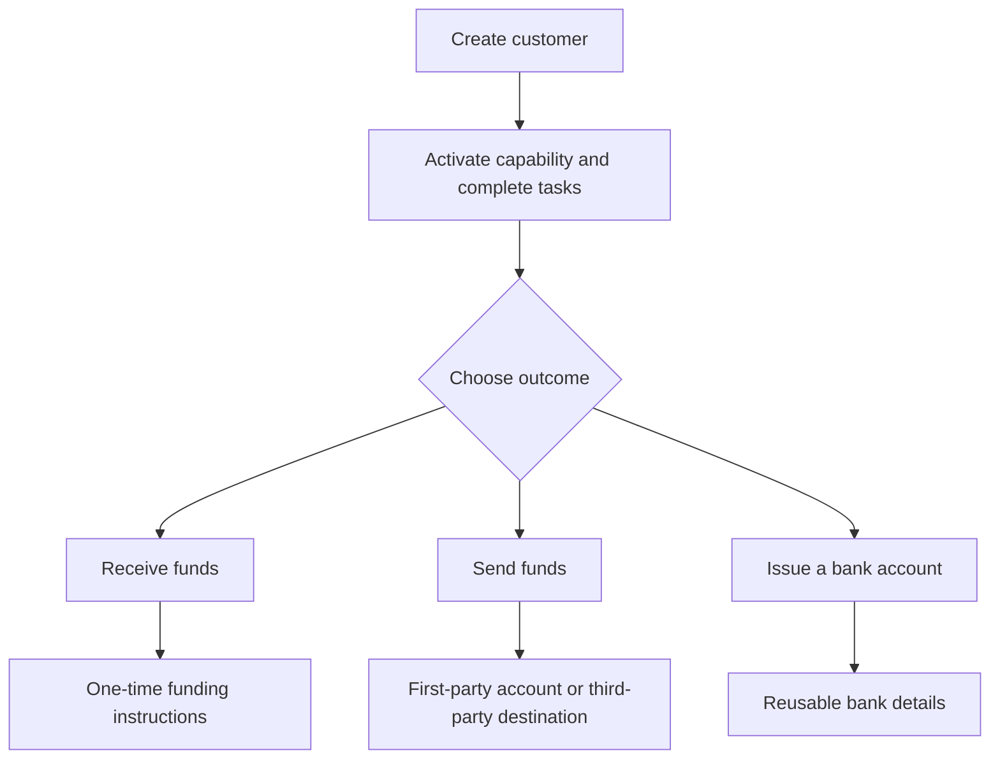

Begin vanuit de klantuitkomst. Elke flow gebruikt hetzelfde onboardingmodel en vertakt zich vervolgens naar verschillende accounts en geldstromen.

## Vergelijk de flows

| Uitkomst | Bereid eerst voor | Wat je ontvangt |
| --- | --- | --- |
| Pay-in | Ready pay-in-capability en uitgegeven bestemmingswallet | Transferspecifieke instructies en stablecoin-settlement |
| Uitbetaling | Ready uitbetalingscapability, gefinancierde uitgegeven wallet en ready rekening of bestemming | Een transfer naar het geselecteerde ontvangereindpunt |
| Uitgegeven bankrekening | Ready bank-capability en uitgegeven settlement-wallet | Herbruikbare bankgegevens na provisioning |

Een gequote pay-in maakt instructies voor één transfer. Een uitgegeven bankrekening maakt herbruikbare gegevens voor latere stortingen. Een uitbetaling begint vanuit gelden die al beschikbaar zijn in een uitgegeven wallet.

## Kies je flow

<CardGroup cols={3}>
  <Card title="Geld ontvangen" icon="arrow-down-to-line" href="/nl/integration/receive-funds">
    Maak en volg een fiat-naar-stablecoin pay-in.
  </Card>
  <Card title="Geld versturen" icon="arrow-up-from-line" href="/nl/integration/send-funds">
    Bouw een first-party of third-party uitbetaling.
  </Card>
  <Card title="Een bankrekening uitgeven" icon="building-columns" href="/nl/integration/issue-bank-account">
    Provisioneer herbruikbare bankgegevens gekoppeld aan een wallet.
  </Card>
</CardGroup>
