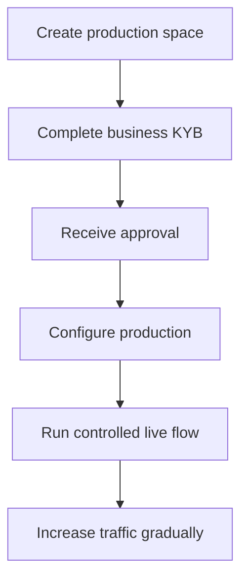

Productie-activering verifieert je integrerende bedrijf. Dit staat los van de API-klanten die je aanmaakt voor je product.

## Activeer je productieomgeving

1. Log in op het Swipelux Dashboard en selecteer **Create a production space**.
2. Open het KYB-tabblad of ga naar [Business verification](https://www.swipelux.app/kyb).
3. Vul elk gevraagd veld in en upload de vereiste documenten.
4. Dien je integrerende bedrijf in voor verificatie en wacht op goedkeuring.

Pas nadat je integrerende bedrijf en productieomgeving zijn goedgekeurd, kun je productie-API-klanten en -transacties aanmaken.

## Houd productie onafhankelijk

Maak productie-resources expliciet aan. Het wisselen van API-key migreert geen sandbox-state.

- Bewaar productie-credentials in een aparte secret manager-entry.
- Gebruik productie-only deploymentconfiguratie en resource-ID's.
- Registreer een aparte productie-webhook-endpoint en signing secret.
- Maak de vereiste klanten, capabilities, accounts, recipients en destinations opnieuw aan in productie.
- Beperk productietoegang tot de services en operators die deze nodig hebben.

Sandbox en productie gebruiken `https://platform.swipelux.com`; de API-key selecteert de omgeving.

## Voltooi de launchchecklist

- [ ] Test het happy path en verwachte failure paths in sandbox.
- [ ] Verstuur een `Idempotency-Key` bij elke write die er een vereist en bewaar die voor veilige retries.
- [ ] Verifieer webhook-signatures voordat je parseert, persisteer event-ID's duurzaam en test replay.
- [ ] Behandel niet-beschikbare capabilities, open taken en gewijzigde task-revisies.
- [ ] Toon transferfouten en actiegerichte instructies aan je operators.
- [ ] Bevestig dat logs `X-Request-Id` of `correlationId` behouden zonder secrets of gevoelige financiële data te tonen.

## Voer één gecontroleerde live flow uit

Begin met een bekende klant en één low-value transactie. Leg vast:

| Control | Bepaal vóór de test |
| --- | --- |
| Scope | Klant, capability, account of destination, bedrag en methode. |
| Verwachte uitkomst | API-state, saldo of instructies en webhook-event dat je verwacht te zien. |
| Owner | Persoon verantwoordelijk voor het bewaken van de volledige flow. |
| Stopvoorwaarde | Elke onverwachte state, ontbrekende webhook, onjuist bedrag of onopgeloste taak. |

Verifieer zowel de huidige API-resource als de geauthenticeerde webhook-delivery. Als een van beide afwijkt van de verwachte uitkomst, stop dan en onderzoek voordat je meer verkeer verstuurt.

Verhoog na een geslaagde volledige flow het volume geleidelijk terwijl je de states van capability, account, destination en transfer monitort.

Ga terug naar [Common flows](/nl/integration/common-flows) voor de productjourney of gebruik de [API Reference](/nl/api-reference/introduction) voor exacte contracten.
