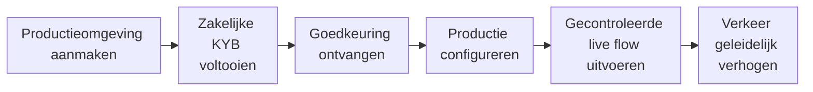

Productie-activering verifieert je integrerende bedrijf. Dit staat los van de API-klanten die je aanmaakt voor je product.

```mermaid
%%{init: {"flowchart": {"rankSpacing": 20, "nodeSpacing": 16, "wrappingWidth": 80, "padding": 8}}}%%
flowchart LR
  A["Productieomgeving aanmaken"] --> B["Zakelijke KYB voltooien"]
  B --> C["Goedkeuring ontvangen"]
  C --> D["Productie configureren"]
  D --> E["Gecontroleerde live flow uitvoeren"]
  E --> F["Verkeer geleidelijk verhogen"]
```

## Activeer je productieomgeving {#activate-your-production-space}

1. Log in op het Swipelux Dashboard en selecteer **Create a production space**.
2. Open het KYB-tabblad of ga naar [Business verification](https://www.swipelux.app/kyb).
3. Vul elk gevraagd veld in en upload de vereiste documenten.
4. Dien je integrerende bedrijf in voor verificatie en wacht op goedkeuring.

Pas nadat de KYB van je integrerende bedrijf is goedgekeurd, kun je productie-API-klanten en -transacties aanmaken.

In een live-omgeving die KYB vereist, retourneert Swipelux tot de goedkeuring `422` [`merchant_kyb_not_approved`](/integration/errors#merchant-kyb-not-approved) voor elk schrijfverzoek buiten bedrijfsverificatie en webhookbeheer. Dit omvat klanten, capabilities, accounts, recipients, regels, quotes en transfers.

Terwijl je op goedkeuring wacht, kun je nog steeds:

- `GET`- en `HEAD`-verzoeken versturen.
- Je bedrijfsverificatie voltooien (profiel, gerelateerde partijen, documenten en taakinzendingen voor de KYB-klant van je bedrijf).
- Webhook-endpoints beheren via de API, en secret keys, omgevingen en railkosten beheren in het dashboard.

Tot de goedkeuring gelden er limieten voor instellingen:

- Je kunt in totaal 20 webhook-URL-wijzigingen per uur doen, verdeeld over alle endpoints in je live-omgevingen die KYB vereisen. Wijzigingen in sandbox-omgevingen tellen niet mee. Het overschrijden van de webhook-URL-limiet retourneert `422 merchant_kyb_not_approved` vanuit `POST /v3/webhooks` of `PATCH /v3/webhooks/{webhookId}`.
- In het dashboard kun je maximaal 10 actieve API-keys hebben per live-omgeving die KYB vereist.
- In het dashboard kun je maximaal 5 omgevingen per merchant hebben zolang je ten minste één live-omgeving hebt, al je live-omgevingen KYB vereisen en geen ervan is goedgekeurd. Hierbij tellen zowel sandbox- als live-omgevingen mee. Als een live-omgeving geen KYB vereist, geldt deze omgevingslimiet niet.

Het dashboard weigert verzoeken die de key- of omgevingslimiet overschrijden met een gewone `422`-respons, zonder de code `merchant_kyb_not_approved`. Alleen de events van een endpoint wijzigen, of de huidige URL opnieuw opslaan, telt niet als URL-wijziging. Ingetrokken API-keys tellen niet mee voor de keylimiet.

Sandbox-omgevingen zijn vrijgesteld van de schrijfblokkade, de webhook-URL-limiet en de keylimiet, zodat je daar kunt blijven bouwen en testen. Ze tellen wel mee voor de omgevingslimiet van de merchant.

## Houd productie onafhankelijk

Maak productie-resources expliciet aan. Het wisselen van API-key migreert geen sandbox-state. Een sandbox-key kan geen productieresources bereiken. Zie [Key-scope](/nl/integration/authentication#key-scope).

- Bewaar productie-credentials in een aparte secret manager-entry.
- Gebruik productie-only deploymentconfiguratie en resource-ID's.
- Registreer een aparte productie-webhook-endpoint en signing secret.
- Maak de vereiste klanten, capabilities, accounts, recipients en destinations opnieuw aan in productie.
- Beperk productietoegang tot de services en operators die deze nodig hebben.

Sandbox en productie gebruiken `https://platform.swipelux.com`; de API-key selecteert de omgeving.

## Voltooi de launchchecklist

- [ ] Test het happy path en verwachte failure paths in sandbox.
- [ ] Verstuur een `Idempotency-Key` bij elke write die er een vereist en bewaar die voor veilige retries.
- [ ] Verifieer webhook-signatures voordat je parseert, persisteer event-ID's duurzaam en test replay.
- [ ] Behandel niet-beschikbare capabilities, open taken en gewijzigde task-revisies.
- [ ] Behandel gedocumenteerde [API-fouten en retries](/integration/errors), inclusief idempotente retries met de oorspronkelijke key.
- [ ] Toon transferfouten en actiegerichte instructies aan je operators.
- [ ] Bevestig dat logs `X-Request-Id` of `correlationId` behouden zonder secrets of gevoelige financiële data te tonen.

## Voer één gecontroleerde live flow uit

Begin met een bekende klant en één low-value transactie. Leg vast:

| Control | Bepaal vóór de test |
| --- | --- |
| Scope | Klant, capability, account of destination, bedrag en methode. |
| Verwachte uitkomst | API-state, saldo of instructies en webhook-event dat je verwacht te zien. |
| Owner | Persoon verantwoordelijk voor het bewaken van de volledige flow. |
| Stopvoorwaarde | Elke onverwachte state, ontbrekende webhook, onjuist bedrag of onopgeloste taak. |

Verifieer zowel de huidige API-resource als de geauthenticeerde webhook-delivery. Als een van beide afwijkt van de verwachte uitkomst, stop dan en onderzoek voordat je meer verkeer verstuurt.

Verhoog na een geslaagde volledige flow het volume geleidelijk terwijl je de states van capability, account, destination en transfer monitort.

Ga terug naar [Common flows](/nl/integration/common-flows) voor de productjourney, bekijk [Fouten en nieuwe pogingen](/integration/errors) voor foutafhandeling of gebruik de [API Reference](/nl/api-reference/introduction) voor exacte contracten.
