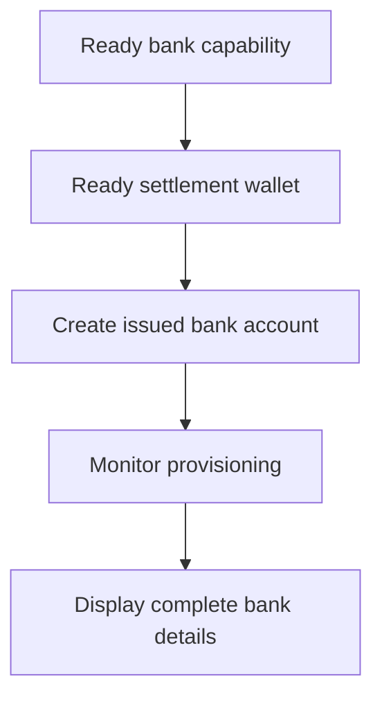

Gebruik een uitgegeven bankrekening wanneer de klant herbruikbare bankgegevens nodig heeft. Voor eenmalige funding-instructies gekoppeld aan een specifiek bedrag gebruik je in plaats daarvan [Geld ontvangen](/nl/integration/receive-funds).



## Voordat je begint

Je hebt een klant-ID, een ready bank-capability voor de beoogde methode en valuta en een ready uitgegeven wallet in bezit van dezelfde klant nodig. Voltooi open werk via [Capabilities en tasks](/nl/integration/onboarding/capabilities-and-requirements).

## 1. Maak of selecteer de settlement-wallet

Maak een uitgegeven wallet via [Accounts en wallets](/nl/integration/accounts#create-the-account) en lees hem daarna opnieuw. Ga alleen verder wanneer de huidige status settlement toestaat.

Bewaar de `data.id` uit de respons als `SETTLEMENT_WALLET_ID`. Gebruik geen externe wallet voor `settlement.accountId`.

## 2. Maak de uitgegeven bankrekening

Gebruik [`POST /v3/customers/{customerId}/accounts`](/api-reference/accounts/post-v3-customers-by-customer-id-accounts) met deze headers:

```http
X-API-Key: ${SWIPELUX_API_KEY}
Idempotency-Key: issued-bank-account-001
Content-Type: application/json
```

Verstuur deze request body:

```json
{
  "origin": "issued",
  "type": "bank",
  "method": "ach",
  "country": "US",
  "currency": "USD",
  "settlement": {
    "accountId": "${SETTLEMENT_WALLET_ID}"
  },
  "label": "USD account"
}
```

Bewaar de geretourneerde `data.id` als `BANK_ACCOUNT_ID`. Behoud ook `data.status`, `data.openTaskIds`, `data.details` en de settlement-relatie.

De bankrekening-ID en wallet-ID hebben verschillende rollen. Lees provisioning en bankgegevens via de bankrekening-ID. Gebruik de settlement-wallet-ID om aan te geven waar stortingen worden gecrediteerd.

## 3. Monitor de provisioning

Lees [`GET /v3/customers/{customerId}/accounts/{accountId}`](/api-reference/accounts/get-v3-customers-by-customer-id-accounts-by-account-id) na het aanmaken en na elke relevante webhook.

Houd de klantinterface in behandeling terwijl `details` afwezig is. Als `openTaskIds` niet leeg is, voltooi je de nieuwste taken en refetch je de rekening. Leid readiness niet af uit verstreken tijd.

Als de nieuwste `statusReason.code` gelijk is aan `awaiting_assignment`, maak dan de eerste pay-in aan voor dezelfde klant, capability en settlement-wallet via [Geld ontvangen](/nl/integration/receive-funds) en lees de bankrekening daarna opnieuw. Volg deze branch alleen wanneer de huidige rekening erom vraagt.

## 4. Toon bankgegevens veilig

Toon alleen de volledige gegevens die de nieuwste rekeninglees retourneert. Wanneer `details.referenceRequired` true is, toon je de exacte `details.reference` en maak je die kopieerbaar. Wanneer die false is, verzin je geen referentie.

Deze bankgegevens zijn herbruikbaar. Vervang ze niet door funding-coördinaten van een gequote pay-in, die alleen bij die transfer horen.

Voeg vervolgens [Webhooks](/nl/integration/webhooks) toe zodat provisioning-updates je applicatie bereiken zonder de klant op een polling-scherm te houden.
