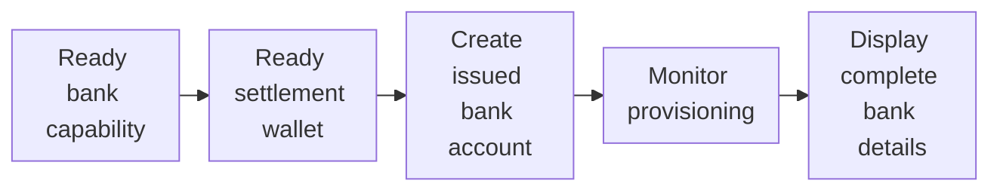

Gebruik een uitgegeven bankrekening wanneer de klant herbruikbare bankgegevens nodig heeft. Voor eenmalige funding-instructies gekoppeld aan een specifiek bedrag gebruik je in plaats daarvan [Geld ontvangen](/nl/integration/receive-funds).


```mermaid
%%{init: {"flowchart": {"rankSpacing": 20, "nodeSpacing": 16, "wrappingWidth": 80, "padding": 8}}}%%
flowchart LR
  A["Ready bank capability"] --> B["Ready settlement wallet"]
  B --> C["Create issued bank account"]
  C --> D["Monitor provisioning"]
  D --> E["Display complete bank details"]
```

## Voordat je begint

Je hebt een klant-ID, een ready bank-capability voor de beoogde methode en valuta en een ready uitgegeven wallet in bezit van dezelfde klant nodig. Met `allowPending` kun je het request opslaan terwijl de geselecteerde bank de klant nog beoordeelt. Voltooi open werk via [Capabilities en tasks](/nl/integration/onboarding/capabilities-and-requirements).

## 1. Maak of selecteer de settlement-wallet

Maak een uitgegeven wallet via [Accounts en wallets](/nl/integration/accounts#create-the-account) en lees hem daarna opnieuw. Ga alleen verder wanneer de huidige status settlement toestaat.

Bewaar de `data.id` uit de respons als `SETTLEMENT_WALLET_ID`. Gebruik geen externe wallet voor `settlement.accountId`.

## 2. Maak de uitgegeven bankrekening

Gebruik [`POST /v3/customers/{customerId}/accounts`](/api-reference/accounts/post-v3-customers-by-customer-id-accounts) met deze headers:

```http
X-API-Key: ${SWIPELUX_API_KEY}
Idempotency-Key: issued-bank-account-001
Content-Type: application/json
```

Verstuur deze request body:

```json
{
  "origin": "issued",
  "type": "bank",
  "method": "ach",
  "country": "US",
  "currency": "USD",
  "settlement": {
    "accountId": "${SETTLEMENT_WALLET_ID}"
  },
  "label": "USD account"
}
```

Bewaar de geretourneerde `data.id` als `BANK_ACCOUNT_ID`. Behoud ook `data.status`, `data.openTaskIds`, `data.details` en de settlement-relatie.

Optionele requestvelden:

| Veld | Van toepassing op | Gedrag |
| --- | --- | --- |
| `institution` | Uitgegeven `ach`, `wire` en `swift` | Selecteert precies deze bank. Swipelux valt niet terug op een andere bank. Gebruik een institution-ID uit de supported-capability-respons. |
| `allowPending` | Uitgegeven `ach`, `wire` en `swift` | Stel in op `true` om het request op te slaan terwijl de aanvraag bij de geselecteerde bank op goedkeuring wacht. Vereist `institution`. |
| `settlement.currency` | Uitgegeven bankrekeningen | `USDC` of `USDT`. Bepaalt welke stablecoin naar de settlement-wallet wordt geleverd. |

### Kies de bank {#choose-the-bank}

Verstuur `institution` wanneer de klant bankgegevens van een specifieke bank nodig heeft. Swipelux reserveert één uitgegeven rekening per klant, methode, valuta en institution. Een request zonder `institution` retourneert `409 conflict` als de klant bij welke bank dan ook al een uitgegeven rekening voor die methode en valuta heeft. Een request met `institution` retourneert `409 conflict` alleen als er al een rekening bij die bank bestaat.

Rekeningreads retourneren de geselecteerde bank als `institution` met `id`, `name` en `bic`. `bic` kan `null` zijn.

Idempotency geldt voor de geselecteerde bank. Het opnieuw versturen van hetzelfde request retourneert de oorspronkelijke rekening. Het wijzigen van `institution` onder dezelfde `Idempotency-Key` retourneert `409 idempotency_conflict`.

### Sla het request op vóór goedkeuring door de bank {#save-the-request-before-bank-approval}

Standaard accepteert Swipelux een request voor een uitgegeven bankrekening pas nadat de bank-capability ready is. Om de rekeninginstellingen van de klant eerder te verzamelen, verstuur je `allowPending: true` met `institution`:

```json
{
  "origin": "issued",
  "type": "bank",
  "method": "wire",
  "country": "US",
  "currency": "USD",
  "institution": "${INSTITUTION_ID}",
  "allowPending": true,
  "settlement": {
    "accountId": "${SETTLEMENT_WALLET_ID}"
  },
  "label": "USD wire account"
}
```

Terwijl de aanvraag bij de bank wordt beoordeeld, retourneert de rekening `status: "in_review"` met `statusReason.code` ingesteld op `waiting_for_approval`. De respons bevat ook `applicationId` en de `openTaskIds` van de aanvraag. Voltooi die taken via [Capabilities en tasks](/nl/integration/onboarding/capabilities-and-requirements).

Het opgeslagen request behoudt zijn rekening-ID, settlement-wallet en rekeningslot. Nadat de aanvraag en de capability ready zijn, provisioneert Swipelux bankgegevens onder dezelfde `BANK_ACCOUNT_ID`. Blijf die ID lezen. Maak geen nieuw request aan.

Als de aanvraag eerst wordt afgewezen, geannuleerd of gearchiveerd, wordt de rekening `rejected`. Hij houdt het rekeningslot dan niet meer vast.

### Kies de settlement-valuta {#choose-the-settlement-currency}

Standaard worden stortingen afgewikkeld in de valuta van de settlement-wallet. Stel `settlement.currency` in op `USDC` of `USDT` om het geleverde asset onafhankelijk van de valuta van de wallet te kiezen:

```json
{
  "settlement": {
    "accountId": "${SETTLEMENT_WALLET_ID}",
    "currency": "USDT"
  }
}
```

`USDT` vereist een `USD`-rekening en een settlement-wallet op een netwerk dat USDT-levering ondersteunt. Anders retourneert het request `400 invalid_settlement_target`. Rekeningreads retourneren de opgeslagen keuze, ook terwijl de rekening wordt geprovisioneerd.

De bankrekening-ID en wallet-ID hebben verschillende rollen. Lees provisioning en bankgegevens via de bankrekening-ID. Gebruik de settlement-wallet-ID om aan te geven waar stortingen worden gecrediteerd.

## 3. Monitor de provisioning

Lees [`GET /v3/customers/{customerId}/accounts/{accountId}`](/api-reference/accounts/get-v3-customers-by-customer-id-accounts-by-account-id) na het aanmaken en na elke relevante webhook.

Houd de klantinterface in behandeling terwijl `details` afwezig is. Als `openTaskIds` niet leeg is, voltooi je de nieuwste taken en refetch je de rekening. Leid readiness niet af uit verstreken tijd.

Als de rekening is opgeslagen met `allowPending: true`, blijft hij `in_review` met `statusReason.code` ingesteld op `waiting_for_approval` totdat de bank de aanvraag goedkeurt.

Als de nieuwste `statusReason.code` gelijk is aan `awaiting_assignment`, maak dan de eerste pay-in aan voor dezelfde klant, capability en settlement-wallet via [Geld ontvangen](/nl/integration/receive-funds) en lees de bankrekening daarna opnieuw. Volg deze branch alleen wanneer de huidige rekening erom vraagt.

## 4. Toon bankgegevens veilig

Toon alleen de volledige gegevens die de nieuwste rekeninglees retourneert. Wanneer `details.referenceRequired` true is, toon je de exacte `details.reference` en maak je die kopieerbaar. Wanneer die false is, verzin je geen referentie.

Toon voor uitgegeven `swift`-rekeningen `details.bankName`, `details.swiftCode` (de BIC van de ontvangende bank), `details.accountNumber`, `details.accountHolderName` en `details.accountHolderAddress` wanneer die worden geretourneerd. Verzenders moeten het adres van de begunstigde exact overnemen in de internationale overboeking. Toon ook `details.bankAddress` en eventuele velden voor intermediaire banken die de rekening retourneert.

Deze bankgegevens zijn herbruikbaar. Vervang ze niet door funding-coördinaten van een gequote pay-in, die alleen bij die transfer horen.

Voeg vervolgens [Webhooks](/nl/integration/webhooks) toe zodat provisioning-updates je applicatie bereiken zonder de klant op een polling-scherm te houden.
