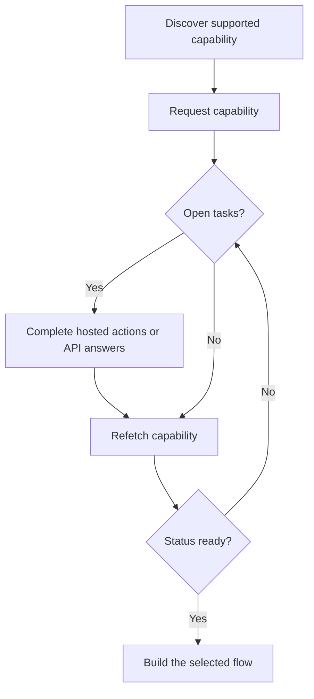

Een capability geeft aan of een klant een specifieke uitkomst, betaalmethode en richting kan gebruiken. Open taken vertellen je wat er moet gebeuren voordat die capability of een gerelateerde resource verder kan.



```bash
export API_BASE='https://platform.swipelux.com'
export SWIPELUX_API_KEY='replace-with-your-api-key'
```

## Ontdek ondersteunde capabilities

Lees de huidige opties van de klant met [`GET /v3/customers/{customerId}/capabilities/supported`](/api-reference/capabilities/get-v3-customers-by-customer-id-capabilities-supported):

```bash
curl --request GET \
  "${API_BASE}/v3/customers/${CUSTOMER_ID}/capabilities/supported" \
  --header "X-API-Key: ${SWIPELUX_API_KEY}"
```

Kies een response-entry die overeenkomt met de beoogde `directions`, `method` en `accountType`. Ga alleen verder wanneer `availability` gelijk is aan `available` of `beta` en `eligibility.eligible` gelijk is aan `true`. Als er `institutions` worden geretourneerd, selecteer je alleen een ID uit die respons.

Bewaar de geselecteerde `data[].id` als `CAPABILITY_ID`. Kopieer nooit een capability-ID van een andere klant of omgeving.

### Pooled vs named accounttypes

Bank-capabilities komen in twee varianten, gecodeerd in het `accountType`-veld en de capability-ID-suffix (bijvoorbeeld `ach_pooled`, `wire_named`):

- **`pooled`**: gedeelde Swipelux-bankrekening. Elke pay-in gebruikt een unieke referentie om geld te routeren. Kies dit voor eenmalige transfers.
- **`named`**: dedicated bankgegevens voor de klant (virtueel IBAN, dedicated ACH-rekening). Herbruikbaar en te delen met elke betaler. Vereist voor [uitgegeven bankrekeningen](/nl/integration/issue-bank-account).

Standaard `pooled`. Gebruik `named` alleen wanneer de klant herbruikbare bankgegevens nodig heeft. Controleer de `supported`-response voor welke varianten beschikbaar zijn.

## Vraag de capability aan

Vraag de geselecteerde optie aan met [`POST /v3/customers/{customerId}/capabilities/{capabilityId}`](/api-reference/capabilities/post-v3-customers-by-customer-id-capabilities-by-capability-id):

```bash
curl --request POST \
  "${API_BASE}/v3/customers/${CUSTOMER_ID}/capabilities/${CAPABILITY_ID}" \
  --header "X-API-Key: ${SWIPELUX_API_KEY}" \
  --header "Idempotency-Key: capability-request-001" \
  --header "Content-Type: application/json" \
  --data '{}'
```

Gebruik alleen een expliciete `institutions`-array wanneer je moet kiezen uit ID's die de supported-capability-respons heeft geretourneerd.

Bewaar `data.status` als `CAPABILITY_STATUS`, `data.openTaskIds` als `OPEN_TASK_IDS` en elke `data.applications[].id` in `APPLICATION_IDS`.

## Voltooi huidige taken {#complete-current-tasks}

Bekijk taken met [`GET /v3/customers/{customerId}/tasks`](/api-reference/tasks/list-customer-tasks), selecteer ID's uit `OPEN_TASK_IDS` en lees elke huidige taak met [`GET /v3/customers/{customerId}/tasks/{taskId}`](/api-reference/tasks/get-customer-task):

```bash
curl --request GET \
  "${API_BASE}/v3/customers/${CUSTOMER_ID}/tasks/${TASK_ID}" \
  --header "X-API-Key: ${SWIPELUX_API_KEY}"
```

Gebruik de nieuwste `data.revision` en `data.requirements`. Refetch de taak direct vóór indiening als een van beide kan zijn gewijzigd.

### Gehoste acties

Elke entry in `verificationSessions` en `tosSessions` publiceert een expliciet `action`-object. Lees `action.kind` voordat je de klant doorstuurt; leid de beschikbaarheid van een link niet af uit de `status` van de sessie.

- `action.kind: "available"` bevat `action.url` en `action.expiresAt` (momenteel altijd `null`). Stuur de klant naar `action.url` en lees de taak vervolgens opnieuw. De platte `url`- en `expiresAt`-velden op de sessie zijn compatibiliteitsspiegels van de available action.
- `action.kind: "unavailable"` betekent dat er geen link mag worden aangeboden. Hergebruikte, voltooide, afgewezen en geannuleerde sessies publiceren deze vorm, en de platte `url`- en `expiresAt`-velden ontbreken.

```json
{
  "verificationSessions": [
    {
      "id": "vfy_...",
      "status": "action_required",
      "action": {
        "kind": "available",
        "url": "https://api.swipelux.com/kyc/redirect/cus_.../tsk_.../vfy_...",
        "expiresAt": null
      },
      "url": "https://api.swipelux.com/kyc/redirect/cus_.../tsk_.../vfy_...",
      "expiresAt": null
    }
  ],
  "tosSessions": [
    {
      "id": "tos_...",
      "status": "completed",
      "action": { "kind": "unavailable" }
    }
  ]
}
```

Dit zijn task-scoped acties, geen aparte lifecycle voor klantverificatie.

### Documenten uploaden {#upload-documents}

Wanneer een vereiste om een document vraagt, upload je het met [`POST /v3/customers/{customerId}/documents`](/api-reference/documents/post-v3-customers-by-customer-id-documents):

```bash
export DOCUMENT_PATH='/absolute/path/to/requested-document.pdf'

curl --request POST \
  "${API_BASE}/v3/customers/${CUSTOMER_ID}/documents" \
  --header "X-API-Key: ${SWIPELUX_API_KEY}" \
  --header "Idempotency-Key: customer-document-001" \
  --form "file=@${DOCUMENT_PATH}"
```

Bewaar de geretourneerde `data.id` als `DOCUMENT_ID` voordat je het antwoord indient dat ernaar verwijst.

### API-antwoorden

Dien één volledige antwoordset in voor de huidige revisie met [`POST /v3/customers/{customerId}/tasks/{taskId}/submissions`](/api-reference/task-submissions/create-customer-task-submission):

```bash
curl --request POST \
  "${API_BASE}/v3/customers/${CUSTOMER_ID}/tasks/${TASK_ID}/submissions" \
  --header "X-API-Key: ${SWIPELUX_API_KEY}" \
  --header "Idempotency-Key: task-submission-001" \
  --header "Content-Type: application/json" \
  --data @- <<'JSON'
{
  "taskRevision": 3,
  "answers": [
    {
      "requirementId": "req_from_current_task",
      "answer": {
        "type": "text",
        "value": "Current answer"
      }
    }
  ]
}
JSON
```

Neem elke requirement-ID en elk antwoordtype uit de nieuwste taak. Als de API meldt dat de taak is gewijzigd, refetch je hem en bouw je de submission opnieuw op vanuit de nieuwe revisie.

## Ga verder wanneer de capability ready is

Lees de capability opnieuw met [`GET /v3/customers/{customerId}/capabilities/{capabilityId}`](/api-reference/capabilities/get-v3-customers-by-customer-id-capabilities-by-capability-id):

```bash
curl --request GET \
  "${API_BASE}/v3/customers/${CUSTOMER_ID}/capabilities/${CAPABILITY_ID}" \
  --header "X-API-Key: ${SWIPELUX_API_KEY}"
```

Vervang de opgeslagen status en task-ID's door de nieuwste respons. Ga alleen verder wanneer de huidige capability-status het account, de quote of de transfer die je wilt aanmaken toestaat.

Kies vervolgens de bijpassende journey in [Common flows](/nl/integration/common-flows).
