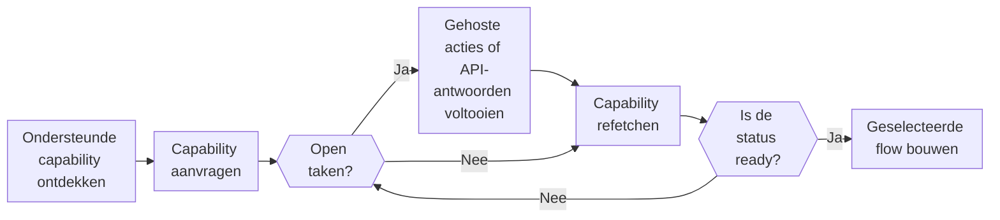

Een capability geeft aan of een klant een specifieke uitkomst, betaalmethode en richting kan gebruiken. Open taken vertellen je wat er moet gebeuren voordat die capability of een gerelateerde resource verder kan.


```mermaid
%%{init: {"flowchart": {"rankSpacing": 20, "nodeSpacing": 16, "wrappingWidth": 80, "padding": 8}}}%%
flowchart LR
  A["Ondersteunde capability ontdekken"] --> B["Capability aanvragen"]
  B --> C{{"Open taken?"}}
  C -->|"Ja"| D["Gehoste acties of API-antwoorden voltooien"]
  D --> E["Capability refetchen"]
  C -->|"Nee"| E
  E --> F{{"Is de status ready?"}}
  F -->|"Nee"| C
  F -->|"Ja"| G["Geselecteerde flow bouwen"]
```

```bash Environment variables
export API_BASE='https://platform.swipelux.com'
export SWIPELUX_API_KEY='replace-with-your-api-key'
```

## Ontdek ondersteunde capabilities

Lees de huidige opties van de klant met [`GET /v3/customers/{customerId}/capabilities/supported`](/api-reference/capabilities/get-v3-customers-by-customer-id-capabilities-supported):

```bash List supported capabilities
curl --request GET \
  "${API_BASE}/v3/customers/${CUSTOMER_ID}/capabilities/supported" \
  --header "X-API-Key: ${SWIPELUX_API_KEY}"
```

Kies een response-entry die overeenkomt met de beoogde `directions`, `method` en `accountType`. Ga alleen verder wanneer `availability` gelijk is aan `available` of `beta` en `eligibility.eligible` gelijk is aan `true`. Als er `institutions` worden geretourneerd, selecteer je alleen een ID uit die respons.

Elke institution-entry bevat een `logoUrl` en een `isDefault`-vlag. Gebruik `logoUrl` om het logo van de bank te tonen in een UI voor bankselectie, en toon je eigen generieke bankicoon wanneer het `null` is. `isDefault` geldt alleen voor deze klant en capability, niet globaal voor de institution. [`GET /v3/institutions`](/api-reference/institutions/get-v3-institutions) retourneert dezelfde nullable `logoUrl`. Institution-ID's zijn opaque, dus verwerk nieuwe ID's zonder codewijzigingen.

```json Institution entry
{
  "institutions": [
    {
      "id": "jpmorgan",
      "name": "JPMorgan Chase",
      "bic": "CHASUS33",
      "logoUrl": "https://wallet.swipelux.com/bank-logos/jpmorgan.png",
      "countries": ["US"],
      "isDefault": true
    }
  ]
}
```

Bewaar de geselecteerde `data[].id` als `CAPABILITY_ID`. Kopieer nooit een capability-ID van een andere klant of omgeving.

### Pooled vs named accounttypes

Bank-capabilities komen in twee varianten, gecodeerd in het `accountType`-veld en de capability-ID-suffix (bijvoorbeeld `ach_pooled`, `wire_named`):

- **`pooled`**: gedeelde Swipelux-bankrekening. Elke pay-in gebruikt een unieke referentie om geld te routeren. Kies dit voor eenmalige transfers.
- **`named`**: dedicated bankgegevens voor de klant (virtueel IBAN, dedicated ACH-rekening). Herbruikbaar en te delen met elke betaler. Vereist voor [uitgegeven bankrekeningen](/nl/integration/issue-bank-account).

Standaard `pooled`. Gebruik `named` alleen wanneer de klant herbruikbare bankgegevens nodig heeft. Controleer de `supported`-response voor welke varianten beschikbaar zijn.

Gebruik `swift_named` om SWIFT-stortingen te ontvangen of SWIFT-bankgegevens uit te geven. `swift_pooled` ondersteunt alleen uitbetalingen, dus controleer de `directions` van elke optie in de supported-capability-respons. Een named SWIFT-rekening retourneert herbruikbare ontvangstgegevens, waaronder de BIC van de bank, een referentie wanneer die vereist is, en het adres van de begunstigde wanneer de bank dat verstrekt.

Voor uitgegeven ACH-, Wire- en SWIFT-rekeningen kun je met `institution` een specifieke bank kiezen en het rekeningverzoek opslaan voordat de bank de klant goedkeurt. Zie [Een bankrekening uitgeven](/nl/integration/issue-bank-account#choose-the-bank).

## Vraag de capability aan

Vraag de geselecteerde optie aan met [`POST /v3/customers/{customerId}/capabilities/{capabilityId}`](/api-reference/capabilities/post-v3-customers-by-customer-id-capabilities-by-capability-id):

```bash Request capability
curl --request POST \
  "${API_BASE}/v3/customers/${CUSTOMER_ID}/capabilities/${CAPABILITY_ID}" \
  --header "X-API-Key: ${SWIPELUX_API_KEY}" \
  --header "Idempotency-Key: capability-request-001" \
  --header "Content-Type: application/json" \
  --data '{}'
```

Gebruik alleen een expliciete `institutions`-array wanneer je moet kiezen uit ID's die de supported-capability-respons heeft geretourneerd.

Bewaar `data.status` als `CAPABILITY_STATUS`, `data.accountProvisioning` als `ACCOUNT_PROVISIONING_STATUS`, `data.openTaskIds` als `OPEN_TASK_IDS` en elke `data.applications[].id` in `APPLICATION_IDS`.

### Gedeelde applications per bank {#shared-applications-per-bank}

Voor named bank-capabilities heeft elke klant één application-case per bank. Pooled en platform-capabilities gebruiken cases zonder bank. Swipelux deelt een case over elke compatibele capability die je aanvraagt:

- Eén goedkeuring kan meerdere capabilities dekken. Een goedgekeurde case bij één bank kan bijvoorbeeld zowel een ACH- als een wire-capability `ready` maken.
- Een later verzoek dat overeenkomt met een bestaande case, hergebruikt die. Swipelux opent geen tweede application en voegt geen dubbele taken toe.
- Cases bij verschillende banken zijn onafhankelijk. Een afwijzing bij één bank heeft geen invloed op een case bij een andere bank.

De respons op het verzoek vertelt je welke case Swipelux heeft gebruikt:

- `201` betekent dat het verzoek een nieuwe application-case heeft geopend.
- `200` betekent dat het verzoek is uitgekomen bij een application-case die de klant al had, bijvoorbeeld een herhaald verzoek voor een bank-capability die de klant al heeft, of een verzoek voor een geannuleerde capability. Een herhaald verzoek voor `card` of `stablecoin_transfers` retourneert nog steeds [`409 capability_already_exists`](/integration/errors#capability-already-exists).
- `selectedApplicationId` is een top-level veld naast `data` met de ID van de case die het verzoek heeft geselecteerd of geopend. Swipelux laat het weg wanneer het verzoek geen case heeft geselecteerd. Een idempotente replay retourneert dezelfde waarde.

Verkorte respons:

```json Response (abbreviated)
{
  "data": {
    "id": "ach_named",
    "status": "pending",
    "openTaskIds": ["tsk_000000000000000002"],
    "applications": [{ "id": "apl_000000000000000005", "status": "in_review" }]
  },
  "selectedApplicationId": "apl_000000000000000005"
}
```

Stuur voor named capabilities dezelfde `institutions`-lijst opnieuw om dezelfde case te selecteren, of stuur één institution-ID om die bank te targeten. Een bank die de klant definitief heeft afgewezen, wordt overgeslagen. Wanneer je alleen die bank noemt, of elke eligible bank de klant heeft afgewezen, retourneert het verzoek [`409 capability_terminally_rejected`](/integration/errors#capability-terminally-rejected). Om na een afwijzing een andere bank te proberen, vraag je de capability opnieuw aan met de institution-ID van die bank.

De status van een capability weerspiegelt alle gerelateerde cases van de klant. Voor een named capability is één `ready` case waarvan de goedkeuring hem dekt genoeg om hem `ready` te maken, ongeacht wat andere banken melden. Een pooled capability wacht ook op zijn methodecontrole, gemeld in `probes` in de lijst met applications van de klant.

#### Bekijk de applications van de klant {#list-the-customers-applications}

Bekijk elke application-case van de klant met [`GET /v3/customers/{customerId}/applications`](/api-reference/capabilities/get-v3-customers-by-customer-id-applications). Resultaten worden gepagineerd met `nextCursor` en `hasMore`, en accepteren `updatedAfter`:

```bash List applications
curl --request GET \
  "${API_BASE}/v3/customers/${CUSTOMER_ID}/applications" \
  --header "X-API-Key: ${SWIPELUX_API_KEY}"
```

Elke entry bevat de application-velden die worden geretourneerd in de `applications[]` van een capability, plus:

- `scope`: `named` voor een case bij één bank, `provider_pooled` of `platform` voor cases zonder bank, of `null` voor een niet-geclassificeerde historische case. `institution` ontbreekt bij `provider_pooled`- en `platform`-cases.
- `requestedScope[]`: de capability-keys die voor de case zijn aangevraagd, elk met de eerste `requestedAt`. Entries worden nooit verwijderd.
- `coverage[]`: de capability-keys die de goedkeuring van de case dekt, elk met `grantedAt` en `source`. Coverage legt scope vast, geen autorisatie. Lees de capability voor de huidige status.
- `probes[]`: methodecontroles voor de pooled capability-keys die de case dekt, elk met `capabilityKey`, `status` en `reason`. Named keys vereisen nooit een probe.
- `generation`, `predecessorApplicationId` en `supersededByApplicationId`: opvolgingslinks. Wanneer `supersededByApplicationId` is ingesteld, is de case vervangen. Volg die ID naar de huidige case. De `applications[]` van een capability bevat alleen huidige cases, dus een vervangen case verschijnt alleen in deze lijst.

Verkorte respons:

```json Response (abbreviated)
{
  "data": [
    {
      "id": "apl_000000000000000005",
      "status": "ready",
      "scope": "named",
      "institution": { "id": "jpmorgan", "name": "JPMorgan Chase", "bic": "CHASUS33" },
      "requestedScope": [
        { "capabilityKey": "ach_named", "requestedAt": "2026-09-20T10:00:00.000Z" }
      ],
      "coverage": [
        { "capabilityKey": "ach_named", "grantedAt": "2026-09-22T12:00:00.000Z", "source": "approval" },
        { "capabilityKey": "wire_named", "grantedAt": "2026-09-22T12:00:00.000Z", "source": "approval" }
      ],
      "probes": [],
      "generation": 1,
      "predecessorApplicationId": null,
      "supersededByApplicationId": null
    }
  ],
  "nextCursor": null,
  "hasMore": false
}
```

## Voltooi huidige taken {#complete-current-tasks}

Bekijk taken met [`GET /v3/customers/{customerId}/tasks`](/api-reference/tasks/list-customer-tasks), selecteer ID's uit `OPEN_TASK_IDS` en lees elke huidige taak met [`GET /v3/customers/{customerId}/tasks/{taskId}`](/api-reference/tasks/get-customer-task):

```bash List open tasks
curl --request GET \
  "${API_BASE}/v3/customers/${CUSTOMER_ID}/tasks/${TASK_ID}" \
  --header "X-API-Key: ${SWIPELUX_API_KEY}"
```

Gebruik de nieuwste `data.revision` en `data.requirements`. Refetch de taak direct vóór indiening als een van beide kan zijn gewijzigd.

### Hergebruikt profielbewijs {#reused-profile-evidence}

Voor application-intaketaken die directe indiening via de API accepteren, hergebruikt Swipelux informatie die de klant al heeft verstrekt. Wanneer zo'n taak wordt aangemaakt of gereconcilieerd, controleert Swipelux het klantprofiel en de door de klant zelf geüploade documenten. Eligible vereisten die al worden onderbouwd door een bruikbare profielwaarde of een bruikbaar document, gaan naar `in_review` in plaats van actionable te blijven. Profielupdates en nieuwe documentuploads activeren dezelfde controle voor bestaande taken.

Alleen ontbrekende of incompatibele waarden blijven actionable. Hergebruik keurt het bewijs niet goed. Swipelux beoordeelt het nog steeds. Expliciete correctieverzoeken en eerder beantwoorde vereisten blijven actionable. Documenten van eigenaren en related parties worden niet hergebruikt, en vereisten die alleen via een hosted session worden verzameld, behouden hun normale flow.

### Vereisten renderen {#render-requirements}

Bouw formulieren op basis van de metadata die elke vereiste retourneert, niet op basis van requirement-keys. Een vereiste kan een optionele korte `title` bevatten, en elke `request` bevat een `prompt` om onder de kop te tonen.

Vereisten met `request.type: "profile"` identificeren het profielveld met `profilePointer` en voegen invoermetadata toe:

- `allowedValues`: de toegestane waarden voor een scalair veld, of voor elk item van een arrayveld. Dien deze waarden in, niet vertaalde weergavelabels.
- `valueSchema`: een zelfstandig JSON Schema Draft 7-document dat de invoervorm, geneste properties, verplichte velden en structurele beperkingen beschrijft. Enums op objecten staan op de relevante property, bijvoorbeeld `valueSchema.items.properties.type.enum` voor fiscale identificatiecodes. Swipelux past na indiening nog steeds veldoverschrijdende validatie en reviewvalidatie toe, dus een waarde die het schema doorstaat, kan nog steeds worden afgewezen.
- `valueType: "country"`, of `itemValueType: "country"` voor arrays: het veld accepteert ISO 3166-1 alpha-2-codes in hoofdletters. Geneste landproperties in `valueSchema` gebruiken `format: "iso-3166-1-alpha-2"`. Gebruik een standaard landenlijst voor gelokaliseerde labels.

```json Requirement
{
  "id": "req_000000000000000010",
  "key": "account_purposes",
  "title": "Account purpose",
  "status": "action_required",
  "request": {
    "type": "profile",
    "prompt": "Select every purpose that applies.",
    "required": true,
    "profilePointer": "/financialProfile/accountPurposes",
    "valueType": "array",
    "itemValueType": "string",
    "allowedValues": ["business_expenses", "ecommerce", "payroll"],
    "valueSchema": {
      "$schema": "http://json-schema.org/draft-07/schema#",
      "type": "array",
      "items": { "enum": ["business_expenses", "ecommerce", "payroll"] }
    }
  }
}
```

Dit voorbeeld verkort de waardencatalogus; de API retourneert elke toegestane waarde. Sommige profielvereisten hebben geen gepubliceerd schema en laten `valueSchema` en `allowedValues` weg. Render die op basis van `prompt` en `valueType`.

Elke open taak bevat een `dueAt`-tijdstempel. Wanneer Swipelux een taak aanmaakt zonder expliciete vervaldatum, staat `dueAt` standaard op precies 31 dagen na de `createdAt` van de taak. Behandel `dueAt` als informatief: je kunt het niet via de API instellen en het activeert geen automatische levenscyclusovergang. Alleen het aparte veld `deadline` veroorzaakt, indien aanwezig, een automatische overgang.

### Gehoste acties {#hosted-actions}

In het taakdetailantwoord bevat elke entry in `verificationSessions` en `tosSessions` een `action`-object. Antwoorden met een takenlijst bevatten deze actielinks niet. Sla de `id` van elke sessie op en lees vervolgens `action.kind` voordat je de klant doorstuurt; leid de beschikbaarheid van een link niet af uit de `status` van de sessie.

- `action.kind: "available"` bevat `action.url` en `action.expiresAt` (momenteel altijd `null`). Sla `action.url` op, stuur de klant ernaartoe en lees de taak daarna opnieuw. De velden `url` en `expiresAt` op sessieniveau bevatten dezelfde waarden.
- `action.kind: "unavailable"` betekent dat er geen link mag worden getoond. De velden `url` en `expiresAt` op sessieniveau ontbreken. Alleen de `status` van een sessie bepaalt niet welk actietype je ontvangt.

```json Verification session
{
  "data": {
    "verificationSessions": [
      {
        "id": "vfy_000000000000000003",
        "key": "identity_verification",
        "type": "identity_verification",
        "status": "action_required",
        "action": {
          "kind": "available",
          "url": "https://platform.swipelux.com/kyc/redirect/cus_000000000000000001/tsk_000000000000000002/vfy_000000000000000003",
          "expiresAt": null
        },
        "url": "https://platform.swipelux.com/kyc/redirect/cus_000000000000000001/tsk_000000000000000002/vfy_000000000000000003",
        "expiresAt": null
      }
    ],
    "tosSessions": [
      {
        "id": "vfy_000000000000000004",
        "key": "terms_of_service",
        "type": "terms_of_service",
        "status": "completed",
        "action": { "kind": "unavailable" }
      }
    ]
  }
}
```

Dit zijn task-scoped acties, geen aparte lifecycle voor klantverificatie.

Een gehost antwoord op een profielvereiste voor een gestructureerde waarde, zoals een adres of fiscale identificatienummers, moet dezelfde schema- en constraintcontroles doorstaan als een direct antwoord. Als dat niet zo is, blijft de vereiste open. Een vereiste die Swipelux om deze reden terugzet naar `action_required`, bevat `reviewFeedback.code: hosted_profile_direct_submission_required`. Verzamel die waarde bij de klant en dien deze in als [API-antwoord](#api-answers).

### Documenten uploaden {#upload-documents}

Wanneer een vereiste om een document vraagt, upload je het met [`POST /v3/customers/{customerId}/documents`](/api-reference/documents/post-v3-customers-by-customer-id-documents):

```bash Upload document
export DOCUMENT_PATH='/absolute/path/to/requested-document.pdf'

curl --request POST \
  "${API_BASE}/v3/customers/${CUSTOMER_ID}/documents" \
  --header "X-API-Key: ${SWIPELUX_API_KEY}" \
  --header "Idempotency-Key: customer-document-001" \
  --form "file=@${DOCUMENT_PATH}"
```

Bewaar de geretourneerde `data.id` als `DOCUMENT_ID` voordat je het antwoord indient dat ernaar verwijst.

Om een opgeslagen bestand later op te halen, roep je [`GET /v3/customers/{customerId}/documents/{documentId}/download`](/api-reference/documents/get-v3-customers-by-customer-id-documents-by-document-id-download) aan. Swipelux retourneert een `url` die het bestand als bijlage downloadt en na één uur verloopt. Gearchiveerde documenten retourneren `404`.

### API-antwoorden {#api-answers}

Dien één volledige antwoordset in voor de huidige revisie met [`POST /v3/customers/{customerId}/tasks/{taskId}/submissions`](/api-reference/task-submissions/create-customer-task-submission):

```bash Submit task answers
curl --request POST \
  "${API_BASE}/v3/customers/${CUSTOMER_ID}/tasks/${TASK_ID}/submissions" \
  --header "X-API-Key: ${SWIPELUX_API_KEY}" \
  --header "Idempotency-Key: task-submission-001" \
  --header "Content-Type: application/json" \
  --data @- <<'JSON'
{
  "taskRevision": 3,
  "answers": [
    {
      "requirementId": "req_from_current_task",
      "answer": {
        "type": "text",
        "value": "Current answer"
      }
    }
  ]
}
JSON
```

Neem elke requirement-ID en elk antwoordtype uit de nieuwste taak. Als de API meldt dat de taak is gewijzigd, refetch je hem en bouw je de submission opnieuw op vanuit de nieuwe revisie.

### UBO-voorwaarde voor bedrijven {#beneficial-owner-prerequisite-for-businesses}

Het aanvragen van een zakelijke capability die UBO-bewijs nodig heeft, slaagt ook wanneer de klant nog geen kwalificerende eigenaar heeft. De capability wordt aangemaakt als `restricted` met `statusReason.code: tasks_due`, en de zakelijke intake-taak vraagt de ontbrekende ownership facts op, inclusief de eigendomsstructuur.

Dezelfde taak bevat een `resource_reference` vereiste waarvan het verzoek `qualification: "beneficial_owner"` bevat:

```json Beneficial owner requirement
{
  "type": "resource_reference",
  "prompt": "Add or select a qualifying beneficial owner.",
  "required": true,
  "resourceType": "related_party",
  "qualification": "beneficial_owner"
}
```

Een related party kwalificeert wanneer die een actieve `person` party van dezelfde klant is met een opgegeven eigendomspercentage van ten minste 25, of met `ownership.declared: true` zonder percentage.

De vereiste wordt afgeleid uit het huidige related-party bestand, dus je beantwoordt hem meestal niet direct:

- Het aanmaken of bijwerken van een kwalificerende related party voldoet aan de vereiste in dezelfde herevaluatie en opent het eigen profiel- en documentwerk van die eigenaar. Zie [Voeg zakelijke related parties toe](/nl/integration/onboarding/customers#add-business-related-parties).
- Je kunt ook expliciet naar een kwalificerende party verwijzen met een `resource_reference` antwoord dat de bijbehorende `relatedPartyId` bevat.
- De vereiste blijft in de huidige taak vermeld nadat eraan is voldaan. Wanneer geen andere verplichting meer openstaat, wordt de taak `satisfied`.
- Het archiveren van de laatste kwalificerende party, of het verwijderen van de facts die hem kwalificeerden, heropent de vereiste, zelfs nadat de taak `satisfied` was.

## Ga verder wanneer de capability ready is {#continue-when-the-capability-is-ready}

Lees de capability opnieuw met [`GET /v3/customers/{customerId}/capabilities/{capabilityId}`](/api-reference/capabilities/get-v3-customers-by-customer-id-capabilities-by-capability-id):

```bash Refetch capability
curl --request GET \
  "${API_BASE}/v3/customers/${CUSTOMER_ID}/capabilities/${CAPABILITY_ID}" \
  --header "X-API-Key: ${SWIPELUX_API_KEY}"
```

Vervang de opgeslagen status, account-provisioning-status en task-ID's door de nieuwste respons. De capability-`status` geeft aan of de bevoegdheid is goedgekeurd. Voor een capability die een account uitgeeft, rapporteert `accountProvisioning` afzonderlijk of dat account `not_started`, `in_progress`, `issued` of `failed` is; een capability die geen account uitgeeft retourneert `not_applicable`.

Zolang de capability `pending` is, laten twee van de `statusReason.code`-waarden die ze kan melden zien of er een beoordeling loopt. `preparing_submission` betekent dat Swipelux nog een aanvraag voorbereidt voor indiening en dat er geen beoordeling loopt, zelfs als de aanvraag bij een andere bank `rejected` is of aandacht nodig heeft. `review_in_progress` betekent dat er een beoordeling loopt, bijvoorbeeld terwijl een aanvraag `in_review` is of een [gehoste verificatie](#hosted-actions) open staat. Beide gebruiken `resolution: wait`. Een wisseling tussen deze codes houdt de status op `pending`, dus er wordt geen `capability.status_changed`-event verzonden. Lees de capability om de huidige code te zien.

Ga alleen verder wanneer de huidige capability-status het account, de quote of de transfer die je wilt aanmaken toestaat. Wanneer de flow een uitgegeven account nodig heeft, wacht je ook tot `accountProvisioning` de status `issued` bereikt.

Kies vervolgens de bijpassende journey in [Common flows](/nl/integration/common-flows).
