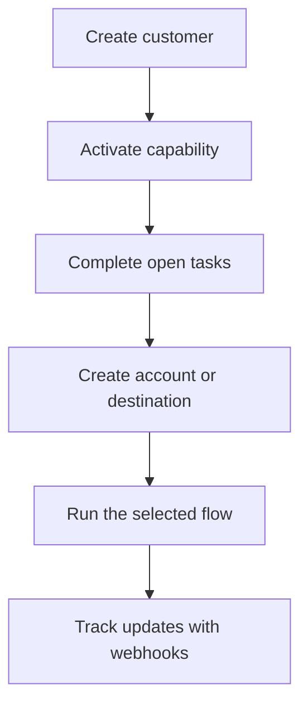

Swipelux geeft je backend de bouwstenen om klanten te onboarden en geld te verplaatsen zonder dat je betaalinfrastructuur in je product hoeft te tonen.

## Wat je kunt bouwen

<CardGroup cols={3}>
  <Card title="Geld ontvangen" icon="arrow-down-to-line" href="/nl/integration/receive-funds">
    Maak eenmalige fiat-fundinginstructies en verwerk stablecoin naar een wallet.
  </Card>
  <Card title="Geld versturen" icon="arrow-up-from-line" href="/nl/integration/send-funds">
    Verstuur vanuit een klant-wallet naar een eigen rekening of externe bestemming.
  </Card>
  <Card title="Een bankrekening uitgeven" icon="building-columns" href="/nl/integration/issue-bank-account">
    Provisioneer herbruikbare bankgegevens gekoppeld aan een settlement-wallet.
  </Card>
</CardGroup>

## Hoe een integratie werkt

Een klant is de persoon of het bedrijf dat de flow bezit. Capabilities beschrijven welke uitkomsten die klant kan gebruiken. Open taken vertellen je wat voltooid moet zijn voordat de capability of resource verder kan.

## Zie het in actie

Verken [demo.swipelux.com](https://demo.swipelux.com) om een gesimuleerde neobank-ervaring te proberen. Je kunt ook [de starter klonen](https://github.com/swipelux/neobank-starter) en de productinterface aanpassen.

De demo en starter zijn product- en UI-referenties. Ze vervangen deze gidsen of het huidige API-contract niet.

## Begin met bouwen

<CardGroup cols={3}>
  <Card title="Quickstart" icon="rocket" href="/nl/integration/quickstart">
    Maak een klant aan en voer één sandboxflow uit.
  </Card>
  <Card title="Common flows" icon="route" href="/nl/integration/common-flows">
    Vergelijk de vereiste opzet voor elke uitkomst.
  </Card>
  <Card title="API Reference" icon="code" href="/nl/api-reference/introduction">
    Lees de requestconventies en bekijk elke API-operation.
  </Card>
</CardGroup>
