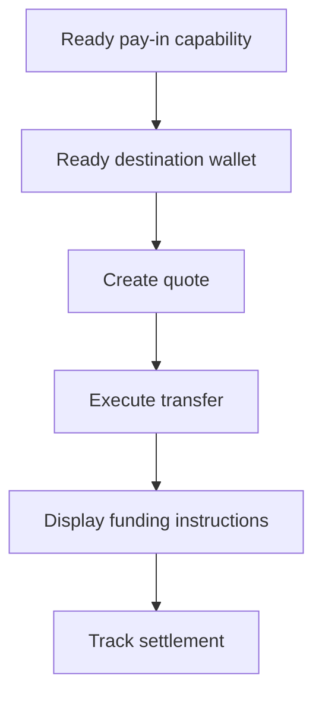

Gebruik een gequote pay-in wanneer de klant een specifiek bedrag moet financieren. De transfer wikkelt stablecoin af naar een uitgegeven wallet.



## Voordat je begint

Je hebt een ready pay-in-capability en een ready uitgegeven bestemmingswallet voor dezelfde klant nodig. Voltooi eventueel open werk via [Capabilities en tasks](/nl/integration/onboarding/capabilities-and-requirements) en refetch dan beide resources.

## 1. Maak een quote

Maak de prijs met [`POST /v3/quotes`](/api-reference/money-movement/post-v3-quotes). Verstuur deze headers:

```http
X-API-Key: ${SWIPELUX_API_KEY}
Idempotency-Key: payin-quote-001
Content-Type: application/json
```

```json
{
  "customerId": "${CUSTOMER_ID}",
  "capabilityId": "${CAPABILITY_ID}",
  "externalId": "payin-order-123",
  "in": {
    "amount": "150.00",
    "currency": "USD"
  },
  "destinationId": "${SETTLEMENT_WALLET_ID}",
  "out": {
    "currency": "USDC"
  }
}
```

Bewaar `data.id` als `QUOTE_ID`. Toon de geretourneerde bedragen en fees in plaats van ze opnieuw te berekenen vanuit het tarief.

## 2. Voer de quote uit

Voer de huidige quote uit vóór het verlopen met [`POST /v3/transfers`](/api-reference/money-movement/post-v3-transfers). Gebruik een nieuwe key voor deze beoogde transfer:

```http
X-API-Key: ${SWIPELUX_API_KEY}
Idempotency-Key: payin-transfer-001
Content-Type: application/json
```

```json
{
  "quoteId": "${QUOTE_ID}"
}
```

Bewaar transfer `data.id` als `TRANSFER_ID` en behoud de huidige state.

## 3. Haal funding-instructies op

Lees [`GET /v3/transfers/{transferId}/instructions`](/api-reference/money-movement/get-v3-transfers-by-transfer-id-instructions). Render de geretourneerde `data.instructions`-variant zonder aannames over het type te maken.

Deze gegevens zijn transferspecifiek. Hergebruik nooit de bankcoördinaten, code, gehoste URL, bedrag, referentie of vervaldatum van één transfer voor een andere pay-in.

Voor bankinstructies: wanneer `reference.required` true is, toon je de exacte `reference.value` naast de bankcoördinaten en maak je die kopieerbaar. Toon het geretourneerde bedrag en de valuta uit dezelfde instructieset.

Een uitgegeven bankrekening is iets anders: die biedt herbruikbare gegevens voor latere stortingen. Zie [Een bankrekening uitgeven](/nl/integration/issue-bank-account) wanneer dat de beoogde ervaring is.

## 4. Volg de settlement

Lees [`GET /v3/transfers/{transferId}`](/api-reference/money-movement/get-v3-transfers-by-transfer-id) na uitvoering en na elke event. Baseer de klantstatus op de nieuwste `data.state`.

Gebruik `data.stateDetail` en `data.openTaskIds` wanneer de transfer een andere actie nodig heeft. Markeer hem niet als voltooid op basis van een verwacht schema.

Voeg vervolgens [Webhooks](/nl/integration/webhooks) toe en houd de transferstatus gesynchroniseerd totdat deze een uitkomst bereikt die je product afhandelt.
