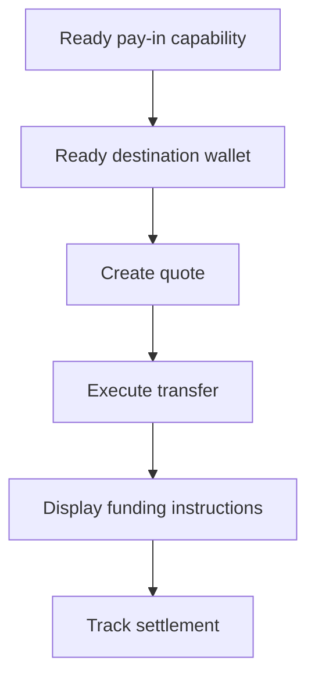

Gebruik een gequote pay-in wanneer de klant een specifiek bedrag moet financieren. De transfer wikkelt stablecoin af naar een uitgegeven wallet.



## Voordat je begint

Je hebt een ready pay-in-capability en een ready uitgegeven bestemmingswallet voor dezelfde klant nodig. Voltooi eventueel open werk via [Capabilities en tasks](/nl/integration/onboarding/capabilities-and-requirements) en refetch dan beide resources.

## 1. Maak een quote

Maak de prijs met [`POST /v3/quotes`](/api-reference/money-movement/post-v3-quotes). Verstuur deze headers:

```http
X-API-Key: ${SWIPELUX_API_KEY}
Idempotency-Key: payin-quote-001
Content-Type: application/json
```

```json
{
  "customerId": "${CUSTOMER_ID}",
  "capabilityId": "${CAPABILITY_ID}",
  "externalId": "payin-order-123",
  "in": {
    "amount": "150.00",
    "currency": "USD"
  },
  "destinationId": "${SETTLEMENT_WALLET_ID}",
  "out": {
    "currency": "USDC"
  }
}
```

Bewaar `data.id` als `QUOTE_ID`. Toon de geretourneerde bedragen en fees in plaats van ze opnieuw te berekenen vanuit het tarief.

## 2. Voer de quote uit

Voer de huidige quote uit vóór het verlopen met [`POST /v3/transfers`](/api-reference/money-movement/post-v3-transfers). Gebruik een nieuwe key voor deze beoogde transfer:

```http
X-API-Key: ${SWIPELUX_API_KEY}
Idempotency-Key: payin-transfer-001
Content-Type: application/json
```

```json
{
  "quoteId": "${QUOTE_ID}"
}
```

Bewaar transfer `data.id` als `TRANSFER_ID` en behoud de huidige state.

### Voeg een terugkeer-URL toe voor kaart en Apple Pay

Voor een kaart- of Apple Pay-quote kun je in hetzelfde verzoek een optionele `redirectUrl` opnemen. Nadat de klant de gehoste checkout heeft afgerond, opent de checkout-pagina deze URL om de klant terug te brengen naar je app.

```json
{
  "quoteId": "${QUOTE_ID}",
  "redirectUrl": "https://your-app.example/payments/complete"
}
```

`redirectUrl` moet een absolute HTTPS-URL van maximaal 2048 tekens zijn en mag geen ingebedde inloggegevens bevatten. Het versturen van een `redirectUrl` voor een quote die geen terugkeernavigatie ondersteunt, faalt bij validatie in plaats van genegeerd te worden.

Aankomst op de `redirectUrl` is uitsluitend browsernavigatie. Het bevestigt niet dat de betaling of de transfer is voltooid. Bepaal voltooiing op basis van de transfer-state in stap 4 en van webhook-events.

### Selecteer vooraf de checkout-methode voor een kaart-quote

Voor een kaart-quote kun je in hetzelfde verzoek een optionele `checkoutMethod` opnemen om te kiezen met welke betaaloptie de gehoste checkout opent. De huidige waarden zijn `card`, `apple_pay`, `google_pay`, `cash_app`, `sepa` en `blik`. De lijst is open en kan groeien, dus tolereer in transfer-reads waarden die je niet herkent. De checkout opent met de aangevraagde methode wanneer die beschikbaar is voor de klant en zijn apparaat, en de klant kan nog steeds elke andere methode kiezen die de checkout aanbiedt. Laat het veld weg om de standaard voorselectie te behouden.

```json
{
  "quoteId": "${QUOTE_ID}",
  "checkoutMethod": "apple_pay"
}
```

`checkoutMethod` is een voorkeur, geen garantie. De beschikbaarheid hangt af van de klant, zijn apparaat en de checkout, dus het aanvragen van een methode maakt die niet beschikbaar. `sepa` en `blik` zijn hier betaalopties binnen de kaart-checkout, geen Swipelux-capabilities, -rails of -rekeningen. De voorselectie verandert de capability, bedragen of kosten van de quote niet, en de checkout bevestigt de definitieve kosten. Transfer-reads geven de aangevraagde waarde terug; ze bevestigen niet welke methode de klant heeft gebruikt. Het versturen van een `checkoutMethod` voor een quote die geen kaart-quote is, faalt bij validatie in plaats van genegeerd te worden, en een herhaling met dezelfde idempotency key moet dezelfde `checkoutMethod` versturen.

## 3. Haal funding-instructies op

Lees [`GET /v3/transfers/{transferId}/instructions`](/api-reference/money-movement/get-v3-transfers-by-transfer-id-instructions). Render de geretourneerde `data.instructions`-variant zonder aannames over het type te maken.

Deze gegevens zijn transferspecifiek. Hergebruik nooit de bankcoördinaten, code, gehoste URL, bedrag, referentie of vervaldatum van één transfer voor een andere pay-in.

Voor bankinstructies: wanneer `reference.required` true is, toon je de exacte `reference.value` naast de bankcoördinaten en maak je die kopieerbaar. Toon het geretourneerde bedrag en de valuta uit dezelfde instructieset.

Een uitgegeven bankrekening is iets anders: die biedt herbruikbare gegevens voor latere stortingen. Zie [Een bankrekening uitgeven](/nl/integration/issue-bank-account) wanneer dat de beoogde ervaring is.

## 4. Volg de settlement

Lees [`GET /v3/transfers/{transferId}`](/api-reference/money-movement/get-v3-transfers-by-transfer-id) na uitvoering en na elke event. Baseer de klantstatus op de nieuwste `data.state`.

Gebruik `data.stateDetail` en `data.openTaskIds` wanneer de transfer een andere actie nodig heeft. Markeer hem niet als voltooid op basis van een verwacht schema.

Voeg vervolgens [Webhooks](/nl/integration/webhooks) toe en houd de transferstatus gesynchroniseerd totdat deze een uitkomst bereikt die je product afhandelt.
