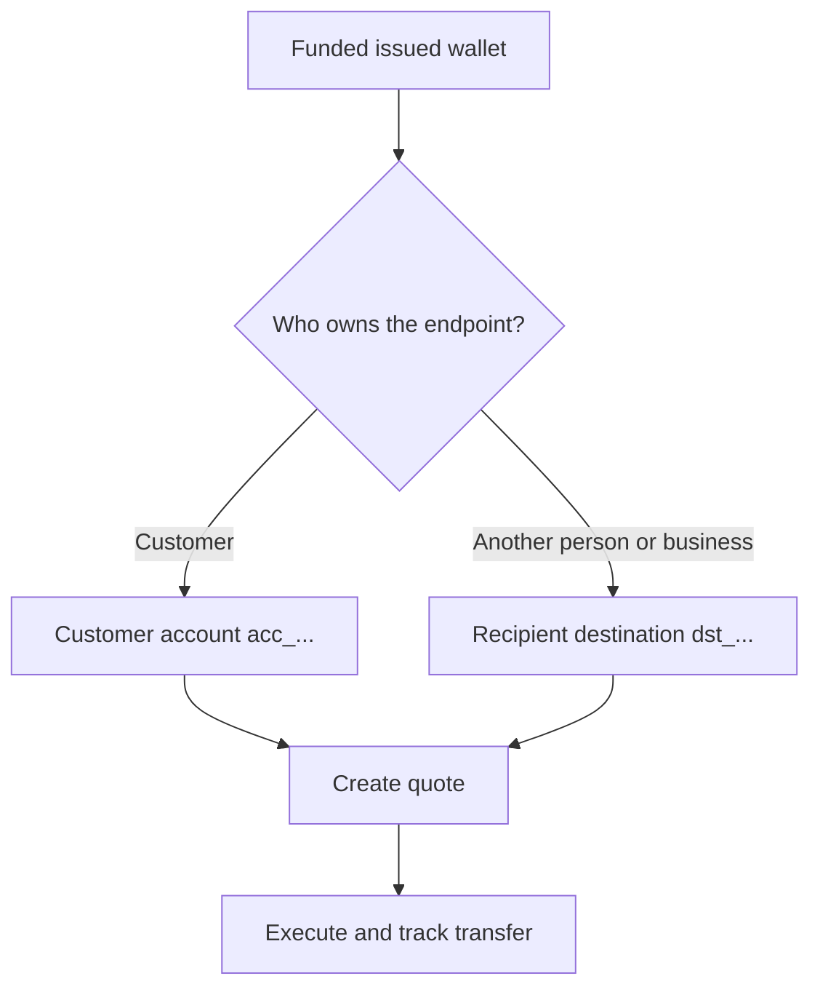

Elke uitbetaling begint vanuit een ready, gefinancierde uitgegeven wallet. Het bestemmingsmodel hangt af van wie het eindpunt bezit.



## Voordat je begint

Refetch de bron-wallet. Bevestig dat de huidige status de uitbetaling toestaat en dat het beschikbare saldo het beoogde bronbedrag dekt. Bewaar de ID uit de respons als `SOURCE_WALLET_ID`.

Je hebt ook een ready uitbetalingscapability nodig voor de huidige klant en geselecteerde destination.

## 1. Bereid de destination voor

<Tabs>
  <Tab title="First-party">

Gebruik een externe bankrekening in bezit van de klant wanneer de klant het eindpunt bezit. Maak deze aan met [`POST /v3/customers/{customerId}/accounts`](/api-reference/accounts/post-v3-customers-by-customer-id-accounts) en deze headers:

```http
X-API-Key: ${SWIPELUX_API_KEY}
Idempotency-Key: payout-account-001
Content-Type: application/json
```

```json
{
  "origin": "external",
  "type": "bank",
  "methods": ["ach", "wire"],
  "country": "US",
  "currency": "USD",
  "details": {
    "routingNumber": "021000021",
    "accountNumber": "123456789",
    "accountType": "checking",
    "bankName": "Example Bank",
    "accountHolderName": "Acme Payments SAS"
  },
  "label": "Customer operating account"
}
```

Lees hem met [`GET /v3/customers/{customerId}/accounts/{accountId}`](/api-reference/accounts/get-v3-customers-by-customer-id-accounts-by-account-id). Ga alleen verder wanneer de huidige status de uitbetaling toestaat. Bewaar de `acc_`-ID als `PAYOUT_DESTINATION_ID`.

  </Tab>
  <Tab title="Third-party">

Maak de persoon of het bedrijf en hun bank- of walleteindpunt aan via [Recipients en destinations](/nl/integration/recipients). Ga alleen verder wanneer de destination ready is.

Bewaar de geretourneerde `dst_`-ID als `PAYOUT_DESTINATION_ID`. Gebruik niet de `rcp_`-ID van de recipient als quote-destination.

  </Tab>
</Tabs>

## 2. Maak de uitbetalingsquote

Gebruik [`POST /v3/quotes`](/api-reference/money-movement/post-v3-quotes) met deze headers:

```http
X-API-Key: ${SWIPELUX_API_KEY}
Idempotency-Key: payout-quote-001
Content-Type: application/json
```

```json
{
  "customerId": "${CUSTOMER_ID}",
  "capabilityId": "${CAPABILITY_ID}",
  "in": {
    "amount": "150.00",
    "currency": "USDC",
    "accountId": "${SOURCE_WALLET_ID}"
  },
  "destinationId": "${PAYOUT_DESTINATION_ID}",
  "out": {
    "currency": "USD"
  }
}
```

Bewaar `data.id` als `QUOTE_ID` en toon de geretourneerde prijs en fees.

## 3. Voer de uitbetaling uit

Maak de transfer met [`POST /v3/transfers`](/api-reference/money-movement/post-v3-transfers). Gebruik één nieuwe key voor deze beoogde uitvoering:

```http
X-API-Key: ${SWIPELUX_API_KEY}
Idempotency-Key: payout-transfer-001
Content-Type: application/json
```

```json
{
  "quoteId": "${QUOTE_ID}"
}
```

Bewaar transfer `data.id` als `TRANSFER_ID`. Een succesvolle create start de uitbetaling; het bewijst niet dat deze is bezorgd.

## 4. Volg de bezorging

Lees [`GET /v3/transfers/{transferId}`](/api-reference/money-movement/get-v3-transfers-by-transfer-id) na aanmaken en na elke event. Gebruik de nieuwste `data.state`, `data.stateDetail` en `data.openTaskIds` om te beslissen of je wacht, handelt of een terminale uitkomst toont.

Bekijk vervolgens [Quotes en transfers](/nl/integration/quotes-and-transfers) voor exacte bedragen, veilige uitvoeringsrecovery en transfertaken.
