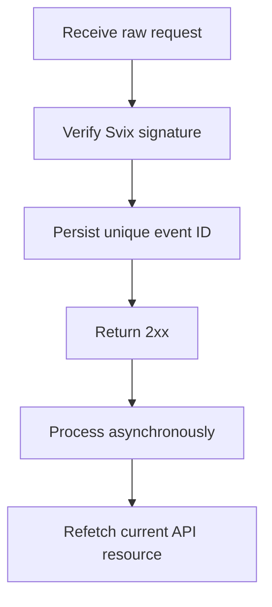

Gebruik webhooks om te reageren op asynchrone wijzigingen. Bezorging is at-least-once, dus dubbele, vertraagde en out-of-order events zijn normaal.



## Registreer alleen de events die je nodig hebt

Maak een endpoint aan met [`POST /v3/webhooks`](/api-reference/webhooks/post-v3-webhooks). Abonneer alleen op gedocumenteerde events die je integratie aansturen. Dit voorbeeld gebruikt [`transfer.state_changed`](/api-reference/webhooks/transfer-state-changed).

```bash
export API_BASE='https://platform.swipelux.com'
export SWIPELUX_API_KEY='replace-with-your-api-key'

curl --request POST \
  "${API_BASE}/v3/webhooks" \
  --header "X-API-Key: ${SWIPELUX_API_KEY}" \
  --header "Idempotency-Key: webhook-endpoint-001" \
  --header "Content-Type: application/json" \
  --data @- <<'JSON'
{
  "url": "https://example.com/webhooks/swipelux",
  "events": ["transfer.state_changed"]
}
JSON
```

Bewaar de respons `data.id` als `WEBHOOK_ID`. Open het portal dat door [`GET /v3/webhooks/portal`](/api-reference/webhooks/get-v3-webhooks-portal) wordt geretourneerd, haal het signing secret van dit endpoint op en bewaar het los van je API-key in een secret manager.

## Verifieer voordat je parseert

Swipelux levert nieuwe webhook-integraties via Svix. Verifieer de raw request body met je endpoint signing secret en deze headers:

- `svix-id`
- `svix-timestamp`
- `svix-signature`

Parseer geen JSON en veroorzaak geen side effects voordat de verificatie is geslaagd.

```javascript
import { Webhook } from "svix";

const verifier = new Webhook(process.env.SWIPELUX_WEBHOOK_SECRET);

export async function handleSwipeluxWebhook(request) {
  const rawBody = await request.text();
  const event = verifier.verify(rawBody, {
    "svix-id": request.headers.get("svix-id"),
    "svix-timestamp": request.headers.get("svix-timestamp"),
    "svix-signature": request.headers.get("svix-signature"),
  });

  await webhookInbox.insertIfAbsent({
    id: event.id,
    payload: event,
    status: "pending",
  });

  return new Response(null, { status: 204 });
}
```

Weiger requests met ontbrekende of ongeldige signatures. Houd de raw body beschikbaar totdat de verificatie is voltooid.

## Persisteer, bevestig, verwerk

Zet een uniqueness constraint op de envelope `id`. Persisteer de geverifieerde envelope, retourneer snel `2xx` en verwerk het daarna asynchroon.

Als de event-ID al bestaat, bevestig je de delivery zonder voltooide side effects te herhalen. Hervat pending of gefaald lokaal werk via je eigen retry queue. Gebruik het envelope `attempt`-veld niet als deduplication key of transport retry counter.

## Refetch huidige state

Webhook-volgorde is geen gezaghebbende resource-geschiedenis. Gebruik `resource.type` en `resource.id` om het object te vinden en haal daarna de huidige state op voordat je je systeem bijwerkt.

Voor een transfer-event roep je [`GET /v3/transfers/{transferId}`](/api-reference/money-movement/get-v3-transfers-by-transfer-id) aan:

```bash
curl --request GET \
  "${API_BASE}/v3/transfers/${TRANSFER_ID}" \
  --header "X-API-Key: ${SWIPELUX_API_KEY}"
```

Baseer de klantstatus en downstream-acties op de huidige API-respons. Ontwerp side effects zodat ze veilig blijven als twee workers gerelateerde events in verschillende volgorde verwerken.

## Herstel deliveries

Gebruik [`GET /v3/webhooks/portal`](/api-reference/webhooks/get-v3-webhooks-portal) om delivery logs te openen, gefaalde deliveries opnieuw te proberen of een handmatige replay te starten.

Elke replay moet dezelfde signature-verificatie en duurzame inbox doorlopen. Om te herstellen na downtime replay je het getroffen venster en refetch je elke verwijzende resource. Voltooide event-ID's blijven no-ops; onvoltooide records worden asynchroon hervat.

Verifieer vervolgens dubbele en out-of-order deliveries in sandbox en voltooi de [Go-live](/nl/integration/go-live)-checklist.
