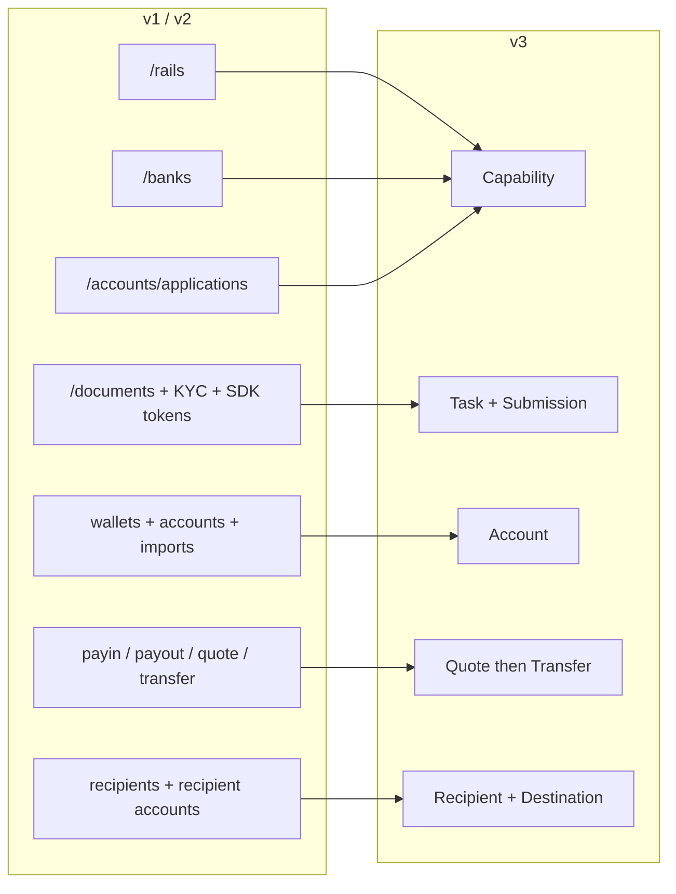
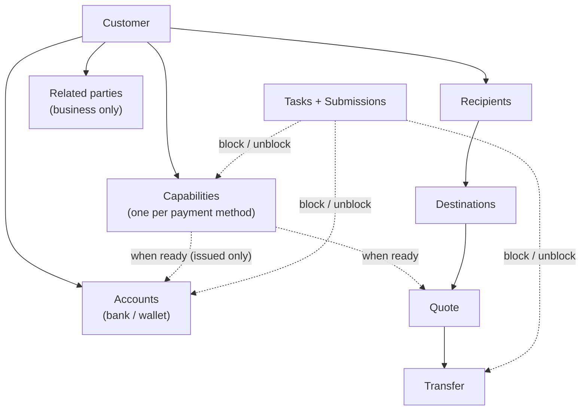
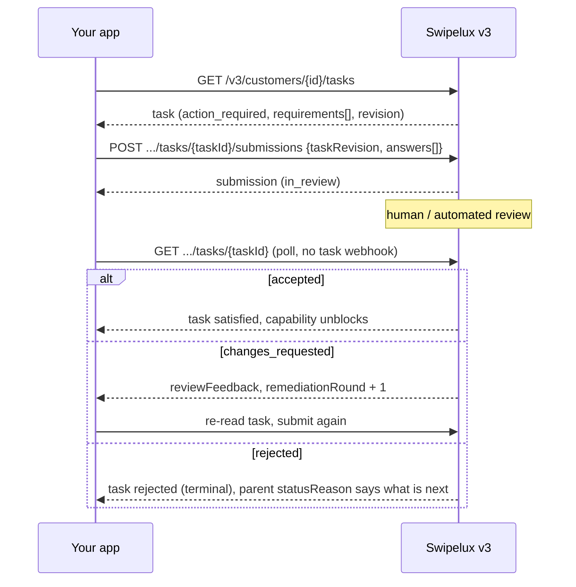
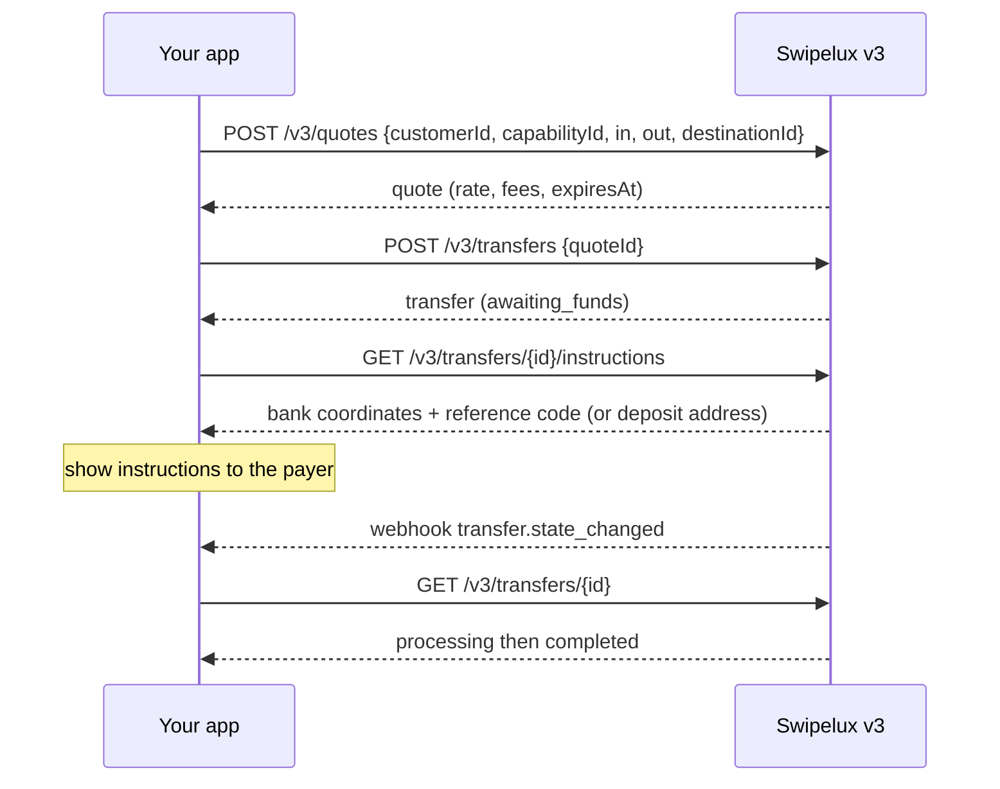
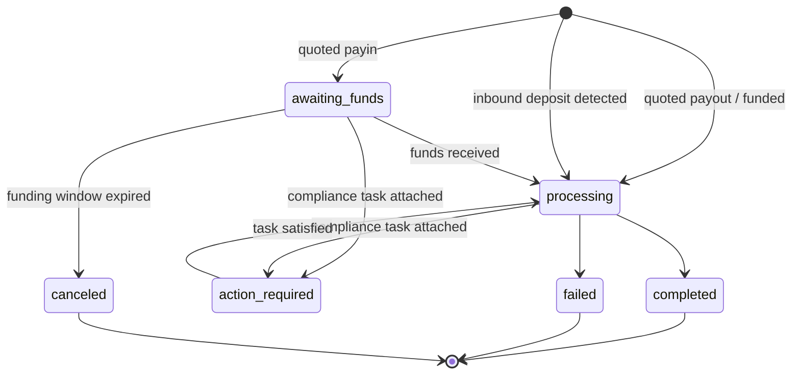
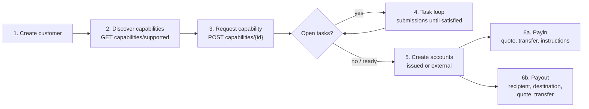

Migrer integrasjonen din fra API v1 og v2 til v3 i to omganger:

- **Del 1, konseptet.** Les dette først. v3 er en omforming, ikke en omdøping: hvis du mapper gamle endepunkter én-til-én, kjemper du mot API-et. Ti minutter her sparer deg for dager senere.
- **Del 2, API-et.** Endepunkt-for-endepunkt-mapping, forespørselseksempler, tilstandsmaskiner og en migreringssjekkliste.

Basert på produksjons-OpenAPI-spesifikasjonen ([platform.swipelux.com/openapi.json](https://platform.swipelux.com/openapi.json)). v1 og v2 er fortsatt aktive og ennå ikke merket som utdaterte; alle nye capability-, mottaker-, task- og quoting-funksjoner leveres kun i v3. Abonner på webhook-hendelsen `api.deprecation` for utfasingsvarsler.

<Info>
  **Innhold.** Del 1: 1.1 hvorfor v3 finnes, 1.2 objektmodell, 1.3 klarhet per capability, 1.4 task-løkken, 1.5 pengeflytting, 1.6 tilstandsmaskiner, 1.7 konvensjoner, 1.8 den gyldne veien. Del 2: 2.1 kunder, 2.2 capabilities, 2.3 tasks og submissions, 2.4 kontoer, 2.5 mottakere og destinations, 2.6 quotes og transfers, 2.7 webhooks, 2.8 sandbox, 2.9 eldre endepunkter, 2.10 migreringsrekkefølge, 2.11 fallgruvesjekkliste.
</Info>

---

## Del 1, konseptet

### 1.1 Hvorfor v3 finnes

v1 og v2 lot fire overlappende måter vokse frem for å gjøre en kunde klar for betaling: `/rails`, `/banks`, `/accounts/applications` og forretnings-`rail-applications`-overflaten, hver med sitt eget statusvokabular. Dokumentinnsamling (`/documents`, KYC-import, verifikasjons-SDK-tokens) var frakoblet fra det den faktisk skulle låse opp. v3 samler alt dette i seks ressurser, kunden pluss fem ting den eier:



| Ressurs | Definisjon på én linje |
| --- | --- |
| **Customer** | Personen eller virksomheten. Har **ingen offentlig statusfelt**, klarhet ligger på capabilities. |
| **Capability** | Én betalingsmåte kunden kan bruke (`sepa`, `ach`, `swift`, `stablecoin_transfers` og så videre), med sin egen status. Erstatter `/rails`, `/banks` og inngangspunktene for kontosøknader. |
| **Task** | En arbeidsenhet Swipelux trenger (data, dokumenter, verifikasjon), besvart med en **Submission**. Erstatter dokument- og KYC-overflaten. |
| **Account** | Et finansieringsendepunkt kunden eier: `bank` eller `wallet`, `issued` av Swipelux eller `external`. |
| **Recipient / Destination** | Utbetalingsmottaker (hvem) og deres bank- eller wallet-endepunkt (hvor). |
| **Quote / Transfer** | All pengeflytting. En transfer utfører en lagret quote; transfers uten quote finnes ikke lenger. |

### 1.2 Objektmodellen



To strukturelle regler å internalisere:

1. **Capabilities styrer alt.** Kontoer opprettes under en `ready` capability; quotes prises mot en capability. Onboarding betyr å få de nødvendige capabilities til `ready`.
2. **Tasks kan henge hvor som helst.** En capability, en konto eller en pågående transfer kan bære `openTaskIds`. Uansett hvor du ser dem, er løkken den samme: les task, send inn svar, vent på gjennomgang, les foreldreobjektet på nytt.

### 1.3 Klarhet er per capability, ikke per kunde

v1 blandet `/rails`-klarhet med en kundeomfattende KYC-port. I v3 finnes det ingen kundestatus: en kunde kan være fullt brukbar på `stablecoin_transfers` mens `sepa`-capabilityen fortsatt har åpne tasks. Capabilities med sammenslåtte kontoer når `ready` som regel raskere enn navngitte, så begynn å transactere på det som er `ready` i stedet for å vente på alt.

Hvis v1- eller v2-koden din baserer UI-merker på kundens verifikasjonsstatus, må du skrive den om:

- "Kan de transactere på X?" blir capability X `status == "ready"`.
- "Må de gjøre noe?" blir en task med status `action_required` (capabilityen viser typisk `restricted` med `statusReason.resolution: "complete_tasks"`).
- "Venter vi på Swipelux?" blir tasks i `in_review`, capability `pending`.

### 1.4 Task-løkken

Alt det gamle dokument- og KYC-overflaten gjorde, er nå denne ene løkken:



Sentrale egenskaper:

- En task bærer `requirements[]`, de enkelte forespørslene. Hver har en task-spesifikk `requirementId`, en stabil `key` som navngir forespørselen (for eksempel adressebekreftelse, dedupliser UI-en din på denne) og et typet `request` som beskriver nøyaktig hva slags inndata som kreves (tekst, dato, valg, dokument, attestasjon og så videre).
- Innsending er **gjennomgangs-styrt**: den endrer aldri capability- eller kontostatus direkte, det gjør aksept. Ett unntak: `profile`-svar skrives direkte inn i kundeprofilen ved innsending (2.3). Etter innsending poller du tasken eller foreldreressursen.
- `taskRevision` (ekko av taskens `revision`) er en samtidighetsvakt: har tasken endret seg siden du leste, må du lese på nytt og bygge svarene på nytt.
- `absence` er et fullverdig svar ("Jeg har ikke dette fordi ..."), bruk det i stedet for å la krav henge.

### 1.5 Pengeflytting

Én flyt for payins, payouts og stablecoin-flyttinger. Det finnes **ingen retningsinndata**, du deklarerer aldri payin kontra payout. Formene på inn- og utvalutaen avleder en skrivebeskyttet `direction` på quoten og transferen: `fiat_to_stablecoin` (payin), `stablecoin_to_fiat` (payout) eller `stablecoin_move`.



### 1.6 Én tilstandsmaskin per ressurs

Hver statusbærende ressurs har sin egen enum, og hver ikke-lykkelig status bærer en strukturert årsak. Kontoer, applications og transfers deler formen `{ code, message, actor, retryable }`: kontoer og applications viser den som `statusReason`, transfers som `stateDetail`. `actor` sier hvem som må handle (`customer`, `developer`, `provider`, `network`, `swipelux`), `retryable` sier om det hjelper å prøve på nytt. Capabilities bruker `{ code, resolution, message }`, der `resolution` (`complete_tasks`, `wait`, `contact_support`, `none`) sier hva som fører capabilityen videre. `code`-verdier er en åpen, kun-utvidbar katalog: forgren på `resolution` (eller `actor` pluss `retryable`), og tolerer koder du aldri har sett før.

| Ressurs | Tilstander |
| --- | --- |
| Capability | `pending`, `restricted`, `ready`, `rejected`, `canceled` |
| Application (forsøk per forespørsel under en capability, 2.2) | `requested`, `in_review`, `action_required`, `ready`, `rejected`, `disabled`, `canceled` |
| Task | `action_required`, `in_review`, `satisfied`, `rejected`, `canceled` |
| Submission | `in_review`, `accepted`, `changes_requested`, `rejected` |
| Account | `provisioning`, `in_review`, `ready`, `action_required`, `suspended`, `rejected`, `archived` |
| Quote | `active`, `executed`, `expired`, `failed` |
| Transfer | `awaiting_funds`, `processing`, `action_required`, `completed`, `failed`, `canceled` |
| Recipient | `active`, `rejected`, `archived` |
| Destination | `in_review`, `ready`, `action_required`, `archived` |

Tilstander denne guiden ikke går gjennom (`rejected`, `suspended`, `disabled`, `failed`, `canceled`) er terminale eller support-drevne; definisjoner per ressurs finnes i spesifikasjonen.

Transfer, tegnet ut:



### 1.7 Konvensjoner

| Område | v1 / v2 | v3 |
| --- | --- | --- |
| Auth | `X-API-Key`-header | Det samme. Miljøet (produksjon eller sandbox) velges av nøkkelen; én base-URL. |
| Idempotens | Ikke håndhevet | `Idempotency-Key`-header **påkrevd på hver effektfull forespørsel** (POST, PATCH, PUT, DELETE), med unntak av sandbox-endepunkter. Samme nøkkel pluss samme body gjentar det opprinnelige svaret. |
| Penger | Blandet tall og strenger | Kun strenger (`"amount": "150.00"`). Aldri flyttall. |
| Paginering | Offset/limit-varianter | Cursor: lister returnerer `{ data, nextCursor, hasMore }`. |
| Oppdateringer | Overveiende PUT | `PATCH` for delvise oppdateringer. |
| Webhooks | Konfigurasjon med ett endepunkt | Flere endepunkter, abonnement per hendelse. Hendelser er **hint**, lesingen er sannheten (2.7). |

Idempotensregler verdt å internalisere før du skriver kode:

- Å gjenbruke en nøkkel med en **annerledes** body gir `409 idempotency_conflict` så lenge nøkkelen oppbevares (minst 7 dager), så planlegg aldri å gjenbruke en nøkkel. Generer en ny UUID per logisk operasjon og lagre den sammen med jobben din.
- Replay dekker også feil: hvis den opprinnelige forespørselen endte i en terminal 4xx, gir samme nøkkel pluss body samme problemsvar igjen.
- To samtidige forespørsler med samme nøkkel: én vinner, den andre får `409`. Prøv taperen på nytt etter at vinneren er ferdig; replayen returnerer det opprinnelige svaret.

### 1.8 Den gyldne veien



---

## Del 2, API-et

### 2.1 Kunder

| v1 / v2 | v3 |
| --- | --- |
| `POST /v1/customers`, `POST /v1/customers/business`, `POST /v2/customers` | `POST /v3/customers` (ett endepunkt, `type: individual \| business`) |
| `GET/PUT/DELETE /v1/customers/{id}`, `/v1/customers/business/{id}`, `/v2/customers/{customerId}` | `GET/PATCH/DELETE /v3/customers/{customerId}` |
| `GET /v1/customers` (liste) | `GET /v3/customers` (cursor-paginert, med innebygde capability-sammendrag) |
| `GET /v1/customers/balances` (batch), `GET /v1/customers/{id}/balances` | Ingen saldoendepunkt, saldoer ligger på kontoer: les `balances` på `GET /v3/customers/{customerId}/accounts` |
| `POST/GET .../shareholders` (v1 business) | `POST/GET /v3/customers/{customerId}/related-parties` (pluss `GET/PATCH/DELETE .../related-parties/{relatedPartyId}`) |
| `POST /v1/customers/business/{id}/kyb` (innsending), `GET .../kyb` (status) | Ingen KYB-innsendingsanrop, be om en capability (2.2) og svar på tasks-ene dens (2.3); resultatet vises som capability- og task-status |
| `POST /v1/customers/{id}/kyc`, `.../kyc/import`, SDK-token-endepunkter | Task-systemet (2.3); hostet verifikasjon vises som `verificationSessions` inne i tasks |

Opprette, skilt på `type` (illustrative verdier, feltnavn per spesifikasjon):

```jsonc
// POST /v3/customers        Idempotency-Key: <fresh uuid>
{
  "type": "individual",
  "externalId": "user-1042",
  "individual": {
    "firstName": "Maria",
    "lastName": "Silva",
    "birthDate": "1990-04-12",
    "nationalities": ["BR"],
    "residenceCountry": "BR",
    "email": "maria@example.com",
    "residentialAddress": {
      "streetLine1": "Av. Paulista 1000",
      "city": "Sao Paulo",
      "postalCode": "01310-100",
      "country": "BR"
    }
  },
  "financialProfile": {
    "accountPurposes": ["cross_border_remittance"],
    "sourcesOfFunds": ["salary"]
  }
}
```

- **Opprettelse er progressiv**: `{ "type": "individual" }` alene er en gyldig opprettelse. Manglende opplysninger gjør aldri kunden ugyldig, de dukker opp senere som intake-tasks på capabilities-ene som trenger dem.
- Virksomheter bærer `business` pluss registreringsdata. v1s shareholder-CRUD mappes til **related parties**, utvidet til å dekke direktører, ledere og eiere: opprett dem inline ved kundeopprettelse (hver får en stabil `rp_`-id) eller administrer dem via de dedikerte related-parties-endepunktene.
- **Ingen kunde-`status`-felt**, se 1.3.
- **Eksisterende kunder overføres**: kunder opprettet på v1 eller v2 er adresserbare med samme id på v3-endepunktene. v3-lesningen er en _renset visning_, eldre verdier som ikke består v3-validering kommer tilbake som fraværende. Etter din **første v3-write blir visningen permanent**: fraværende verdier kommer ikke tilbake av seg selv. Berik derfor tidlig, sett av en engangs-runde som `PATCH`-er den fulle profilen fra dine egne poster før du stoler på v3-lesninger. v1-`metadata` er et separat navneområde og **overføres ikke**, sett det på nytt på v3.
- `externalId` er førsteklasses og **unik på tvers av alle kundene dine** i v3, per miljø (`409 duplicate_external_id`). Arkivering av en kunde frigjør ikke `externalId`, tøm den via PATCH før DELETE hvis du vil gjenbruke den.
- `DELETE` er en **arkiveringskaskade** (ingen gjenoppretting; ids gjenbrukes aldri). Den blokkeres med `409 customer_has_active_resources` pluss `blockingResources[]` så lenge det finnes en ikke-arkivert konto eller pågående transfer.
- PATCH-mergeregler: eksplisitt `null` tømmer et nullbart felt, arrayer erstattes fullstendig (unntatt inline related parties, som upsertes etter id), `metadata`-nøkler slås sammen. Fulle skjemaer og listefiltre finnes i OpenAPI-spesifikasjonen.

### 2.2 `/rails`, `/banks`, applications blir Capabilities

| v1 / v2 | v3 |
| --- | --- |
| `GET /v1/.../rails/capabilities` | `GET /v3/customers/{customerId}/capabilities/supported` |
| `GET /v2/.../banks` (pluss `/banks/{bank}`), `GET /v2/meta/banks` | `GET /v3/customers/{customerId}/capabilities/supported` |
| `GET /v1/customers/{customerId}/rails` (liste) | `GET /v3/customers/{customerId}/capabilities` |
| `GET /v2/customers/{customerId}/rails` (oversikt) | `GET /v3/customers/{customerId}/capabilities` |
| `POST /v1/.../rails`, `POST /v2/.../banks` | `POST /v3/customers/{customerId}/capabilities/{capabilityId}` |
| `POST /v2/.../accounts/applications` | `POST /v3/customers/{customerId}/capabilities/{capabilityId}` |
| `GET /v1/.../rails/{rail}` | `GET /v3/.../capabilities/{capabilityId}` |
| `GET /v2/.../accounts/applications` (pluss `/{applicationId}`, `/{applicationId}/history`) | `GET /v3/.../capabilities/{capabilityId}` (pluss `/applications`, `/applications/{id}/history`) |
| Forretnings-rail-overflate: `GET/POST /v2/customers/business/{customerId}/rail-applications` (pluss `/{rail}`) | Samme v3-capability-endepunkter, ingen separat forretningsoverflate |
| Forretnings-rail-overflate: `GET .../business/{customerId}/rails` (pluss `/{rail}`) | Samme v3-capability-endepunkter, ingen separat forretningsoverflate |
| `GET /v1/meta/rails` (statisk katalog) | `GET /v3/customers/{customerId}/capabilities/supported`, tilgjengelighet er per kunde; det finnes ingen statisk katalog |
| `GET /v1/meta/accounts/banks` | `GET /v3/institutions` (bankkatalog: id, navn, BIC, land) |
| Ikke tilgjengelig | `GET /v3/capabilities`, merchant-omfattende liste over tildelte capabilities på tvers av kunder (filtrer på `status`, `method`, `customerId`) |
| Ikke tilgjengelig | `GET /v3/.../capabilities/{capabilityId}/tasks-preview` (se krav før forespørsel) |
| Ikke tilgjengelig | `POST /v3/.../capabilities/{capabilityId}/cancel` |

- En capability er `method` (`ach`, `wire`, `rtp`, `pix`, `sepa`, `swift`, `spei`, `pse`, `transfers_3_0`, `faster_payments`, `sepa_instant`, `uaefts`, `card`, `stablecoin_transfers` og så videre) pluss `accountType` (`pooled` eller `named`, `null` for ikke-bankmetoder) pluss `directions` (`payin` eller `payout`). Den offentlige `capabilityId` er det kvalifiserte paret (`sepa_pooled`, `ach_named`) eller kun metoden for `card` og `stablecoin_transfers`.
- Hver capability-forespørsel genererer en **application**, posten per forsøk under `.../capabilities/{capabilityId}/applications` (pluss `/{applicationId}/history`), med egne statuser (1.6) og `statusReason`. Den er revisjonsloggen for en forespørsel; i det daglige poller du selve capabilityen.
- `capabilities/supported` returnerer tilgjengelighet (`available`, `beta` eller `disabled`), kvalifisering og institusjoner som tilbys. Bankvalg skjer ved forespørselstidspunktet via det valgfrie `institutions`-arrayet, det finnes ingen separat `/banks`-ressurs. Utelatelse (eller å sende `[]`) velger alle standardinstitusjoner; `isDefault: true` er et kunde- og capability-spesifikt flagg, ikke et globalt. En ikke-tom liste overstyrer standardene, og en bankstøttet capability uten anvendbar standard returnerer `422 capability_institutions_required`. Institusjons-ids er ugjennomsiktige, tolerer nye.
- `stablecoin_transfers` **tildeles automatisk ved kundeopprettelse** og fødes som `ready` (bes altså aldri om og kan ikke kanselleres). `card` er kun for individer.
- `openTaskIds` på capabilityen er "hva gjør jeg neste"-pekeren. Åpen betyr `action_required` **eller** `in_review`, og oppsummeringen inkluderer delte tasks på kundenivå som nås gjennom aktive avhengigheter.
- `cancel` fungerer kun fra `pending` eller `restricted` **og** uten blokkerende ressurser, ellers `409 capability_not_cancelable`, hvis problem-body lister `blockingResources`. Å be på nytt etter kansellering er en fersk opprettelse med en ny idempotency-nøkkel.
- **Poll GET-en.** Capability-status oppdateres når du leser; poll `GET .../capabilities/{capabilityId}` eller abonner på `capability.status_changed`, ikke cache.
- Å be om én metode kan gjøre relaterte metoder tilgjengelige med en gang, behandle capabilities som et sett du leser på nytt, ikke som én rad du sporer.
- Bruk `tasks-preview` for å vise onboarding-forespørsler **før** du forplikter deg til en forespørsel.
- Verifikasjon er ikke engangs: nye tasks kan dukke opp på en allerede `ready` capability (periodisk eller hendelsesdrevet re-verifikasjon). Hold task-løkken koblet gjennom hele kundens levetid, ikke bare ved onboarding.

### 2.3 Dokumenter og KYC blir Tasks og Submissions

<Note>
  **Merknad om navn.** Disse endepunktene ble en kort periode levert som `requirements` og `fulfillments`. Fra 02.08.2026 er de offentlige navnene **tasks** og **submissions**. Omdøpingen omfattet kun ressursene og endepunkt-stiene, `requirements[]`-arrayet inne i en task og dens `requirementId` beholder disse navnene.
</Note>

Hvert eldre dokumentoverflate mappes til samme erstatning: les `GET /v3/customers/{customerId}/tasks`, svar med `POST .../tasks/{taskId}/submissions`.

| v1 / v2 | v3 |
| --- | --- |
| `POST/GET/DELETE /v1/documents` | `GET /v3/.../tasks` pluss `POST .../tasks/{taskId}/submissions` |
| `POST /v1/customers/{id}/documents` | `GET /v3/.../tasks` pluss `POST .../tasks/{taskId}/submissions` |
| `GET/POST /v1/customers/business/{id}/documents` (pluss `PUT/DELETE .../{docId}`) | `GET /v3/.../tasks` pluss `POST .../tasks/{taskId}/submissions` |
| `GET/POST .../shareholders/{shareholderId}/documents` (pluss `GET/PUT/DELETE .../{docId}`) | `GET /v3/.../tasks` pluss `POST .../tasks/{taskId}/submissions` |
| `GET/POST/DELETE /v2/.../documents` (pluss `/{documentId}`) | `GET /v3/.../tasks` pluss `POST .../tasks/{taskId}/submissions` |
| `POST /v2/.../documents/upload-token` pluss `POST /v2/documents/direct-upload` | Last opp direkte med API-nøkkelen din (under), eller send en fersk direct-upload-`storageKey` som JSON til `POST /v3/.../documents` innen fem minutter |
| `POST /v1/customers/documents/upload`, `POST /v1/document` (eldre inntak) | Borte, last opp direkte med API-nøkkelen din (under) |
| `POST /v1/customers/{id}/kyc` pluss SDK-tokens | Task `verificationSessions` (hostet verifikasjon); ingen direkte "start KYC"-anrop |

Rundt den løkken:

- **Rå fillagring**: `POST/GET/DELETE /v3/customers/{customerId}/documents` (pluss `/{documentId}` og `GET .../{documentId}/download`), last opp én gang med API-nøkkelen din, og referer så til dokument-id-er i submission-svar. Dette erstatter alle upload-token- og direct-upload-inntak. `POST .../documents` godtar også en JSON-body (`storageKey`, `fileName`, `type`) som konsumerer en fortsatt fersk kundeavgrenset referanse fra `POST /v2/documents/direct-upload`, slik at parkerte opplastinger migreres uten å sende bytene på nytt.
- **Helt nye lesninger**: `GET /v3/tasks` (merchant-omfattende innboks), `GET /v3/transfers/{transferId}/tasks`, `GET .../tasks/{taskId}/history`, `GET .../tasks/{taskId}/submissions` (pluss `/{submissionId}`).

Submission (illustrativ):

```jsonc
// POST /v3/customers/{cus}/tasks/{task}/submissions   Idempotency-Key: <fresh uuid>
{
  "taskRevision": 3,
  "answers": [
    { "requirementId": "req_a1", "answer": { "type": "document", "documentIds": ["doc_passport1"] } },
    { "requirementId": "req_b2", "answer": { "type": "text", "value": "Import/export business" } },
    { "requirementId": "req_c3", "answer": { "type": "absence", "reason": "not_applicable" } }
  ]
}
```

- Svartyper: `profile`, `text`, `date`, `single_select`, `multi_select`, `boolean`, `attestation`, `document`, `resource_reference`, `absence`. Hvert requirements `request`-objekt sier hvilken type det forventer.
- En submission må besvare **hvert handlingskrevende requirement i gjeldende runde**, med nøyaktig den `taskRevision` du leste. Delvise submissions avvises.
- `profile`-svar **skriver gjennom**: de oppdaterer kundeprofilen via den vanlige valideringsveien og re-evaluerer umiddelbart hver capability som refererer til det samme intake-arbeidet. Søskenlagerte intake-tasks der alle requirements er oppfylt, lukkes automatisk.
- Requirements kan danne alternative grupper (`alternativeKey`): send inn nøyaktig én av gruppen.
- `changes_requested` øker `remediationRound` og bærer `reviewFeedback`. Les tasken på nytt og send inn på nytt **med en ny idempotency-nøkkel**.
- Hostede verifikasjons-URLer vises **kun** på kundeavgrenset task-detalj (`GET /v3/customers/{customerId}/tasks/{taskId}`) og bare mens sesjonen er handlingskrevende; lister og `GET /v3/tasks/{taskId}` er bevisst URL-frie.
- Tjenestevilkår er også en task: `openTaskIds` kan inkludere en task med `category: "terms_of_service"` hvis hostede aksepteringside er lenket på samme måte (kun kundeavgrenset detalj). Generiske submissions kan ikke godta vilkår, og KYC-godkjenning innebærer aldri aksept av vilkår.
- Tasks er avgrenset per capability, så det "samme" kravet (for eksempel adressebekreftelse) kan dukke opp én gang per capability. Dedupliser i UI-en på requirement `key`.
- **Ingen oversettelseslag**: å poste til `/v1/documents` låser ikke opp v3-capabilities. Når en kunde først er på v3, driv alle forespørsler gjennom tasks.

### 2.4 Kontoer og wallets

| v1 / v2 | v3 |
| --- | --- |
| `POST/GET /v1/.../accounts` (pluss `/import`), `/v2/.../accounts` (pluss `/import`) | `POST/GET /v3/customers/{customerId}/accounts` |
| `POST/GET /v1/.../wallets` (pluss `/import`) | Samme endepunkt, `type: wallet` |
| `GET/DELETE /v1/customers/{customerId}/accounts/{accountId}` (og wallet-varianten), `GET /v2/.../accounts/{accountId}` | `GET/PATCH/DELETE /v3/.../accounts/{accountId}` |
| `PATCH /v2/.../accounts/{accountId}/fees` | `GET/PUT /v3/.../accounts/{accountId}/fees` |

Opprette, skilt på `origin` pluss `type`. Utstedte bankkontoer tar én `method`; eksterne bankkontoer tar i stedet et `methods`-array (å sende `method` der avvises):

```jsonc
// issued bank account (capability must be ready)
{ "origin": "issued", "type": "bank", "method": "sepa",
  "currency": "EUR", "settlement": { "accountId": "acc_wallet1" } }

// external wallet the customer already owns (replaces /import)
{ "origin": "external", "type": "wallet", "currency": "USDC",
  "network": "polygon", "details": { "address": "0x71C7656EC7ab88b098defB751B7401B5f6d8976F" } }
```

- `country` på utstedte bankkontoer er valgfritt (standard per metode); på eksterne **bankkontoer** oppgir du det eksplisitt. Wallet-kontoer bærer ikke land i det hele tatt.
- `settlement.accountId` er påkrevd på utstedte bankkontoer: den navngir den utstedte wallet-kontoen som mottar oppgjorte midler fra innskudd til bankkontoen.
- Utstedte kontoer eksponerer `details` (IBAN eller routing pluss konto eller adresse), versjonert `routing` (innskuddskoordinater kan roteres, gjengi alltid den nyeste lesningen), `fees`, `balances`.
- Nettverk: `polygon`, `ethereum`, `base`, `arbitrum`, `optimism`, `bsc`, `avalanche`.
- Capability-porten gjelder kun **utstedte** kontoer: å opprette en mot en ikke-klar capability feiler med en capability-kodet feil, be om capabilityen først (2.2). Eksterne kontoer trenger ingen capability (og ingen kundegodkjenning); de får kun validering av forespørselsskjema og bankdetaljer.
- Utstedte bankkontoer fødes som `provisioning` med `details: null`. Poll kontoen eller se på `account.status_changed` til `ready`.
- `DELETE` arkiverer, sletter aldri hardt. Kontoer som refereres av pågående transfers returnerer `409 account_has_active_transfers`. Prøv på nytt etter at disse transferene når en terminal tilstand.
- Nytt i v3: **Rules**, stående instruksjoner på en utstedt wallet-konto (`POST/GET /v3/customers/{customerId}/rules`, `GET/PATCH/DELETE .../rules/{ruleId}`) som automatisk feier innkommende midler til en annen konto eller en wallet-destination. Ingen v1- eller v2-ekvivalent.

### 2.5 Mottakere og destinations

| v1 | v3 |
| --- | --- |
| `POST/GET /v1/.../recipients` | `POST/GET /v3/customers/{customerId}/recipients` |
| Ikke tilgjengelig (v1-mottakere var kun create og list) | `GET/PATCH/DELETE /v3/.../recipients/{recipientId}`, helt nytt: detalj, oppdatering, arkivering |
| `POST/GET .../recipients/{recipientId}/accounts` | `POST/GET /v3/.../recipients/{recipientId}/destinations` |
| `GET/DELETE .../recipients/{recipientId}/accounts/{recipientAccountId}` | `GET/DELETE /v3/.../recipients/{recipientId}/destinations/{destinationId}` (ingen PATCH for destination, arkiver og opprett på nytt) |

v2 hadde ikke noe mottakerkonsept. Hvis du er på v2 og betaler ut til tredjeparter, er dette en ny overflate, ikke et navnebytte.

- **Recipient** er hvem: `individual` (fornavn og etternavn) eller `business` (firmanavn), med påkrevd `relationship` (`employee`, `contractor`, `vendor`, `subsidiary`, `merchant`, `customer`, `landlord`, `family`, `other`). Recipients og destinations er kun for tredjeparter. En utbetaling til deg selv bruker ikke recipient i det hele tatt: sikt på en av kundens egne `acc_`-kontoer som quotens `destinationId` (2.6).
- **Destination** er hvor: typet per metode, `sepa` (iban, bic valgfritt), `ach` eller `wire` (routing pluss konto), `swift` (fulle koordinater pluss valgfri mellombank), `spei` (clabe), `pse`, `transfers_3_0` (cbu) og så videre, samt wallet-destinations. Hver destination har sin egen status. Følg med på `destination.status_changed`.
- Fiat-destinations krever mottakerens fullstendige `address` (gate, by, postnummer, land) **før** opprettelse. Manglende deler feiler med `422 recipient_address_required`. Wallet-destinations hopper over adressen, men krever `ownership` på toppnivå (`self_custodied`, eller `custodial` med et custodian-navn).
- Nøyaktighet i mottakernavnet er viktig: mottakerbanker matcher kontoens **juridiske** navn. Send eksakt juridisk fornavn pluss etternavn eller firmanavn, ikke et visnings-kallenavn.
- Feltskjemaer per metode for destinations finnes i OpenAPI-spesifikasjonen.

### 2.6 Quotes og transfers

| v1 / v2 | v3 |
| --- | --- |
| `POST /v1/payin/quote`, `/v1/payout/quote`, `/v2/quote` | `POST /v3/quotes` |
| `POST /v1/payin`, `/v1/payout`, `POST /v1/transfers`, `/v2/transfer` | `POST /v3/transfers` (utfører en quote, opprettelser uten quote finnes ikke lenger) |
| `GET /v1/transfers` (liste), `GET /v1/transfers/{id}` | `GET /v3/transfers`, `/v3/transfers/{transferId}` |
| Ikke tilgjengelig (v1- og v2-quotes hadde ingen lesning) | `GET /v3/quotes/{quoteId}` |
| `GET /v1/rate/{base}/{quote}` | `GET /v3/rates` |
| (implisitt i payin-responsen) | `GET /v3/transfers/{transferId}/instructions` |
| Ikke tilgjengelig | `POST /v3/transfers/{transferId}/cancel`, `GET /v3/transfers/{transferId}/tasks` |

```jsonc
// 1. Quote: amount on exactly one side picks mode (exact_in / exact_out).
// POST /v3/quotes            Idempotency-Key: <fresh uuid>
{
  "customerId": "cus_123",
  "capabilityId": "sepa_named",
  "in":  { "currency": "EUR", "amount": "150.00" },
  "out": { "currency": "USDC" },
  "destinationId": "acc_wallet1",   // fiat-funded: must be a customer-owned acc_ account
  "fees": { "breakdown": { "developer": { "fixed": "1.00", "bips": 50 } } }
}
// -> { mode: "exact_in", direction: "fiat_to_stablecoin", rate, fees[], expiresAt, ... }

// 2. Execute before expiresAt.
// POST /v3/transfers         Idempotency-Key: <fresh uuid>
{ "quoteId": "quo_789", "externalId": "order-991", "memo": "invoice 44" }
```

- `destinationId` tar en `acc_`-id (kundeeid konto) eller en `dst_`-id (mottakerdestination). **Fiat-finansierte quotes (payins) må sikte mot en `acc_`-konto**, et `dst_`-mål betyr alltid en utbetaling (ellers `422 quote_direction_invalid`).
- `externalId` på quotes og transfers er en ikke-unik korrelasjonsreferanse (gjentas i lesninger, filtrerbar på lister). Regelen om unikhet per miljø (2.1) gjelder kun for kundens `externalId`.
- Utfør en quote nøyaktig én gang, før `expiresAt`. En utløpt quote feiler med `409 quote_expired`, en andre utførelse med `409 quote_already_executed` (problemet inneholder eksisterende `transferId`).
- Kansellering av transfer støttes ennå ikke: `POST .../cancel` returnerer `409 transfer_not_cancelable` i alle tilstander. Dagens `canceled`-transfers kommer fra at finansieringsvinduet utløper på en ufinansiert payin, ikke fra dette endepunktet.
- Payins starter i `awaiting_funds`: gjengi `GET .../instructions` for betaleren, bankkoordinater pluss **referanse- eller memokode** for fiat, innskuddsadresse for krypto. Referansekoden er slik innskuddet matches. Vis den alltid.
- `state` pluss `stateDetail` for maskinlesbare subtilstander; `action_required` betyr at en compliance-task er vedlagt (`openTaskIds`, `GET .../tasks`), svar via submissions.
- Innkommende innskudd oppdaget på utstedte kontoer vises som transfers med `origin: "inbound_deposit"` (i stedet for `"quoted"`).
- Referanser til betalingsnettverk er samlet under `references`: `transactionHash`, `traceNumber`, `imad`, `uetr`, `explorerUrl`, `returnedTransferId`.

Oversettelse av v1-status:

| v1-konsept | v3 |
| --- | --- |
| separate payin- og payout-objekter | én transfer med `direction` |
| retur eller leverandørsidige kanselleringer (foldet inn i `failed`) | fortsatt `failed`, nå med maskinlesbar `stateDetail` og `references.returnedTransferId` når en retur genererte en revers-transfer |

To migrasjonsadvarsler:

- **Transfers krysser ikke versjoner.** Transfers opprettet på v1 eller v2 er ikke lesbare fra v3. Listen utelater dem og `GET /v3/transfers/{transferId}` gir 404. Bytt over _oppretting_ først, behold v1-leseveien til disse transferene når terminale tilstander, og fjern den så.
- **Ingen tokenbytter.** `stablecoin_move` krever samme valuta inn og ut: USDC til USDT feiler med `422 recipient_destination_invalid` med en `currency_mismatch`-feltfeil. Samme nettverk på begge sider, ingen bridging, og wallet-til-wallet-flyttinger støtter for øyeblikket kun gebyrfri levering: en quote hvis plattform- eller utviklergebyr er ulik null feiler med `422 amount_not_deliverable`.

### 2.7 Webhooks

| v1 | v3 |
| --- | --- |
| `GET/PATCH /v1/webhooks` (konfigurasjon med ett endepunkt) | `POST/GET /v3/webhooks`, `PATCH/DELETE /v3/webhooks/{webhookId}`, `GET /v3/webhooks/portal` |

Hendelseskatalog: `customer.created`, `customer.updated`, `customer.archived`, `capability.created`, `capability.status_changed`, `application.status_changed`, `recipient.status_changed`, `destination.status_changed`, `account.created`, `account.status_changed`, `account.details_changed`, `transfer.created`, `transfer.state_changed`, `api.deprecation`.

- `GET /v3/webhooks/portal` returnerer en hostet administrasjonsportal-URL for leveringslogger, retries og manuell replay.
- `transfer.created` leveres for øyeblikket i eldre v1-payloadform (v3-konvolutten aktiveres når v1-webhooks utfases). Behandle den kun som et hint og hent transferen via GET; ikke bygg mot bodyen dens.
- Hendelser er hint: ved mottak hent ressursen og handle på lesningen. Bygg aldri tilstand basert på hendelses-payload eller rekkefølge. Levering er minst-én-gang og kan være forsinket eller omordnet. Dedupliser på hendelses-id, og gjenopprett tapte hendelser med hver listes inklusive `updatedAfter`-filter.
- Abonner på `api.deprecation`, maskinkanalen for versjonsutfasinger.
- Ingen `task.*`-hendelse i dag: etter innsending poller du tasken eller foreldreobjektet.

### 2.8 Sandbox

Samme base-URL; sandbox-API-nøkkelen velger miljøet.

| v1 | v3 |
| --- | --- |
| `POST /v1/sandbox/topup` | `POST /v3/sandbox/accounts/{accountId}/topup` |
| `POST /v1/sandbox/payins/simulate`, `.../payouts/simulate`, `POST /v1/customers/{id}/simulate-transactions` | `POST /v3/sandbox/transfers/{transferId}/state` (driv en ekte transfer gjennom tilstander) |
| Ikke tilgjengelig | `POST /v3/sandbox/customers/{customerId}/verification` (fullfør verifikasjon) |
| Ikke tilgjengelig | `POST /v3/sandbox/customers/{customerId}/capabilities/{capabilityId}/status` (fremtving capability-status) |
| Ikke tilgjengelig | `POST /v3/sandbox/tasks`, `POST /v3/sandbox/tasks/{taskId}/review` (opprett en task, og simuler så avgjørelsen) |

v3-sandboxen simulerer gjennomgangsløkken fra ende til ende: opprett en task, send inn mot den, `review` den til `accepted` eller `rejected`, og se capabilityen låses opp. Øv på herstellings-UX-en din før produksjon. Både tasks opprettet i sandboxen og de vanlige intake-taskene som dukker opp på forespurte capabilities kan gjennomgås på denne måten; som i produksjon fyres ingen task-webhooks, poll (2.7).

### 2.9 Eldre endepunkter uten v3-erstatning

Disse har ingen v3-erstatning. De fleste forblir uendret på v1 (behold de eksisterende kallene dine); to trekkes tilbake helt (se Disposisjon):

| Endepunkt | Disposisjon |
| --- | --- |
| `GET /v1/merchant-kyb/creation-gate`, `POST /v1/merchant-kyb/{customerId}/submit`, `POST /v1/merchant-kyb/parked-url`, `POST /v1/merchant-kyb/upload-token` | Din egen merchant-KYB-onboarding (ikke kunde-KYB), uendret på v1 |
| `POST /v1/merchant-wallets/get-or-create` | Merchant-treasury-wallet-hjelper, uendret på v1 |
| `GET /v1/meta/accounts/relationships` | Utgått, recipient `relationship`-enumet er fast og dokumentert inline (2.5) |
| `GET /v1/meta/kyb/documents` | Utgått, v3-tasks deklarerer de påkrevde dokumentene per sak via `requirements[]` (2.3); det finnes ingen statisk katalog |
| `GET /statecharts` (pluss `/{machineId}`, `/{machineId}/svg`, `/explorer`, `/validate`) | Versjonsuavhengige offentlige referansesider for tilstandsmaskiner, uendret |

Hvert annet offentlig v1- eller v2-endepunkt dukker opp i en mappingtabell ovenfor.

### 2.10 Foreslått migreringsrekkefølge

Hvert trinn leveres uavhengig; v1 eller v2 og v3 kjører side om side mot samme kundebase. Øv på hvert trinn mot sandbox-nøkkelen din (2.8) før du gjentar det i produksjon.

<Steps>
  <Step title="Rørleggerarbeid">
    `Idempotency-Key` på alle effektfulle forespørsler (POST, PATCH, PUT, DELETE; sandbox-endepunkter unntatt); penger som strenger; hjelpere for cursor-paginering.
  </Step>
  <Step title="Webhooks">
    Registrer v3-endepunkter per hendelse, inkludert `api.deprecation`. v1-konfigurasjonen med ett endepunkt er en separat overflate, la den stå; begge kjører side om side frem til draineringen i trinn 9.
  </Step>
  <Step title="Profilberikelse">
    `PATCH /v3/customers/{id}` med den fulle profilen du har (v1 samlet mindre enn det v3 eksponerer), og sett `metadata` på nytt. Gjør dette bevisst til den **første v3-writen** per kunde: det fyller den rensede visningen før den visningen blir permanent (2.1).
  </Step>
  <Step title="Lesninger">
    Rett kunde-, capability- og kontolesninger mot v3; skriv om kundestatus-logikken per 1.3. Først etter trinn 3, uberikte lesninger kommer tilbake med eldre-ugyldige felter som fraværende.
  </Step>
  <Step title="Onboarding-writes">
    Opprett via `POST /v3/customers`; be om capabilities i stedet for `/rails`, `/banks` eller applications; bygg task-løkken (det største nye UI-arbeidet, `tasks-preview` hjelper med å vise forespørsler på forhånd). Herfra slutter du å poste `/v1/documents` for v3-drevne kunder, de låser ikke opp capabilities (2.3).
  </Step>
  <Step title="Kontoer">
    Utsted via v3; flytt import til `origin: external`.
  </Step>
  <Step title="Utbetalinger">
    Recipients pluss destinations, deretter quote og transfer.
  </Step>
  <Step title="Innbetalinger">
    Quote, transfer, instructions; fortsett å gjengi referansekoden.
  </Step>
  <Step title="Drainering">
    Transfers krysser ikke versjoner (2.6). Behold v1- eller v2-leseveien og v1-webhookendepunktet for transfers opprettet der, dobbeltles til de når terminale tilstander, og fjern så den gamle klienten og v1-webhookkonfigurasjonen.
  </Step>
</Steps>

### 2.11 Fallgruvesjekkliste

- [ ] Ny UUID per **logisk operasjon**, lagret med jobben din og gjenbrukt ved retry; gjenbruk aldri en nøkkel med endret body (`409 idempotency_conflict`). Sandbox-endepunkter er unntatt fra headeren.
- [ ] Berik eksisterende kunder (`PATCH` den fulle profilen, sett `metadata` på nytt, den overføres ikke) **før enhver annen v3-write**, den første v3-writen gjør den rensede visningen permanent.
- [ ] `externalId` er unik per miljø og **frigjøres ikke ved arkivering**, tøm den via `PATCH` før `DELETE` hvis du planlegger å gjenbruke den.
- [ ] Det finnes ikke noe kunde-`status`-felt, avled klarhet per capability.
- [ ] `action_required` **og** `in_review` betyr begge en åpen task.
- [ ] Submissions er gjennomgangs-styrt (innsending er ikke det samme som opplåst) og må besvare **hvert** handlingskrevende requirement med nøyaktig `taskRevision`. Ved uoverensstemmelse må du lese på nytt og bygge på nytt.
- [ ] Det finnes ingen `task.*`-webhook, poll tasken (eller foreldreobjektet) etter hver innsending.
- [ ] Retry ved `changes_requested` betyr å lese tasken på nytt, nye svar, **ny idempotency-nøkkel**.
- [ ] Å poste til `/v1/documents` låser aldri opp en v3-capability, når en kunde er på tasks, driv hver forespørsel gjennom tasks.
- [ ] Nye tasks kan dukke opp på en allerede `ready` capability, hold task-løkken koblet etter onboarding, ikke bare under.
- [ ] Capability `cancel` fungerer kun fra `pending` eller `restricted` uten blokkerende ressurser (`409 capability_not_cancelable`); å be på nytt etter kansellering er en fersk opprettelse med en ny idempotency-nøkkel.
- [ ] Capability må være `ready` før du utsteder kontoer under den eller quoter mot den.
- [ ] Quote har beløp på nøyaktig én side; ingen retningsfelt; utfør nøyaktig én gang før `expiresAt` (`409 quote_expired` eller `409 quote_already_executed`).
- [ ] Stablecoin-flyttinger er kun samme-valuta og samme-nettverk (USDC til USDT feiler `422`); wallet-til-wallet støtter kun gebyrfri levering.
- [ ] `DELETE` arkiverer, sletter aldri hardt. Kontosletting blokkeres av pågående transfers (`409 account_has_active_transfers`); kundesletting blokkeres i tillegg av enhver ikke-arkivert konto (`409 customer_has_active_resources`, `blockingResources[]` navngir dem).
- [ ] v1- eller v2-transfers er usynlige for v3-lesninger (listen utelater dem, GET gir 404), dobbeltles til drainert, og fjern så de gamle veiene.
- [ ] Innskudds-`routing` og instructions kan roteres, gjengi alltid den nyeste GET-en, og vis alltid referansekoden.
- [ ] Webhooks er hint; GET er sannheten, dedupliser på hendelses-id, gjenopprett tapte hendelser med `updatedAfter`.

## Neste steg

Start på trinn 1 i migreringsrekkefølgen (2.10), idempotency-nøkler, penger som strenger, cursor-paginering, og øv på hvert trinn mot sandbox-nøkkelen din (2.8) før du gjentar det i produksjon.
