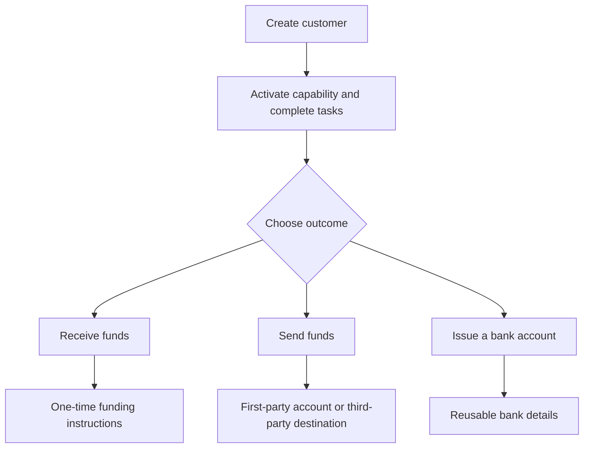

Start fra kundeutfallet. Hver flyt bruker samme onboarding-modell, og forgrener seg deretter til ulike kontoer og pengeflytting.

## Sammenlign flytene

| Utfall | Forbered først | Hva du får |
| --- | --- | --- |
| Pay-in | Klar pay-in-capability og utstedt destinasjonslommebok | Overføringsspesifikke instruksjoner og stablecoin-oppgjør |
| Payout | Klar payout-capability, finansiert utstedt lommebok, og klar konto eller destinasjon | En overføring til det valgte mottakerendepunktet |
| Utstedt bankkonto | Klar bank-capability og utstedt oppgjørslommebok | Gjenbrukbare bankopplysninger etter provisjonering |

En prisfestet pay-in oppretter instruksjoner for én overføring. En utstedt bankkonto oppretter gjenbrukbare opplysninger for senere innskudd. En payout starter fra midler som allerede er tilgjengelig i en utstedt lommebok.

## Velg flyten din

<CardGroup cols={3}>
  <Card title="Motta midler" icon="arrow-down-to-line" href="/no/integration/receive-funds">
    Opprett og følg opp en pay-in fra fiat til stablecoin.
  </Card>
  <Card title="Send midler" icon="arrow-up-from-line" href="/no/integration/send-funds">
    Bygg en førsteparts eller tredjeparts utbetaling.
  </Card>
  <Card title="Utsted en bankkonto" icon="building-columns" href="/no/integration/issue-bank-account">
    Sørg for gjenbrukbare bankopplysninger koblet til en lommebok.
  </Card>
</CardGroup>
