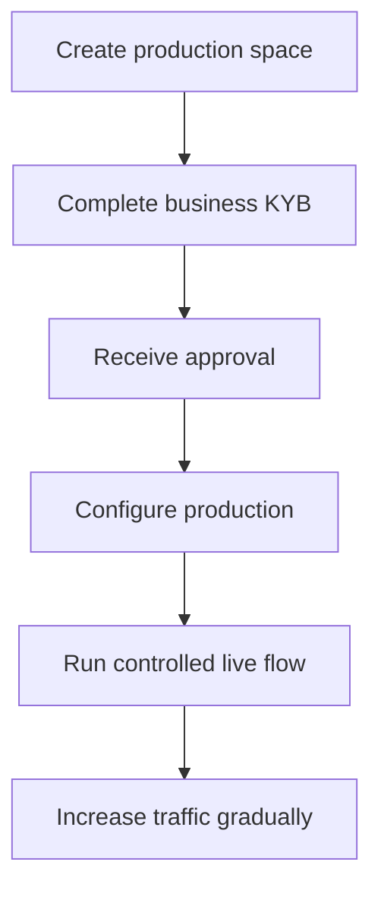

Produksjonsaktivering verifiserer den integrerende virksomheten din. Det er separat fra API-kundene du oppretter for produktet ditt.

## Aktiver produksjonsområdet ditt

1. Logg inn på Swipelux Dashboard og velg **Create a production space**.
2. Åpne KYB-fanen eller gå til [Business verification](https://www.swipelux.app/kyb).
3. Fyll ut hvert etterspurte felt og last opp de nødvendige dokumentene.
4. Send den integrerende virksomheten din inn til verifisering og vent på godkjenning.

Først etter at den integrerende virksomheten og produksjonsområdet er godkjent kan du opprette produksjons-API-kunder og -transaksjoner.

## Hold produksjon uavhengig

Opprett produksjonsressurser eksplisitt. Å bytte API-nøkkel migrerer ikke sandbox-tilstand.

- Oppbevar produksjonslegitimasjon i en separat oppføring hos hemmelighetshåndteringen.
- Bruk kun produksjonsspesifikk utrullingskonfigurasjon og ressurs-ID-er.
- Registrer et separat produksjons-webhook-endepunkt og signeringshemmelighet.
- Gjenskap de nødvendige kundene, capabilities, kontoene, mottakerne og destinasjonene i produksjon.
- Begrens produksjonstilgang til tjenestene og operatørene som trenger den.

Sandbox og produksjon bruker `https://platform.swipelux.com`; API-nøkkelen velger miljøet.

## Fullfør lanseringssjekklisten

- [ ] Test happy path og forventede feilstier i sandbox.
- [ ] Send en `Idempotency-Key` med hver skrive-operasjon som krever det, og behold den for trygge retries.
- [ ] Verifiser webhook-signaturer før parsing, persister hendelses-ID-er holdbart, og test avspilling.
- [ ] Håndter utilgjengelige capabilities, åpne oppgaver og endrede oppgaverevisjoner.
- [ ] Vis overføringsfeil og handlingsrettede instruksjoner for operatørene dine.
- [ ] Bekreft at loggene beholder `X-Request-Id` eller `correlationId` uten å eksponere hemmeligheter eller sensitiv finansiell data.

## Kjør én kontrollert live-flyt

Start med en kjent kunde og én transaksjon med lav verdi. Registrer:

| Kontroll | Definer før testen |
| --- | --- |
| Omfang | Kunde, capability, konto eller destinasjon, beløp og metode. |
| Forventet resultat | API-tilstand, saldo eller instruksjoner, og webhook-hendelsen du forventer å observere. |
| Eier | Person som er ansvarlig for å følge hele flyten. |
| Stoppvilkår | Enhver uventet tilstand, manglende webhook, feil beløp eller uløst oppgave. |

Verifiser både gjeldende API-ressurs og den autentiserte webhook-leveransen. Hvis noen av dem avviker fra forventet resultat, stopp og undersøk før du sender mer trafikk.

Etter at hele flyten lykkes, øk volumet gradvis mens du overvåker capability-, konto-, destinasjons- og overføringstilstander.

Gå tilbake til [Vanlige flyter](/no/integration/common-flows) for produktreisen, eller bruk [API-referansen](/no/api-reference/introduction) for nøyaktige kontrakter.
