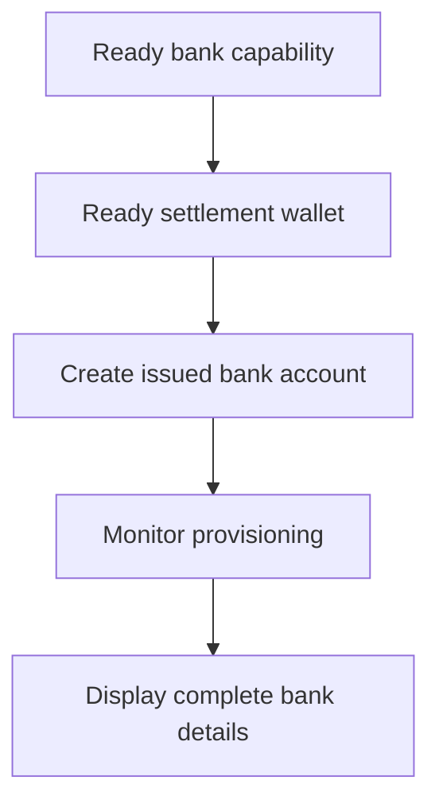

Bruk en utstedt bankkonto når kunden trenger gjenbrukbare bankopplysninger. For engangsinstruksjoner knyttet til et spesifikt beløp, bruk i stedet [Motta midler](/no/integration/receive-funds).



## Før du starter

Du trenger en kunde-ID, en klar bank-capability for tiltenkt metode og valuta, samt en klar utstedt lommebok eid av samme kunde. Fullfør åpent arbeid via [Capabilities og oppgaver](/no/integration/onboarding/capabilities-and-requirements).

## 1. Opprett eller velg oppgjørslommeboken

Opprett en utstedt lommebok via [Kontoer og lommebøker](/no/integration/accounts#create-the-account), og les den så på nytt. Fortsett kun når gjeldende status tillater oppgjør.

Lagre dens responsavledede `data.id` som `SETTLEMENT_WALLET_ID`. Ikke bruk en ekstern lommebok for `settlement.accountId`.

## 2. Opprett den utstedte bankkontoen

Bruk [`POST /v3/customers/{customerId}/accounts`](/api-reference/accounts/post-v3-customers-by-customer-id-accounts) med disse headerne:

```http
X-API-Key: ${SWIPELUX_API_KEY}
Idempotency-Key: issued-bank-account-001
Content-Type: application/json
```

Send denne forespørsel-body-en:

```json
{
  "origin": "issued",
  "type": "bank",
  "method": "ach",
  "country": "US",
  "currency": "USD",
  "settlement": {
    "accountId": "${SETTLEMENT_WALLET_ID}"
  },
  "label": "USD account"
}
```

Lagre den returnerte `data.id` som `BANK_ACCOUNT_ID`. Behold også `data.status`, `data.openTaskIds`, `data.details` og oppgjørsforholdet.

Bankkonto-ID-en og lommebok-ID-en har ulike roller. Les provisjonering og bankopplysninger via bankkonto-ID-en. Bruk oppgjørslommebok-ID-en til å identifisere hvor innskudd krediteres.

## 3. Overvåk provisjonering

Les [`GET /v3/customers/{customerId}/accounts/{accountId}`](/api-reference/accounts/get-v3-customers-by-customer-id-accounts-by-account-id) etter opprettelse og etter hver relevante webhook.

Hold kundegrensesnittet ventende mens `details` mangler. Hvis `openTaskIds` ikke er tom, fullfør de siste oppgavene og hent kontoen på nytt. Ikke slutt fra forløpt tid at kontoen er klar.

Hvis siste `statusReason.code` er `awaiting_assignment`, opprett den første pay-in-en for samme kunde, capability og oppgjørslommebok via [Motta midler](/no/integration/receive-funds), og les så bankkontoen på nytt. Følg denne grenen kun når gjeldende konto ber om det.

## 4. Presenter bankopplysninger trygt

Vis kun de komplette opplysningene returnert av siste kontolesning. Når `details.referenceRequired` er true, vis den nøyaktige `details.reference` og gjør den kopierbar. Når den er false, ikke oppfinn en referanse.

Disse bankopplysningene er gjenbrukbare. Ikke erstatt dem med finansieringskoordinater fra en prisfestet pay-in, som hører kun til den overføringen.

Deretter, legg til [Webhooks](/no/integration/webhooks) slik at provisjoneringsoppdateringer når applikasjonen din uten å måtte holde kunden på en pollingskjerm.
