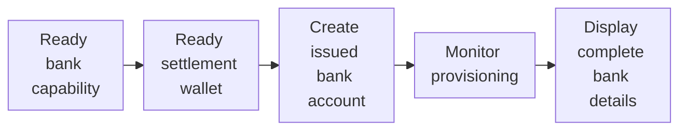

Bruk en utstedt bankkonto når kunden trenger gjenbrukbare bankopplysninger. For engangsinstruksjoner knyttet til et spesifikt beløp, bruk i stedet [Motta midler](/no/integration/receive-funds).


```mermaid
%%{init: {"flowchart": {"rankSpacing": 20, "nodeSpacing": 16, "wrappingWidth": 80, "padding": 8}}}%%
flowchart LR
  A["Ready bank capability"] --> B["Ready settlement wallet"]
  B --> C["Create issued bank account"]
  C --> D["Monitor provisioning"]
  D --> E["Display complete bank details"]
```

## Før du starter

Du trenger en kunde-ID, en klar bank-capability for tiltenkt metode og valuta, samt en klar utstedt lommebok eid av samme kunde. Med `allowPending` kan du lagre forespørselen mens den valgte banken fortsatt vurderer kunden. Fullfør åpent arbeid via [Capabilities og oppgaver](/no/integration/onboarding/capabilities-and-requirements).

## 1. Opprett eller velg oppgjørslommeboken

Opprett en utstedt lommebok via [Kontoer og lommebøker](/no/integration/accounts#create-the-account), og les den så på nytt. Fortsett kun når gjeldende status tillater oppgjør.

Lagre dens responsavledede `data.id` som `SETTLEMENT_WALLET_ID`. Ikke bruk en ekstern lommebok for `settlement.accountId`.

## 2. Opprett den utstedte bankkontoen

Bruk [`POST /v3/customers/{customerId}/accounts`](/api-reference/accounts/post-v3-customers-by-customer-id-accounts) med disse headerne:

```http
X-API-Key: ${SWIPELUX_API_KEY}
Idempotency-Key: issued-bank-account-001
Content-Type: application/json
```

Send denne forespørsel-body-en:

```json
{
  "origin": "issued",
  "type": "bank",
  "method": "ach",
  "country": "US",
  "currency": "USD",
  "settlement": {
    "accountId": "${SETTLEMENT_WALLET_ID}"
  },
  "label": "USD account"
}
```

Lagre den returnerte `data.id` som `BANK_ACCOUNT_ID`. Behold også `data.status`, `data.openTaskIds`, `data.details` og oppgjørsforholdet.

Valgfrie felt i forespørselen:

| Felt | Gjelder for | Virkemåte |
| --- | --- | --- |
| `institution` | Utstedte `ach`, `wire` og `swift` | Velger nøyaktig denne banken. Swipelux faller ikke tilbake til en annen bank. Bruk en institusjons-ID returnert av responsen for støttede capabilities. |
| `allowPending` | Utstedte `ach`, `wire` og `swift` | Sett til `true` for å lagre forespørselen mens søknaden hos den valgte banken venter på godkjenning. Krever `institution`. |
| `settlement.currency` | Utstedte bankkontoer | `USDC` eller `USDT`. Angir hvilken stablecoin som leveres til oppgjørslommeboken. |

### Velg banken {#choose-the-bank}

Send `institution` når kunden trenger bankopplysninger fra en bestemt bank. Swipelux reserverer én utstedt konto per kunde, metode, valuta og institusjon. En forespørsel uten `institution` returnerer `409 conflict` hvis kunden allerede har en utstedt konto for den metoden og valutaen i en hvilken som helst bank. En forespørsel med `institution` returnerer `409 conflict` kun hvis det allerede finnes en konto i den banken.

Kontolesninger returnerer den valgte banken som `institution` med `id`, `name` og `bic`. `bic` kan være `null`.

Idempotens gjelder for den valgte banken. Å spille av samme forespørsel på nytt returnerer den opprinnelige kontoen. Å endre `institution` under samme `Idempotency-Key` returnerer `409 idempotency_conflict`.

### Lagre forespørselen før bankens godkjenning {#save-the-request-before-bank-approval}

Som standard godtar Swipelux en forespørsel om utstedt bankkonto først når bank-capability-en er klar. For å samle inn kundens kontooppsett tidligere, send `allowPending: true` sammen med `institution`:

```json
{
  "origin": "issued",
  "type": "bank",
  "method": "wire",
  "country": "US",
  "currency": "USD",
  "institution": "${INSTITUTION_ID}",
  "allowPending": true,
  "settlement": {
    "accountId": "${SETTLEMENT_WALLET_ID}"
  },
  "label": "USD wire account"
}
```

Mens søknaden hos banken er under behandling, returnerer kontoen `status: "in_review"` med `statusReason.code` satt til `waiting_for_approval`. Responsen inkluderer også `applicationId` og søknadens `openTaskIds`. Fullfør disse oppgavene via [Capabilities og oppgaver](/no/integration/onboarding/capabilities-and-requirements).

Den lagrede forespørselen beholder konto-ID-en, oppgjørslommeboken og kontoplassen sin. Når søknaden og capability-en er klare, klargjør Swipelux bankopplysninger under samme `BANK_ACCOUNT_ID`. Fortsett å lese denne ID-en. Ikke opprett en ny forespørsel.

Hvis søknaden først blir avvist, kansellert eller arkivert, blir kontoen `rejected`. Den holder ikke lenger kontoplassen.

### Velg oppgjørsvaluta {#choose-the-settlement-currency}

Som standard gjøres innskudd opp i oppgjørslommebokens valuta. Sett `settlement.currency` til `USDC` eller `USDT` for å velge levert aktivum uavhengig av lommebokens valuta:

```json
{
  "settlement": {
    "accountId": "${SETTLEMENT_WALLET_ID}",
    "currency": "USDT"
  }
}
```

`USDT` krever en `USD`-konto og en oppgjørslommebok på et nettverk som støtter USDT-levering. Ellers returnerer forespørselen `400 invalid_settlement_target`. Kontolesninger returnerer det lagrede valget, også mens kontoen provisjoneres.

Bankkonto-ID-en og lommebok-ID-en har ulike roller. Les provisjonering og bankopplysninger via bankkonto-ID-en. Bruk oppgjørslommebok-ID-en til å identifisere hvor innskudd krediteres.

## 3. Overvåk provisjonering

Les [`GET /v3/customers/{customerId}/accounts/{accountId}`](/api-reference/accounts/get-v3-customers-by-customer-id-accounts-by-account-id) etter opprettelse og etter hver relevante webhook.

Hold kundegrensesnittet ventende mens `details` mangler. Hvis `openTaskIds` ikke er tom, fullfør de siste oppgavene og hent kontoen på nytt. Ikke slutt fra forløpt tid at kontoen er klar.

Hvis kontoen ble lagret med `allowPending: true`, forblir den `in_review` med `statusReason.code` satt til `waiting_for_approval` til banken godkjenner søknaden.

Hvis siste `statusReason.code` er `awaiting_assignment`, opprett den første pay-in-en for samme kunde, capability og oppgjørslommebok via [Motta midler](/no/integration/receive-funds), og les så bankkontoen på nytt. Følg denne grenen kun når gjeldende konto ber om det.

## 4. Presenter bankopplysninger trygt

Vis kun de komplette opplysningene returnert av siste kontolesning. Når `details.referenceRequired` er true, vis den nøyaktige `details.reference` og gjør den kopierbar. Når den er false, ikke oppfinn en referanse.

For utstedte `swift`-kontoer, vis `details.bankName`, `details.swiftCode` (mottakerbankens BIC), `details.accountNumber`, `details.accountHolderName` og `details.accountHolderAddress` når de returneres. Avsendere må kopiere mottakerens adresse nøyaktig inn i den internasjonale overføringen. Vis også `details.bankAddress` og eventuelle felt for mellombank som kontoen returnerer.

Disse bankopplysningene er gjenbrukbare. Ikke erstatt dem med finansieringskoordinater fra en prisfestet pay-in, som hører kun til den overføringen.

Deretter, legg til [Webhooks](/no/integration/webhooks) slik at provisjoneringsoppdateringer når applikasjonen din uten å måtte holde kunden på en pollingskjerm.
