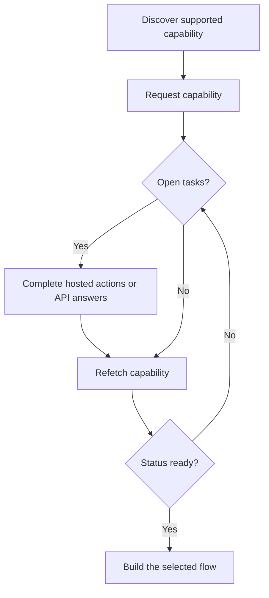

En capability forteller deg om en kunde kan bruke et bestemt utfall, betalingsmetode og retning. Åpne oppgaver forteller deg hva som må skje før capability-en eller en relatert ressurs kan gå videre.



```bash
export API_BASE='https://platform.swipelux.com'
export SWIPELUX_API_KEY='replace-with-your-api-key'
```

## Oppdag støttede capabilities

Les kundens gjeldende valg med [`GET /v3/customers/{customerId}/capabilities/supported`](/api-reference/capabilities/get-v3-customers-by-customer-id-capabilities-supported):

```bash
curl --request GET \
  "${API_BASE}/v3/customers/${CUSTOMER_ID}/capabilities/supported" \
  --header "X-API-Key: ${SWIPELUX_API_KEY}"
```

Velg en responsoppføring som samsvarer med tiltenkt `directions`, `method` og `accountType`. Fortsett kun når `availability` er `available` eller `beta` og `eligibility.eligible` er `true`. Hvis `institutions` returneres, velg kun én ID fra den responsen.

Lagre den valgte `data[].id` som `CAPABILITY_ID`. Kopier aldri en capability-ID fra en annen kunde eller et annet miljø.

### Pooled vs named kontotyper

Bankcapabilities finnes i to varianter, kodet som `accountType`-feltet og suffiks i capability-ID-en (for eksempel `ach_pooled`, `wire_named`):

- **`pooled`**: delt Swipelux-bankkonto. Hver pay-in bruker en unik referanse for å rute midler. Velg denne for engangsoverføringer.
- **`named`**: dedikerte bankopplysninger for kunden (virtuell IBAN, dedikert ACH-konto). Gjenbrukbare og delbare med hvilken som helst betaler. Kreves for [utstedte bankkontoer](/no/integration/issue-bank-account).

Bruk `pooled` som standard. Bruk `named` kun når kunden trenger gjenbrukbare bankopplysninger. Sjekk `supported`-responsen for hvilke varianter som er tilgjengelige.

## Be om capability-en

Be om det valgte alternativet med [`POST /v3/customers/{customerId}/capabilities/{capabilityId}`](/api-reference/capabilities/post-v3-customers-by-customer-id-capabilities-by-capability-id):

```bash
curl --request POST \
  "${API_BASE}/v3/customers/${CUSTOMER_ID}/capabilities/${CAPABILITY_ID}" \
  --header "X-API-Key: ${SWIPELUX_API_KEY}" \
  --header "Idempotency-Key: capability-request-001" \
  --header "Content-Type: application/json" \
  --data '{}'
```

Bruk en eksplisitt `institutions`-liste kun når du må velge fra ID-er returnert av responsen for støttede capabilities.

Lagre `data.status` som `CAPABILITY_STATUS`, `data.openTaskIds` som `OPEN_TASK_IDS`, og hver `data.applications[].id` i `APPLICATION_IDS`.

## Fullfør gjeldende oppgaver {#complete-current-tasks}

List oppgaver med [`GET /v3/customers/{customerId}/tasks`](/api-reference/tasks/list-customer-tasks), velg ID-er fra `OPEN_TASK_IDS`, og les så hver gjeldende oppgave med [`GET /v3/customers/{customerId}/tasks/{taskId}`](/api-reference/tasks/get-customer-task):

```bash
curl --request GET \
  "${API_BASE}/v3/customers/${CUSTOMER_ID}/tasks/${TASK_ID}" \
  --header "X-API-Key: ${SWIPELUX_API_KEY}"
```

Bruk siste `data.revision` og `data.requirements`. Hent oppgaven på nytt umiddelbart før innsending hvis noen av delene kan ha endret seg.

### Hostede handlinger

Når oppgaven returnerer `verificationSessions` eller `tosSessions`, lagre hver sesjons `id` og gjeldende `url`. Send kunden til den returnerte URL-en, og les så oppgaven på nytt. Dette er oppgaveavgrensede handlinger, ikke en separat livssyklus for kundeverifisering.

### Last opp dokumenter {#upload-documents}

Når et krav ber om et dokument, last det opp med [`POST /v3/customers/{customerId}/documents`](/api-reference/documents/post-v3-customers-by-customer-id-documents):

```bash
export DOCUMENT_PATH='/absolute/path/to/requested-document.pdf'

curl --request POST \
  "${API_BASE}/v3/customers/${CUSTOMER_ID}/documents" \
  --header "X-API-Key: ${SWIPELUX_API_KEY}" \
  --header "Idempotency-Key: customer-document-001" \
  --form "file=@${DOCUMENT_PATH}"
```

Lagre den returnerte `data.id` som `DOCUMENT_ID` før du sender inn svaret som refererer til den.

### API-svar

Send inn ett komplett svarsett for gjeldende revisjon med [`POST /v3/customers/{customerId}/tasks/{taskId}/submissions`](/api-reference/task-submissions/create-customer-task-submission):

```bash
curl --request POST \
  "${API_BASE}/v3/customers/${CUSTOMER_ID}/tasks/${TASK_ID}/submissions" \
  --header "X-API-Key: ${SWIPELUX_API_KEY}" \
  --header "Idempotency-Key: task-submission-001" \
  --header "Content-Type: application/json" \
  --data @- <<'JSON'
{
  "taskRevision": 3,
  "answers": [
    {
      "requirementId": "req_from_current_task",
      "answer": {
        "type": "text",
        "value": "Current answer"
      }
    }
  ]
}
JSON
```

Hent hver krav-ID og svar-type fra siste oppgave. Hvis API-et melder at oppgaven har endret seg, hent den på nytt og bygg innsendingen på nytt fra den nye revisjonen.

## Fortsett når capability-en er klar

Les capability-en på nytt med [`GET /v3/customers/{customerId}/capabilities/{capabilityId}`](/api-reference/capabilities/get-v3-customers-by-customer-id-capabilities-by-capability-id):

```bash
curl --request GET \
  "${API_BASE}/v3/customers/${CUSTOMER_ID}/capabilities/${CAPABILITY_ID}" \
  --header "X-API-Key: ${SWIPELUX_API_KEY}"
```

Erstatt den lagrede statusen og oppgave-ID-ene med siste respons. Fortsett kun når gjeldende capability-status tillater kontoen, tilbudet eller overføringen du har til hensikt å opprette.

Deretter, velg den samsvarende reisen i [Vanlige flyter](/no/integration/common-flows).
