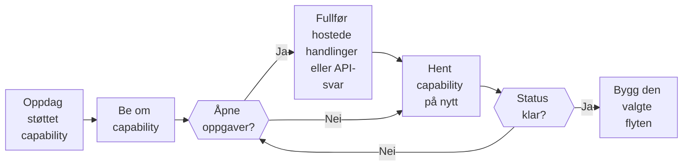

En capability forteller deg om en kunde kan bruke et bestemt utfall, betalingsmetode og retning. Åpne oppgaver forteller deg hva som må skje før capability-en eller en relatert ressurs kan gå videre.


```mermaid
%%{init: {"flowchart": {"rankSpacing": 20, "nodeSpacing": 16, "wrappingWidth": 80, "padding": 8}}}%%
flowchart LR
  A["Oppdag støttet capability"] --> B["Be om capability"]
  B --> C{{"Åpne oppgaver?"}}
  C -->|"Ja"| D["Fullfør hostede handlinger eller API-svar"]
  D --> E["Hent capability på nytt"]
  C -->|"Nei"| E
  E --> F{{"Status klar?"}}
  F -->|"Nei"| C
  F -->|"Ja"| G["Bygg den valgte flyten"]
```

```bash Environment variables
export API_BASE='https://platform.swipelux.com'
export SWIPELUX_API_KEY='replace-with-your-api-key'
```

## Oppdag støttede capabilities

Les kundens gjeldende valg med [`GET /v3/customers/{customerId}/capabilities/supported`](/api-reference/capabilities/get-v3-customers-by-customer-id-capabilities-supported):

```bash List supported capabilities
curl --request GET \
  "${API_BASE}/v3/customers/${CUSTOMER_ID}/capabilities/supported" \
  --header "X-API-Key: ${SWIPELUX_API_KEY}"
```

Velg en responsoppføring som samsvarer med tiltenkt `directions`, `method` og `accountType`. Fortsett kun når `availability` er `available` eller `beta` og `eligibility.eligible` er `true`. Hvis `institutions` returneres, velg kun én ID fra den responsen.

Hver institusjonsoppføring inneholder en `logoUrl` og et `isDefault`-flagg. Bruk `logoUrl` til å vise bankens logo i et grensesnitt for bankvalg, og vis ditt eget generiske bankikon når den er `null`. `isDefault` gjelder kun for denne kunden og capability-en, ikke for institusjonen globalt. [`GET /v3/institutions`](/api-reference/institutions/get-v3-institutions) returnerer den samme `logoUrl`, som kan være null. Institusjons-ID-er er ugjennomsiktige, så håndter nye ID-er uten kodeendringer.

```json Institution entry
{
  "institutions": [
    {
      "id": "jpmorgan",
      "name": "JPMorgan Chase",
      "bic": "CHASUS33",
      "logoUrl": "https://wallet.swipelux.com/bank-logos/jpmorgan.png",
      "countries": ["US"],
      "isDefault": true
    }
  ]
}
```

Lagre den valgte `data[].id` som `CAPABILITY_ID`. Kopier aldri en capability-ID fra en annen kunde eller et annet miljø.

### Pooled vs named kontotyper

Bankcapabilities finnes i to varianter, kodet som `accountType`-feltet og suffiks i capability-ID-en (for eksempel `ach_pooled`, `wire_named`):

- **`pooled`**: delt Swipelux-bankkonto. Hver pay-in bruker en unik referanse for å rute midler. Velg denne for engangsoverføringer.
- **`named`**: dedikerte bankopplysninger for kunden (virtuell IBAN, dedikert ACH-konto). Gjenbrukbare og delbare med hvilken som helst betaler. Kreves for [utstedte bankkontoer](/no/integration/issue-bank-account).

Bruk `pooled` som standard. Bruk `named` kun når kunden trenger gjenbrukbare bankopplysninger. Sjekk `supported`-responsen for hvilke varianter som er tilgjengelige.

Bruk `swift_named` for å motta SWIFT-innskudd eller utstede SWIFT-bankopplysninger. `swift_pooled` støtter kun utbetalinger, så sjekk `directions` for hvert alternativ i responsen for støttede capabilities. En named SWIFT-konto returnerer gjenbrukbare mottaksopplysninger, inkludert bankens BIC, en referanse når det kreves, og mottakerens adresse når banken oppgir den.

For utstedte ACH-, Wire- og SWIFT-kontoer kan du velge en bestemt bank med `institution` og lagre kontoforespørselen før banken godkjenner kunden. Se [Utsted en bankkonto](/no/integration/issue-bank-account#choose-the-bank).

## Be om capability-en

Be om det valgte alternativet med [`POST /v3/customers/{customerId}/capabilities/{capabilityId}`](/api-reference/capabilities/post-v3-customers-by-customer-id-capabilities-by-capability-id):

```bash Request capability
curl --request POST \
  "${API_BASE}/v3/customers/${CUSTOMER_ID}/capabilities/${CAPABILITY_ID}" \
  --header "X-API-Key: ${SWIPELUX_API_KEY}" \
  --header "Idempotency-Key: capability-request-001" \
  --header "Content-Type: application/json" \
  --data '{}'
```

Bruk en eksplisitt `institutions`-liste kun når du må velge fra ID-er returnert av responsen for støttede capabilities.

Lagre `data.status` som `CAPABILITY_STATUS`, `data.accountProvisioning` som `ACCOUNT_PROVISIONING_STATUS`, `data.openTaskIds` som `OPEN_TASK_IDS`, og hver `data.applications[].id` i `APPLICATION_IDS`.

### Delte søknader per bank {#shared-applications-per-bank}

For named bankcapabilities har hver kunde én søknadssak per bank. Pooled- og plattform-capabilities bruker saker uten bank. Swipelux deler en sak på tvers av alle kompatible capabilities du ber om:

- Én godkjenning kan dekke flere capabilities. For eksempel kan en godkjent sak hos én bank gjøre både en ACH- og en wire-capability `ready`.
- En senere forespørsel som samsvarer med en eksisterende sak, gjenbruker den. Swipelux åpner ingen ny søknad og legger ikke til dupliserte oppgaver.
- Saker hos forskjellige banker er uavhengige. Et avslag hos én bank påvirker ikke en sak hos en annen bank.

Responsen på forespørselen forteller deg hvilken sak Swipelux brukte:

- `201` betyr at forespørselen åpnet en ny søknadssak.
- `200` betyr at forespørselen ble løst til en søknadssak kunden allerede hadde, for eksempel en gjentatt forespørsel om en bankcapability kunden allerede har, eller en forespørsel om en kansellert capability. En gjentatt forespørsel om `card` eller `stablecoin_transfers` returnerer fortsatt [`409 capability_already_exists`](/integration/errors#capability-already-exists).
- `selectedApplicationId` er et felt på toppnivå ved siden av `data` med ID-en til saken som forespørselen valgte eller åpnet. Swipelux utelater feltet når forespørselen ikke valgte noen sak. En idempotent gjentakelse returnerer samme verdi.

Forkortet respons:

```json Response (abbreviated)
{
  "data": {
    "id": "ach_named",
    "status": "pending",
    "openTaskIds": ["tsk_000000000000000002"],
    "applications": [{ "id": "apl_000000000000000005", "status": "in_review" }]
  },
  "selectedApplicationId": "apl_000000000000000005"
}
```

For named capabilities sender du den samme `institutions`-listen på nytt for å velge den samme saken, eller én institusjons-ID for å målrette den banken. En bank som endelig har avslått kunden, hoppes over. Når du bare angir den banken, eller alle kvalifiserte banker har avslått kunden, returnerer forespørselen [`409 capability_terminally_rejected`](/integration/errors#capability-terminally-rejected). For å prøve en annen bank etter et avslag, be om capability-en på nytt med den bankens institusjons-ID.

Statusen til en capability gjenspeiler alle kundens relaterte saker. For en named capability er én `ready`-sak med en godkjenning som dekker den, nok til å gjøre den `ready`, uansett hva andre banker rapporterer. En pooled capability venter også på metodesjekken sin, som rapporteres i `probes` i kundens søknadsliste.

#### List kundens søknader {#list-the-customers-applications}

List alle søknadssaker for kunden med [`GET /v3/customers/{customerId}/applications`](/api-reference/capabilities/get-v3-customers-by-customer-id-applications). Resultatene pagineres med `nextCursor` og `hasMore`, og godtar `updatedAfter`:

```bash List applications
curl --request GET \
  "${API_BASE}/v3/customers/${CUSTOMER_ID}/applications" \
  --header "X-API-Key: ${SWIPELUX_API_KEY}"
```

Hver oppføring inneholder søknadsfeltene som returneres i en capabilitys `applications[]`, samt:

- `scope`: `named` for en sak hos én bank, `provider_pooled` eller `platform` for saker uten bank, eller `null` for en uklassifisert historisk sak. `institution` er fraværende for `provider_pooled`- og `platform`-saker.
- `requestedScope[]`: capability-nøklene som er forespurt mot saken, hver med sin første `requestedAt`. Oppføringer fjernes aldri.
- `coverage[]`: capability-nøklene som sakens godkjenning dekker, hver med `grantedAt` og `source`. Dekningen registrerer omfang, ikke autorisasjon. Les capability-en for å se gjeldende status.
- `probes[]`: metodesjekker for de pooled capability-nøklene saken dekker, hver med `capabilityKey`, `status` og `reason`. Named nøkler krever aldri en probe.
- `generation`, `predecessorApplicationId` og `supersededByApplicationId`: etterfølgerlenker. Når `supersededByApplicationId` er satt, er saken erstattet. Følg den ID-en til den gjeldende saken. En capabilitys `applications[]` viser bare gjeldende saker, så en erstattet sak vises bare i denne listen.

Forkortet respons:

```json Response (abbreviated)
{
  "data": [
    {
      "id": "apl_000000000000000005",
      "status": "ready",
      "scope": "named",
      "institution": { "id": "jpmorgan", "name": "JPMorgan Chase", "bic": "CHASUS33" },
      "requestedScope": [
        { "capabilityKey": "ach_named", "requestedAt": "2026-09-20T10:00:00.000Z" }
      ],
      "coverage": [
        { "capabilityKey": "ach_named", "grantedAt": "2026-09-22T12:00:00.000Z", "source": "approval" },
        { "capabilityKey": "wire_named", "grantedAt": "2026-09-22T12:00:00.000Z", "source": "approval" }
      ],
      "probes": [],
      "generation": 1,
      "predecessorApplicationId": null,
      "supersededByApplicationId": null
    }
  ],
  "nextCursor": null,
  "hasMore": false
}
```

## Fullfør gjeldende oppgaver {#complete-current-tasks}

List oppgaver med [`GET /v3/customers/{customerId}/tasks`](/api-reference/tasks/list-customer-tasks), velg ID-er fra `OPEN_TASK_IDS`, og les så hver gjeldende oppgave med [`GET /v3/customers/{customerId}/tasks/{taskId}`](/api-reference/tasks/get-customer-task):

```bash List open tasks
curl --request GET \
  "${API_BASE}/v3/customers/${CUSTOMER_ID}/tasks/${TASK_ID}" \
  --header "X-API-Key: ${SWIPELUX_API_KEY}"
```

Bruk siste `data.revision` og `data.requirements`. Hent oppgaven på nytt umiddelbart før innsending hvis noen av delene kan ha endret seg.

### Gjenbrukte profilbevis {#reused-profile-evidence}

For intake-oppgaver for søknader som godtar direkte innsending via API, gjenbruker Swipelux informasjon kunden allerede har oppgitt. Når en slik oppgave opprettes eller avstemmes, sjekker Swipelux kundeprofilen og kundens egne opplastede dokumenter. Kvalifiserte krav som allerede støttes av en brukbar profilverdi eller et dokument, flyttes til `in_review` i stedet for å forbli handlingsklare. Profiloppdateringer og nye dokumentopplastinger utløser den samme sjekken for eksisterende oppgaver.

Kun manglende eller inkompatible verdier forblir handlingsklare. Gjenbruk godkjenner ikke beviset. Swipelux gjennomgår det fortsatt. Eksplisitte forespørsler om korrigering og krav som allerede er besvart, forblir handlingsklare. Dokumenter for eiere og nærstående parter gjenbrukes ikke, og krav som kun samles inn gjennom en hosted sesjon, følger sin vanlige flyt.

### Gjengi krav {#render-requirements}

Bygg skjemaer fra metadataene hvert krav returnerer, ikke fra kravnøkler. Et krav kan inneholde en valgfri kort `title`, og hver `request` inneholder en `prompt` som skal vises under overskriften.

Krav med `request.type: "profile"` identifiserer profilfeltet med `profilePointer` og legger til metadata for inndata:

- `allowedValues`: de tillatte verdiene for et skalarfelt, eller for hvert element i et array-felt. Send inn disse verdiene, ikke oversatte visningsetiketter.
- `valueSchema`: et selvstendig JSON Schema Draft 7-dokument som beskriver formen på inndataene, nestede egenskaper, påkrevde felt og strukturelle begrensninger. Enums på objekter vises på den aktuelle egenskapen, for eksempel `valueSchema.items.properties.type.enum` for skatteidentifikatorer. Swipelux utfører fortsatt validering på tvers av felt og ved gjennomgang etter innsending, så en verdi som består skjemaet, kan likevel bli avvist.
- `valueType: "country"`, eller `itemValueType: "country"` for arrays: feltet tar ISO 3166-1 alpha-2-koder med store bokstaver. Nestede landegenskaper i `valueSchema` bruker `format: "iso-3166-1-alpha-2"`. Bruk en standard landliste for lokaliserte etiketter.

```json Requirement
{
  "id": "req_000000000000000010",
  "key": "account_purposes",
  "title": "Account purpose",
  "status": "action_required",
  "request": {
    "type": "profile",
    "prompt": "Select every purpose that applies.",
    "required": true,
    "profilePointer": "/financialProfile/accountPurposes",
    "valueType": "array",
    "itemValueType": "string",
    "allowedValues": ["business_expenses", "ecommerce", "payroll"],
    "valueSchema": {
      "$schema": "http://json-schema.org/draft-07/schema#",
      "type": "array",
      "items": { "enum": ["business_expenses", "ecommerce", "payroll"] }
    }
  }
}
```

Dette eksempelet forkorter verdikatalogen. API-et returnerer alle tillatte verdier. Noen profilkrav har ikke noe publisert skjema og utelater `valueSchema` og `allowedValues`. Gjengi disse fra `prompt` og `valueType`.

Hver åpen oppgave inneholder et `dueAt`-tidsstempel. Når Swipelux oppretter en oppgave uten en eksplisitt forfallsdato, settes `dueAt` som standard til nøyaktig 31 dager etter oppgavens `createdAt`. Behandle `dueAt` som informativt: du kan ikke sette det via API-et, og det utløser ingen automatisk livssyklusovergang. Bare det separate feltet `deadline` forårsaker en automatisk overgang når det er satt.

### Hostede handlinger {#hosted-actions}

I svaret med oppgavedetaljer inneholder hver oppføring i `verificationSessions` og `tosSessions` et `action`-objekt. Svar med oppgavelister inneholder ikke disse handlingslenkene. Lagre `id` for hver sesjon, og les deretter `action.kind` før du sender kunden videre. Ikke utled tilgjengeligheten av lenken fra sesjonens `status`.

- `action.kind: "available"` inkluderer `action.url` og `action.expiresAt` (for øyeblikket alltid `null`). Lagre `action.url`, send kunden dit, og les deretter oppgaven på nytt. Feltene `url` og `expiresAt` på sesjonsnivå inneholder de samme verdiene.
- `action.kind: "unavailable"` betyr at ingen lenke skal vises. Feltene `url` og `expiresAt` på sesjonsnivå er fraværende. Sesjonens `status` alene avgjør ikke hvilken handlingstype du mottar.

```json Verification session
{
  "data": {
    "verificationSessions": [
      {
        "id": "vfy_000000000000000003",
        "key": "identity_verification",
        "type": "identity_verification",
        "status": "action_required",
        "action": {
          "kind": "available",
          "url": "https://platform.swipelux.com/kyc/redirect/cus_000000000000000001/tsk_000000000000000002/vfy_000000000000000003",
          "expiresAt": null
        },
        "url": "https://platform.swipelux.com/kyc/redirect/cus_000000000000000001/tsk_000000000000000002/vfy_000000000000000003",
        "expiresAt": null
      }
    ],
    "tosSessions": [
      {
        "id": "vfy_000000000000000004",
        "key": "terms_of_service",
        "type": "terms_of_service",
        "status": "completed",
        "action": { "kind": "unavailable" }
      }
    ]
  }
}
```

Dette er oppgaveavgrensede handlinger, ikke en separat livssyklus for kundeverifisering.

Et hostet svar på et profilkrav for en strukturert verdi, for eksempel en adresse eller skatteidentifikatorer, må bestå de samme skjema- og begrensningskontrollene som et direkte svar. Hvis det ikke gjør det, forblir kravet åpent. Et krav som Swipelux returnerer til `action_required` av denne grunnen, har `reviewFeedback.code: hosted_profile_direct_submission_required`. Samle inn verdien fra kunden og send den inn som et [API-svar](#api-answers).

### Last opp dokumenter {#upload-documents}

Når et krav ber om et dokument, last det opp med [`POST /v3/customers/{customerId}/documents`](/api-reference/documents/post-v3-customers-by-customer-id-documents):

```bash Upload document
export DOCUMENT_PATH='/absolute/path/to/requested-document.pdf'

curl --request POST \
  "${API_BASE}/v3/customers/${CUSTOMER_ID}/documents" \
  --header "X-API-Key: ${SWIPELUX_API_KEY}" \
  --header "Idempotency-Key: customer-document-001" \
  --form "file=@${DOCUMENT_PATH}"
```

Lagre den returnerte `data.id` som `DOCUMENT_ID` før du sender inn svaret som refererer til den.

For å hente en lagret fil senere, kall [`GET /v3/customers/{customerId}/documents/{documentId}/download`](/api-reference/documents/get-v3-customers-by-customer-id-documents-by-document-id-download). Swipelux returnerer en `url` som laster ned filen som et vedlegg og utløper etter én time. Arkiverte dokumenter returnerer `404`.

### API-svar {#api-answers}

Send inn ett komplett svarsett for gjeldende revisjon med [`POST /v3/customers/{customerId}/tasks/{taskId}/submissions`](/api-reference/task-submissions/create-customer-task-submission):

```bash Submit task answers
curl --request POST \
  "${API_BASE}/v3/customers/${CUSTOMER_ID}/tasks/${TASK_ID}/submissions" \
  --header "X-API-Key: ${SWIPELUX_API_KEY}" \
  --header "Idempotency-Key: task-submission-001" \
  --header "Content-Type: application/json" \
  --data @- <<'JSON'
{
  "taskRevision": 3,
  "answers": [
    {
      "requirementId": "req_from_current_task",
      "answer": {
        "type": "text",
        "value": "Current answer"
      }
    }
  ]
}
JSON
```

Hent hver krav-ID og svar-type fra siste oppgave. Hvis API-et melder at oppgaven har endret seg, hent den på nytt og bygg innsendingen på nytt fra den nye revisjonen.

### UBO-forutsetning for virksomheter {#beneficial-owner-prerequisite-for-businesses}

Å be om en virksomhets-capability som trenger UBO-bevis lykkes selv når kunden ennå ikke har en kvalifiserende eier. Capability-en opprettes som `restricted` med `statusReason.code: tasks_due`, og intake-oppgaven for virksomheten ber om de manglende eierskapsfaktaene, inkludert eierskapsstrukturen.

Den samme oppgaven inneholder et `resource_reference`-krav der forespørselen inkluderer `qualification: "beneficial_owner"`:

```json Beneficial owner requirement
{
  "type": "resource_reference",
  "prompt": "Add or select a qualifying beneficial owner.",
  "required": true,
  "resourceType": "related_party",
  "qualification": "beneficial_owner"
}
```

En nærstående part kvalifiserer når den er en aktiv `person`-part hos samme kunde med en oppgitt eierandel på minst 25, eller med `ownership.declared: true` uten oppgitt eierandel.

Kravet utledes fra den gjeldende listen over nærstående parter, så du svarer vanligvis ikke på det direkte:

- Å opprette eller oppdatere en kvalifiserende nærstående part oppfyller kravet i samme reevaluering og åpner den eierens eget profil- og dokumentarbeid. Se [Legg til nærstående parter for virksomheten](/no/integration/onboarding/customers#add-business-related-parties).
- Du kan også referere til en kvalifiserende part eksplisitt med et `resource_reference`-svar som inneholder dens `relatedPartyId`.
- Kravet forblir oppført i den gjeldende oppgaven etter at det er oppfylt. Når ingen annen forpliktelse gjenstår som åpen, blir oppgaven `satisfied`.
- Å arkivere den siste kvalifiserende parten, eller fjerne faktaene som kvalifiserte den, gjenåpner kravet, selv etter at oppgaven var `satisfied`.

## Fortsett når capability-en er klar {#continue-when-the-capability-is-ready}

Les capability-en på nytt med [`GET /v3/customers/{customerId}/capabilities/{capabilityId}`](/api-reference/capabilities/get-v3-customers-by-customer-id-capabilities-by-capability-id):

```bash Refetch capability
curl --request GET \
  "${API_BASE}/v3/customers/${CUSTOMER_ID}/capabilities/${CAPABILITY_ID}" \
  --header "X-API-Key: ${SWIPELUX_API_KEY}"
```

Erstatt den lagrede statusen, kontoutstedelsesstatusen og oppgave-ID-ene med siste respons. Capability-ens `status` viser om rettigheten er godkjent. For en capability som utsteder en konto, rapporterer `accountProvisioning` separat om den kontoen er `not_started`, `in_progress`, `issued` eller `failed`; en capability som ikke utsteder en konto, returnerer `not_applicable`.

Mens capability-en er `pending`, viser to av `statusReason.code`-verdiene den kan rapportere om en gjennomgang pågår. `preparing_submission` betyr at Swipelux fortsatt forbereder en søknad for innsending og at ingen gjennomgang pågår, selv om en annen banks søknad er `rejected` eller trenger oppmerksomhet. `review_in_progress` betyr at en gjennomgang pågår, for eksempel mens en søknad er `in_review` eller en [hostet verifisering](#hosted-actions) er åpen. Begge bruker `resolution: wait`. En endring mellom disse kodene beholder statusen `pending`, så det sendes ingen `capability.status_changed`-hendelse. Les capability-en for å se gjeldende kode.

Fortsett kun når gjeldende capability-status tillater kontoen, tilbudet eller overføringen du har til hensikt å opprette. Når flyten trenger en utstedt konto, vent også til `accountProvisioning` blir `issued`.

Deretter, velg den samsvarende reisen i [Vanlige flyter](/no/integration/common-flows).
