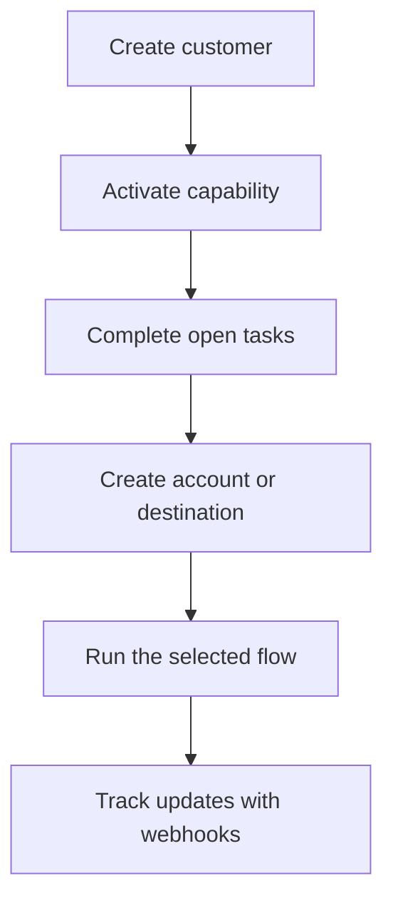

Swipelux gir backend-en din byggeklossene til å onboarde kunder og flytte penger uten å eksponere betalingsinfrastruktur i produktet ditt.

## Hva du kan bygge

<CardGroup cols={3}>
  <Card title="Motta midler" icon="arrow-down-to-line" href="/no/integration/receive-funds">
    Opprett engangsinstruksjoner for fiat-finansiering og gjør opp stablecoin til en lommebok.
  </Card>
  <Card title="Send midler" icon="arrow-up-from-line" href="/no/integration/send-funds">
    Send fra en kundelommebok til en førsteparts konto eller en tredjepartsdestinasjon.
  </Card>
  <Card title="Utsted en bankkonto" icon="building-columns" href="/no/integration/issue-bank-account">
    Sørg for gjenbrukbare bankopplysninger koblet til en oppgjørslommebok.
  </Card>
</CardGroup>

## Slik fungerer en integrasjon

En kunde er den enkeltpersonen eller virksomheten som eier flyten. Capabilities beskriver hvilke utfall den kunden kan bruke. Åpne oppgaver forteller deg hva som må fullføres før capability-en eller ressursen kan gå videre.

## Se det i praksis

Utforsk [demo.swipelux.com](https://demo.swipelux.com) for å prøve en simulert neobank-opplevelse. Du kan også [klone startpakken](https://github.com/swipelux/neobank-starter) og tilpasse produktgrensesnittet.

Demoen og startpakken er produkt- og UI-referanser. De erstatter ikke disse veiledningene eller gjeldende API-kontrakt.

## Start å bygge

<CardGroup cols={3}>
  <Card title="Hurtigstart" icon="rocket" href="/no/integration/quickstart">
    Opprett en kunde og kjør én sandbox-flyt.
  </Card>
  <Card title="Vanlige flyter" icon="route" href="/no/integration/common-flows">
    Sammenlign oppsettet som kreves for hvert utfall.
  </Card>
  <Card title="API-referanse" icon="code" href="/no/api-reference/introduction">
    Les forespørselskonvensjoner og inspiser hver API-operasjon.
  </Card>
</CardGroup>
