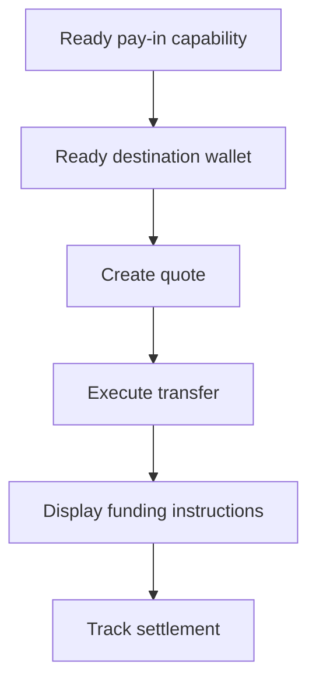

Bruk en prisfestet pay-in når kunden må finansiere et spesifikt beløp. Overføringen gjør opp stablecoin til en utstedt lommebok.



## Før du starter

Du trenger en klar pay-in-capability og en klar utstedt destinasjonslommebok for samme kunde. Fullfør eventuelt åpent arbeid via [Capabilities og oppgaver](/no/integration/onboarding/capabilities-and-requirements), og hent så begge ressursene på nytt.

## 1. Opprett et tilbud

Opprett prisen med [`POST /v3/quotes`](/api-reference/money-movement/post-v3-quotes). Send disse headerne:

```http
X-API-Key: ${SWIPELUX_API_KEY}
Idempotency-Key: payin-quote-001
Content-Type: application/json
```

```json
{
  "customerId": "${CUSTOMER_ID}",
  "capabilityId": "${CAPABILITY_ID}",
  "externalId": "payin-order-123",
  "in": {
    "amount": "150.00",
    "currency": "USD"
  },
  "destinationId": "${SETTLEMENT_WALLET_ID}",
  "out": {
    "currency": "USDC"
  }
}
```

Lagre `data.id` som `QUOTE_ID`. Presenter de returnerte beløpene og gebyrene fremfor å bygge dem opp på nytt fra kursen.

## 2. Utfør tilbudet

Utfør det gjeldende tilbudet før utløp med [`POST /v3/transfers`](/api-reference/money-movement/post-v3-transfers). Bruk en ny nøkkel for denne tiltenkte overføringen:

```http
X-API-Key: ${SWIPELUX_API_KEY}
Idempotency-Key: payin-transfer-001
Content-Type: application/json
```

```json
{
  "quoteId": "${QUOTE_ID}"
}
```

Lagre overføringens `data.id` som `TRANSFER_ID` og behold gjeldende tilstand.

## 3. Hent finansieringsinstruksjoner

Les [`GET /v3/transfers/{transferId}/instructions`](/api-reference/money-movement/get-v3-transfers-by-transfer-id-instructions). Render den returnerte `data.instructions`-varianten uten å anta typen.

Disse opplysningene er overføringsspesifikke. Gjenbruk aldri en overførings bankkoordinater, kode, hosted URL, beløp, referanse eller utløp for en annen pay-in.

For bankinstruksjoner: når `reference.required` er true, vis den nøyaktige `reference.value` ved siden av bankkoordinatene og gjør den kopierbar. Vis det returnerte beløpet og valutaen fra samme instruksjonssett.

Bankinstruksjoner kan også inneholde de valgfrie feltene `bankName`, `bankAddress`, `accountHolderName` og `accountHolderAddress` for metodene `ach`, `wire`, `rtp` og `swift`. Vis hvert returnerte felt ved siden av de andre bankkoordinatene. Avsenderbanker krever ofte mottakerbankens adresse for `swift` og andre internasjonale overføringer, så vis `bankAddress` hver gang det returneres.

```json
{
  "type": "bank",
  "method": "swift",
  "amount": { "amount": "150.00", "currency": "USD" },
  "accountHolderName": "Swipelux FBO Customer",
  "accountHolderAddress": "8 The Green, Dover, DE",
  "bankName": "JPMorgan Chase",
  "bankAddress": "383 Madison Avenue, New York, NY",
  "details": {
    "swiftCode": "CHASUS33",
    "accountNumber": "123456789"
  },
  "reference": { "value": "SWIFTMEMO1", "required": true }
}
```

En utstedt bankkonto er noe annet: den gir gjenbrukbare opplysninger for senere innskudd. Se [Utsted en bankkonto](/no/integration/issue-bank-account) når det er den tiltenkte opplevelsen.

## 4. Følg opp oppgjøret

Les [`GET /v3/transfers/{transferId}`](/api-reference/money-movement/get-v3-transfers-by-transfer-id) etter utførelse og etter hver hendelse. Driv den kundevendte statusen fra siste `data.state`.

Bruk `data.stateDetail` og `data.openTaskIds` når overføringen trenger en ny handling. Ikke merk den som fullført ut fra en forventet plan.

Deretter, legg til [Webhooks](/no/integration/webhooks) og hold overføringsstatusen synkronisert til den når et utfall som produktet ditt håndterer.
