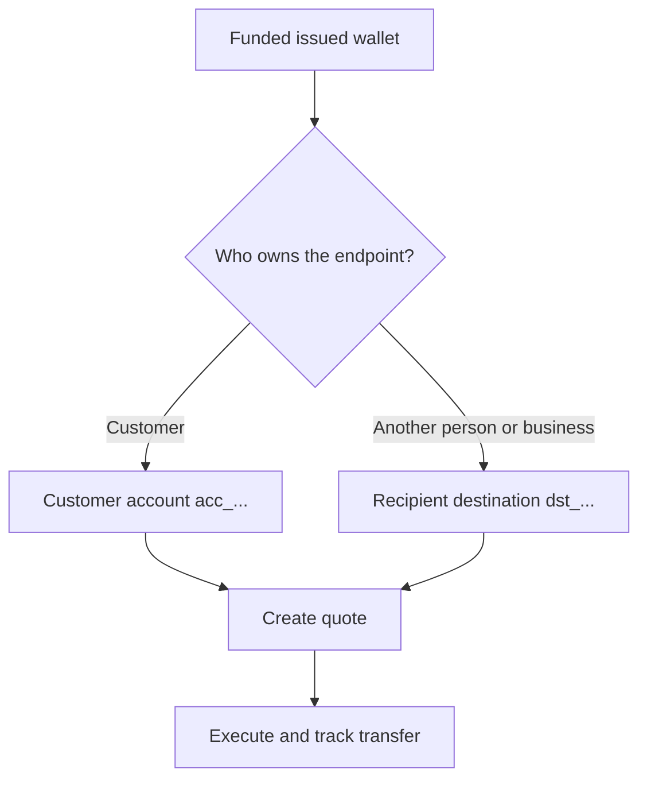

Hver payout starter fra en klar, finansiert utstedt lommebok. Destinasjonsmodellen avhenger av hvem som eier endepunktet.



## Før du starter

Hent kildelommeboken på nytt. Bekreft at gjeldende status tillater payout-en og at tilgjengelig saldo dekker det tiltenkte kildebeløpet. Lagre dens responsavledede ID som `SOURCE_WALLET_ID`.

Du trenger også en klar payout-capability for gjeldende kunde og valgt destinasjon.

## 1. Klargjør destinasjonen

<Tabs>
  <Tab title="Førsteparts">

Bruk en kundeeid ekstern bankkonto når kunden eier endepunktet. Opprett den med [`POST /v3/customers/{customerId}/accounts`](/api-reference/accounts/post-v3-customers-by-customer-id-accounts) og disse headerne:

```http
X-API-Key: ${SWIPELUX_API_KEY}
Idempotency-Key: payout-account-001
Content-Type: application/json
```

```json
{
  "origin": "external",
  "type": "bank",
  "methods": ["ach", "wire"],
  "country": "US",
  "currency": "USD",
  "details": {
    "routingNumber": "021000021",
    "accountNumber": "123456789",
    "accountType": "checking",
    "bankName": "Example Bank",
    "accountHolderName": "Acme Payments SAS"
  },
  "label": "Customer operating account"
}
```

Les den med [`GET /v3/customers/{customerId}/accounts/{accountId}`](/api-reference/accounts/get-v3-customers-by-customer-id-accounts-by-account-id). Fortsett kun når gjeldende status tillater payout-en. Lagre `acc_`-ID-en som `PAYOUT_DESTINATION_ID`.

  </Tab>
  <Tab title="Tredjeparts">

Opprett personen eller virksomheten og deres bank- eller lommebok-endepunkt via [Mottakere og destinasjoner](/no/integration/recipients). Fortsett kun når destinasjonen er klar.

Lagre den returnerte `dst_`-ID-en som `PAYOUT_DESTINATION_ID`. Ikke bruk mottakerens `rcp_`-ID som tilbudsdestinasjon.

  </Tab>
</Tabs>

## 2. Opprett payout-tilbudet

Bruk [`POST /v3/quotes`](/api-reference/money-movement/post-v3-quotes) med disse headerne:

```http
X-API-Key: ${SWIPELUX_API_KEY}
Idempotency-Key: payout-quote-001
Content-Type: application/json
```

```json
{
  "customerId": "${CUSTOMER_ID}",
  "capabilityId": "${CAPABILITY_ID}",
  "in": {
    "amount": "150.00",
    "currency": "USDC",
    "accountId": "${SOURCE_WALLET_ID}"
  },
  "destinationId": "${PAYOUT_DESTINATION_ID}",
  "out": {
    "currency": "USD"
  }
}
```

Lagre `data.id` som `QUOTE_ID` og presenter den returnerte prisen og gebyrene.

## 3. Utfør payout-en

Opprett overføringen med [`POST /v3/transfers`](/api-reference/money-movement/post-v3-transfers). Bruk én ny nøkkel for denne tiltenkte utførelsen:

```http
X-API-Key: ${SWIPELUX_API_KEY}
Idempotency-Key: payout-transfer-001
Content-Type: application/json
```

```json
{
  "quoteId": "${QUOTE_ID}"
}
```

Lagre overføringens `data.id` som `TRANSFER_ID`. En vellykket opprettelse starter payout-en; den beviser ikke levering.

## 4. Følg opp levering

Les [`GET /v3/transfers/{transferId}`](/api-reference/money-movement/get-v3-transfers-by-transfer-id) etter opprettelse og etter hver hendelse. Bruk siste `data.state`, `data.stateDetail` og `data.openTaskIds` for å avgjøre om du skal vente, handle eller vise et terminalt utfall.

Deretter, gå gjennom [Tilbud og overføringer](/no/integration/quotes-and-transfers) for nøyaktige beløp, trygg utførelsesgjenoppretting og overføringsoppgaver.
