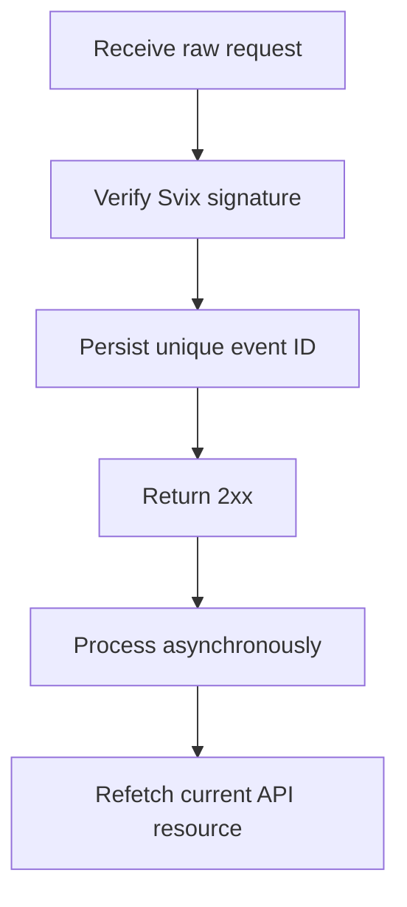

Bruk webhooks til å reagere på asynkrone endringer. Levering skjer minst én gang, så duplikater, forsinkede og hendelser i feil rekkefølge er normalt.



## Registrer kun hendelsene du trenger

Opprett et endepunkt med [`POST /v3/webhooks`](/api-reference/webhooks/post-v3-webhooks). Abonner kun på dokumenterte hendelser som driver integrasjonen din. Dette eksempelet bruker [`transfer.state_changed`](/api-reference/webhooks/transfer-state-changed).

```bash
export API_BASE='https://platform.swipelux.com'
export SWIPELUX_API_KEY='replace-with-your-api-key'

curl --request POST \
  "${API_BASE}/v3/webhooks" \
  --header "X-API-Key: ${SWIPELUX_API_KEY}" \
  --header "Idempotency-Key: webhook-endpoint-001" \
  --header "Content-Type: application/json" \
  --data @- <<'JSON'
{
  "url": "https://example.com/webhooks/swipelux",
  "events": ["transfer.state_changed"]
}
JSON
```

Lagre respons `data.id` som `WEBHOOK_ID`. Åpne portalen som returneres av [`GET /v3/webhooks/portal`](/api-reference/webhooks/get-v3-webhooks-portal), hent dette endepunktets signeringshemmelighet, og oppbevar den separat fra API-nøkkelen din i en hemmelighetshåndterer.

## Verifiser før parsing

Swipelux leverer nye webhook-integrasjoner via Svix. Verifiser den rå forespørsel-body-en med endepunktets signeringshemmelighet og disse headerne:

- `svix-id`
- `svix-timestamp`
- `svix-signature`

Ikke parse JSON eller forårsak sideeffekter før verifiseringen lykkes.

```javascript
import { Webhook } from "svix";

const verifier = new Webhook(process.env.SWIPELUX_WEBHOOK_SECRET);

export async function handleSwipeluxWebhook(request) {
  const rawBody = await request.text();
  const event = verifier.verify(rawBody, {
    "svix-id": request.headers.get("svix-id"),
    "svix-timestamp": request.headers.get("svix-timestamp"),
    "svix-signature": request.headers.get("svix-signature"),
  });

  await webhookInbox.insertIfAbsent({
    id: event.id,
    payload: event,
    status: "pending",
  });

  return new Response(null, { status: 204 });
}
```

Avvis forespørsler med manglende eller ugyldige signaturer. Behold den rå body-en tilgjengelig til verifiseringen er ferdig.

## Persister, bekreft og prosesser

Legg en unikhetsbegrensning på konvoluttens `id`. Persister den verifiserte konvolutten, returner `2xx` raskt, og prosesser den så asynkront.

Hvis hendelses-ID-en allerede finnes, bekreft leveransen uten å gjenta fullførte sideeffekter. Gjenoppta ventende eller feilende lokalt arbeid via din egen retry-kø. Ikke bruk konvoluttens `attempt`-felt som dedupliseringsnøkkel eller transporttelleverdi for retries.

## Hent gjeldende tilstand på nytt

Webhook-rekkefølgen er ikke en autoritativ ressurshistorikk. Bruk `resource.type` og `resource.id` for å finne objektet, og hent så gjeldende tilstand før du oppdaterer systemet ditt.

For en overføringshendelse, kall [`GET /v3/transfers/{transferId}`](/api-reference/money-movement/get-v3-transfers-by-transfer-id):

```bash
curl --request GET \
  "${API_BASE}/v3/transfers/${TRANSFER_ID}" \
  --header "X-API-Key: ${SWIPELUX_API_KEY}"
```

Driv kundevisibel status og etterfølgende handlinger fra gjeldende API-respons. Design sideeffekter slik at de forblir trygge hvis to arbeidere prosesserer relaterte hendelser i en annen rekkefølge.

## Gjenopprett leveranser

Bruk [`GET /v3/webhooks/portal`](/api-reference/webhooks/get-v3-webhooks-portal) for å åpne leveranselogger, prøve mislykkede leveranser på nytt, eller starte en manuell avspilling.

Hver avspilling må passere gjennom samme signaturverifisering og holdbare inbox. For å gjenopprette etter nedetid, spill av det berørte vinduet på nytt og hent hver refererte ressurs på nytt. Fullførte hendelses-ID-er forblir no-ops; ufullstendige oppføringer gjenopptas asynkront.

Deretter, verifiser dupliserte og feilaktig rekkefølge-leveranser i sandbox, og fullfør så sjekklisten for [Go live](/no/integration/go-live).
