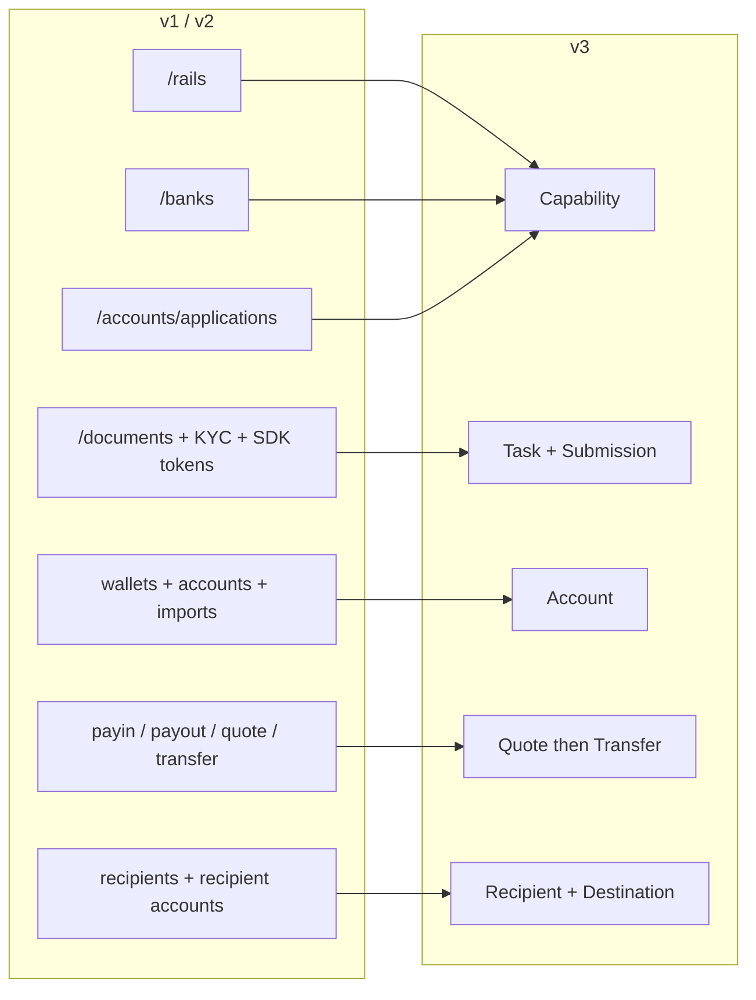
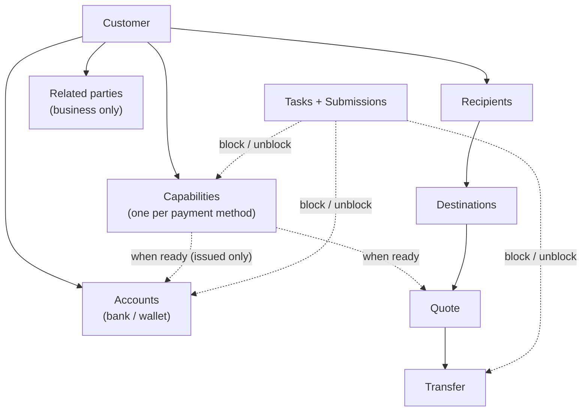
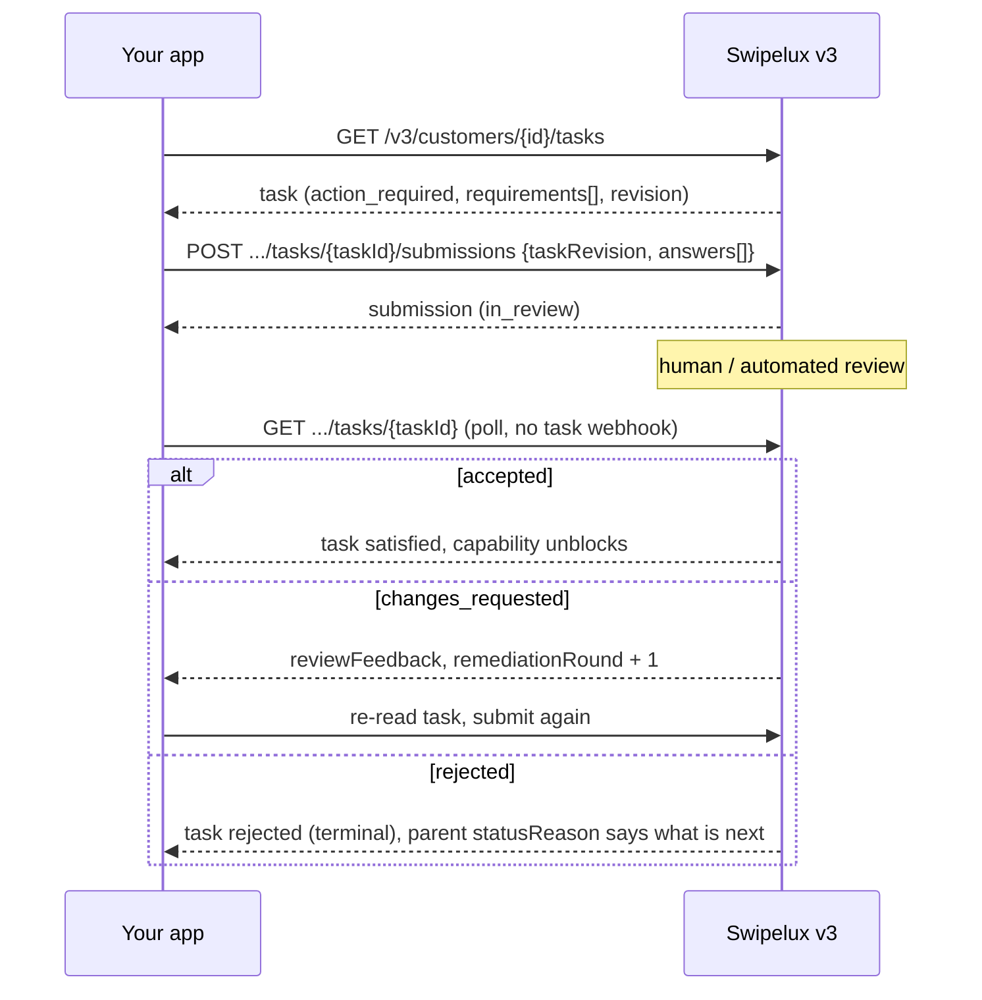
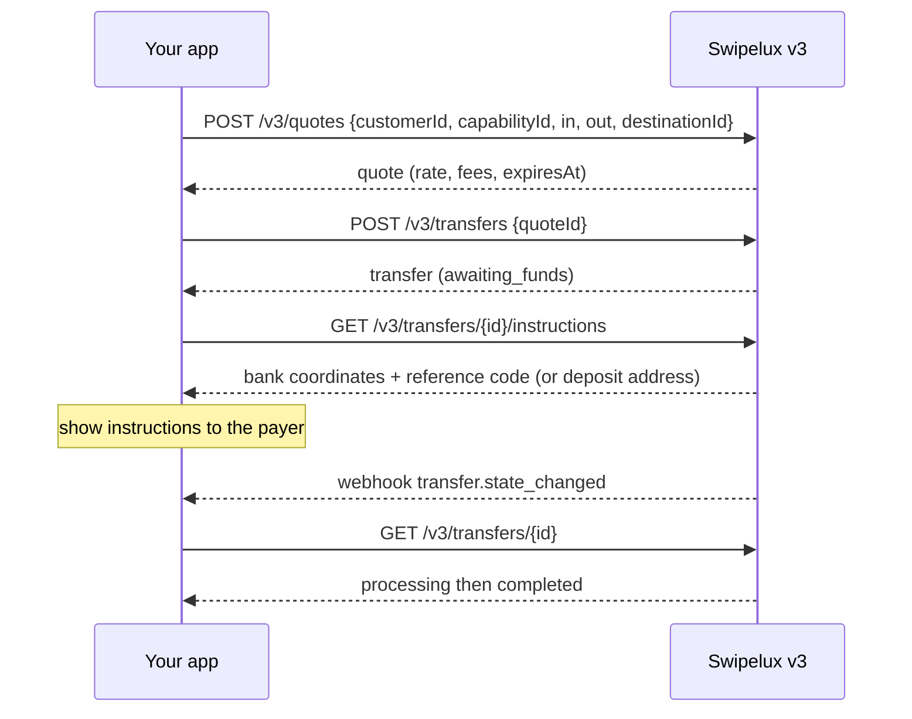
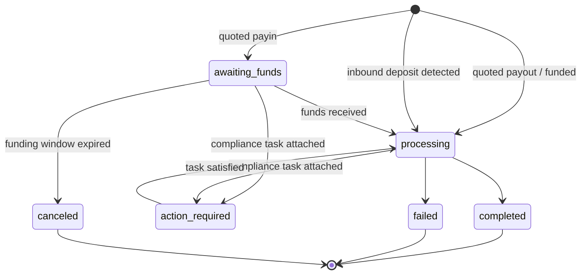
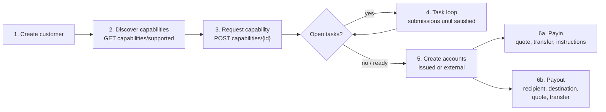

分兩階段將您的整合從 API v1 與 v2 遷移至 v3:

- **第一部分:概念。** 請先閱讀此部分。v3 是重新設計,而非重新命名:若您把舊端點一對一對應,將會與 API 產生衝突。此處花費十分鐘,將替日後省下數日時間。
- **第二部分:API。** 逐一端點對照、請求範例、狀態機,以及遷移檢查清單。

本文以正式環境 OpenAPI 規格為依據 ([platform.swipelux.com/openapi.json](https://platform.swipelux.com/openapi.json))。v1 與 v2 仍在運作且尚未被淘汰;所有全新的 capability、recipient、task 與報價功能僅在 v3 上推出。請訂閱 `api.deprecation` webhook 事件以接收停用通知。

<Info>
  **目錄。** 第一部分:1.1 v3 存在的原因、1.2 物件模型、1.3 每項 capability 的就緒狀態、1.4 task 循環、1.5 金流、1.6 狀態機、1.7 慣例、1.8 黃金路徑。第二部分:2.1 customers、2.2 capabilities、2.3 tasks 與 submissions、2.4 accounts、2.5 recipients 與 destinations、2.6 quotes 與 transfers、2.7 webhooks、2.8 sandbox、2.9 舊版端點、2.10 遷移順序、2.11 陷阱檢查清單。
</Info>

---

## 第一部分:概念

### 1.1 v3 存在的原因

v1 與 v2 演化出四種重疊的方式讓客戶達到可付款狀態:`/rails`、`/banks`、`/accounts/applications`,以及企業版的 `rail-applications` 介面,各自擁有專屬的狀態詞彙。文件收集(`/documents`、KYC 匯入、驗證 SDK token)則與其實際解鎖的對象脫節。v3 將全部整併為六種資源,即客戶本身加上客戶所擁有的五項資源:



| 資源 | 一句話定義 |
| --- | --- |
| **Customer** | 個人或企業。**沒有公開的 status 欄位**,就緒狀態存在於 capabilities 上。 |
| **Capability** | 客戶可使用的一種付款方式(`sepa`、`ach`、`swift`、`stablecoin_transfers` 等),擁有自己的狀態。取代 `/rails`、`/banks` 及帳戶申請入口。 |
| **Task** | Swipelux 需要的工作單位(資料、文件、驗證),透過 **Submission** 來回應。取代文件與 KYC 介面。 |
| **Account** | 客戶擁有的資金端點:`bank` 或 `wallet`,由 Swipelux `issued` 或為 `external`。 |
| **Recipient / Destination** | 收款受益人(誰)與其銀行或錢包端點(何處)。 |
| **Quote / Transfer** | 所有金流。轉帳會執行已保存的報價;未經報價的轉帳已不存在。 |

### 1.2 物件模型



需要內化的兩項結構性規則:

1. **Capabilities 是所有事物的閘門。** Accounts 是在 `ready` 的 capability 下佈建;quotes 是針對 capability 定價。上線流程等同於將您需要的 capabilities 帶到 `ready` 狀態。
2. **Tasks 可附加於任何位置。** 一個 capability、一個 account,或一筆進行中的 transfer,都可以帶有 `openTaskIds`。無論在何處看到它們,循環都相同:讀取 task、提交答案、等待審核、重新讀取父層。

### 1.3 就緒狀態依 capability 而定,而非依 customer

v1 將 `/rails` 就緒狀態與涵蓋整個 customer 的 KYC 閘門糾結在一起。在 v3 中沒有 customer 狀態:某位 customer 在 `stablecoin_transfers` 上可能完全可用,而其 `sepa` capability 仍有未完成的 tasks。共用帳戶型的 capabilities 通常比具名型更快進入 `ready`,因此應對已 `ready` 的 capability 開始交易,而非等待全部都就緒。

若您的 v1 或 v2 程式碼是以 customer 驗證狀態驅動 UI 徽章,請重寫:

- 「他們是否可在 X 上交易?」變成 capability X `status == "ready"`。
- 「他們是否需要做些什麼?」變成任何狀態為 `action_required` 的 task(capability 通常顯示為 `restricted`,並帶有 `statusReason.resolution: "complete_tasks"`)。
- 「我們是否在等待 Swipelux?」變成 tasks 為 `in_review`,capability 為 `pending`。

### 1.4 Task 循環

舊有文件與 KYC 介面所做的一切,現在都是這一個循環:



重要特性:

- 一個 task 帶有 `requirements[]`,即個別的請求項目。每一項有 task 內的 `requirementId`、命名該請求的穩定 `key`(例如地址證明,可在您的 UI 中據此去重),以及描述所需輸入的型別化 `request`(text、date、select、document、attestation 等)。
- 提交是**經過審核把關**:提交本身絕不會直接改變 capability 或 account 狀態,由審核通過才會。有一項例外:`profile` 答案在提交時會直接寫入 customer profile(見 2.3)。提交後,請輪詢該 task 或其父層資源。
- `taskRevision`(task `revision` 的回應值)是併發防護:若您讀取後 task 發生變化,請重新讀取並重建答案。
- `absence` 是一等公民等級的答案(「我沒有這項,因為……」),請使用它,而非讓 requirements 懸而未決。

### 1.5 金流

payin、payout 與 stablecoin 移轉共用一種流程。**沒有方向輸入**,您永遠不需宣告是 payin 或 payout。進出的幣別型態會在 quote 與 transfer 上衍生一個唯讀的 `direction`:`fiat_to_stablecoin`(payin)、`stablecoin_to_fiat`(payout),或 `stablecoin_move`。



### 1.6 每個資源一個狀態機

每個帶有狀態的資源都有自己的 enum,而每個非順利狀態都帶有結構化的原因。Accounts、applications 與 transfers 共用形狀 `{ code, message, actor, retryable }`:accounts 與 applications 將其以 `statusReason` 呈現,transfers 則以 `stateDetail` 呈現。`actor` 指出必須採取行動的一方(`customer`、`developer`、`provider`、`network`、`swipelux`);`retryable` 說明重試是否有幫助。Capabilities 使用 `{ code, resolution, message }`,其中 `resolution`(`complete_tasks`、`wait`、`contact_support`、`none`)說明是什麼將推進該 capability。`code` 值是一份開放、僅追加的目錄:請根據 `resolution`(或 `actor` 加 `retryable`)分支處理,並對從未見過的 code 保持容忍。

| 資源 | 狀態 |
| --- | --- |
| Capability | `pending`、`restricted`、`ready`、`rejected`、`canceled` |
| Application(capability 下每次請求嘗試,見 2.2) | `requested`、`in_review`、`action_required`、`ready`、`rejected`、`disabled`、`canceled` |
| Task | `action_required`、`in_review`、`satisfied`、`rejected`、`canceled` |
| Submission | `in_review`、`accepted`、`changes_requested`、`rejected` |
| Account | `provisioning`、`in_review`、`ready`、`action_required`、`suspended`、`rejected`、`archived` |
| Quote | `active`、`executed`、`expired`、`failed` |
| Transfer | `awaiting_funds`、`processing`、`action_required`、`completed`、`failed`、`canceled` |
| Recipient | `active`、`rejected`、`archived` |
| Destination | `in_review`、`ready`、`action_required`、`archived` |

本指南未逐一走過的狀態(`rejected`、`suspended`、`disabled`、`failed`、`canceled`)為終端態或由支援團隊驅動;各資源的定義請參閱規格。

Transfer 詳細狀態:



### 1.7 慣例

| 項目 | v1 / v2 | v3 |
| --- | --- | --- |
| 驗證 | `X-API-Key` 標頭 | 相同。環境(正式或 sandbox)由金鑰決定;單一 base URL。 |
| 冪等性 | 未強制 | `Idempotency-Key` 標頭**在每次會產生副作用的請求(POST、PATCH、PUT、DELETE)上皆為必填**,sandbox 端點除外。相同金鑰加上相同 body 會重放原始回應。 |
| 金額 | 混合使用數字與字串 | 僅使用字串(`"amount": "150.00"`)。絕不使用浮點數。 |
| 分頁 | offset/limit 變體 | 游標式:列表回傳 `{ data, nextCursor, hasMore }`。 |
| 更新 | 大量使用 PUT | `PATCH` 部分更新。 |
| Webhooks | 單一端點設定 | 多個端點,依事件訂閱。事件為**提示**,以 GET 為準(見 2.7)。 |

在撰寫程式碼前,值得內化的冪等性規則:

- 以**不同**的 body 重複使用同一個金鑰,只要該金鑰仍被保留(至少 7 天),都會得到 `409 idempotency_conflict`,所以千萬不要規劃重複使用金鑰。每個邏輯操作產生一個全新的 UUID,並隨作業一起持久化保存。
- 重放同樣涵蓋錯誤:若原始請求以終端態 4xx 結束,以相同金鑰加上相同 body 會再次回傳相同的問題回應。
- 兩個同時攜帶相同金鑰的請求:其中一個勝出,另一個得到 `409`。在勝出者定案之後重試落敗者;重放將回傳原始回應。

### 1.8 黃金路徑



---

## 第二部分:API

### 2.1 Customers

| v1 / v2 | v3 |
| --- | --- |
| `POST /v1/customers`、`POST /v1/customers/business`、`POST /v2/customers` | `POST /v3/customers`(單一端點,`type: individual \| business`) |
| `GET/PUT/DELETE /v1/customers/{id}`、`/v1/customers/business/{id}`、`/v2/customers/{customerId}` | `GET/PATCH/DELETE /v3/customers/{customerId}` |
| `GET /v1/customers`(列表) | `GET /v3/customers`(游標分頁,內嵌 capability 摘要) |
| `GET /v1/customers/balances`(批次)、`GET /v1/customers/{id}/balances` | 無餘額端點,餘額存在於帳戶上:於 `GET /v3/customers/{customerId}/accounts` 讀取 `balances` |
| `POST/GET .../shareholders`(v1 企業版) | `POST/GET /v3/customers/{customerId}/related-parties`(以及 `GET/PATCH/DELETE .../related-parties/{relatedPartyId}`) |
| `POST /v1/customers/business/{id}/kyb`(提交)、`GET .../kyb`(狀態) | 沒有 KYB 提交呼叫,請請求一個 capability(2.2)並回答其 tasks(2.3);判定結果會以 capability 與 task 狀態呈現 |
| `POST /v1/customers/{id}/kyc`、`.../kyc/import`、SDK token 端點 | Task 系統(2.3);託管驗證會以 `verificationSessions` 出現在 tasks 內 |

建立(依 `type` 區分,以下為說明性欄位值,實際欄位名以規格為準):

```jsonc
// POST /v3/customers        Idempotency-Key: <fresh uuid>
{
  "type": "individual",
  "externalId": "user-1042",
  "individual": {
    "firstName": "Maria",
    "lastName": "Silva",
    "birthDate": "1990-04-12",
    "nationalities": ["BR"],
    "residenceCountry": "BR",
    "email": "maria@example.com",
    "residentialAddress": {
      "streetLine1": "Av. Paulista 1000",
      "city": "Sao Paulo",
      "postalCode": "01310-100",
      "country": "BR"
    }
  },
  "financialProfile": {
    "accountPurposes": ["cross_border_remittance"],
    "sourcesOfFunds": ["salary"]
  }
}
```

- **建立是漸進式的**:僅 `{ "type": "individual" }` 亦是有效的建立。缺少的資訊絕不會使 customer 失效,它們會之後以 intake tasks 的形式出現在需要它們的 capabilities 上。
- 企業帶有 `business` 加上註冊資料。v1 的 shareholder CRUD 對應到**related parties**,並擴展以涵蓋 director、officer 與 owner:可在建立 customer 時內嵌建立(每個都會取得穩定的 `rp_` id),或透過專屬的 related-parties 端點管理。
- **沒有 customer `status` 欄位**,見 1.3。
- **既有 customers 會保留**:在 v1 或 v2 建立的 customers 可透過相同 id 在 v3 端點上存取。v3 讀取為一份_經過整理的檢視_,無法通過 v3 驗證的舊值會缺席回傳。**在您首次 v3 寫入後,該檢視即成為永久狀態**:缺席的值不會自動回來。所以請及早補全資料,規劃一次性作業以 `PATCH` 從您自有紀錄補入完整 profile,再依賴 v3 讀取。v1 的 `metadata` 為獨立命名空間,**不會**沿用,請在 v3 上重新設定。
- `externalId` 是一等公民,並且在 v3 上**於每個環境內在您的 customers 範圍內唯一**(`409 duplicate_external_id`)。封存 customer **不會**釋放其 `externalId`,若打算重用,請在 DELETE 前先以 PATCH 將其清除。
- `DELETE` 為**封存串連**(不可還原;id 永不重用)。當任何未封存的帳戶或進行中的 transfer 存在時,將被 `409 customer_has_active_resources` 封鎖並列出 `blockingResources[]`。
- PATCH 合併規則:明確的 `null` 會清除可為空的欄位;陣列會整體取代(除了內嵌 related parties,依 id upsert);`metadata` 鍵會合併。完整 schema 與列表過濾條件請見 OpenAPI 規格。

### 2.2 `/rails`、`/banks`、applications 變為 Capabilities

| v1 / v2 | v3 |
| --- | --- |
| `GET /v1/.../rails/capabilities` | `GET /v3/customers/{customerId}/capabilities/supported` |
| `GET /v2/.../banks`(以及 `/banks/{bank}`)、`GET /v2/meta/banks` | `GET /v3/customers/{customerId}/capabilities/supported` |
| `GET /v1/customers/{customerId}/rails`(列表) | `GET /v3/customers/{customerId}/capabilities` |
| `GET /v2/customers/{customerId}/rails`(概覽) | `GET /v3/customers/{customerId}/capabilities` |
| `POST /v1/.../rails`、`POST /v2/.../banks` | `POST /v3/customers/{customerId}/capabilities/{capabilityId}` |
| `POST /v2/.../accounts/applications` | `POST /v3/customers/{customerId}/capabilities/{capabilityId}` |
| `GET /v1/.../rails/{rail}` | `GET /v3/.../capabilities/{capabilityId}` |
| `GET /v2/.../accounts/applications`(以及 `/{applicationId}`、`/{applicationId}/history`) | `GET /v3/.../capabilities/{capabilityId}`(以及 `/applications`、`/applications/{id}/history`) |
| 企業 rail 介面:`GET/POST /v2/customers/business/{customerId}/rail-applications`(以及 `/{rail}`) | 同一組 v3 capability 端點,無獨立企業介面 |
| 企業 rail 介面:`GET .../business/{customerId}/rails`(以及 `/{rail}`) | 同一組 v3 capability 端點,無獨立企業介面 |
| `GET /v1/meta/rails`(靜態目錄) | `GET /v3/customers/{customerId}/capabilities/supported`,可用性依 customer 而定;無靜態目錄 |
| `GET /v1/meta/accounts/banks` | `GET /v3/institutions`(銀行目錄:id、名稱、BIC、國家) |
| 不可用 | `GET /v3/capabilities`,商戶範圍內跨所有 customer 已授予的 capabilities 列表(可依 `status`、`method`、`customerId` 過濾) |
| 不可用 | `GET /v3/.../capabilities/{capabilityId}/tasks-preview`(在提出請求前預覽將被詢問的項目) |
| 不可用 | `POST /v3/.../capabilities/{capabilityId}/cancel` |

- 一個 capability 等於 `method`(`ach`、`wire`、`rtp`、`pix`、`sepa`、`swift`、`spei`、`pse`、`transfers_3_0`、`faster_payments`、`sepa_instant`、`uaefts`、`card`、`stablecoin_transfers` 等)加上 `accountType`(`pooled` 或 `named`,非銀行方式為 `null`)加上 `directions`(`payin` 或 `payout`)。公開的 `capabilityId` 是合格化的組合(`sepa_pooled`、`ach_named`),或對 `card` 與 `stablecoin_transfers` 使用純粹的 method 名稱。
- 每次 capability 請求會產生一個**application**,即 `.../capabilities/{capabilityId}/applications` 下的每次嘗試紀錄(以及 `/{applicationId}/history`),擁有自己的狀態(見 1.6)與 `statusReason`。它是請求的稽核軌跡;日常請直接輪詢 capability 本身。
- `capabilities/supported` 回傳可用性(`available`、`beta` 或 `disabled`)、資格,以及提供的機構列表。銀行選擇在請求時透過可選的 `institutions` 陣列進行;不存在獨立的 `/banks` 資源。省略(或送出 `[]`)會選中所有預設機構;`isDefault: true` 是 customer 與 capability 特定的旗標,而非全域旗標。若送出非空清單將覆寫預設值;而由銀行支持的 capability 若無適用的預設值,將回傳 `422 capability_institutions_required`。機構 id 為不透明識別碼,請容忍新增。
- `stablecoin_transfers` **於建立 customer 時自動授予**,並以 `ready` 誕生(因此永遠無需請求且無法取消)。`card` 僅限個人。
- capability 上的 `openTaskIds` 是您的「接下來要做什麼」指標。「開啟」等於 `action_required` **或** `in_review`,且該匯總包含透過現行相依性關係達到的客戶層級共享 tasks。
- `cancel` 僅在 `pending` 或 `restricted` **且**無阻礙資源時可行,否則會得到 `409 capability_not_cancelable`,其問題主體列出 `blockingResources`。取消後重新請求為全新的建立作業,並使用新的冪等金鑰。
- **請輪詢 GET。** capability 狀態在您讀取時會刷新;輪詢 `GET .../capabilities/{capabilityId}` 或訂閱 `capability.status_changed`,勿快取。
- 請求一種 method 可能一次使多個相關 method 變得可用,請將 capabilities 視為需重新讀取的集合,而非您單獨追蹤的一行紀錄。
- 使用 `tasks-preview` 在提交請求**之前**顯示上線所需的詢問項目。
- 驗證不是一次性的:新的 tasks 可能出現在已 `ready` 的 capability 上(週期性或事件驅動的再次驗證)。請在整個 customer 生命週期都保持 task 循環運作,而非僅在上線期間。

### 2.3 Documents 與 KYC 變為 Tasks 與 Submissions

<Note>
  **命名注記。** 這些端點曾短暫以 `requirements` 與 `fulfillments` 出貨。自 2026-08-02 起,公開名稱為 **tasks** 與 **submissions**。此次更名僅涵蓋資源與端點路徑,task 內部的 `requirements[]` 陣列及其 `requirementId` 保留原名。
</Note>

每個舊有的 document 介面都對應到相同的替代:讀取 `GET /v3/customers/{customerId}/tasks`,以 `POST .../tasks/{taskId}/submissions` 回應。

| v1 / v2 | v3 |
| --- | --- |
| `POST/GET/DELETE /v1/documents` | `GET /v3/.../tasks` 加 `POST .../tasks/{taskId}/submissions` |
| `POST /v1/customers/{id}/documents` | `GET /v3/.../tasks` 加 `POST .../tasks/{taskId}/submissions` |
| `GET/POST /v1/customers/business/{id}/documents`(以及 `PUT/DELETE .../{docId}`) | `GET /v3/.../tasks` 加 `POST .../tasks/{taskId}/submissions` |
| `GET/POST .../shareholders/{shareholderId}/documents`(以及 `GET/PUT/DELETE .../{docId}`) | `GET /v3/.../tasks` 加 `POST .../tasks/{taskId}/submissions` |
| `GET/POST/DELETE /v2/.../documents`(以及 `/{documentId}`) | `GET /v3/.../tasks` 加 `POST .../tasks/{taskId}/submissions` |
| `POST /v2/.../documents/upload-token` 加 `POST /v2/documents/direct-upload` | 直接以您的 API key 上傳(見下),或在五分鐘內將新暫存的 direct-upload `storageKey` 以 JSON 傳送至 `POST /v3/.../documents` |
| `POST /v1/customers/documents/upload`、`POST /v1/document`(舊有 intake) | 已移除,直接以您的 API key 上傳(見下) |
| `POST /v1/customers/{id}/kyc` 加 SDK token | Task 的 `verificationSessions`(託管驗證);無直接「啟動 KYC」呼叫 |

配合該循環:

- **原始檔案儲存**:`POST/GET/DELETE /v3/customers/{customerId}/documents`(以及 `/{documentId}` 與 `GET .../{documentId}/download`),先以您的 API key 上傳一次,然後在 submission 答案中引用文件 id。此取代所有 upload-token 與 direct-upload 匯入。`POST .../documents` 也接受 JSON 本文(`storageKey`、`fileName`、`type`),用以消耗來自 `POST /v2/documents/direct-upload`、仍在時效內的客戶範圍參照,讓已暫存的上傳無需重新傳送位元組即可遷移。
- **全新讀取**:`GET /v3/tasks`(商戶範圍收件匣)、`GET /v3/transfers/{transferId}/tasks`、`GET .../tasks/{taskId}/history`、`GET .../tasks/{taskId}/submissions`(以及 `/{submissionId}`)。

Submission(說明性):

```jsonc
// POST /v3/customers/{cus}/tasks/{task}/submissions   Idempotency-Key: <fresh uuid>
{
  "taskRevision": 3,
  "answers": [
    { "requirementId": "req_a1", "answer": { "type": "document", "documentIds": ["doc_passport1"] } },
    { "requirementId": "req_b2", "answer": { "type": "text", "value": "Import/export business" } },
    { "requirementId": "req_c3", "answer": { "type": "absence", "reason": "not_applicable" } }
  ]
}
```

- 答案類型:`profile`、`text`、`date`、`single_select`、`multi_select`、`boolean`、`attestation`、`document`、`resource_reference`、`absence`。每個 requirement 的 `request` 物件會告知您它期待哪種類型。
- 一次 submission 必須回答**當前輪次中每一個可執行的 requirement**,並帶有您讀取到的精確 `taskRevision`。部分提交會被拒絕。
- `profile` 答案會**直接寫入**:它們會經過正常驗證路徑更新 customer profile,並立即重新評估參考同一 intake 工作的每個 capability。所有 requirements 已被滿足的兄弟 intake tasks 會自動關閉。
- Requirements 可能形成替代組(`alternativeKey`):提交組內任一項即可。
- `changes_requested` 會遞增 `remediationRound` 並帶有 `reviewFeedback`。請重新讀取 task,並以**全新的冪等金鑰**再次提交。
- 託管驗證 URL **僅**出現在 customer 範圍的 task 詳細頁(`GET /v3/customers/{customerId}/tasks/{taskId}`),且僅在該 session 可執行時;列表與 `GET /v3/tasks/{taskId}` 刻意不含 URL。
- 服務條款也是一種 task:`openTaskIds` 可能包含 `category: "terms_of_service"` 的 task,其託管接受頁面以同樣方式連結(僅 customer 範圍詳細頁)。一般 submissions 不能接受條款,而 KYC 通過絕不代表條款已接受。
- Tasks 依 capability 分別劃分範圍,因此「相同」的詢問(例如地址證明)可能每個 capability 各出現一次。請在您的 UI 中以 requirement `key` 去重。
- **無轉換層**:向 `/v1/documents` 發布不會解鎖 v3 capabilities。一旦 customer 進入 v3,請以 tasks 驅動所有詢問。

### 2.4 Accounts 與 wallets

| v1 / v2 | v3 |
| --- | --- |
| `POST/GET /v1/.../accounts`(以及 `/import`)、`/v2/.../accounts`(以及 `/import`) | `POST/GET /v3/customers/{customerId}/accounts` |
| `POST/GET /v1/.../wallets`(以及 `/import`) | 同一端點,`type: wallet` |
| `GET/DELETE /v1/customers/{customerId}/accounts/{accountId}`(及 wallets 版本)、`GET /v2/.../accounts/{accountId}` | `GET/PATCH/DELETE /v3/.../accounts/{accountId}` |
| `PATCH /v2/.../accounts/{accountId}/fees` | `GET/PUT /v3/.../accounts/{accountId}/fees` |

建立,依 `origin` 加 `type` 區分。Issued 銀行帳戶取單一 `method`;external 銀行帳戶則取 `methods` 陣列(在該處送出 `method` 會被拒絕):

```jsonc
// issued bank account (capability must be ready)
{ "origin": "issued", "type": "bank", "method": "sepa",
  "currency": "EUR", "settlement": { "accountId": "acc_wallet1" } }

// external wallet the customer already owns (replaces /import)
{ "origin": "external", "type": "wallet", "currency": "USDC",
  "network": "polygon", "details": { "address": "0x71C7656EC7ab88b098defB751B7401B5f6d8976F" } }
```

- issued 銀行帳戶上的 `country` 為選填(每種 method 有預設值);在 external **銀行**帳戶上請明確提供。錢包帳戶完全不帶國家欄位。
- issued 銀行帳戶上必填 `settlement.accountId`:它指出接收從該銀行帳戶存款結算資金的 issued 錢包帳戶。
- issued 帳戶會揭露 `details`(IBAN 或 routing 加帳號或地址)、有版本的 `routing`(存款座標可輪替,總是以最新讀取為準呈現)、`fees`、`balances`。
- 網路:`polygon`、`ethereum`、`base`、`arbitrum`、`optimism`、`bsc`、`avalanche`。
- capability 閘門僅適用於 **issued** 帳戶:對非 ready 的 capability 建立帳戶將以 capability 相關錯誤失敗,請先請求該 capability(見 2.2)。external 帳戶不需要 capability(也無需 customer 核准);僅接受請求 schema 與銀行資料驗證。
- issued 銀行帳戶以 `provisioning` 誕生,`details: null`。輪詢該帳戶或監聽 `account.status_changed` 直到 `ready`。
- `DELETE` 為封存,永不硬刪除。被進行中 transfers 引用的帳戶會回傳 `409 account_has_active_transfers`。請於這些 transfer 到達終端態後重試。
- v3 新增:**Rules**,issued 錢包帳戶上的常設指令(`POST/GET /v3/customers/{customerId}/rules`、`GET/PATCH/DELETE .../rules/{ruleId}`),可將收到的資金自動掃入另一帳戶或錢包 destination。無 v1 或 v2 對應。

### 2.5 Recipients 與 destinations

| v1 | v3 |
| --- | --- |
| `POST/GET /v1/.../recipients` | `POST/GET /v3/customers/{customerId}/recipients` |
| 不可用(v1 的 recipients 僅可建立與列表) | `GET/PATCH/DELETE /v3/.../recipients/{recipientId}`,全新的詳情、更新、封存 |
| `POST/GET .../recipients/{recipientId}/accounts` | `POST/GET /v3/.../recipients/{recipientId}/destinations` |
| `GET/DELETE .../recipients/{recipientId}/accounts/{recipientAccountId}` | `GET/DELETE /v3/.../recipients/{recipientId}/destinations/{destinationId}`(無 destination PATCH,請封存後重新建立) |

v2 沒有 recipient 概念。若您目前在 v2 上並支付給第三方,這是全新介面,而非更名。

- **Recipient** 等於誰:`individual`(名與姓)或 `business`(公司名稱),並需要 `relationship`(`employee`、`contractor`、`vendor`、`subsidiary`、`merchant`、`customer`、`landlord`、`family`、`other`)。Recipients 與 destinations 僅用於第三方。第一方付款完全不需 recipient:將該 customer 自己的一個 `acc_` 帳戶作為 quote `destinationId`(見 2.6)。
- **Destination** 等於何處:依 method 型別化,`sepa`(iban、bic 選填)、`ach` 或 `wire`(routing 加帳號)、`swift`(完整座標加選填中介行)、`spei`(clabe)、`pse`、`transfers_3_0`(cbu)等,加上錢包 destinations。每個 destination 有自己的狀態。請監聽 `destination.status_changed`。
- 法幣 destinations 需在建立**之前**取得 recipient 的完整 `address`(街道、城市、郵遞區號、國家)。缺項會以 `422 recipient_address_required` 失敗。錢包 destinations 不需要地址,但需要頂層 `ownership`(`self_custodied`,或為 `custodial` 並附上託管方名稱)。
- 受益人姓名的準確性很重要:收款銀行以帳戶的**法定**名稱進行比對。請送出精確的法定名與姓或公司名稱,而非顯示暱稱。
- 每種 method 的 destination 欄位 schema 見 OpenAPI 規格。

### 2.6 Quotes 與 transfers

| v1 / v2 | v3 |
| --- | --- |
| `POST /v1/payin/quote`、`/v1/payout/quote`、`/v2/quote` | `POST /v3/quotes` |
| `POST /v1/payin`、`/v1/payout`、`POST /v1/transfers`、`/v2/transfer` | `POST /v3/transfers`(執行一個 quote,未經 quote 的建立已移除) |
| `GET /v1/transfers`(列表)、`GET /v1/transfers/{id}` | `GET /v3/transfers`、`/v3/transfers/{transferId}` |
| 不可用(v1 與 v2 的 quotes 無讀取) | `GET /v3/quotes/{quoteId}` |
| `GET /v1/rate/{base}/{quote}` | `GET /v3/rates` |
| (payin 回應中隱含) | `GET /v3/transfers/{transferId}/instructions` |
| 不可用 | `POST /v3/transfers/{transferId}/cancel`、`GET /v3/transfers/{transferId}/tasks` |

```jsonc
// 1. Quote: amount on exactly one side picks mode (exact_in / exact_out).
// POST /v3/quotes            Idempotency-Key: <fresh uuid>
{
  "customerId": "cus_123",
  "capabilityId": "sepa_named",
  "in":  { "currency": "EUR", "amount": "150.00" },
  "out": { "currency": "USDC" },
  "destinationId": "acc_wallet1",   // fiat-funded: must be a customer-owned acc_ account
  "fees": { "breakdown": { "developer": { "fixed": "1.00", "bips": 50 } } }
}
// -> { mode: "exact_in", direction: "fiat_to_stablecoin", rate, fees[], expiresAt, ... }

// 2. Execute before expiresAt.
// POST /v3/transfers         Idempotency-Key: <fresh uuid>
{ "quoteId": "quo_789", "externalId": "order-991", "memo": "invoice 44" }
```

- `destinationId` 接受 `acc_`(customer 自有帳戶)或 `dst_`(recipient destination)id。**法幣資金的 quotes(payins)必須指向 `acc_` 帳戶**,以 `dst_` 為目標則永遠代表 payout(否則回傳 `422 quote_direction_invalid`)。
- quotes 與 transfers 上的 `externalId` 是非唯一關聯參考(讀取時回傳、列表可過濾)。每環境唯一的規則(見 2.1)僅適用於 customer 的 `externalId`。
- Quote 只可執行一次,並在 `expiresAt` 之前。過期的 quote 會以 `409 quote_expired` 失敗;第二次執行會得到 `409 quote_already_executed`(問題主體帶有既有的 `transferId`)。
- Transfer 取消尚未支援:`POST .../cancel` 在任何狀態下都會回傳 `409 transfer_not_cancelable`。目前的 `canceled` transfers 來自未完成資金的 payin 之資金投入窗口過期,並非來自此端點。
- Payins 從 `awaiting_funds` 開始:對付款人呈現 `GET .../instructions`,即法幣的銀行座標加**參考或備註代碼**,或加密貨幣的存款地址。參考代碼是存款對帳的方式,務必顯示。
- `state` 加 `stateDetail` 提供機器可讀的子狀態;`action_required` 表示有一個合規 task 附加(`openTaskIds`、`GET .../tasks`),請透過 submissions 回應。
- 在 issued 帳戶上偵測到的入帳存款會以 `origin: "inbound_deposit"` 的 transfers 出現(相對於 `"quoted"`)。
- 支付網路參考統一於 `references` 下:`transactionHash`、`traceNumber`、`imad`、`uetr`、`explorerUrl`、`returnedTransferId`。

v1 狀態轉換:

| v1 概念 | v3 |
| --- | --- |
| 獨立的 payin 與 payout 物件 | 單一 transfer 帶有 `direction` |
| 退款或供應商端的取消(併入 `failed`) | 仍為 `failed`,但帶有機器可讀的 `stateDetail`,並在退款產生了反向 transfer 時附上 `references.returnedTransferId` |

兩項遷移警告:

- **Transfers 不會跨版本存取。** 在 v1 或 v2 建立的 transfers 從 v3 讀取不到。列表會省略,`GET /v3/transfers/{transferId}` 會回傳 404。請先切換_建立_,保留 v1 讀取路徑直到那些 transfers 到達終端態,然後再移除。
- **無代幣互換。** `stablecoin_move` 要求進出貨幣相同:USDC 換 USDT 會以 `422 recipient_destination_invalid` 失敗,並帶有 `currency_mismatch` 欄位錯誤。兩側必須為相同網路,無橋接;錢包對錢包的移轉目前僅支援零手續費投遞:平台或開發者手續費非零的 quote 會以 `422 amount_not_deliverable` 失敗。

### 2.7 Webhooks

| v1 | v3 |
| --- | --- |
| `GET/PATCH /v1/webhooks`(單一端點設定) | `POST/GET /v3/webhooks`、`PATCH/DELETE /v3/webhooks/{webhookId}`、`GET /v3/webhooks/portal` |

事件目錄:`customer.created`、`customer.updated`、`customer.archived`、`capability.created`、`capability.status_changed`、`application.status_changed`、`recipient.status_changed`、`destination.status_changed`、`account.created`、`account.status_changed`、`account.details_changed`、`transfer.created`、`transfer.state_changed`、`api.deprecation`。

- `GET /v3/webhooks/portal` 會回傳一個託管管理入口的 URL,供投遞記錄、重試與手動重放使用。
- `transfer.created` 目前以舊有 v1 payload 結構投遞(v3 信封在 v1 webhooks 停用時啟用)。請純粹將其視為提示並 GET 該 transfer;不要以其 body 為依據建構邏輯。
- 事件為提示:收到後,GET 該資源並依讀取採取行動。切勿以事件 payload 或順序建構狀態。投遞為至少一次,且可能延遲或亂序。請以事件 id 去重,並以各列表的包含式 `updatedAfter` 過濾器復原漏掉的事件。
- 訂閱 `api.deprecation`,即版本停用的機器通道。
- 目前沒有 `task.*` 事件:提交後請輪詢 task 或其父層。

### 2.8 Sandbox

同一 base URL;sandbox API key 會決定環境。

| v1 | v3 |
| --- | --- |
| `POST /v1/sandbox/topup` | `POST /v3/sandbox/accounts/{accountId}/topup` |
| `POST /v1/sandbox/payins/simulate`、`.../payouts/simulate`、`POST /v1/customers/{id}/simulate-transactions` | `POST /v3/sandbox/transfers/{transferId}/state`(推動真實 transfer 走過各狀態) |
| 不可用 | `POST /v3/sandbox/customers/{customerId}/verification`(完成驗證) |
| 不可用 | `POST /v3/sandbox/customers/{customerId}/capabilities/{capabilityId}/status`(強制 capability 狀態) |
| 不可用 | `POST /v3/sandbox/tasks`、`POST /v3/sandbox/tasks/{taskId}/review`(建立 task,然後模擬判定) |

v3 sandbox 完整模擬審核循環:建立 task、對其提交、`review` 到 `accepted` 或 `rejected`、觀察 capability 解鎖。可在上線前先排練您的補救 UX。sandbox 建立的 tasks 與請求 capability 時出現的常規 intake tasks 都能以此方式審核;如同正式環境,不會觸發 task webhooks,請輪詢(見 2.7)。

### 2.9 無 v3 替代的舊有端點

以下端點沒有 v3 替代。多數維持在 v1 上不變(繼續使用您的既有呼叫);兩項直接退役(見「處置」):

| 端點 | 處置 |
| --- | --- |
| `GET /v1/merchant-kyb/creation-gate`、`POST /v1/merchant-kyb/{customerId}/submit`、`POST /v1/merchant-kyb/parked-url`、`POST /v1/merchant-kyb/upload-token` | 您自己的商戶 KYB 上線(非 customer KYB),在 v1 上不變 |
| `POST /v1/merchant-wallets/get-or-create` | 商戶財庫錢包輔助端點,在 v1 上不變 |
| `GET /v1/meta/accounts/relationships` | 已退役,recipient 的 `relationship` enum 是固定的且在文件中內嵌記載(見 2.5) |
| `GET /v1/meta/kyb/documents` | 已退役,v3 tasks 透過 `requirements[]`(見 2.3)依個案宣告所需文件;無靜態目錄 |
| `GET /statecharts`(以及 `/{machineId}`、`/{machineId}/svg`、`/explorer`、`/validate`) | 與版本無關的公開狀態機參考頁,不變 |

其他所有公開 v1 或 v2 端點都出現在上面的對應表中。

### 2.10 建議的遷移順序

每一步可以獨立出貨;v1 或 v2 與 v3 可對同一批 customer 併行運作。在正式環境重複之前,請針對每一步以您的 sandbox key(見 2.8)排練。

<Steps>
  <Step title="基礎架構">
    對所有會產生副作用的請求(POST、PATCH、PUT、DELETE;sandbox 端點除外)加上 `Idempotency-Key`;金額以字串表示;準備游標分頁輔助函式。
  </Step>
  <Step title="Webhooks">
    依事件註冊 v3 端點,包括 `api.deprecation`。v1 的單一端點設定是獨立介面,請維持原狀;兩者將併行運作直到步驟 9 的排放期。
  </Step>
  <Step title="Profile 補全">
    以您手上的完整 profile 呼叫 `PATCH /v3/customers/{id}`(v1 收集的資料少於 v3 揭露的),並重新設定 `metadata`。請刻意將這一步作為每個 customer 的**第一次 v3 寫入**:它會在整理後檢視變為永久狀態之前先將其填滿(見 2.1)。
  </Step>
  <Step title="讀取">
    將 customer、capability 與 account 讀取指向 v3;依 1.3 重寫 customer 狀態邏輯。僅在步驟 3 之後,未補全的讀取才會缺少舊版不合規的欄位。
  </Step>
  <Step title="上線寫入">
    以 `POST /v3/customers` 建立;請求 capabilities 而非 `/rails`、`/banks` 或 applications;建立 task 循環(最大量的全新 UI 工作,`tasks-preview` 有助於預先顯示詢問)。從此時起,對於由 v3 驅動的 customers,停止呼叫 `/v1/documents`,那不會解鎖 capabilities(見 2.3)。
  </Step>
  <Step title="Accounts">
    透過 v3 發行;將 imports 轉移為 `origin: external`。
  </Step>
  <Step title="Payouts">
    Recipients 加 destinations,然後 quote 與 transfer。
  </Step>
  <Step title="Payins">
    Quote、transfer、instructions;繼續呈現參考代碼。
  </Step>
  <Step title="排放">
    Transfers 不會跨版本(見 2.6)。請保留 v1 或 v2 讀取路徑,以及供在那邊建立的 transfers 使用的 v1 webhook 端點;雙讀直到它們到達終端態,再移除舊用戶端與 v1 webhook 設定。
  </Step>
</Steps>

### 2.11 陷阱檢查清單

- [ ] 每個**邏輯操作**使用全新 UUID,隨作業一起持久化,於重試時重用;絕不使用相同金鑰配合已變更的 body(`409 idempotency_conflict`)。sandbox 端點不需該標頭。
- [ ] 在**任何其他 v3 寫入之前**,補全既有 customers(`PATCH` 完整 profile、重新設定 `metadata`,它不會沿用);首次 v3 寫入會使整理後檢視變為永久狀態。
- [ ] `externalId` 於每環境唯一,且**封存不會釋放它**;若打算重用,請在 `DELETE` 前先以 `PATCH` 清除。
- [ ] 沒有 customer `status` 欄位,請依 capability 導出就緒狀態。
- [ ] `action_required` **與** `in_review` 都代表存在未完成的 task。
- [ ] Submissions 經過審核把關(提交不等於解鎖),且必須以精確的 `taskRevision` 回答**每一個**可執行 requirement。若不符,請重新讀取並重建。
- [ ] 沒有 `task.*` webhook,每次提交後請輪詢 task(或其父層)。
- [ ] `changes_requested` 的重試等於重新讀取 task、給出全新答案、**使用全新的冪等金鑰**。
- [ ] 對 `/v1/documents` 發文絕不會解鎖 v3 capability;一旦 customer 使用 tasks,請以 tasks 驅動所有詢問。
- [ ] 新的 tasks 可能出現在已 `ready` 的 capability 上,請在上線後也保持 task 循環運作,而非只在上線期間。
- [ ] Capability `cancel` 僅在 `pending` 或 `restricted` 且無阻礙資源時可行(`409 capability_not_cancelable`);取消後重新請求為全新的建立,並使用全新冪等金鑰。
- [ ] Capability 必須為 `ready` 才能在其下發行帳戶或針對其定價。
- [ ] Quote 只有一側有金額;無方向欄位;在 `expiresAt` 之前正好執行一次(`409 quote_expired` 或 `409 quote_already_executed`)。
- [ ] Stablecoin 移轉僅支援相同貨幣、相同網路(USDC 轉 USDT 會 `422` 失敗);錢包對錢包僅支援零手續費投遞。
- [ ] `DELETE` 為封存,永不硬刪除。Account 刪除會被進行中 transfers 封鎖(`409 account_has_active_transfers`);Customer 刪除還會被任何未封存帳戶封鎖(`409 customer_has_active_resources`,`blockingResources[]` 會列出它們)。
- [ ] v1 或 v2 transfers 對 v3 讀取不可見(列表會省略,GET 回 404),請雙讀直到排放完畢,再移除舊路徑。
- [ ] 存款 `routing` 與指示可能輪替,永遠以最新 GET 呈現,並永遠顯示參考代碼。
- [ ] Webhooks 只是提示;GET 才是真相,請以事件 id 去重,並以 `updatedAfter` 復原漏掉的事件。

## 下一步

從遷移順序的步驟 1(見 2.10)開始:冪等金鑰、金額為字串、游標分頁,並在正式環境重複之前,先以您的 sandbox key(見 2.8)排練每一步。
