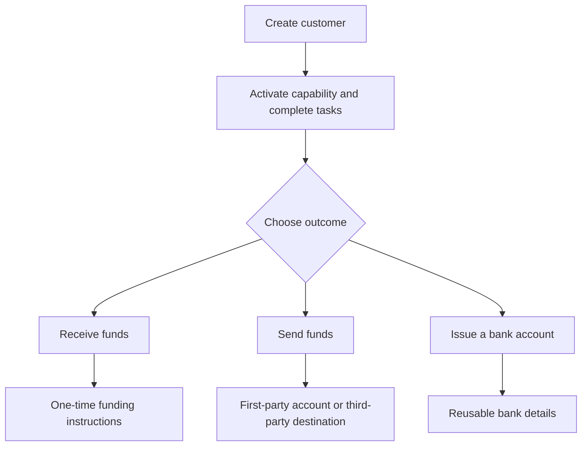

從客戶結果開始。每個流程都使用相同的入駐模型,接著再分支至不同的帳戶與資金流動。

## 比較各流程

| 結果 | 需先準備 | 您將取得 |
| --- | --- | --- |
| 入金 | 就緒的入金能力與發行的目的地錢包 | 特定於本次轉帳的指令,以及穩定幣結算 |
| 出金 | 就緒的出金能力、已入金的發行錢包,以及就緒的帳戶或目的地 | 一筆前往所選收款端點的轉帳 |
| 發行銀行帳戶 | 就緒的銀行能力與發行的結算錢包 | 佈建完成後可重複使用的銀行資料 |

已報價的入金會為單筆轉帳建立指令。發行的銀行帳戶則為後續存款建立可重複使用的資料。出金則從發行錢包中已可用的資金開始。

## 選擇您的流程

<CardGroup cols={3}>
  <Card title="接收資金" icon="arrow-down-to-line" href="/zh-Hant/integration/receive-funds">
    建立並追蹤一次法幣兌穩定幣的入金。
  </Card>
  <Card title="發送資金" icon="arrow-up-from-line" href="/zh-Hant/integration/send-funds">
    建構第一方或第三方的出金。
  </Card>
  <Card title="發行銀行帳戶" icon="building-columns" href="/zh-Hant/integration/issue-bank-account">
    佈建可重複使用、連結至錢包的銀行資料。
  </Card>
</CardGroup>
