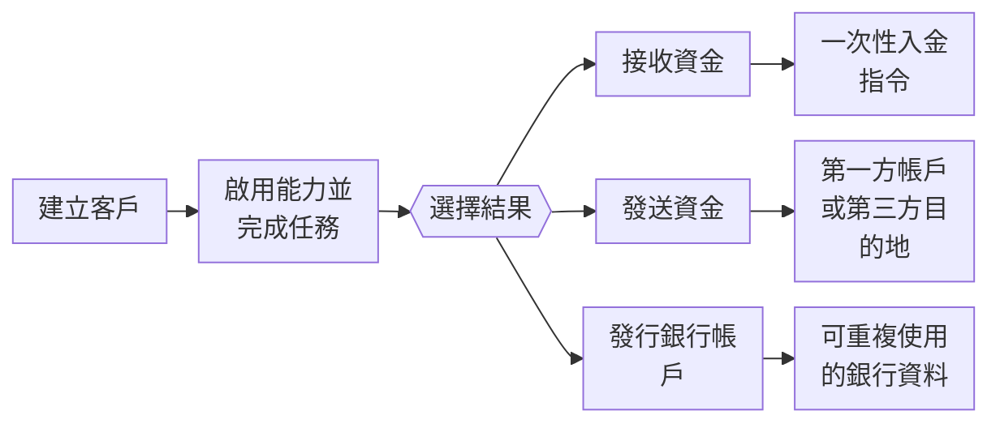

從客戶結果開始。每個流程都使用相同的入駐模型,接著再分支至不同的帳戶與資金流動。

```mermaid
%%{init: {"flowchart": {"rankSpacing": 20, "nodeSpacing": 16, "wrappingWidth": 80, "padding": 8}}}%%
flowchart LR
  A["建立客戶"] --> B["啟用能力並完成任務"]
  B --> C{{"選擇結果"}}
  C --> D["接收資金"]
  C --> E["發送資金"]
  C --> F["發行銀行帳戶"]
  D --> G["一次性入金指令"]
  E --> H["第一方帳戶或第三方目的地"]
  F --> I["可重複使用的銀行資料"]
```

## 比較各流程

| 結果 | 需先準備 | 您將取得 |
| --- | --- | --- |
| 入金 | 就緒的入金能力與發行的目的地錢包 | 特定於本次轉帳的指令,以及穩定幣結算 |
| 出金 | 就緒的出金能力、已入金的發行錢包,以及就緒的帳戶或目的地 | 一筆前往所選收款端點的轉帳 |
| 發行銀行帳戶 | 就緒的銀行能力與發行的結算錢包 | 佈建完成後可重複使用的銀行資料 |

已報價的入金會為單筆轉帳建立指令。發行的銀行帳戶則為後續存款建立可重複使用的資料。出金則從發行錢包中已可用的資金開始。

## Onramp 與 offramp

Swipelux 使用入金與出金這兩個術語,而非 onramp 與 offramp。入金會將穩定幣結算至發行錢包。出金則從發行錢包發送資金。

| 如果您要建置 | 使用 | 報價與轉帳的 `direction` |
| --- | --- | --- |
| Onramp(法幣轉穩定幣) | [接收資金](/zh-Hant/integration/receive-funds) | `fiat_to_stablecoin` |
| Offramp(穩定幣轉法幣) | [發送資金](/zh-Hant/integration/send-funds)至銀行帳戶或銀行目的地 | `stablecoin_to_fiat` |
| 錢包對錢包的穩定幣轉帳 | [發送資金](/zh-Hant/integration/send-funds)至錢包 | `stablecoin_move` |

您不需要在請求中傳送 `direction`。Swipelux 會根據報價中的 `in` 與 `out` 幣別推導出此值。請參閱[報價與轉帳](/zh-Hant/integration/quotes-and-transfers)。

## 選擇您的流程

<CardGroup cols={3}>
  <Card title="接收資金" icon="arrow-down-to-line" href="/zh-Hant/integration/receive-funds">
    建立並追蹤一次法幣兌穩定幣的入金。
  </Card>
  <Card title="發送資金" icon="arrow-up-from-line" href="/zh-Hant/integration/send-funds">
    建構第一方或第三方的出金。
  </Card>
  <Card title="發行銀行帳戶" icon="building-columns" href="/zh-Hant/integration/issue-bank-account">
    佈建可重複使用、連結至錢包的銀行資料。
  </Card>
</CardGroup>
