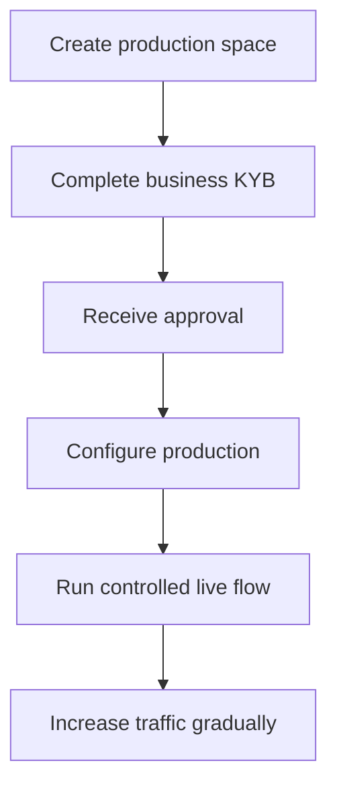

正式環境啟用會驗證您整合的企業實體。它與您為產品建立的 API 客戶是分開的。

## 啟用您的正式環境空間

1. 登入 Swipelux Dashboard 並選擇 **Create a production space**。
2. 開啟 KYB 分頁,或前往 [Business verification](https://www.swipelux.app/kyb)。
3. 完成所有必填欄位並上傳所需的文件。
4. 送交您整合的企業進行驗證,並等待核准。

僅在您整合的企業與正式環境空間皆獲得核准後,才能建立正式環境的 API 客戶與交易。

## 保持正式環境獨立

請明確地建立正式環境的資源。變更 API 金鑰並不會遷移沙箱狀態。

- 將正式環境憑證存放於獨立的密鑰管理項目中。
- 使用僅限正式環境的部署設定與資源 ID。
- 註冊獨立的正式環境 webhook 端點與簽章密鑰。
- 於正式環境中重新建立所需的客戶、能力、帳戶、收款人與目的地。
- 將正式環境存取限制為需要的服務與操作人員。

沙箱與正式環境皆使用 `https://platform.swipelux.com`;由 API 金鑰決定環境。

## 完成上線清單

- [ ] 在沙箱中測試正常流程與預期的失敗路徑。
- [ ] 為每個需要 `Idempotency-Key` 的寫入操作附上該金鑰,並保留以便安全重試。
- [ ] 於解析前先驗證 webhook 簽章、可靠地持久化事件 ID,並測試重播。
- [ ] 處理不可用的能力、待辦任務與變更後的任務版本。
- [ ] 處理已記載的 [API 錯誤與重試](/zh-Hant/integration/errors),包含使用原始金鑰進行冪等重試。
- [ ] 向操作人員呈現轉帳失敗訊息與可採取行動的說明。
- [ ] 確認日誌保留 `X-Request-Id` 或 `correlationId`,並且不會暴露密鑰或敏感的財務資料。

## 執行一次受控上線流程

從一位已知客戶與一筆小額交易開始。請記錄:

| 控制項 | 於測試前定義 |
| --- | --- |
| 範圍 | 客戶、能力、帳戶或目的地、金額與方法。 |
| 預期結果 | API 狀態、餘額或指令,以及您預期觀察到的 webhook 事件。 |
| 負責人 | 監看整個流程的負責人。 |
| 停止條件 | 任何預料外的狀態、缺失的 webhook、金額錯誤或未解決的任務。 |

同時驗證當前的 API 資源與經身分驗證的 webhook 派送。若任一項與預期結果不符,請先停止並調查後再送出更多流量。

在整個流程成功之後,請逐步增加流量,同時監控能力、帳戶、目的地與轉帳的狀態。

回到[常見流程](/zh-Hant/integration/common-flows) 查看產品路徑、參閱[錯誤與重試](/zh-Hant/integration/errors) 了解失敗處理,或使用 [API 參考](/zh-Hant/api-reference/introduction) 檢視精確的契約。
