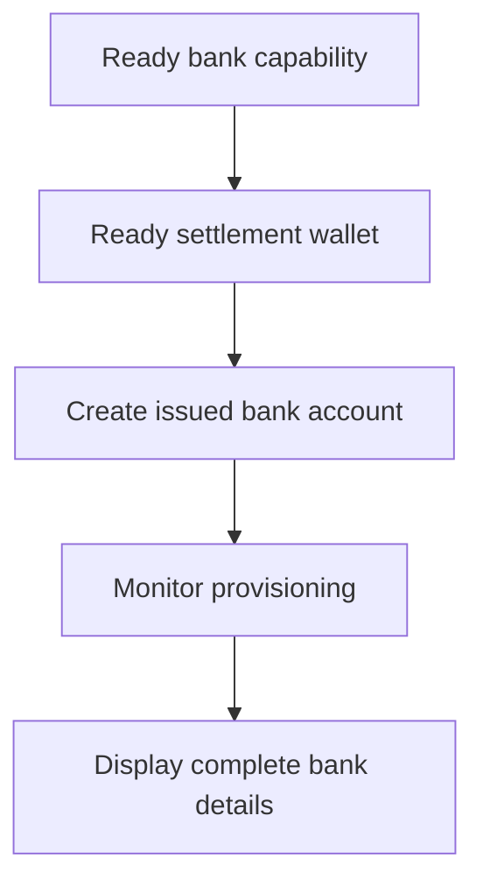

當客戶需要可重複使用的銀行資料時,請使用發行的銀行帳戶。若是綁定特定金額的一次性入金指令,請改用[接收資金](/zh-Hant/integration/receive-funds)。



## 開始前

您需要一個客戶 ID、對應方法與幣別已就緒的銀行能力,以及同一客戶名下已就緒的發行錢包。請透過[能力與任務](/zh-Hant/integration/onboarding/capabilities-and-requirements) 完成待辦事項。

## 1. 建立或選擇結算錢包

透過[帳戶與錢包](/zh-Hant/integration/accounts#create-the-account) 建立一個發行錢包,然後再次讀取。僅在其當前狀態允許結算時繼續。

將回應取得的 `data.id` 儲存為 `SETTLEMENT_WALLET_ID`。不要將外部錢包用於 `settlement.accountId`。

## 2. 建立發行的銀行帳戶

使用 [`POST /v3/customers/{customerId}/accounts`](/api-reference/accounts/post-v3-customers-by-customer-id-accounts),並搭配以下標頭:

```http
X-API-Key: ${SWIPELUX_API_KEY}
Idempotency-Key: issued-bank-account-001
Content-Type: application/json
```

傳送以下請求主體:

```json
{
  "origin": "issued",
  "type": "bank",
  "method": "ach",
  "country": "US",
  "currency": "USD",
  "settlement": {
    "accountId": "${SETTLEMENT_WALLET_ID}"
  },
  "label": "USD account"
}
```

將回傳的 `data.id` 儲存為 `BANK_ACCOUNT_ID`。同時保留 `data.status`、`data.openTaskIds`、`data.details` 以及結算關係。

銀行帳戶 ID 與錢包 ID 具有不同的角色。透過銀行帳戶 ID 讀取佈建狀態與銀行資料;使用結算錢包 ID 標識存款所要記入的位置。

## 3. 監控佈建進度

於建立後及每次相關 webhook 後,讀取 [`GET /v3/customers/{customerId}/accounts/{accountId}`](/api-reference/accounts/get-v3-customers-by-customer-id-accounts-by-account-id)。

在 `details` 尚未提供時,請將客戶介面維持在等待狀態。若 `openTaskIds` 不為空,請完成最新的任務並重新讀取帳戶。切勿以經過時間推論就緒狀態。

若最新的 `statusReason.code` 為 `awaiting_assignment`,請透過[接收資金](/zh-Hant/integration/receive-funds) 為同一位客戶、同一能力與同一結算錢包建立第一筆入金,然後再次讀取該銀行帳戶。僅在當前帳戶要求時才走這條分支。

## 4. 安全地呈現銀行資料

僅顯示最新一次帳戶讀取所回傳的完整資料。當 `details.referenceRequired` 為 true 時,請顯示完整的 `details.reference` 並使其可複製。當其為 false 時,切勿自行編造參考編號。

這些銀行資料可重複使用。請勿以已報價入金中的入金座標取代它們,因為那些座標僅屬於該筆轉帳。

接下來,請加入 [Webhooks](/zh-Hant/integration/webhooks),讓佈建更新能夠送達您的應用程式,而不必讓客戶停留在輪詢畫面。
