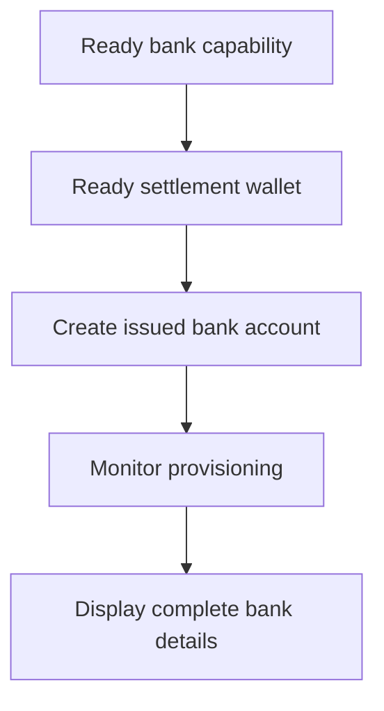

當客戶需要可重複使用的銀行資料時,請使用發行的銀行帳戶。若是綁定特定金額的一次性入金指令,請改用[接收資金](/zh-Hant/integration/receive-funds)。


```mermaid
flowchart TD
  A["Ready bank capability"] --> B["Ready settlement wallet"]
  B --> C["Create issued bank account"]
  C --> D["Monitor provisioning"]
  D --> E["Display complete bank details"]
```

## 開始前

您需要一個客戶 ID、對應方法與幣別已就緒的銀行能力,以及同一客戶名下已就緒的發行錢包。請透過[能力與任務](/zh-Hant/integration/onboarding/capabilities-and-requirements) 完成待辦事項。

## 1. 建立或選擇結算錢包

透過[帳戶與錢包](/zh-Hant/integration/accounts#create-the-account) 建立一個發行錢包,然後再次讀取。僅在其當前狀態允許結算時繼續。

將回應取得的 `data.id` 儲存為 `SETTLEMENT_WALLET_ID`。不要將外部錢包用於 `settlement.accountId`。

## 2. 建立發行的銀行帳戶

使用 [`POST /v3/customers/{customerId}/accounts`](/api-reference/accounts/post-v3-customers-by-customer-id-accounts),並搭配以下標頭:

```http
X-API-Key: ${SWIPELUX_API_KEY}
Idempotency-Key: issued-bank-account-001
Content-Type: application/json
```

傳送以下請求主體:

```json
{
  "origin": "issued",
  "type": "bank",
  "method": "ach",
  "country": "US",
  "currency": "USD",
  "settlement": {
    "accountId": "${SETTLEMENT_WALLET_ID}"
  },
  "label": "USD account"
}
```

將回傳的 `data.id` 儲存為 `BANK_ACCOUNT_ID`。同時保留 `data.status`、`data.openTaskIds`、`data.details` 以及結算關係。

選用的請求欄位:

| 欄位 | 適用對象 | 行為 |
| --- | --- | --- |
| `institution` | 發行的 `ach`、`wire` 與 `swift` | 僅選定此銀行。Swipelux 不會改用其他銀行。請使用支援能力回應中回傳的機構 ID。 |
| `allowPending` | 發行的 `ach`、`wire` 與 `swift` | 設為 `true` 可在所選銀行的申請等待核准期間先儲存請求。需要搭配 `institution`。 |
| `settlement.currency` | 發行的 `USD` 銀行帳戶 | `USDC` 或 `USDT`。設定交付至結算錢包的穩定幣。 |

### 選擇銀行 {#choose-the-bank}

當客戶需要特定銀行的銀行資料時,請傳送 `institution`。Swipelux 會為每個客戶、方法、幣別與機構的組合保留一個發行帳戶。若省略 `institution`,則每個方法與幣別只會有一個涵蓋所有銀行的發行帳戶,此時針對同一方法與幣別再次提出建立請求會回傳 `409 conflict`。

帳戶讀取會以 `institution` 回傳所選銀行,其中包含 `id`、`name` 與 `bic`。`bic` 可能為 `null`。

冪等性適用於所選銀行。重送相同請求會回傳原本的帳戶。在相同的 `Idempotency-Key` 下變更 `institution` 會回傳 `409 idempotency_conflict`。

### 在銀行核准前儲存請求 {#save-the-request-before-bank-approval}

預設情況下,Swipelux 僅在銀行能力就緒後才接受發行銀行帳戶的請求。若要提早收集客戶的帳戶設定,請搭配 `institution` 傳送 `allowPending: true`:

```json
{
  "origin": "issued",
  "type": "bank",
  "method": "wire",
  "country": "US",
  "currency": "USD",
  "institution": "${INSTITUTION_ID}",
  "allowPending": true,
  "settlement": {
    "accountId": "${SETTLEMENT_WALLET_ID}"
  },
  "label": "USD wire account"
}
```

在銀行審核申請期間,帳戶會回傳 `status: "in_review"`,且 `statusReason.code` 為 `waiting_for_approval`。回應中也會包含 `applicationId` 與該申請的 `openTaskIds`。請透過[能力與任務](/zh-Hant/integration/onboarding/capabilities-and-requirements) 完成這些任務。

已儲存的請求會保留其帳戶 ID、結算錢包與帳戶名額。當申請與能力就緒後,Swipelux 會在同一個 `BANK_ACCOUNT_ID` 下佈建銀行資料。請持續讀取該 ID,切勿建立另一個請求。

若申請先遭到拒絕、取消或封存,帳戶會變為 `rejected`。該帳戶不再佔用帳戶名額,因此您可以傳送新的請求。

### 選擇結算幣別 {#choose-the-settlement-currency}

預設情況下,存款會以結算錢包的幣別結算。將 `settlement.currency` 設為 `USDC` 或 `USDT`,即可不受錢包幣別限制,自行選擇交付的資產:

```json
{
  "settlement": {
    "accountId": "${SETTLEMENT_WALLET_ID}",
    "currency": "USDT"
  }
}
```

帳戶讀取會回傳已儲存的選擇,包括帳戶仍在佈建期間。日後變更結算幣別不會變更錢包,也不會重新計價 Swipelux 已歸屬於該帳戶的存款。

銀行帳戶 ID 與錢包 ID 具有不同的角色。透過銀行帳戶 ID 讀取佈建狀態與銀行資料;使用結算錢包 ID 標識存款所要記入的位置。

## 3. 監控佈建進度

於建立後及每次相關 webhook 後,讀取 [`GET /v3/customers/{customerId}/accounts/{accountId}`](/api-reference/accounts/get-v3-customers-by-customer-id-accounts-by-account-id)。

在 `details` 尚未提供時,請將客戶介面維持在等待狀態。若 `openTaskIds` 不為空,請完成最新的任務並重新讀取帳戶。切勿以經過時間推論就緒狀態。

若帳戶是以 `allowPending: true` 儲存,在銀行核准申請之前,帳戶會維持 `in_review`,且 `statusReason.code` 為 `waiting_for_approval`。

若最新的 `statusReason.code` 為 `awaiting_assignment`,請透過[接收資金](/zh-Hant/integration/receive-funds) 為同一位客戶、同一能力與同一結算錢包建立第一筆入金,然後再次讀取該銀行帳戶。僅在當前帳戶要求時才走這條分支。

## 4. 安全地呈現銀行資料

僅顯示最新一次帳戶讀取所回傳的完整資料。當 `details.referenceRequired` 為 true 時,請顯示完整的 `details.reference` 並使其可複製。當其為 false 時,切勿自行編造參考編號。

對於發行的 `swift` 帳戶,若有回傳,請顯示 `details.swiftCode`(收款銀行的 BIC)、`details.accountNumber`、`details.accountHolderName` 與 `details.accountHolderAddress`。匯款人必須將受益人地址完整複製到國際電匯中。同時也請顯示 `details.bankAddress` 以及帳戶回傳的任何中介銀行欄位。

這些銀行資料可重複使用。請勿以已報價入金中的入金座標取代它們,因為那些座標僅屬於該筆轉帳。

接下來,請加入 [Webhooks](/zh-Hant/integration/webhooks),讓佈建更新能夠送達您的應用程式,而不必讓客戶停留在輪詢畫面。
