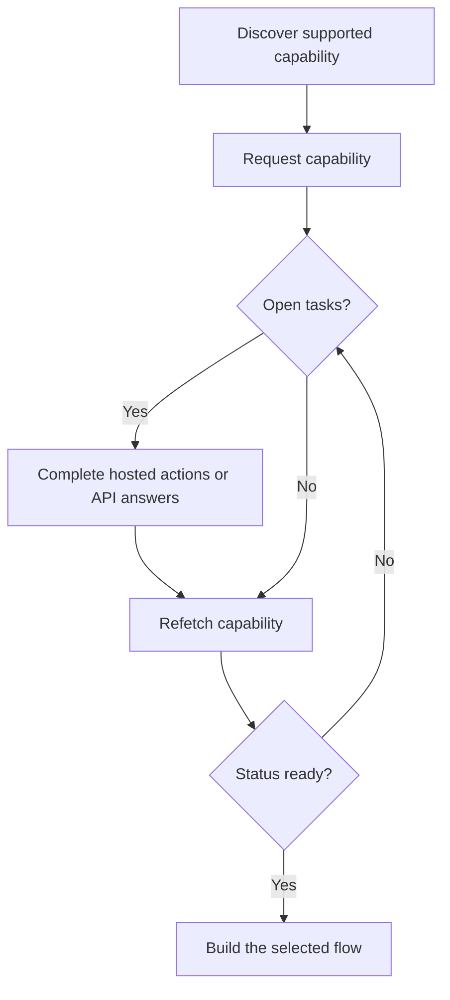

能力(capability)會告訴您客戶是否能使用特定的結果、支付方式與方向。待辦任務(open tasks)則告訴您在該能力或相關資源可以繼續之前必須完成哪些事項。



```bash
export API_BASE='https://platform.swipelux.com'
export SWIPELUX_API_KEY='replace-with-your-api-key'
```

## 探索支援的能力

使用 [`GET /v3/customers/{customerId}/capabilities/supported`](/api-reference/capabilities/get-v3-customers-by-customer-id-capabilities-supported) 讀取客戶當前可用的選項:

```bash
curl --request GET \
  "${API_BASE}/v3/customers/${CUSTOMER_ID}/capabilities/supported" \
  --header "X-API-Key: ${SWIPELUX_API_KEY}"
```

選擇符合預期 `directions`、`method` 與 `accountType` 的回應項目。僅在 `availability` 為 `available` 或 `beta`,且 `eligibility.eligible` 為 `true` 時繼續。若回傳了 `institutions`,僅從該回應中選擇一個 ID。

將選定的 `data[].id` 儲存為 `CAPABILITY_ID`。切勿從其他客戶或其他環境複製 capability ID。

### 共用型與專屬型帳戶類型

銀行能力有兩種變體,分別以 `accountType` 欄位與 capability ID 尾綴(例如 `ach_pooled`、`wire_named`)標示:

- **`pooled`**: 共用的 Swipelux 銀行帳戶。每筆入金使用唯一的參考編號來路由資金。用於一次性轉帳。
- **`named`**: 為客戶專屬的銀行資料(虛擬 IBAN、專屬 ACH 帳戶)。可重複使用並可與任何付款人分享。[發行銀行帳戶](/zh-Hant/integration/issue-bank-account)必須使用此類型。

預設請採用 `pooled`。僅在客戶需要可重複使用的銀行資料時才使用 `named`。可在 `supported` 回應中查看有哪些變體可用。

## 申請能力

使用 [`POST /v3/customers/{customerId}/capabilities/{capabilityId}`](/api-reference/capabilities/post-v3-customers-by-customer-id-capabilities-by-capability-id) 申請所選的選項:

```bash
curl --request POST \
  "${API_BASE}/v3/customers/${CUSTOMER_ID}/capabilities/${CAPABILITY_ID}" \
  --header "X-API-Key: ${SWIPELUX_API_KEY}" \
  --header "Idempotency-Key: capability-request-001" \
  --header "Content-Type: application/json" \
  --data '{}'
```

僅在您需要從支援能力回應所提供的 ID 中挑選時,才使用明確的 `institutions` 陣列。

將 `data.status` 儲存為 `CAPABILITY_STATUS`、`data.openTaskIds` 儲存為 `OPEN_TASK_IDS`,並將每個 `data.applications[].id` 存入 `APPLICATION_IDS`。

## 完成當前任務 {#complete-current-tasks}

使用 [`GET /v3/customers/{customerId}/tasks`](/api-reference/tasks/list-customer-tasks) 列出任務,從 `OPEN_TASK_IDS` 中選擇 ID,然後使用 [`GET /v3/customers/{customerId}/tasks/{taskId}`](/api-reference/tasks/get-customer-task) 讀取每個當前任務:

```bash
curl --request GET \
  "${API_BASE}/v3/customers/${CUSTOMER_ID}/tasks/${TASK_ID}" \
  --header "X-API-Key: ${SWIPELUX_API_KEY}"
```

請使用最新的 `data.revision` 與 `data.requirements`。若兩者中任一可能已變更,請在提交前立即重新讀取任務。

### 託管操作

在任務詳細資料回應中，`verificationSessions` 與 `tosSessions` 的每一筆項目都包含 `action` 物件。任務清單回應不包含這些動作連結。請儲存每個工作階段的 `id`，並在引導客戶前讀取 `action.kind`；不要從工作階段的 `status` 推斷連結是否可用。

- `action.kind: "available"` 會包含 `action.url` 與 `action.expiresAt`（目前一律為 `null`）。請儲存 `action.url`，將客戶引導至該網址，然後再次讀取任務。工作階段層級的 `url` 與 `expiresAt` 欄位包含相同的值。
- `action.kind: "unavailable"` 表示不應顯示連結。工作階段層級的 `url` 與 `expiresAt` 欄位不存在。僅憑工作階段的 `status` 無法判定會收到哪種動作類型。

```json
{
  "data": {
    "verificationSessions": [
      {
        "id": "vfy_000000000000000003",
        "key": "identity_verification",
        "type": "identity_verification",
        "status": "action_required",
        "action": {
          "kind": "available",
          "url": "https://platform.swipelux.com/kyc/redirect/cus_000000000000000001/tsk_000000000000000002/vfy_000000000000000003",
          "expiresAt": null
        },
        "url": "https://platform.swipelux.com/kyc/redirect/cus_000000000000000001/tsk_000000000000000002/vfy_000000000000000003",
        "expiresAt": null
      }
    ],
    "tosSessions": [
      {
        "id": "vfy_000000000000000004",
        "key": "terms_of_service",
        "type": "terms_of_service",
        "status": "completed",
        "action": { "kind": "unavailable" }
      }
    ]
  }
}
```

這些是與任務相關的操作,而不是獨立的客戶驗證生命週期。

### 上傳文件 {#upload-documents}

當要求提供文件時,請使用 [`POST /v3/customers/{customerId}/documents`](/api-reference/documents/post-v3-customers-by-customer-id-documents) 上傳:

```bash
export DOCUMENT_PATH='/absolute/path/to/requested-document.pdf'

curl --request POST \
  "${API_BASE}/v3/customers/${CUSTOMER_ID}/documents" \
  --header "X-API-Key: ${SWIPELUX_API_KEY}" \
  --header "Idempotency-Key: customer-document-001" \
  --form "file=@${DOCUMENT_PATH}"
```

在提交引用該文件的答覆前,將回傳的 `data.id` 儲存為 `DOCUMENT_ID`。

### API 答覆

使用 [`POST /v3/customers/{customerId}/tasks/{taskId}/submissions`](/api-reference/task-submissions/create-customer-task-submission) 為當前版本提交一組完整的答覆:

```bash
curl --request POST \
  "${API_BASE}/v3/customers/${CUSTOMER_ID}/tasks/${TASK_ID}/submissions" \
  --header "X-API-Key: ${SWIPELUX_API_KEY}" \
  --header "Idempotency-Key: task-submission-001" \
  --header "Content-Type: application/json" \
  --data @- <<'JSON'
{
  "taskRevision": 3,
  "answers": [
    {
      "requirementId": "req_from_current_task",
      "answer": {
        "type": "text",
        "value": "Current answer"
      }
    }
  ]
}
JSON
```

請從最新的任務中取用每個 requirement ID 與答覆類型。若 API 回報任務已變更,請重新讀取,並根據新版本重新建構提交內容。

## 能力就緒後繼續

使用 [`GET /v3/customers/{customerId}/capabilities/{capabilityId}`](/api-reference/capabilities/get-v3-customers-by-customer-id-capabilities-by-capability-id) 再次讀取能力:

```bash
curl --request GET \
  "${API_BASE}/v3/customers/${CUSTOMER_ID}/capabilities/${CAPABILITY_ID}" \
  --header "X-API-Key: ${SWIPELUX_API_KEY}"
```

將儲存的狀態與任務 ID 替換為最新的回應。僅在當前能力狀態允許您預期建立的帳戶、報價或轉帳時才繼續。

接下來,請於[常見流程](/zh-Hant/integration/common-flows) 中選擇對應的路徑。
