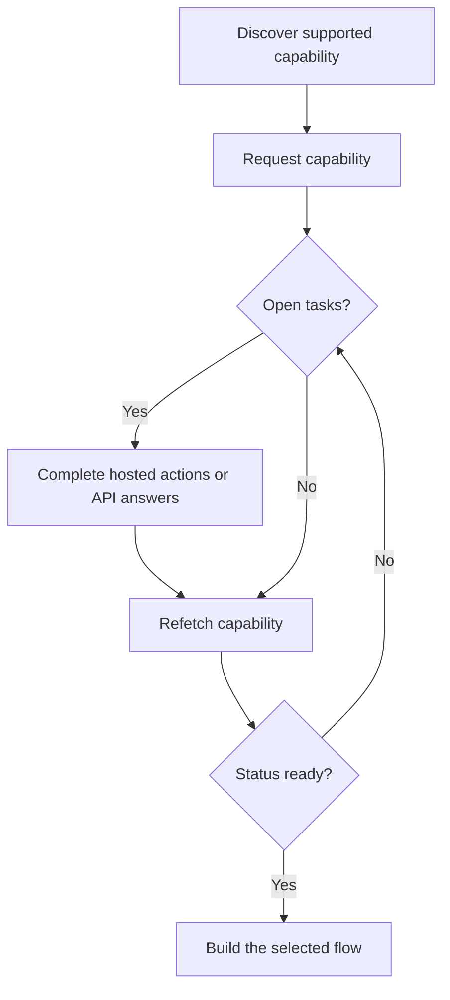

能力(capability)會告訴您客戶是否能使用特定的結果、支付方式與方向。待辦任務(open tasks)則告訴您在該能力或相關資源可以繼續之前必須完成哪些事項。


```mermaid
flowchart TD
  A["Discover supported capability"] --> B["Request capability"]
  B --> C{"Open tasks?"}
  C -->|"Yes"| D["Complete hosted actions or API answers"]
  D --> E["Refetch capability"]
  C -->|"No"| E
  E --> F{"Status ready?"}
  F -->|"No"| C
  F -->|"Yes"| G["Build the selected flow"]
```

```bash
export API_BASE='https://platform.swipelux.com'
export SWIPELUX_API_KEY='replace-with-your-api-key'
```

## 探索支援的能力

使用 [`GET /v3/customers/{customerId}/capabilities/supported`](/api-reference/capabilities/get-v3-customers-by-customer-id-capabilities-supported) 讀取客戶當前可用的選項:

```bash
curl --request GET \
  "${API_BASE}/v3/customers/${CUSTOMER_ID}/capabilities/supported" \
  --header "X-API-Key: ${SWIPELUX_API_KEY}"
```

選擇符合預期 `directions`、`method` 與 `accountType` 的回應項目。僅在 `availability` 為 `available` 或 `beta`,且 `eligibility.eligible` 為 `true` 時繼續。若回傳了 `institutions`,僅從該回應中選擇一個 ID。

每個機構項目都包含 `logoUrl` 與 `isDefault` 旗標。請使用 `logoUrl` 在銀行選擇介面中顯示銀行標誌,並在其為 `null` 時顯示您自己的通用銀行圖示。`isDefault` 僅適用於此客戶與此能力,而非機構的全域設定。[`GET /v3/institutions`](/api-reference/institutions/get-v3-institutions) 會回傳相同且可為 null 的 `logoUrl`。機構 ID 為不透明值,因此請在不修改程式碼的情況下處理新的 ID。

```json
{
  "institutions": [
    {
      "id": "jpmorgan",
      "name": "JPMorgan Chase",
      "bic": "CHASUS33",
      "logoUrl": "https://wallet.swipelux.com/bank-logos/jpmorgan.png",
      "countries": ["US"],
      "isDefault": true
    }
  ]
}
```

將選定的 `data[].id` 儲存為 `CAPABILITY_ID`。切勿從其他客戶或其他環境複製 capability ID。

### 共用型與專屬型帳戶類型

銀行能力有兩種變體,分別以 `accountType` 欄位與 capability ID 尾綴(例如 `ach_pooled`、`wire_named`)標示:

- **`pooled`**: 共用的 Swipelux 銀行帳戶。每筆入金使用唯一的參考編號來路由資金。用於一次性轉帳。
- **`named`**: 為客戶專屬的銀行資料(虛擬 IBAN、專屬 ACH 帳戶)。可重複使用並可與任何付款人分享。[發行銀行帳戶](/zh-Hant/integration/issue-bank-account)必須使用此類型。

預設請採用 `pooled`。僅在客戶需要可重複使用的銀行資料時才使用 `named`。可在 `supported` 回應中查看有哪些變體可用。

若要接收 SWIFT 存款或發行 SWIFT 銀行資料,請使用 `swift_named`。`swift_pooled` 僅支援出金,因此請在支援能力回應中檢查每個選項的 `directions`。專屬型 SWIFT 帳戶會回傳可重複使用的收款資料,包括銀行的 BIC、在需要時提供的參考編號,以及在銀行提供時的受益人地址。

對於發行的 ACH、Wire 與 SWIFT 帳戶,您可以透過 `institution` 指定特定銀行,並在銀行核准客戶之前先儲存帳戶請求。請參閱[發行銀行帳戶](/zh-Hant/integration/issue-bank-account#choose-the-bank)。

## 申請能力

使用 [`POST /v3/customers/{customerId}/capabilities/{capabilityId}`](/api-reference/capabilities/post-v3-customers-by-customer-id-capabilities-by-capability-id) 申請所選的選項:

```bash
curl --request POST \
  "${API_BASE}/v3/customers/${CUSTOMER_ID}/capabilities/${CAPABILITY_ID}" \
  --header "X-API-Key: ${SWIPELUX_API_KEY}" \
  --header "Idempotency-Key: capability-request-001" \
  --header "Content-Type: application/json" \
  --data '{}'
```

僅在您需要從支援能力回應所提供的 ID 中挑選時,才使用明確的 `institutions` 陣列。

將 `data.status` 儲存為 `CAPABILITY_STATUS`、`data.accountProvisioning` 儲存為 `ACCOUNT_PROVISIONING_STATUS`、`data.openTaskIds` 儲存為 `OPEN_TASK_IDS`,並將每個 `data.applications[].id` 存入 `APPLICATION_IDS`。

### 每家銀行共用的申請 {#shared-applications-per-bank}

對於專屬型銀行能力,每位客戶在每家銀行各有一個申請案件。共用型與平台能力使用不隸屬任何銀行的案件。Swipelux 會在您申請的所有相容能力之間共用同一個案件:

- 一次核准可涵蓋多項能力。例如,某家銀行已核准的案件可以讓 ACH 與 wire 能力都變為 `ready`。
- 之後符合現有案件的申請會重複使用該案件。Swipelux 不會開啟第二個申請,也不會新增重複的任務。
- 不同銀行的案件彼此獨立。某家銀行的拒絕不會影響另一家銀行的案件。

申請的回應會告訴您 Swipelux 使用了哪個案件:

- `201` 表示該申請開啟了新的申請案件。
- `200` 表示該申請對應到客戶既有的申請案件,例如針對客戶已持有的銀行能力重複申請,或申請已取消的能力。針對 `card` 或 `stablecoin_transfers` 的重複申請仍會回傳 [`409 capability_already_exists`](/integration/errors#capability-already-exists)。
- `selectedApplicationId` 是與 `data` 並列的頂層欄位,包含該申請所選擇或開啟之案件的 ID。當申請未選擇任何案件時,Swipelux 會省略此欄位。冪等重放會回傳相同的值。

精簡後的回應:

```json
{
  "data": {
    "id": "ach_named",
    "status": "pending",
    "openTaskIds": ["tsk_000000000000000002"],
    "applications": [{ "id": "apl_000000000000000005", "status": "in_review" }]
  },
  "selectedApplicationId": "apl_000000000000000005"
}
```

對於專屬型能力,請再次傳送相同的 `institutions` 清單以選擇同一個案件,或傳送單一機構 ID 以指定該銀行。已最終拒絕該客戶的銀行會被略過。當您只指定該銀行,或所有符合資格的銀行都已拒絕該客戶時,申請會回傳 [`409 capability_terminally_rejected`](/integration/errors#capability-terminally-rejected)。若要在遭拒後嘗試另一家銀行,請使用該銀行的機構 ID 再次申請該能力。

能力的狀態反映客戶所有相關案件的情況。對於專屬型能力,只要有一個 `ready` 案件的核准涵蓋該能力,即足以使其變為 `ready`,不論其他銀行回報什麼。共用型能力還需等待其方式檢查完成,檢查結果會在客戶申請清單的 `probes` 中回報。

#### 列出客戶的申請 {#list-the-customers-applications}

使用 [`GET /v3/customers/{customerId}/applications`](/api-reference/capabilities/get-v3-customers-by-customer-id-applications) 列出客戶的所有申請案件。結果會以 `nextCursor` 與 `hasMore` 分頁,並接受 `updatedAfter`:

```bash
curl --request GET \
  "${API_BASE}/v3/customers/${CUSTOMER_ID}/applications" \
  --header "X-API-Key: ${SWIPELUX_API_KEY}"
```

每個項目都包含能力的 `applications[]` 中回傳的申請欄位,另外還有:

- `scope`: `named` 表示某一家銀行的案件,`provider_pooled` 或 `platform` 表示不隸屬任何銀行的案件,`null` 表示未分類的歷史案件。`provider_pooled` 與 `platform` 案件不會包含 `institution`。
- `requestedScope[]`: 針對該案件申請的能力鍵,每個都附有其首次的 `requestedAt`。項目永遠不會被移除。
- `coverage[]`: 該案件的核准所涵蓋的能力鍵,每個都附有 `grantedAt` 與 `source`。涵蓋範圍記錄的是範圍,而非授權。請讀取能力以取得其目前狀態。
- `probes[]`: 針對該案件所涵蓋之共用型能力鍵的方式檢查,每個都附有 `capabilityKey`、`status` 與 `reason`。專屬型能力鍵永遠不需要檢查。
- `generation`、`predecessorApplicationId` 與 `supersededByApplicationId`: 承繼連結。當 `supersededByApplicationId` 已設定時,表示該案件已被取代。請依該 ID 前往目前的案件。

精簡後的回應:

```json
{
  "data": [
    {
      "id": "apl_000000000000000005",
      "status": "ready",
      "scope": "named",
      "institution": { "id": "jpmorgan", "name": "JPMorgan Chase", "bic": "CHASUS33" },
      "requestedScope": [
        { "capabilityKey": "ach_named", "requestedAt": "2026-09-20T10:00:00.000Z" }
      ],
      "coverage": [
        { "capabilityKey": "ach_named", "grantedAt": "2026-09-22T12:00:00.000Z", "source": "approval" },
        { "capabilityKey": "wire_named", "grantedAt": "2026-09-22T12:00:00.000Z", "source": "approval" }
      ],
      "probes": [],
      "generation": 1,
      "predecessorApplicationId": null,
      "supersededByApplicationId": null
    }
  ],
  "nextCursor": null,
  "hasMore": false
}
```

## 完成當前任務 {#complete-current-tasks}

使用 [`GET /v3/customers/{customerId}/tasks`](/api-reference/tasks/list-customer-tasks) 列出任務,從 `OPEN_TASK_IDS` 中選擇 ID,然後使用 [`GET /v3/customers/{customerId}/tasks/{taskId}`](/api-reference/tasks/get-customer-task) 讀取每個當前任務:

```bash
curl --request GET \
  "${API_BASE}/v3/customers/${CUSTOMER_ID}/tasks/${TASK_ID}" \
  --header "X-API-Key: ${SWIPELUX_API_KEY}"
```

請使用最新的 `data.revision` 與 `data.requirements`。若兩者中任一可能已變更,請在提交前立即重新讀取任務。

### 重複使用的個人資料佐證 {#reused-profile-evidence}

對於接受直接 API 提交的申請資料收集任務,Swipelux 會重複使用客戶已提供的資訊。當此類任務建立或重新核對時,Swipelux 會檢查客戶個人資料以及客戶自行上傳的文件。已有可用個人資料值或文件佐證的符合資格要求會移至 `in_review`,而不會維持可操作狀態。個人資料更新與新的文件上傳也會對既有任務觸發相同的檢查。

只有缺少或不相容的值會維持可操作狀態。重複使用並不代表核准該佐證。Swipelux 仍會審查它。明確的更正要求與先前已答覆的要求會維持可操作狀態。所有者與關係人的文件不會被重複使用,而僅透過託管工作階段收集的要求則維持其一般流程。

### 呈現要求 {#render-requirements}

請根據每項要求所回傳的中繼資料建構表單,而不是根據要求鍵。要求可以包含選用的簡短 `title`,且每個 `request` 都包含要顯示在標題下方的 `prompt`。

`request.type: "profile"` 的要求會以 `profilePointer` 標識個人資料欄位,並加入輸入中繼資料:

- `allowedValues`: 純量欄位的允許值,或陣列欄位中每個項目的允許值。請提交這些值,而非翻譯後的顯示標籤。
- `valueSchema`: 一份自成一體的 JSON Schema Draft 7 文件,描述輸入的形態、巢狀屬性、必填欄位與結構限制。物件上的列舉會出現在相關屬性上,例如稅務識別碼的 `valueSchema.items.properties.type.enum`。Swipelux 在提交後仍會套用跨欄位與審查驗證,因此通過結構描述的值仍可能遭到拒絕。
- `valueType: "country"`,或陣列的 `itemValueType: "country"`: 此欄位接受大寫的 ISO 3166-1 alpha-2 代碼。`valueSchema` 中的巢狀國家屬性使用 `format: "iso-3166-1-alpha-2"`。請使用標準國家清單來取得在地化標籤。

```json
{
  "id": "req_000000000000000010",
  "key": "account_purposes",
  "title": "Account purpose",
  "status": "action_required",
  "request": {
    "type": "profile",
    "prompt": "Select every purpose that applies.",
    "required": true,
    "profilePointer": "/financialProfile/accountPurposes",
    "valueType": "array",
    "itemValueType": "string",
    "allowedValues": ["business_expenses", "ecommerce", "payroll"],
    "valueSchema": {
      "$schema": "http://json-schema.org/draft-07/schema#",
      "type": "array",
      "items": { "enum": ["business_expenses", "ecommerce", "payroll"] }
    }
  }
}
```

此範例縮短了值目錄,API 會回傳所有允許的值。部分個人資料要求沒有已發布的結構描述,因此會省略 `valueSchema` 與 `allowedValues`。請根據 `prompt` 與 `valueType` 呈現這些要求。

每個未完成任務都包含 `dueAt` 時間戳記。當 Swipelux 建立任務且未明確指定到期日期時,`dueAt` 預設為任務 `createdAt` 之後整整 31 天。請將 `dueAt` 視為僅供參考:您無法透過 API 設定它,它也不會觸發任何自動生命週期轉換。只有單獨的 `deadline` 欄位(如存在)才會觸發自動轉換。

### 託管操作

在任務詳細資料回應中，`verificationSessions` 與 `tosSessions` 的每一筆項目都包含 `action` 物件。任務清單回應不包含這些動作連結。請儲存每個工作階段的 `id`，並在引導客戶前讀取 `action.kind`；不要從工作階段的 `status` 推斷連結是否可用。

- `action.kind: "available"` 會包含 `action.url` 與 `action.expiresAt`（目前一律為 `null`）。請儲存 `action.url`，將客戶引導至該網址，然後再次讀取任務。工作階段層級的 `url` 與 `expiresAt` 欄位包含相同的值。
- `action.kind: "unavailable"` 表示不應顯示連結。工作階段層級的 `url` 與 `expiresAt` 欄位不存在。僅憑工作階段的 `status` 無法判定會收到哪種動作類型。

```json
{
  "data": {
    "verificationSessions": [
      {
        "id": "vfy_000000000000000003",
        "key": "identity_verification",
        "type": "identity_verification",
        "status": "action_required",
        "action": {
          "kind": "available",
          "url": "https://platform.swipelux.com/kyc/redirect/cus_000000000000000001/tsk_000000000000000002/vfy_000000000000000003",
          "expiresAt": null
        },
        "url": "https://platform.swipelux.com/kyc/redirect/cus_000000000000000001/tsk_000000000000000002/vfy_000000000000000003",
        "expiresAt": null
      }
    ],
    "tosSessions": [
      {
        "id": "vfy_000000000000000004",
        "key": "terms_of_service",
        "type": "terms_of_service",
        "status": "completed",
        "action": { "kind": "unavailable" }
      }
    ]
  }
}
```

這些是與任務相關的操作,而不是獨立的客戶驗證生命週期。

### 上傳文件 {#upload-documents}

當要求提供文件時,請使用 [`POST /v3/customers/{customerId}/documents`](/api-reference/documents/post-v3-customers-by-customer-id-documents) 上傳:

```bash
export DOCUMENT_PATH='/absolute/path/to/requested-document.pdf'

curl --request POST \
  "${API_BASE}/v3/customers/${CUSTOMER_ID}/documents" \
  --header "X-API-Key: ${SWIPELUX_API_KEY}" \
  --header "Idempotency-Key: customer-document-001" \
  --form "file=@${DOCUMENT_PATH}"
```

在提交引用該文件的答覆前,將回傳的 `data.id` 儲存為 `DOCUMENT_ID`。

若之後要取回已儲存的檔案,請呼叫 [`GET /v3/customers/{customerId}/documents/{documentId}/download`](/api-reference/documents/get-v3-customers-by-customer-id-documents-by-document-id-download)。Swipelux 會回傳一個 `url`,以附件形式下載檔案,且該連結於一小時後到期。已封存的文件會回傳 `404`。

### API 答覆

使用 [`POST /v3/customers/{customerId}/tasks/{taskId}/submissions`](/api-reference/task-submissions/create-customer-task-submission) 為當前版本提交一組完整的答覆:

```bash
curl --request POST \
  "${API_BASE}/v3/customers/${CUSTOMER_ID}/tasks/${TASK_ID}/submissions" \
  --header "X-API-Key: ${SWIPELUX_API_KEY}" \
  --header "Idempotency-Key: task-submission-001" \
  --header "Content-Type: application/json" \
  --data @- <<'JSON'
{
  "taskRevision": 3,
  "answers": [
    {
      "requirementId": "req_from_current_task",
      "answer": {
        "type": "text",
        "value": "Current answer"
      }
    }
  ]
}
JSON
```

請從最新的任務中取用每個 requirement ID 與答覆類型。若 API 回報任務已變更,請重新讀取,並根據新版本重新建構提交內容。

### 企業的最終受益人前置條件 {#beneficial-owner-prerequisite-for-businesses}

申請需要最終受益人佐證的企業能力,即使客戶尚未有符合資格的所有者,也會成功。該能力會以 `restricted` 建立,並帶有 `statusReason.code: tasks_due`,而企業資料收集任務會要求缺少的所有權事實,包括所有權結構。

同一任務帶有一項 `resource_reference` 要求,其請求包含 `qualification: "beneficial_owner"`:

```json
{
  "type": "resource_reference",
  "prompt": "Add or select a qualifying beneficial owner.",
  "required": true,
  "resourceType": "related_party",
  "qualification": "beneficial_owner"
}
```

當關係人為同一客戶名下的有效 `person` 關係人,且具有 `ownership.declared: true` 或提供的所有權比例達 25 以上時,即符合資格。

該要求是從當前的關係人名冊推導而來,因此您通常不會直接答覆它:

- 建立或更新符合資格的關係人,會在同一次重新評估中滿足該要求,並開啟該所有者本身的個人資料與文件工作。請參閱[新增企業關係人](/zh-Hant/integration/onboarding/customers#add-business-related-parties)。
- 您也可以使用帶有其 `relatedPartyId` 的 `resource_reference` 答覆,明確引用符合資格的關係人。
- 該要求在被滿足後仍會列在當前任務中。當沒有其他未完成的義務時,任務會變為 `satisfied`。
- 封存最後一位符合資格的關係人,或移除使其符合資格的事實,會重新開啟該要求,即使任務先前已為 `satisfied`。

## 能力就緒後繼續

使用 [`GET /v3/customers/{customerId}/capabilities/{capabilityId}`](/api-reference/capabilities/get-v3-customers-by-customer-id-capabilities-by-capability-id) 再次讀取能力:

```bash
curl --request GET \
  "${API_BASE}/v3/customers/${CUSTOMER_ID}/capabilities/${CAPABILITY_ID}" \
  --header "X-API-Key: ${SWIPELUX_API_KEY}"
```

將儲存的狀態、帳戶核發狀態與任務 ID 替換為最新的回應。能力的 `status` 回報權限是否已獲核准。對於會核發帳戶的能力,`accountProvisioning` 會另外回報該帳戶為 `not_started`、`in_progress`、`issued` 或 `failed`;不核發帳戶的能力則會回傳 `not_applicable`。

僅在當前能力狀態允許您預期建立的帳戶、報價或轉帳時才繼續。若流程需要已核發的帳戶,也請等待 `accountProvisioning` 變為 `issued`。

接下來,請於[常見流程](/zh-Hant/integration/common-flows) 中選擇對應的路徑。
