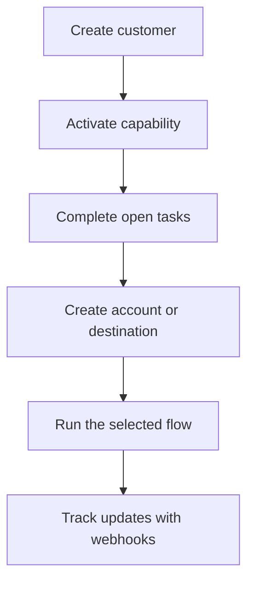

Swipelux 為您的後端提供入駐客戶與資金流動所需的建構模組,不必在您的產品中暴露支付基礎設施。

## 您可以建構什麼

<CardGroup cols={3}>
  <Card title="接收資金" icon="arrow-down-to-line" href="/zh-Hant/integration/receive-funds">
    建立一次性法幣入金指令,並將穩定幣結算至錢包。
  </Card>
  <Card title="發送資金" icon="arrow-up-from-line" href="/zh-Hant/integration/send-funds">
    從客戶錢包發送至第一方帳戶或第三方目的地。
  </Card>
  <Card title="發行銀行帳戶" icon="building-columns" href="/zh-Hant/integration/issue-bank-account">
    佈建可重複使用的銀行帳戶資訊,並連結至結算錢包。
  </Card>
</CardGroup>

## 整合是如何運作的

客戶是擁有該流程的個人或企業。能力(capability)描述該客戶可以使用哪些結果。待辦任務(open tasks)則告訴您在該能力或資源可以繼續前必須完成哪些事項。

## 實際體驗

前往 [demo.swipelux.com](https://demo.swipelux.com) 體驗模擬的 neobank 流程。您也可以[複製起始模板](https://github.com/swipelux/neobank-starter)並自訂其產品介面。

示範與起始模板僅作為產品與介面參考。它們不會取代這些指南或當前的 API 契約。

## 開始建構

<CardGroup cols={3}>
  <Card title="快速入門" icon="rocket" href="/zh-Hant/integration/quickstart">
    建立客戶並執行一次沙箱流程。
  </Card>
  <Card title="常見流程" icon="route" href="/zh-Hant/integration/common-flows">
    比較各種結果所需的設定。
  </Card>
  <Card title="API 參考" icon="code" href="/zh-Hant/api-reference/introduction">
    閱讀請求慣例,並檢視每個 API 操作。
  </Card>
</CardGroup>
