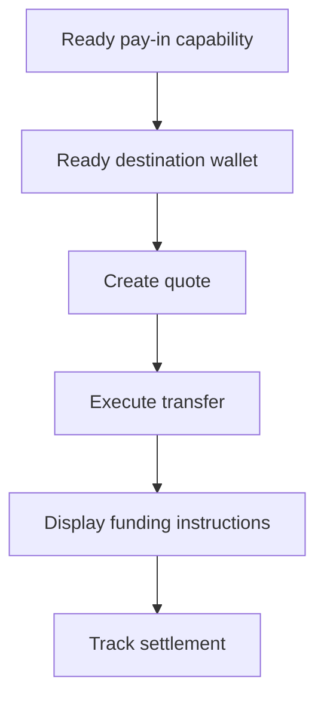

當客戶需要以特定金額入金時,請使用已報價的入金。該筆轉帳會將穩定幣結算至發行的錢包。



## 開始前

您需要同一客戶名下、已就緒的入金能力與已就緒的發行目的地錢包。請透過[能力與任務](/zh-Hant/integration/onboarding/capabilities-and-requirements) 完成任何待辦事項,然後重新讀取兩項資源。

## 1. 建立報價

使用 [`POST /v3/quotes`](/api-reference/money-movement/post-v3-quotes) 建立價格。請傳送以下標頭:

```http
X-API-Key: ${SWIPELUX_API_KEY}
Idempotency-Key: payin-quote-001
Content-Type: application/json
```

```json
{
  "customerId": "${CUSTOMER_ID}",
  "capabilityId": "${CAPABILITY_ID}",
  "externalId": "payin-order-123",
  "in": {
    "amount": "150.00",
    "currency": "USD"
  },
  "destinationId": "${SETTLEMENT_WALLET_ID}",
  "out": {
    "currency": "USDC"
  }
}
```

將 `data.id` 儲存為 `QUOTE_ID`。請直接呈現回傳的金額與費用,而非由匯率重新計算。

## 2. 執行報價

在到期前,使用 [`POST /v3/transfers`](/api-reference/money-movement/post-v3-transfers) 執行當前的報價。請為此筆預期轉帳使用新的金鑰:

```http
X-API-Key: ${SWIPELUX_API_KEY}
Idempotency-Key: payin-transfer-001
Content-Type: application/json
```

```json
{
  "quoteId": "${QUOTE_ID}"
}
```

將轉帳的 `data.id` 儲存為 `TRANSFER_ID`,並保留其當前狀態。

## 3. 取得入金指令

讀取 [`GET /v3/transfers/{transferId}/instructions`](/api-reference/money-movement/get-v3-transfers-by-transfer-id-instructions)。請依回傳的 `data.instructions` 變體進行呈現,不要假設其類型。

這些資料僅屬於該筆轉帳。切勿將某筆轉帳的銀行座標、代碼、託管 URL、金額、參考編號或到期日重複用於另一筆入金。

對於銀行指令,若 `reference.required` 為 true,請於銀行座標旁顯示完整的 `reference.value`,並使其可複製。同時顯示同一組指令中回傳的金額與幣別。

發行的銀行帳戶則不同:它會為後續存款提供可重複使用的資料。若這才是您想要的體驗,請參閱[發行銀行帳戶](/zh-Hant/integration/issue-bank-account)。

## 4. 追蹤結算

於執行後及每次事件後,讀取 [`GET /v3/transfers/{transferId}`](/api-reference/money-movement/get-v3-transfers-by-transfer-id)。請以最新的 `data.state` 驅動面向客戶的狀態。

當轉帳需要進一步操作時,請使用 `data.stateDetail` 與 `data.openTaskIds`。切勿根據預期時程將其標記為已完成。

接下來,請加入 [Webhooks](/zh-Hant/integration/webhooks),並持續同步轉帳狀態,直到其達到您產品可處理的結果。
