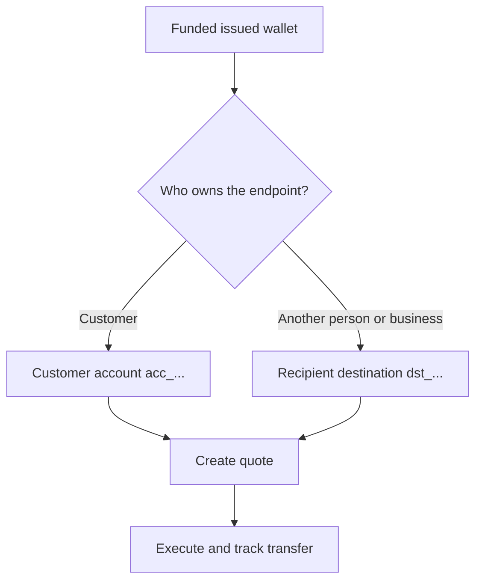

每一筆出金都從已就緒且已入金的發行錢包開始。目的地模型取決於該端點的擁有者。



## 開始前

重新讀取來源錢包。確認其當前狀態允許出金,且可用餘額涵蓋預期的來源金額。將回應取得的 ID 儲存為 `SOURCE_WALLET_ID`。

您也需要當前客戶與所選目的地對應的、已就緒的出金能力。

## 1. 準備目的地

<Tabs>
  <Tab title="第一方">

當該端點由客戶擁有時,請使用客戶名下的外部銀行帳戶。使用 [`POST /v3/customers/{customerId}/accounts`](/api-reference/accounts/post-v3-customers-by-customer-id-accounts) 並搭配以下標頭建立:

```http
X-API-Key: ${SWIPELUX_API_KEY}
Idempotency-Key: payout-account-001
Content-Type: application/json
```

```json
{
  "origin": "external",
  "type": "bank",
  "methods": ["ach", "wire"],
  "country": "US",
  "currency": "USD",
  "details": {
    "routingNumber": "021000021",
    "accountNumber": "123456789",
    "accountType": "checking",
    "bankName": "Example Bank",
    "accountHolderName": "Acme Payments SAS"
  },
  "label": "Customer operating account"
}
```

使用 [`GET /v3/customers/{customerId}/accounts/{accountId}`](/api-reference/accounts/get-v3-customers-by-customer-id-accounts-by-account-id) 讀取。僅在其當前狀態允許出金時繼續。將其 `acc_` ID 儲存為 `PAYOUT_DESTINATION_ID`。

  </Tab>
  <Tab title="第三方">

透過[收款人與目的地](/zh-Hant/integration/recipients) 建立該個人或企業及其銀行或錢包端點。僅在目的地就緒時繼續。

將回傳的 `dst_` ID 儲存為 `PAYOUT_DESTINATION_ID`。切勿將收款人的 `rcp_` ID 作為報價目的地。

  </Tab>
</Tabs>

## 2. 建立出金報價

使用 [`POST /v3/quotes`](/api-reference/money-movement/post-v3-quotes) 並搭配以下標頭:

```http
X-API-Key: ${SWIPELUX_API_KEY}
Idempotency-Key: payout-quote-001
Content-Type: application/json
```

```json
{
  "customerId": "${CUSTOMER_ID}",
  "capabilityId": "${CAPABILITY_ID}",
  "in": {
    "amount": "150.00",
    "currency": "USDC",
    "accountId": "${SOURCE_WALLET_ID}"
  },
  "destinationId": "${PAYOUT_DESTINATION_ID}",
  "out": {
    "currency": "USD"
  }
}
```

將 `data.id` 儲存為 `QUOTE_ID`,並呈現回傳的價格與費用。

## 3. 執行出金

使用 [`POST /v3/transfers`](/api-reference/money-movement/post-v3-transfers) 建立轉帳。請為此次預期執行使用一組新的金鑰:

```http
X-API-Key: ${SWIPELUX_API_KEY}
Idempotency-Key: payout-transfer-001
Content-Type: application/json
```

```json
{
  "quoteId": "${QUOTE_ID}"
}
```

將轉帳的 `data.id` 儲存為 `TRANSFER_ID`。成功的建立只是啟動出金,並不代表已完成送達。

## 4. 追蹤送達

於建立後及每次事件後,讀取 [`GET /v3/transfers/{transferId}`](/api-reference/money-movement/get-v3-transfers-by-transfer-id)。請根據最新的 `data.state`、`data.stateDetail` 與 `data.openTaskIds` 決定要等待、採取行動或呈現最終結果。

接下來,請參閱[報價與轉帳](/zh-Hant/integration/quotes-and-transfers) 了解精確金額、安全的執行恢復,以及轉帳任務。
