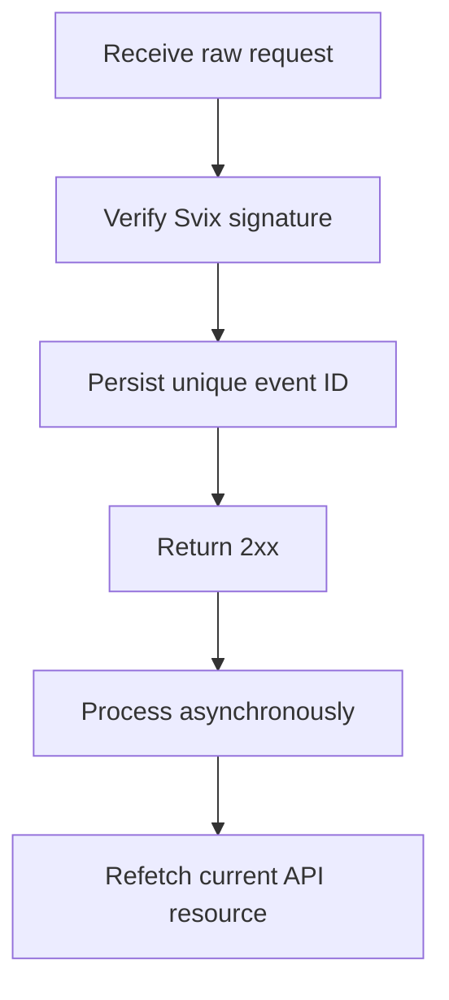

使用 webhook 對非同步變更作出反應。派送是至少一次(at least once)保證,因此重複、延遲與亂序的事件皆屬正常。



## 僅註冊您需要的事件

使用 [`POST /v3/webhooks`](/api-reference/webhooks/post-v3-webhooks) 建立端點。僅訂閱您整合中所需的、有文件記載的事件。此範例使用 [`transfer.state_changed`](/api-reference/webhooks/transfer-state-changed)。

```bash
export API_BASE='https://platform.swipelux.com'
export SWIPELUX_API_KEY='replace-with-your-api-key'

curl --request POST \
  "${API_BASE}/v3/webhooks" \
  --header "X-API-Key: ${SWIPELUX_API_KEY}" \
  --header "Idempotency-Key: webhook-endpoint-001" \
  --header "Content-Type: application/json" \
  --data @- <<'JSON'
{
  "url": "https://example.com/webhooks/swipelux",
  "events": ["transfer.state_changed"]
}
JSON
```

將回應的 `data.id` 儲存為 `WEBHOOK_ID`。開啟由 [`GET /v3/webhooks/portal`](/api-reference/webhooks/get-v3-webhooks-portal) 回傳的入口網站,取得此端點的簽章密鑰,並將其與您的 API 金鑰分別存放在密鑰管理員中。

## 解析前先驗證

Swipelux 透過 Svix 派送新的 webhook 整合。請使用您的端點簽章密鑰以及以下標頭驗證原始請求主體:

- `svix-id`
- `svix-timestamp`
- `svix-signature`

在驗證成功前,切勿解析 JSON 或產生副作用。

```javascript
import { Webhook } from "svix";

const verifier = new Webhook(process.env.SWIPELUX_WEBHOOK_SECRET);

export async function handleSwipeluxWebhook(request) {
  const rawBody = await request.text();
  const event = verifier.verify(rawBody, {
    "svix-id": request.headers.get("svix-id"),
    "svix-timestamp": request.headers.get("svix-timestamp"),
    "svix-signature": request.headers.get("svix-signature"),
  });

  await webhookInbox.insertIfAbsent({
    id: event.id,
    payload: event,
    status: "pending",
  });

  return new Response(null, { status: 204 });
}
```

拒絕缺少或無效簽章的請求。在驗證完成前,請保留原始請求主體。

## 保存、確認,然後處理

在信封 `id` 上設定唯一性約束。持久化已驗證的信封、儘快回傳 `2xx`,然後以非同步方式處理。

若事件 ID 已存在,請確認派送但不重複執行已完成的副作用。透過您自己的重試佇列繼續處理待辦或失敗的本地工作。切勿將信封的 `attempt` 欄位當作去重複的鍵或傳輸重試計數器。

## 重新讀取當前狀態

Webhook 的順序並非權威的資源歷史紀錄。請使用 `resource.type` 與 `resource.id` 定位物件,然後在更新您的系統前,先取得其當前狀態。

對於轉帳事件,呼叫 [`GET /v3/transfers/{transferId}`](/api-reference/money-movement/get-v3-transfers-by-transfer-id):

```bash
curl --request GET \
  "${API_BASE}/v3/transfers/${TRANSFER_ID}" \
  --header "X-API-Key: ${SWIPELUX_API_KEY}"
```

請以當前的 API 回應驅動面向客戶的狀態與後續動作。設計副作用時,即使兩個 worker 以不同順序處理相關事件,也應保持安全。

## 復原派送

使用 [`GET /v3/webhooks/portal`](/api-reference/webhooks/get-v3-webhooks-portal) 開啟派送日誌、重試失敗派送或啟動手動重播。

每次重播皆須經過相同的簽章驗證與可靠收件匣。若欲於停機後復原,請重播受影響的時段,並重新讀取每個所引用的資源。已完成的事件 ID 會保持無操作;未完成的紀錄則會以非同步方式繼續。

接下來,請於沙箱中驗證重複與亂序派送,然後完成[上線](/zh-Hant/integration/go-live) 清單。
