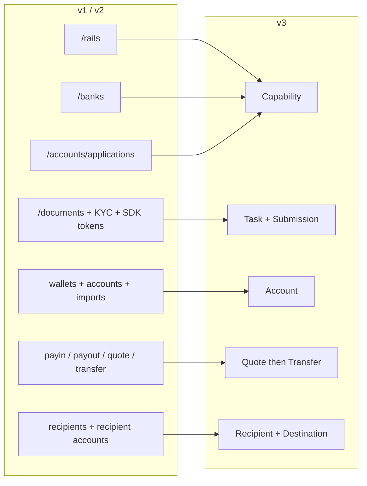
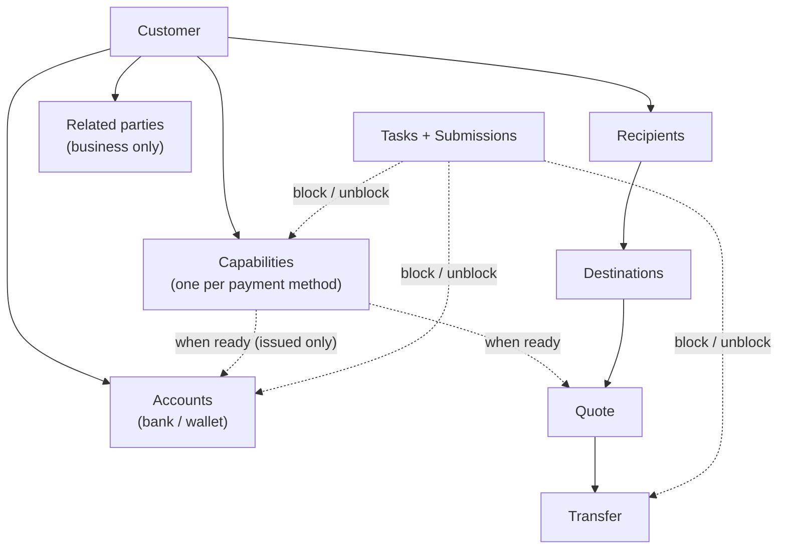
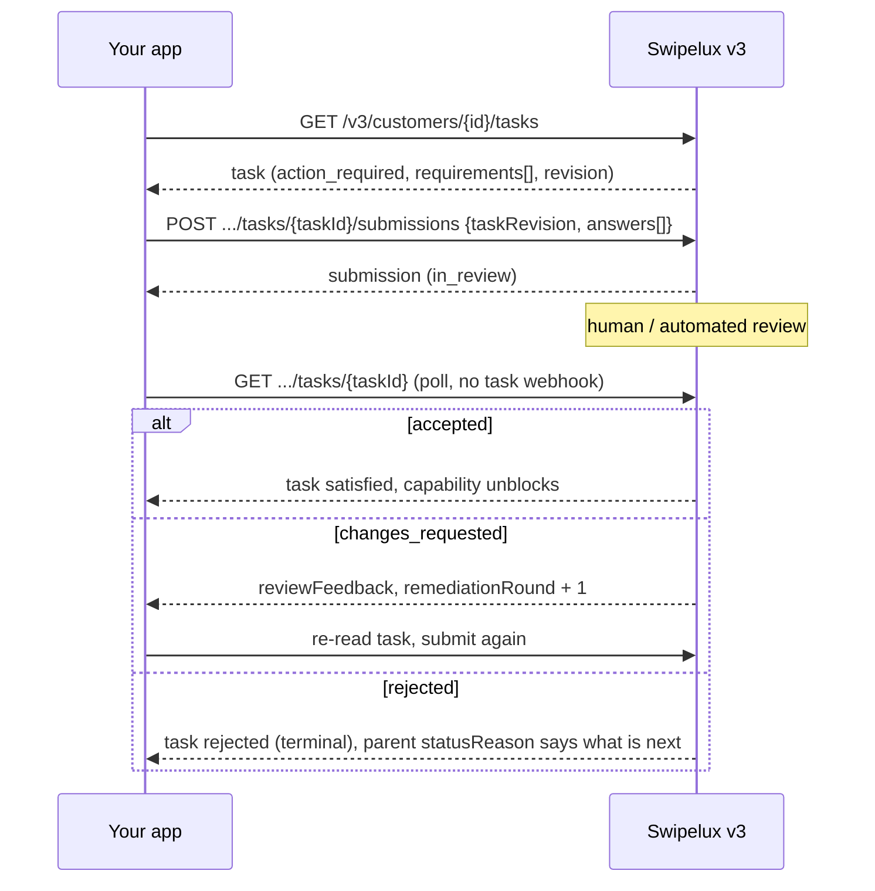
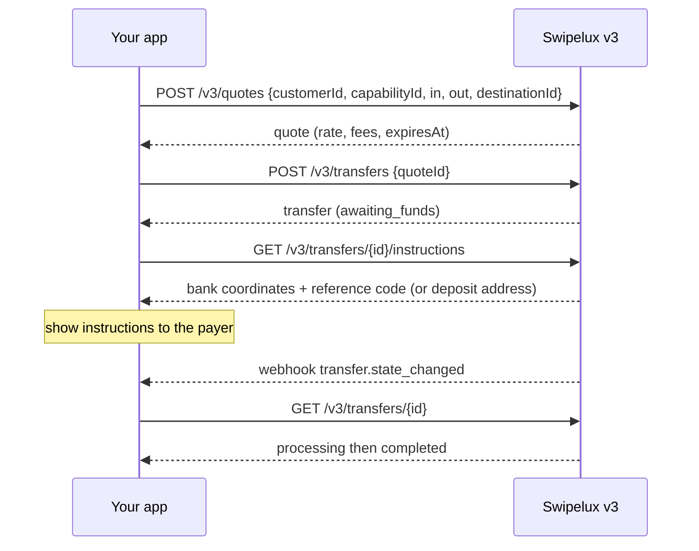
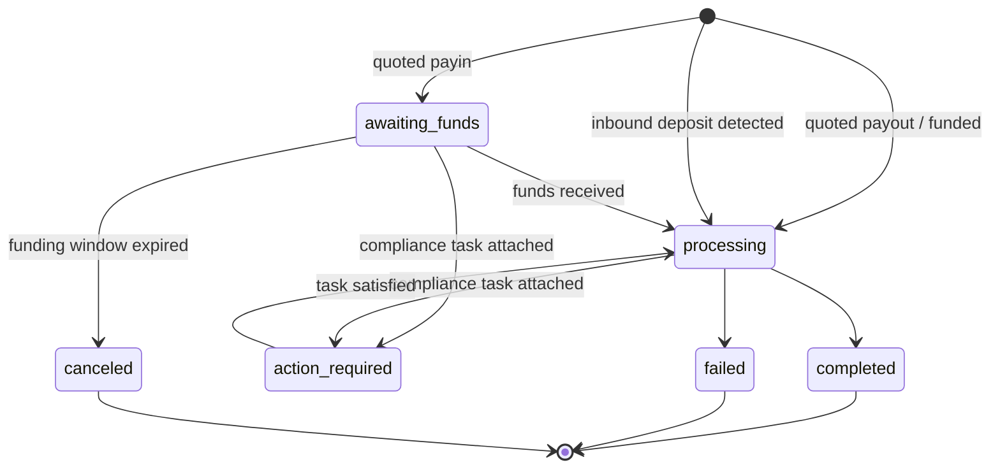
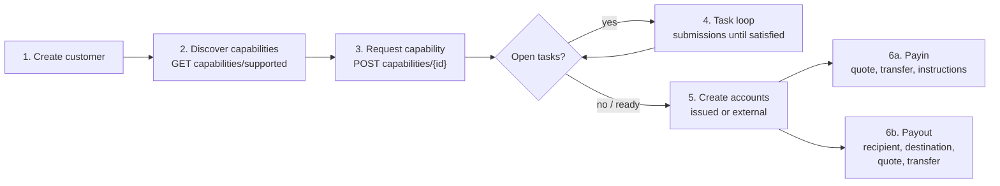

分两遍将您的集成从 API v1 和 v2 迁移到 v3：

- **第 1 部分：概念。** 请先阅读本部分。v3 是一次重塑，而不是改名：如果您把旧端点一对一地映射过来，就会和 API 处处对抗。在这里花十分钟，可以为您日后节省数天时间。
- **第 2 部分：API。** 逐个端点的映射、请求示例、状态机以及迁移检查清单。

内容以生产环境的 OpenAPI 规范为准（[platform.swipelux.com/openapi.json](https://platform.swipelux.com/openapi.json)）。v1 和 v2 仍在运行，暂未废弃；所有新的 capability、recipient、task 与报价功能仅在 v3 上发布。请订阅 `api.deprecation` webhook 事件以接收下线通知。

<Info>
  **目录。** 第 1 部分：1.1 为什么会有 v3、1.2 对象模型、1.3 按 capability 就绪、1.4 task 循环、1.5 资金流动、1.6 状态机、1.7 约定、1.8 黄金路径。第 2 部分：2.1 customers、2.2 capabilities、2.3 tasks 与 submissions、2.4 accounts、2.5 recipients 与 destinations、2.6 quotes 与 transfers、2.7 webhooks、2.8 沙箱、2.9 遗留端点、2.10 迁移顺序、2.11 常见陷阱清单。
</Info>

---

## 第 1 部分：概念

### 1.1 为什么会有 v3

v1 和 v2 中演化出了四种彼此重叠的方式来让客户具备支付能力：`/rails`、`/banks`、`/accounts/applications`，以及企业客户的 `rail-applications` 接口，每种都有自己的一套状态词汇。文档采集（`/documents`、KYC 导入、验证 SDK token）也与它真正解锁的对象脱节。v3 把所有这些整合为六个资源，即客户加上其所拥有的五种事物：



| 资源 | 一句话定义 |
| --- | --- |
| **Customer** | 个人或企业。**没有公开的 status 字段**，就绪状态由各个 capability 承载。 |
| **Capability** | 客户可以使用的一种支付方式（`sepa`、`ach`、`swift`、`stablecoin_transfers` 等），有其自身的状态。取代了 `/rails`、`/banks` 以及 account-application 入口。 |
| **Task** | Swipelux 需要的一项工作单元（数据、文档、验证），通过 **Submission** 来回应。取代了原有的文档与 KYC 接口。 |
| **Account** | 客户拥有的一个资金端点：`bank` 或 `wallet`，由 Swipelux `issued` 或 `external`。 |
| **Recipient / Destination** | 收款方（谁）及其银行或钱包端点（在哪里）。 |
| **Quote / Transfer** | 所有资金流动。transfer 执行一份已持久化的 quote；不带 quote 的 transfer 不再存在。 |

### 1.2 对象模型



需要内化的两条结构性规则：

1. **Capability 决定一切。** account 只能在 `ready` 状态的 capability 下开立；quote 基于 capability 定价。入驻等同于让您需要的 capability 达到 `ready`。
2. **Task 可以附着在任何地方。** capability、account 或进行中的 transfer 都可能携带 `openTaskIds`。无论出现在哪里，处理循环都相同：读取 task，提交答案，等待审核，再重新读取父资源。

### 1.3 就绪状态是按 capability 计算的，而不是按客户

v1 把 `/rails` 的就绪状态和面向客户整体的 KYC 门禁纠缠在一起。在 v3 中没有客户级 status：客户可以在 `stablecoin_transfers` 上完全可用，而其 `sepa` capability 仍有未完成的 task。汇集账户型（pooled）capability 通常比命名账户型（named）更快进入 `ready`，因此应在已 `ready` 的 capability 上先开始交易，而不是等到所有都就绪。

如果您的 v1 或 v2 代码依据客户验证状态驱动 UI 徽章，请重写它：

- "他们能在 X 上交易吗？"变为 capability X 的 `status == "ready"`。
- "他们是否需要做什么？"变为存在任何状态为 `action_required` 的 task（此时 capability 通常显示为 `restricted`，`statusReason.resolution: "complete_tasks"`）。
- "我们是否在等 Swipelux？"变为 task 处于 `in_review`、capability 处于 `pending`。

### 1.4 task 循环

原有的文档与 KYC 接口所做的一切，现在都归结为这一个循环：



关键特性：

- 一个 task 携带 `requirements[]`，即具体的问询项。每项都有 task 内唯一的 `requirementId`、一个用于命名问询的稳定 `key`（例如地址证明，UI 中据此去重），以及一个类型化的 `request`，精确描述所需输入的类型（text、date、select、document、attestation 等）。
- 提交是**受审核约束的**：提交本身绝不会直接改变 capability 或 account 的状态，只有被接受才会。有一个例外：`profile` 类答案在提交时会直接写入客户档案（见 2.3）。提交后，请轮询 task 或其父资源。
- `taskRevision`（对 task `revision` 的回显）是并发保护：如果自您读取以来 task 已发生变化，需重新读取并重建答案。
- `absence` 是一等公民的答案（"我没有这个，因为……"），请使用它，而不要让 requirement 悬空。

### 1.5 资金流动

payin、payout 与稳定币划转共用一个流程。**没有方向输入**，您绝不需要声明是 payin 还是 payout。进出币种的形态派生出 quote 与 transfer 上一个只读的 `direction`：`fiat_to_stablecoin`（payin）、`stablecoin_to_fiat`（payout）或 `stablecoin_move`。



### 1.6 每个资源一台状态机

每个带状态的资源都有自己的枚举，并且所有非"顺利"状态都会携带一个结构化的原因。account、application 与 transfer 共用形态 `{ code, message, actor, retryable }`：account 与 application 通过 `statusReason` 暴露，transfer 通过 `stateDetail` 暴露。`actor` 指出应由谁行动（`customer`、`developer`、`provider`、`network`、`swipelux`），`retryable` 说明重试是否有意义。capability 使用 `{ code, resolution, message }`，其中 `resolution`（`complete_tasks`、`wait`、`contact_support`、`none`）说明如何推动 capability 前进。`code` 的取值是开放的、只增不减的目录：请按 `resolution`（或 `actor` 加 `retryable`）来分支，并对您从未见过的 code 保持容忍。

| 资源 | 状态 |
| --- | --- |
| Capability | `pending`、`restricted`、`ready`、`rejected`、`canceled` |
| Application（capability 下每次请求的尝试，见 2.2） | `requested`、`in_review`、`action_required`、`ready`、`rejected`、`disabled`、`canceled` |
| Task | `action_required`、`in_review`、`satisfied`、`rejected`、`canceled` |
| Submission | `in_review`、`accepted`、`changes_requested`、`rejected` |
| Account | `provisioning`、`in_review`、`ready`、`action_required`、`suspended`、`rejected`、`archived` |
| Quote | `active`、`executed`、`expired`、`failed` |
| Transfer | `awaiting_funds`、`processing`、`action_required`、`completed`、`failed`、`canceled` |
| Recipient | `active`、`rejected`、`archived` |
| Destination | `in_review`、`ready`、`action_required`、`archived` |

本指南未展开的状态（`rejected`、`suspended`、`disabled`、`failed`、`canceled`）是终态或需要支持团队介入的状态；各资源的具体定义详见规范。

Transfer 的详细状态：



### 1.7 约定

| 方面 | v1 / v2 | v3 |
| --- | --- | --- |
| 认证 | `X-API-Key` 请求头 | 相同。环境（生产或沙箱）由密钥决定；只有一个基础 URL。 |
| 幂等性 | 未强制 | **每个具有副作用的请求都必须携带 `Idempotency-Key` 请求头**（POST、PATCH、PUT、DELETE），沙箱端点除外。相同密钥加相同请求体会重放原始响应。 |
| 金额 | 数字与字符串混用 | 只用字符串（`"amount": "150.00"`）。绝不使用浮点。 |
| 分页 | 各种 offset/limit 变体 | 游标式：列表返回 `{ data, nextCursor, hasMore }`。 |
| 更新 | 大量 PUT | `PATCH` 部分更新。 |
| Webhooks | 单端点配置 | 多端点，按事件订阅。事件是**提示**，读取才是事实（见 2.7）。 |

在动手写代码之前值得内化的幂等性规则：

- 使用相同的 key 但**不同的**请求体，在该 key 的保留期内（至少 7 天）会返回 `409 idempotency_conflict`，因此绝不要计划复用 key。请为每个逻辑操作生成一个新的 UUID，并与您的任务一起持久化。
- 重放同样适用于错误：如果原请求以终态 4xx 结束，同样的 key 加请求体会再次返回相同的问题响应。
- 两个使用相同 key 的并发请求：一个胜出，另一个得到 `409`。请在胜者落定后重试失败的那个；重放会返回原始响应。

### 1.8 黄金路径



---

## 第 2 部分：API

### 2.1 Customers

| v1 / v2 | v3 |
| --- | --- |
| `POST /v1/customers`、`POST /v1/customers/business`、`POST /v2/customers` | `POST /v3/customers`（单一端点，`type: individual \| business`） |
| `GET/PUT/DELETE /v1/customers/{id}`、`/v1/customers/business/{id}`、`/v2/customers/{customerId}` | `GET/PATCH/DELETE /v3/customers/{customerId}` |
| `GET /v1/customers`（列表） | `GET /v3/customers`（游标分页，内嵌 capability 汇总） |
| `GET /v1/customers/balances`（批量）、`GET /v1/customers/{id}/balances` | 没有余额端点，余额在 account 上：从 `GET /v3/customers/{customerId}/accounts` 的 `balances` 中读取 |
| `POST/GET .../shareholders`（v1 企业客户） | `POST/GET /v3/customers/{customerId}/related-parties`（另有 `GET/PATCH/DELETE .../related-parties/{relatedPartyId}`） |
| `POST /v1/customers/business/{id}/kyb`（提交）、`GET .../kyb`（状态） | 没有 KYB 提交接口，请请求一个 capability（见 2.2）并回应其 task（见 2.3）；结论会以 capability 与 task 的状态呈现 |
| `POST /v1/customers/{id}/kyc`、`.../kyc/import`、SDK token 端点 | task 系统（见 2.3）；托管验证以 task 内的 `verificationSessions` 形式出现 |

创建时按 `type` 区分（示例值，字段名以规范为准）：

```jsonc
// POST /v3/customers        Idempotency-Key: <fresh uuid>
{
  "type": "individual",
  "externalId": "user-1042",
  "individual": {
    "firstName": "Maria",
    "lastName": "Silva",
    "birthDate": "1990-04-12",
    "nationalities": ["BR"],
    "residenceCountry": "BR",
    "email": "maria@example.com",
    "residentialAddress": {
      "streetLine1": "Av. Paulista 1000",
      "city": "Sao Paulo",
      "postalCode": "01310-100",
      "country": "BR"
    }
  },
  "financialProfile": {
    "accountPurposes": ["cross_border_remittance"],
    "sourcesOfFunds": ["salary"]
  }
}
```

- **创建是渐进式的**：仅 `{ "type": "individual" }` 也是有效的创建请求。缺失的信息永远不会使客户无效，它们会在稍后作为需要它的 capability 上的 intake task 呈现出来。
- 企业客户携带 `business` 及注册数据。v1 的股东 CRUD 被映射到 **related parties**，并扩展为涵盖董事、高管和所有人：可以在创建客户时以内联方式创建（每个都会获得一个稳定的 `rp_` id），也可以通过专用的 related-parties 端点进行管理。
- **没有客户 `status` 字段**，参见 1.3。
- **已存在的客户可延续使用**：在 v1 或 v2 上创建的客户，可通过相同的 id 在 v3 端点上访问。v3 读取的是一个_已净化的视图_，无法通过 v3 校验的历史值会以缺失形式返回。**在您的第一次 v3 写入之后，该视图将永久固化**：缺失的值不会自行回来。因此请尽早补全数据，规划一次一次性的操作，用您自己的记录 `PATCH` 完整档案，然后再依赖 v3 读取。v1 的 `metadata` 属于独立的命名空间，**不会**被延续，请在 v3 上重新设置。
- `externalId` 是一等字段，在 v3 上**在您的客户之间保持唯一**，按环境隔离（`409 duplicate_external_id`）。归档客户并不会释放其 `externalId`，若您打算复用，请在 DELETE 之前用 PATCH 将其清空。
- `DELETE` 是**归档级联**操作（不可恢复；id 永不复用）。当存在任何未归档的 account 或进行中的 transfer 时会被阻止，返回 `409 customer_has_active_resources` 并附带 `blockingResources[]`。
- PATCH 合并规则：显式 `null` 会清空可空字段；数组整体替换（inline related parties 例外，按 id upsert）；`metadata` 的键会合并。完整 schema 与列表过滤条件详见 OpenAPI 规范。

### 2.2 `/rails`、`/banks`、application 演变为 Capabilities

| v1 / v2 | v3 |
| --- | --- |
| `GET /v1/.../rails/capabilities` | `GET /v3/customers/{customerId}/capabilities/supported` |
| `GET /v2/.../banks`（以及 `/banks/{bank}`）、`GET /v2/meta/banks` | `GET /v3/customers/{customerId}/capabilities/supported` |
| `GET /v1/customers/{customerId}/rails`（列表） | `GET /v3/customers/{customerId}/capabilities` |
| `GET /v2/customers/{customerId}/rails`（概览） | `GET /v3/customers/{customerId}/capabilities` |
| `POST /v1/.../rails`、`POST /v2/.../banks` | `POST /v3/customers/{customerId}/capabilities/{capabilityId}` |
| `POST /v2/.../accounts/applications` | `POST /v3/customers/{customerId}/capabilities/{capabilityId}` |
| `GET /v1/.../rails/{rail}` | `GET /v3/.../capabilities/{capabilityId}` |
| `GET /v2/.../accounts/applications`（以及 `/{applicationId}`、`/{applicationId}/history`） | `GET /v3/.../capabilities/{capabilityId}`（以及 `/applications`、`/applications/{id}/history`） |
| 企业客户 rail 接口：`GET/POST /v2/customers/business/{customerId}/rail-applications`（以及 `/{rail}`） | 同样的 v3 capability 端点，不再有单独的企业接口 |
| 企业客户 rail 接口：`GET .../business/{customerId}/rails`（以及 `/{rail}`） | 同样的 v3 capability 端点，不再有单独的企业接口 |
| `GET /v1/meta/rails`（静态目录） | `GET /v3/customers/{customerId}/capabilities/supported`，可用性按客户判定；不再有静态目录 |
| `GET /v1/meta/accounts/banks` | `GET /v3/institutions`（银行目录：id、名称、BIC、国家/地区） |
| 不可用 | `GET /v3/capabilities`，跨客户列出商户范围内已授予的 capability（可按 `status`、`method`、`customerId` 过滤） |
| 不可用 | `GET /v3/.../capabilities/{capabilityId}/tasks-preview`（在请求前查看需要提交的问询） |
| 不可用 | `POST /v3/.../capabilities/{capabilityId}/cancel` |

- 一个 capability 由 `method`（`ach`、`wire`、`rtp`、`pix`、`sepa`、`swift`、`spei`、`pse`、`transfers_3_0`、`faster_payments`、`sepa_instant`、`uaefts`、`card`、`stablecoin_transfers` 等）加 `accountType`（`pooled` 或 `named`，非银行方式为 `null`）加 `directions`（`payin` 或 `payout`）构成。公开的 `capabilityId` 是限定组合（`sepa_pooled`、`ach_named`），或对 `card` 与 `stablecoin_transfers` 而言就是方式本身。
- 每次请求 capability 都会派生出一个 **application**，即 `.../capabilities/{capabilityId}/applications` 之下的按次尝试记录（还有 `/{applicationId}/history`），它有自己的状态（见 1.6）和 `statusReason`。它是一次请求的审计轨迹；日常轮询请针对 capability 本身。
- `capabilities/supported` 返回可用性（`available`、`beta` 或 `disabled`）、资格以及可选的机构。银行选择在请求时通过可选的 `institutions` 数组进行，不再有单独的 `/banks` 资源。省略该字段（或发送 `[]`）即选中所有默认机构；`isDefault: true` 是针对特定客户与特定 capability 的标志，并非全局标志。非空列表将覆盖默认值；如果某个基于银行的 capability 没有适用的默认值，将返回 `422 capability_institutions_required`。机构 id 是不透明的，请对新的 id 保持容忍。
- `stablecoin_transfers` 在**创建客户时被自动授予**，出生即为 `ready`（因此永远不需要请求，也不可取消）。`card` 仅限个人客户。
- capability 上的 `openTaskIds` 是您的"下一步做什么"指针。开放即 `action_required` **或** `in_review`，且该汇总包含通过活跃依赖关系涉及到的客户级共享 task。
- `cancel` 仅可在 `pending` 或 `restricted` 状态下**且没有阻塞资源**时使用，否则返回 `409 capability_not_cancelable`，其问题响应体列出 `blockingResources`。取消后如需再次请求，需带一个新的幂等性 key 全新创建。
- **轮询 GET。** capability 状态在您读取时刷新；请轮询 `GET .../capabilities/{capabilityId}` 或订阅 `capability.status_changed`，不要缓存。
- 请求某一种方式可能会一次性使多种相关方式变为可用，请将 capability 视为一个需要整体重新读取的集合，而不是单独跟踪的一行。
- 使用 `tasks-preview` 可以在承诺一次请求**之前**先展示入驻问询。
- 验证不是一次性的：即便一个 capability 已处于 `ready` 状态，仍可能出现新的 task（周期性或事件驱动的再验证）。请让 task 循环在客户的整个生命周期内保持运转，而不仅仅是入驻期间。

### 2.3 文档与 KYC 演变为 Tasks 和 Submissions

<Note>
  **命名说明。** 这些端点曾短暂发布为 `requirements` 和 `fulfillments`。自 2026-08-02 起，公开名称为 **tasks** 与 **submissions**。改名仅涉及资源和端点路径，task 内部的 `requirements[]` 数组及其 `requirementId` 名称保持不变。
</Note>

每一个遗留的文档接口都映射到相同的替代方案：读取 `GET /v3/customers/{customerId}/tasks`，通过 `POST .../tasks/{taskId}/submissions` 提交作答。

| v1 / v2 | v3 |
| --- | --- |
| `POST/GET/DELETE /v1/documents` | `GET /v3/.../tasks` 加 `POST .../tasks/{taskId}/submissions` |
| `POST /v1/customers/{id}/documents` | `GET /v3/.../tasks` 加 `POST .../tasks/{taskId}/submissions` |
| `GET/POST /v1/customers/business/{id}/documents`（以及 `PUT/DELETE .../{docId}`） | `GET /v3/.../tasks` 加 `POST .../tasks/{taskId}/submissions` |
| `GET/POST .../shareholders/{shareholderId}/documents`（以及 `GET/PUT/DELETE .../{docId}`） | `GET /v3/.../tasks` 加 `POST .../tasks/{taskId}/submissions` |
| `GET/POST/DELETE /v2/.../documents`（以及 `/{documentId}`） | `GET /v3/.../tasks` 加 `POST .../tasks/{taskId}/submissions` |
| `POST /v2/.../documents/upload-token` 加 `POST /v2/documents/direct-upload` | 已移除，请使用您的 API key 直接上传（见下） |
| `POST /v1/customers/documents/upload`、`POST /v1/document`（旧的上传入口） | 已移除，请使用您的 API key 直接上传（见下） |
| `POST /v1/customers/{id}/kyc` 加 SDK token | task 的 `verificationSessions`（托管验证）；不再有直接的"启动 KYC"调用 |

围绕这个循环还有：

- **原始文件存储**：`POST/GET/DELETE /v3/customers/{customerId}/documents`（以及 `/{documentId}`），使用您的 API key 一次性上传，然后在 submission 答案中引用 document id。它取代了所有的 upload-token 和 direct-upload 上传入口。
- **全新的读取**：`GET /v3/tasks`（商户级收件箱）、`GET /v3/transfers/{transferId}/tasks`、`GET .../tasks/{taskId}/history`、`GET .../tasks/{taskId}/submissions`（以及 `/{submissionId}`）。

Submission 示例：

```jsonc
// POST /v3/customers/{cus}/tasks/{task}/submissions   Idempotency-Key: <fresh uuid>
{
  "taskRevision": 3,
  "answers": [
    { "requirementId": "req_a1", "answer": { "type": "document", "documentIds": ["doc_passport1"] } },
    { "requirementId": "req_b2", "answer": { "type": "text", "value": "Import/export business" } },
    { "requirementId": "req_c3", "answer": { "type": "absence", "reason": "not_applicable" } }
  ]
}
```

- 答案类型：`profile`、`text`、`date`、`single_select`、`multi_select`、`boolean`、`attestation`、`document`、`resource_reference`、`absence`。每个 requirement 的 `request` 对象会告诉您它期望的类型。
- 一次 submission 必须回答当前轮次中**每一个可作答的 requirement**，且携带您所读取的准确 `taskRevision`。部分回答将被拒绝。
- `profile` 类答案**直写生效**：它们通过常规校验路径更新客户档案，并立即重新评估引用相同 intake 工作的每个 capability。所有 requirement 都已满足的同级 intake task 会自动关闭。
- Requirement 可能构成互斥分组（`alternativeKey`）：请仅在该组中提交其中之一。
- `changes_requested` 会递增 `remediationRound` 并携带 `reviewFeedback`。请重新读取 task，并**用一个新的幂等性 key**再次提交。
- 托管验证 URL **仅**出现在客户维度的 task 详情（`GET /v3/customers/{customerId}/tasks/{taskId}`）上，且仅在会话可作答时出现；列表和 `GET /v3/tasks/{taskId}` 有意不含 URL。
- 服务条款也是一个 task：`openTaskIds` 可能包含 `category: "terms_of_service"` 的 task，其托管接受页以同样方式提供（仅客户维度详情）。普通 submission 不能用来接受条款，KYC 通过也永远不代表接受条款。
- Task 是按 capability 划分的，因此"相同"的问询（例如地址证明）可能每个 capability 都会出现一次。请在 UI 中按 requirement `key` 去重。
- **没有翻译层**：向 `/v1/documents` 发送内容不会解锁 v3 capability。一旦客户处于 v3 上，请通过 task 驱动所有问询。

### 2.4 Accounts 与 wallets

| v1 / v2 | v3 |
| --- | --- |
| `POST/GET /v1/.../accounts`（以及 `/import`）、`/v2/.../accounts`（以及 `/import`） | `POST/GET /v3/customers/{customerId}/accounts` |
| `POST/GET /v1/.../wallets`（以及 `/import`） | 相同端点，`type: wallet` |
| `GET/DELETE /v1/customers/{customerId}/accounts/{accountId}`（以及 wallet 变体）、`GET /v2/.../accounts/{accountId}` | `GET/PATCH/DELETE /v3/.../accounts/{accountId}` |
| `PATCH /v2/.../accounts/{accountId}/fees` | `GET/PUT /v3/.../accounts/{accountId}/fees` |

创建时按 `origin` 加 `type` 区分。issued 银行 account 使用单个 `method`；external 银行 account 使用 `methods` 数组（在此发送 `method` 会被拒绝）：

```jsonc
// issued bank account (capability must be ready)
{ "origin": "issued", "type": "bank", "method": "sepa",
  "currency": "EUR", "settlement": { "accountId": "acc_wallet1" } }

// external wallet the customer already owns (replaces /import)
{ "origin": "external", "type": "wallet", "currency": "USDC",
  "network": "polygon", "details": { "address": "0x71C7656EC7ab88b098defB751B7401B5f6d8976F" } }
```

- issued 银行 account 上的 `country` 是可选的（按 method 有默认值）；external **银行** account 需明确提供。钱包类 account 完全不携带国家/地区。
- 在 issued 银行 account 上 `settlement.accountId` 是必需的：它指定接收该银行 account 存款结算资金的 issued 钱包 account。
- issued account 暴露 `details`（IBAN 或 routing 加 account 或 address）、带版本的 `routing`（存款坐标可能会更新，请始终展示最新一次读取）、`fees`、`balances`。
- 网络：`polygon`、`ethereum`、`base`、`arbitrum`、`optimism`、`bsc`、`avalanche`。
- capability 门槛仅适用于 **issued** account：在非 ready 状态的 capability 下创建将失败并返回一个 capability 类错误码，请先请求该 capability（见 2.2）。external account 不需要 capability（也不需要客户批准）；它只会经过请求 schema 与银行详情校验。
- issued 银行 account 出生时状态为 `provisioning`，`details: null`。请轮询该 account 或监听 `account.status_changed` 直至 `ready`。
- `DELETE` 归档，绝不硬删除。被进行中的 transfer 引用的 account 会返回 `409 account_has_active_transfers`。在这些 transfer 达到终态后再重试。
- v3 新增：**Rules**，即 issued 钱包 account 上的常设指令（`POST/GET /v3/customers/{customerId}/rules`、`GET/PATCH/DELETE .../rules/{ruleId}`），可自动将到账资金归集到另一个 account 或钱包 destination。v1 或 v2 无等效功能。

### 2.5 Recipients 与 destinations

| v1 | v3 |
| --- | --- |
| `POST/GET /v1/.../recipients` | `POST/GET /v3/customers/{customerId}/recipients` |
| 不可用（v1 的 recipient 只能创建和列出） | `GET/PATCH/DELETE /v3/.../recipients/{recipientId}`，全新的详情、更新、归档 |
| `POST/GET .../recipients/{recipientId}/accounts` | `POST/GET /v3/.../recipients/{recipientId}/destinations` |
| `GET/DELETE .../recipients/{recipientId}/accounts/{recipientAccountId}` | `GET/DELETE /v3/.../recipients/{recipientId}/destinations/{destinationId}`（destination 无 PATCH，请归档后重建） |

v2 没有 recipient 概念。如果您在 v2 上向第三方付款，这是新增接口，不是改名。

- **Recipient** 即"谁"：`individual`（姓与名）或 `business`（公司名），并需要 `relationship`（`employee`、`contractor`、`vendor`、`subsidiary`、`merchant`、`customer`、`landlord`、`family`、`other`）。recipient 与 destination 只用于第三方。一笔第一方付款完全不使用 recipient：请将 quote 的 `destinationId` 指向该客户自己的某个 `acc_` account（见 2.6）。
- **Destination** 即"在哪里"：按 method 分类型，`sepa`（iban，bic 可选）、`ach` 或 `wire`（routing 加 account）、`swift`（完整坐标加可选中间行）、`spei`（clabe）、`pse`、`transfers_3_0`（cbu）等，以及钱包 destination。每个 destination 都有自己的状态。请监听 `destination.status_changed`。
- 法币 destination 在创建**之前**需要 recipient 完整的 `address`（街道、城市、邮编、国家/地区）。缺失部分会以 `422 recipient_address_required` 失败。钱包 destination 不需要地址，但需要顶层 `ownership`（`self_custodied`，或 `custodial` 并附上托管机构名称）。
- 收款人姓名的准确性至关重要：接收银行按 account 的**法定**姓名进行匹配。请发送准确的法定姓与名或公司名，而非展示昵称。
- 各 method 的 destination 字段 schema 详见 OpenAPI 规范。

### 2.6 Quotes 与 transfers

| v1 / v2 | v3 |
| --- | --- |
| `POST /v1/payin/quote`、`/v1/payout/quote`、`/v2/quote` | `POST /v3/quotes` |
| `POST /v1/payin`、`/v1/payout`、`POST /v1/transfers`、`/v2/transfer` | `POST /v3/transfers`（执行一个 quote，不带 quote 的创建已移除） |
| `GET /v1/transfers`（列表）、`GET /v1/transfers/{id}` | `GET /v3/transfers`、`/v3/transfers/{transferId}` |
| 不可用（v1 与 v2 的 quote 不可读取） | `GET /v3/quotes/{quoteId}` |
| `GET /v1/rate/{base}/{quote}` | `GET /v3/rates` |
| （隐含在 payin 响应中） | `GET /v3/transfers/{transferId}/instructions` |
| 不可用 | `POST /v3/transfers/{transferId}/cancel`、`GET /v3/transfers/{transferId}/tasks` |

```jsonc
// 1. Quote: amount on exactly one side picks mode (exact_in / exact_out).
// POST /v3/quotes            Idempotency-Key: <fresh uuid>
{
  "customerId": "cus_123",
  "capabilityId": "sepa_named",
  "in":  { "currency": "EUR", "amount": "150.00" },
  "out": { "currency": "USDC" },
  "destinationId": "acc_wallet1",   // fiat-funded: must be a customer-owned acc_ account
  "fees": { "breakdown": { "developer": { "fixed": "1.00", "bips": 50 } } }
}
// -> { mode: "exact_in", direction: "fiat_to_stablecoin", rate, fees[], expiresAt, ... }

// 2. Execute before expiresAt.
// POST /v3/transfers         Idempotency-Key: <fresh uuid>
{ "quoteId": "quo_789", "externalId": "order-991", "memo": "invoice 44" }
```

- `destinationId` 接受 `acc_`（客户自有 account）或 `dst_`（recipient destination）id。**法币出资的 quote（payin）必须指向 `acc_` account**，指向 `dst_` 总是表示 payout（否则返回 `422 quote_direction_invalid`）。
- quote 与 transfer 上的 `externalId` 是非唯一的关联引用（在读取时回显，可在列表中过滤）。按环境唯一性的规则（见 2.1）仅适用于客户的 `externalId`。
- 每个 quote 必须在 `expiresAt` 之前恰好执行一次。已过期的 quote 会以 `409 quote_expired` 失败；二次执行会以 `409 quote_already_executed` 失败（其问题响应携带已有的 `transferId`）。
- 尚未支持 transfer 取消：`POST .../cancel` 在任何状态下都会返回 `409 transfer_not_cancelable`。目前的 `canceled` 状态 transfer 来自 payin 未在出资窗口内到账，而非此端点。
- payin 从 `awaiting_funds` 开始：请向付款人展示 `GET .../instructions`，包括银行坐标加**参考号或备注码**（法币）或存款地址（加密货币）。参考号是匹配存款的方式。请始终展示它。
- `state` 加 `stateDetail` 提供机器可读的子状态；`action_required` 表示附加了一个合规 task（`openTaskIds`、`GET .../tasks`），请通过 submission 作答。
- 在 issued account 上检测到的入金存款会作为 `origin: "inbound_deposit"` 的 transfer 出现（而非 `"quoted"`）。
- 支付网络引用统一在 `references` 下：`transactionHash`、`traceNumber`、`imad`、`uetr`、`explorerUrl`、`returnedTransferId`。

v1 状态翻译：

| v1 概念 | v3 |
| --- | --- |
| 独立的 payin 与 payout 对象 | 一个带 `direction` 的 transfer |
| 退单或提供方侧取消（并入 `failed`） | 依然是 `failed`，但带有机器可读的 `stateDetail`；当退单派生出一笔反向 transfer 时，会附带 `references.returnedTransferId` |

两条迁移警告：

- **Transfer 不跨版本。** 在 v1 或 v2 上创建的 transfer 无法通过 v3 读取。列表会略过它们，`GET /v3/transfers/{transferId}` 返回 404。请先切换_创建_路径，并保留 v1 的读取路径，直到那些 transfer 到达终态后再移除。
- **不支持币种兑换。** `stablecoin_move` 要求进出币种相同：USDC 到 USDT 会以 `422 recipient_destination_invalid` 失败，并附带 `currency_mismatch` 字段错误。两侧必须同网络，不做跨链，且钱包到钱包目前仅支持零费递送：任何平台费或开发者费不为零的 quote 会以 `422 amount_not_deliverable` 失败。

### 2.7 Webhooks

| v1 | v3 |
| --- | --- |
| `GET/PATCH /v1/webhooks`（单端点配置） | `POST/GET /v3/webhooks`、`PATCH/DELETE /v3/webhooks/{webhookId}`、`GET /v3/webhooks/portal` |

事件目录：`customer.created`、`customer.updated`、`customer.archived`、`capability.created`、`capability.status_changed`、`application.status_changed`、`recipient.status_changed`、`destination.status_changed`、`account.created`、`account.status_changed`、`account.details_changed`、`transfer.created`、`transfer.state_changed`、`api.deprecation`。

- `GET /v3/webhooks/portal` 返回一个托管管理门户的 URL，可用于投递日志、重试和手动重放。
- `transfer.created` 当前仍以旧的 v1 载荷形态投递（v3 信封将在 v1 webhook 下线时启用）。请将其单纯视为提示并 GET 该 transfer；不要依赖其载荷来构建业务。
- 事件是提示：收到后请 GET 该资源，并基于读取结果行动。绝不要基于事件载荷或投递顺序构建状态。投递至少一次，可能延迟或乱序。请按事件 id 去重，并使用每个列表的包含式 `updatedAfter` 过滤器补齐遗漏的事件。
- 请订阅 `api.deprecation`，这是版本下线的机器通道。
- 目前没有 `task.*` 事件：提交之后请轮询 task 或其父资源。

### 2.8 沙箱

同一基础 URL；沙箱 API key 决定环境。

| v1 | v3 |
| --- | --- |
| `POST /v1/sandbox/topup` | `POST /v3/sandbox/accounts/{accountId}/topup` |
| `POST /v1/sandbox/payins/simulate`、`.../payouts/simulate`、`POST /v1/customers/{id}/simulate-transactions` | `POST /v3/sandbox/transfers/{transferId}/state`（驱动一笔真实 transfer 走过各个状态） |
| 不可用 | `POST /v3/sandbox/customers/{customerId}/verification`（完成验证） |
| 不可用 | `POST /v3/sandbox/customers/{customerId}/capabilities/{capabilityId}/status`（强制设置 capability 状态） |
| 不可用 | `POST /v3/sandbox/tasks`、`POST /v3/sandbox/tasks/{taskId}/review`（先创建 task，再模拟审核结果） |

v3 沙箱端到端地模拟审核循环：创建一个 task，向其提交，`review` 为 `accepted` 或 `rejected`，观察 capability 解锁。在上线前先演练您的补救 UX。沙箱创建的 task 与在已请求的 capability 上出现的常规 intake task 都可以这样审核；与生产一致，不会有 task webhook，请轮询（见 2.7）。

### 2.9 没有 v3 替代品的遗留端点

以下端点没有 v3 替代品。大多数保留在 v1 上不变（继续沿用您现有的调用）；有两个已经完全下线（见"处置"）：

| 端点 | 处置 |
| --- | --- |
| `GET /v1/merchant-kyb/creation-gate`、`POST /v1/merchant-kyb/{customerId}/submit`、`POST /v1/merchant-kyb/parked-url`、`POST /v1/merchant-kyb/upload-token` | 您自己的商户 KYB 入驻（不是客户 KYB），在 v1 上保持不变 |
| `POST /v1/merchant-wallets/get-or-create` | 商户国库钱包辅助工具，在 v1 上保持不变 |
| `GET /v1/meta/accounts/relationships` | 已下线，recipient 的 `relationship` 枚举是固定的，并已在文档中列出（见 2.5） |
| `GET /v1/meta/kyb/documents` | 已下线，v3 task 通过 `requirements[]` 按情况声明所需文档（见 2.3）；不再有静态目录 |
| `GET /statecharts`（以及 `/{machineId}`、`/{machineId}/svg`、`/explorer`、`/validate`） | 与版本无关的公开状态机参考页，保持不变 |

其他所有的公开 v1 或 v2 端点，都在上面的映射表中出现过。

### 2.10 建议的迁移顺序

每一步都可独立发布；v1 或 v2 与 v3 可以在同一客户群上并行运行。请先用您的沙箱 key 演练每一步（见 2.8），再到生产环境重复执行。

<Steps>
  <Step title="基础设施">
    对所有具有副作用的请求携带 `Idempotency-Key`（POST、PATCH、PUT、DELETE；沙箱端点除外）；金额使用字符串；实现游标分页辅助函数。
  </Step>
  <Step title="Webhooks">
    按事件注册 v3 端点，包括 `api.deprecation`。v1 的单端点配置是独立接口，请保留原样；两者会并行运行，直到第 9 步的收尾阶段。
  </Step>
  <Step title="档案补全">
    使用您掌握的完整档案对 `PATCH /v3/customers/{id}` 发起写入（v1 采集的字段少于 v3 暴露的），并重新设置 `metadata`。请刻意将其作为每个客户的**第一次 v3 写入**：这会在净化视图永久固化之前先补齐它（见 2.1）。
  </Step>
  <Step title="读取">
    将 customer、capability 与 account 的读取指向 v3；按 1.3 改写客户状态逻辑。仅在第 3 步之后才安全，否则未补全的读取会返回缺失了旧版无效字段的结果。
  </Step>
  <Step title="入驻写入">
    通过 `POST /v3/customers` 创建；用请求 capability 取代 `/rails`、`/banks` 或 application；构建 task 循环（这是新增 UI 工作量最大的部分，`tasks-preview` 有助于提前展示问询）。从此起，请对使用 v3 的客户不再向 `/v1/documents` 提交，那不会解锁 capability（见 2.3）。
  </Step>
  <Step title="Accounts">
    通过 v3 开立；将导入迁移到 `origin: external`。
  </Step>
  <Step title="Payouts">
    先建立 recipient 和 destination，然后进行 quote 与 transfer。
  </Step>
  <Step title="Payins">
    进行 quote、transfer、instructions；持续展示参考号。
  </Step>
  <Step title="收尾">
    Transfer 不跨版本（见 2.6）。请为在 v1 或 v2 上创建的 transfer 保留 v1 或 v2 的读取路径以及 v1 的 webhook 端点，双读直至它们到达终态，然后再下线旧客户端与 v1 的 webhook 配置。
  </Step>
</Steps>

### 2.11 常见陷阱清单

- [ ] 每个**逻辑操作**使用新的 UUID，与您的任务一起持久化并在重试时复用；绝不要用相同的 key 搭配已变更的请求体（`409 idempotency_conflict`）。沙箱端点无需该请求头。
- [ ] 在进行**任何其他 v3 写入之前**先补全已存在的客户档案（`PATCH` 完整档案，重新设置 `metadata`，它不会被延续），第一次 v3 写入会使净化视图永久固化。
- [ ] `externalId` 按环境唯一，**归档并不释放**它，若您计划复用，请在 `DELETE` 前用 `PATCH` 清空。
- [ ] 没有客户 `status` 字段，请按 capability 推导就绪状态。
- [ ] `action_required` **与** `in_review` 都表示存在一个开放的 task。
- [ ] submission 受审核约束（提交并不等于解锁），且必须以准确的 `taskRevision` 回答**每一个**可作答的 requirement。不匹配时请重新读取并重建。
- [ ] 没有 `task.*` webhook，每次提交后请轮询 task（或其父资源）。
- [ ] `changes_requested` 的重试意味着重新读取 task、给出新答案，**并使用新的幂等性 key**。
- [ ] 向 `/v1/documents` 发送内容永远不会解锁 v3 capability，一旦客户切到 task 上，请通过 task 驱动每一个问询。
- [ ] 即便一个 capability 已是 `ready`，仍可能出现新的 task，请在入驻之后依然保持 task 循环运转，而不仅仅是在入驻期间。
- [ ] capability 的 `cancel` 仅可在 `pending` 或 `restricted` 且无阻塞资源时使用（`409 capability_not_cancelable`）；取消后如需再次请求，需用新的幂等性 key 全新创建。
- [ ] 在其下开立 account 或对其报价之前，capability 必须处于 `ready`。
- [ ] quote 只能在一侧提供金额；没有方向字段；必须在 `expiresAt` 之前恰好执行一次（`409 quote_expired` 或 `409 quote_already_executed`）。
- [ ] 稳定币划转仅支持同币种、同网络（USDC 到 USDT 会 `422` 失败）；钱包到钱包目前仅支持零费递送。
- [ ] `DELETE` 归档，绝不硬删除。account 删除会被进行中的 transfer 阻止（`409 account_has_active_transfers`）；客户删除还会被任何未归档的 account 阻止（`409 customer_has_active_resources`，`blockingResources[]` 会列出这些资源）。
- [ ] v1 或 v2 的 transfer 对 v3 读取不可见（列表略过、GET 返回 404），请双读至清空，然后再移除旧路径。
- [ ] 存款 `routing` 与 instructions 可能会变化，请始终展示最新一次 GET，并始终展示参考号。
- [ ] webhook 是提示；GET 才是事实，请按事件 id 去重，并用 `updatedAfter` 找回遗漏事件。

## 下一步

请从迁移顺序的第 1 步（见 2.10）开始：幂等性 key、金额使用字符串、游标分页，并在到生产重复之前先用您的沙箱 key 演练每一步（见 2.8）。
